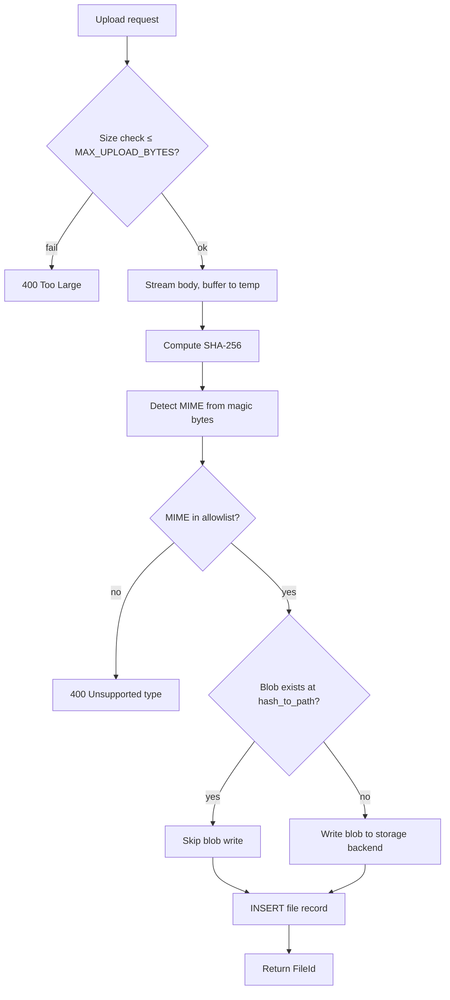

# File Store (Implementation)

**Version:** 1.1.0
**Status:** Stable
**Layer:** implementation
**Implements:** l1-file-management.md

## Overview

Realization of the file management subsystem, in two disclosed layers. **Built today**: a
domain-tier reference algebra (`crates/domain/src/file_store.rs`) proving content-addressed
deduplication, decoupled metadata, and reference-tracked garbage collection over an in-memory
store — pure, I/O-free, and directly tested against those properties. **Not yet built**: the
production mechanism — a SQLite schema for file metadata, SHA-256 content addressing (the
algebra uses a deterministic std hash as its seam-free stand-in), an async upload pipeline, a
configurable storage backend trait, access-control integration, MIME detection, and a GC
scheduler. §4.1 marks exactly which parts of the design below are live and which are the
target this module's own doc comments name as unbuilt seams.

## Related Specifications

- [l1-file-management.md](l1-file-management.md) - The concept this spec implements.
- [l2-resource-sharing.md](l2-resource-sharing.md) - `access-grants`; FM-4 is unbuilt at this layer (§4.1) and would compose with this the way `knowledge_access.rs`'s `GatedKnowledge` already composes with the knowledge store.
- [l2-knowledge-store.md](l2-knowledge-store.md) - `crates/domain/src/knowledge_ingest.rs` is the one real caller of `FileStore` today, storing ingested blobs through it.
- [l2-notes.md](l2-notes.md) - Note content is designed to embed `FileId` for inline images once both the rich-content-tree and the storage-backend seams are built (§4.1); not wired yet.
- [l2-filesystem-layout.md](l2-filesystem-layout.md) - Blob storage path under the mutable state tier — the target for the unbuilt storage backend.

## 1. Motivation

Multiple subsystems (knowledge base, notes, chat attachments) need to store and retrieve binary content. Without a shared file store, each duplicates upload handling and storage code, and the same binary may be stored multiple times. One store with SHA-256 deduplication keeps storage efficient and access control centralised.

## 2. Constraints & Assumptions

- Default storage backend is the local filesystem (under the state tier's `files/` directory). Object stores (S3-compatible) are a pluggable backend via a trait.
- Blob paths are derived from the content hash (`<sha256[0:2]>/<sha256[2:4]>/<sha256>`) — identical to the Git object store layout — enabling directory-level sharding.
- MIME type is determined server-side using magic bytes (first 4 KiB of content); the client-supplied MIME hint is advisory and may be overridden.
- The reference count for deduplication is maintained by counting `file` rows sharing the same `hash` and `storage_path`; no separate refcount column.

## 3. Invariant Compliance (Layer 2)

| L1 Invariant | Implementation |
| --- | --- |
| FM-1 Explicit ingestion | `FileStore::add_file(file_id, data)` is the sole write path; no implicit capture exists in the algebra. |
| FM-2 Content-addressed dedup | `content_hash()` addresses by content; `blobs: HashMap<ContentHash, Blob>` stores one blob per distinct hash regardless of how many file ids bind to it (`identical_content_deduplicates_to_one_blob`). **Unbuilt seam**: production addressing is SHA-256 over the real bytes; the algebra uses a deterministic std hash as its stand-in, by its own doc comment (`file_store.rs` line 8). |
| FM-3 Metadata decoupled | `files: HashMap<String, ContentHash>` (the metadata layer) is a separate map from `blobs` (the byte layer) — `metadata_is_decoupled_from_blob_bytes` proves two file ids can share one blob. |
| FM-4 Access control | **Unbuilt at this layer.** No access-control wrapper exists around `FileStore` (unlike `knowledge_access.rs`'s `GatedKnowledge` over `KnowledgeStore`); the module has no caller-identity parameter at all. |
| FM-5 Reference tracking | Realized as **dedup ref-counting**, not a generic consumer table: each `Blob.ref_count` increments per file id newly bound to that hash and decrements on rebind/removal (`release`); a blob is GC-eligible only at `ref_count == 0`. This is a narrower mechanism than a cross-resource-type reference table, but it satisfies the same safety property — a live-referenced blob is never GC'd. |
| FM-6 Size enforcement | **Unbuilt.** No upload-size guard exists in the algebra; there is no upload pipeline for it to guard. |
| FM-7 Immutable blobs | Structural, not enforced by a separate rule: a blob is keyed by its own content hash, so two different byte sequences can never share a key and a stored blob's bytes can never be mutated in place — content-addressing makes immutability automatic. |

## 4. Detailed Design

### 4.1 Realization Status

| Piece | Status | Where |
| --- | --- | --- |
| Content-addressed dedup, decoupled metadata, ref-tracked GC | **Built** | `crates/domain/src/file_store.rs` |
| SHA-256 addressing | Unbuilt seam (std-hash stand-in live) | — |
| SQLite schema (§4.1.1), storage-backend trait (§4.2), upload pipeline (§4.3), download/access-control (§4.4), size enforcement, MIME allowlist (§4.7) | **Unbuilt** — target design | §4.1.1–§4.7 below describe the design to build against, not current state |

Everything from §4.1.1 onward was authored as the production target before the domain-tier
algebra existed and has not been updated since the algebra landed instead. It is retained
because the design itself is not wrong — it is simply not yet built — and a future task
realizing the storage-backend/schema seam should build against it rather than starting over.

### 4.1.1 Schema (target design, unbuilt)

```sql
[REFERENCE]
CREATE TABLE file (
    id           TEXT PRIMARY KEY,       -- fil/ prefix
    owner_id     TEXT NOT NULL,
    name         TEXT NOT NULL,          -- original filename
    mime_type    TEXT NOT NULL,
    size         INTEGER NOT NULL,       -- bytes
    hash         TEXT NOT NULL,          -- SHA-256 hex
    storage_path TEXT NOT NULL,          -- backend-relative path (hash-derived)
    meta         TEXT,                   -- JSON
    status       TEXT NOT NULL DEFAULT 'ready',  -- uploading|ready|deleted
    created_at   INTEGER NOT NULL,
    updated_at   INTEGER NOT NULL
);
CREATE INDEX ix_file_owner  ON file(owner_id);
CREATE INDEX ix_file_hash   ON file(hash);
CREATE INDEX ix_file_status ON file(status);

-- Reference tracking: who uses this file
CREATE TABLE file_reference (
    id            TEXT PRIMARY KEY,
    file_id       TEXT NOT NULL REFERENCES file(id),
    resource_type TEXT NOT NULL,         -- 'knowledge_document'|'note'|'chat_message'|…
    resource_id   TEXT NOT NULL,
    created_at    INTEGER NOT NULL,
    UNIQUE (file_id, resource_type, resource_id)
);
CREATE INDEX ix_fileref_file ON file_reference(file_id);
CREATE INDEX ix_fileref_resource ON file_reference(resource_type, resource_id);
```

### 4.2 Storage Backend Trait (target design, unbuilt)

```rust
[REFERENCE]
/// Pluggable backend for blob storage.
#[async_trait]
pub trait StorageBackend: Send + Sync {
    /// Write a blob; returns the backend-relative storage_path.
    async fn write(&self, hash: &str, data: &[u8]) -> Result<String>;

    /// Check if a blob already exists (for deduplication).
    async fn exists(&self, storage_path: &str) -> Result<bool>;

    /// Read a blob as a byte stream.
    async fn read(&self, storage_path: &str) -> Result<BoxStream<'static, Result<Bytes>>>;

    /// Delete a blob.
    async fn delete(&self, storage_path: &str) -> Result<()>;
}

/// Default local filesystem backend.
pub struct LocalFileBackend {
    base_dir: PathBuf,
}

// S3-compatible backend is a separate optional crate feature.
```

**Blob path derivation (FM-2):**

```rust
[REFERENCE]
fn hash_to_path(hash: &str) -> String {
    // e.g. "a1b2c3..." -> "a1/b2/a1b2c3..."
    format!("{}/{}/{}", &hash[..2], &hash[2..4], hash)
}
```

### 4.3 Upload Pipeline (target design, unbuilt)


```mermaid
graph TD
    REQ[Upload request] --> LIMIT{Size check ≤ MAX_UPLOAD_BYTES?}
    LIMIT -->|fail| ERR[400 Too Large]
    LIMIT -->|ok| STREAM[Stream body, buffer to temp]
    STREAM --> HASH[Compute SHA-256]
    HASH --> MIME[Detect MIME from magic bytes]
    MIME --> ALLOWED{MIME in allowlist?}
    ALLOWED -->|no| ERR2[400 Unsupported type]
    ALLOWED -->|yes| DEDUP{Blob exists at hash_to_path?}
    DEDUP -->|yes| SKIP[Skip blob write]
    DEDUP -->|no| WRITE[Write blob to storage backend]
    SKIP --> RECORD[INSERT file record]
    WRITE --> RECORD
    RECORD --> OK[Return FileId]
```

### 4.4 Download — Access-Controlled (target design, unbuilt)

```rust
[REFERENCE]
pub async fn download_file(
    store       : &FileStore,
    grants      : &AccessGrantService,
    file_id     : &FileId,
    requesting_user: &UserId,
    user_groups : &[GroupId],
) -> Result<(FileMetadata, BoxStream<Bytes>)> {
    let file = store.get_metadata(file_id).await?;
    let is_owner = file.owner_id == *requesting_user;
    if !grants.has_access(File, file_id, Permission::Read, requesting_user, is_owner, user_groups).await? {
        return Err(Error::Forbidden);
    }
    let stream = store.backend.read(&file.storage_path).await?;
    Ok((file.into(), stream))
}
```

### 4.5 Reference Tracking (target design — today's mechanism is simpler, see FM-5 above)

The generic multi-resource-type reference table below is the target design. What exists today
is narrower and already satisfies FM-5's safety property: `FileStore::add_file` itself is the
reference — binding a file id to a hash is what increments `ref_count`, and `remove_file`
decrements it. No separate registration call exists, because none is needed for the property
GC depends on.

Consumers register references when they link to a file:

```rust
[REFERENCE]
// When a knowledge document is created referencing a file:
file_store.add_reference(file_id, "knowledge_document", doc_id).await?;

// When a knowledge document is deleted:
file_store.remove_reference(file_id, "knowledge_document", doc_id).await?;
```

### 4.6 Garbage Collection (target design — a simpler, real GC exists today: `FileStore::gc()`, ref-count-triggered)

GC runs at startup and on a configurable periodic schedule:

1. Find `file` rows where `status = 'deleted'` AND `deleted_at < now() - RETENTION_WINDOW`.
2. For each, check `file_reference` — if any row exists, skip (still referenced).
3. Check blob dedup: count other `file` rows with the same `hash` and `status != 'deleted'`. If count > 0, skip blob deletion (blob is shared).
4. If no references and no live duplicates: delete blob via backend, delete `access_grant` rows for the file, delete `file` row.

### 4.7 MIME Allowlist (target design, unbuilt)

Default allowed categories: `text/*`, `application/pdf`, `application/json`, `image/*`, `audio/*`.

Blocked regardless of config: `application/x-executable`, `application/x-msdos-program`, and any magic byte that indicates a script or executable.

### 4.8 Module Layout

**Today (real):** a single domain-tier module, no dedicated crate.

```plaintext
crates/domain/src/
└── file_store.rs      // FileStore: add_file, read, remove_file, gc, and their tests
```

**Target (unbuilt), if the production seam is ever built as its own crate** — retained as a
plausible future shape, not a current claim:

```plaintext
crates/
└── file-store/
    ├── src/
    │   ├── lib.rs          // FileStore service: upload, download, delete, gc
    │   ├── model.rs        // File, FileReference, FileMetadata, FileId
    │   ├── db.rs           // SQLite queries
    │   ├── backend/
    │   │   ├── mod.rs      // StorageBackend trait
    │   │   └── local.rs    // LocalFileBackend
    │   ├── mime.rs         // MIME detection (magic bytes) + allowlist
    │   ├── hash.rs         // SHA-256 streaming hash + path derivation
    │   └── gc.rs           // GC scheduler
    └── tests/
        └── upload_tests.rs
```

## 5. Implementation Notes

1. Use `blake3` or `sha2` crate for hash computation; Blake3 is faster but SHA-256 is the more universal choice for interoperability.
2. Stream the upload body; do not buffer the entire file in memory before hashing — use an incrementally-updating hasher.
3. Temp file during upload: write to a `.tmp` path in the same directory, then rename to the final hash-derived path (atomic on most filesystems).
4. Magic-byte MIME detection: inspect only the first 4 KiB; use `infer` crate or equivalent.

## 7. Drawbacks & Alternatives

- **Per-file encryption:** encrypting blobs at rest adds security but requires key management per file or per user. Out of scope for the base implementation; `l2-memory-encryption.md` shows the pattern for key management if needed.
- **Storing blobs in SQLite:** avoids separate backend but SQLite is not optimised for large binary blobs. External file system remains the default.

## Canonical References

| Alias | Path | Purpose |
| --- | --- | --- |
| `[L1]` | `.design/main/specifications/l1-file-management.md` | Invariants FM-1…FM-7. |
| `[LAYOUT]` | `.design/main/specifications/l2-filesystem-layout.md` | State tier path where blobs live. |
| `[SHARING]` | `.design/main/specifications/l2-resource-sharing.md` | Grant enforcement for file access. |
| `[REAL]` | `crates/domain/src/file_store.rs` | The actual, current implementation — the source of truth for §3's Invariant Compliance table. |

## Document History

| Version | Date | Notes |
| --- | --- | --- |
| 1.1.0 | 2026-09-12 | **Realization Status correction** (Retro L2 finding, `/magic.spec main`): this spec described a production mechanism (SQLite schema, async pipeline, storage-backend trait, access-control wiring, MIME allowlist, size guard) that was never built, as though it were current — `crates/file-store/` was never minted as a crate. What actually exists is a domain-tier reference algebra at `crates/domain/src/file_store.rs`, proving FM-1/2/3/7 and a narrower ref-counting realization of FM-5; FM-4 and FM-6 are unbuilt. Every §4 subsection describing the unbuilt mechanism is now explicitly labelled target design rather than presented as built; §4.1 added as the disclosure table; Invariant Compliance (§3) rewritten against the real module; Related Specifications corrected — the dead `l2-source-layout.md` citation (that spec never covered this placement) dropped, `l2-knowledge-store.md`'s real dependency on `FileStore` named. No L1 invariant added, removed, or reworded — `l1-file-management.md` is unchanged. |
| 1.0.0 | 2026-06-24 | Initial spec. |
