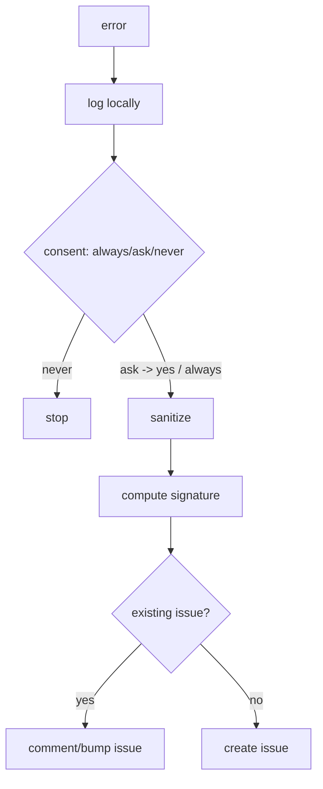

# GitHub Issue Reporting

**Version:** 1.0.1
**Status:** Stable
**Layer:** implementation
**Implements:** l1-error-reporting.md

## Overview

The concrete error reporter: on an unrepairable error, with user consent, it sanitizes diagnostics, de-duplicates against existing issues, and files or updates a GitHub issue.

## Related Specifications

- [l1-error-reporting.md](l1-error-reporting.md) - The model this implements.
- [l2-security.md](l2-security.md) - Egress gate and redaction the reporter uses.
- [l2-cli.md](l2-cli.md) - Command grammar standard.

## 1. Motivation

The model needs a concrete tracker integration with consent, scrubbing, and dedup so real failures become actionable issues without spam or leaks.

## 2. Constraints & Assumptions

- Target repository and enablement are configured (`<state>/config.json`).
- Filing passes the security egress gate (consent + audit).
- Dedup searches existing issues by an error signature.

## 3. Invariant Compliance (Layer 2 only)

| L1 Invariant | Implementation |
| --- | --- |
| ERR-1 Consent-gated | Filing requires a consent prompt or a remembered always/never preference; passes the egress gate. |
| ERR-2 Privacy-scrubbed | A sanitizer strips secrets/user content; only allowlisted diagnostic fields are sent. |
| ERR-3 De-duplicated | An error signature (type + sanitized stack hash + version) is searched; matches are updated, not duplicated. |
| ERR-4 Actionable | The issue includes app version, sanitized stack, environment summary, and repro hints. |
| ERR-5 Local-first | The error is written to the workspace logs regardless of filing. |

## 4. Detailed Design

### 4.1 Pipeline



Filing uses the GitHub CLI/API. Config: `report.enabled`, `report.repo`, `report.consent` (always|ask|never). <!-- TBD: default consent mode -->

### 4.2 Command surface

| Action | CLI | TUI | Library (no code) |
| --- | --- | --- | --- |
| report last error | `cronus report` | `/report` | `reporter.report() -> IssueRef` |
| set consent | `cronus report consent <always\|ask\|never>` | `/report consent …` | `reporter.setConsent(mode) -> void` |

### 4.3 Error fingerprinting

Before filing or updating a GitHub issue, the error is **fingerprinted**: a normalized canonical representation of the error text is hashed (BLAKE3) and checked against a persistent dedup table. Matching fingerprints across episodes surface "you have seen this exact error N times before" — like `git blame` for bugs.

#### Normalization

```text
[REFERENCE]
normalize_message(msg: &str) -> String:
  // 1. Replace hex addresses with a sentinel so 0xdeadbeef ≡ 0xcafebabe
  stripped = regex r"0x[0-9a-fA-F]+" .replace_all(msg, "0xADDR")
  // 2. Replace the user's home directory with /USER so cross-machine panics match
  return stripped.replace(home_dir(), "/USER")

fingerprint_error(error_type: &str, message: &str) -> String:
  canonical = format!("{error_type}|{normalized_message}")
  return blake3::hash(canonical.as_bytes()).to_hex()  // 64 hex chars
```

Normalization strips machine-specific and address-layout-specific noise, so the same panic on two different machines — or at different ASLR addresses — produces the same 64-character fingerprint.

#### Dedup table

```sql
-- [REFERENCE] illustrative, not final DDL
CREATE TABLE error_fingerprints (
    hash             TEXT NOT NULL,
    episode_id       TEXT NOT NULL,
    occurrence_count INTEGER NOT NULL DEFAULT 1,
    first_seen       INTEGER NOT NULL,
    last_seen        INTEGER NOT NULL,
    PRIMARY KEY (hash, episode_id)
);
CREATE INDEX error_fp_hash ON error_fingerprints(hash, last_seen DESC);
```

Each `(hash, episode_id)` pair tracks how many times a given fingerprint appeared within a specific episode. When a capture records an error, the pipeline:

1. Computes `fingerprint_error(error_type, message)`.
2. Upserts: increments `occurrence_count` and refreshes `last_seen` if the row exists; inserts with `count=1` otherwise.
3. Queries prior episodes (excluding the current) where this hash appeared — returns the episode IDs, occurrence counts, and last-seen timestamps.
4. If prior matches exist, surfaces "seen N times before in episodes \[IDs\]" in the capture response and pre-fills the GitHub issue with prior resolutions.

#### Lookup API

```text
[REFERENCE]
record(hash: &str, episode_id: &str) -> occurrence_count: i64
matches(hash: &str, exclude_episode_id: &str) -> Vec<FingerprintMatch>
total_occurrences(hash: &str) -> i64
```

`matches` orders results by `last_seen DESC` and caps at 10 prior episodes. `total_occurrences` returns the sum across all episodes for "seen N times total" messages.

## 5. Drawbacks & Alternatives

- **Signature collisions:** distinct errors may hash alike; mitigated by including error type + version in the signature.
- **Alternative — email/other tracker:** GitHub default; the reporter is adaptable to other trackers later.

## Canonical References

| Alias | Path | Purpose |
| --- | --- | --- |
| `[ERR]` | `.design/main/specifications/l1-error-reporting.md` | Invariants this implements |
| `[SECURITY]` | `.design/main/specifications/l2-security.md` | Egress gate + redaction |
