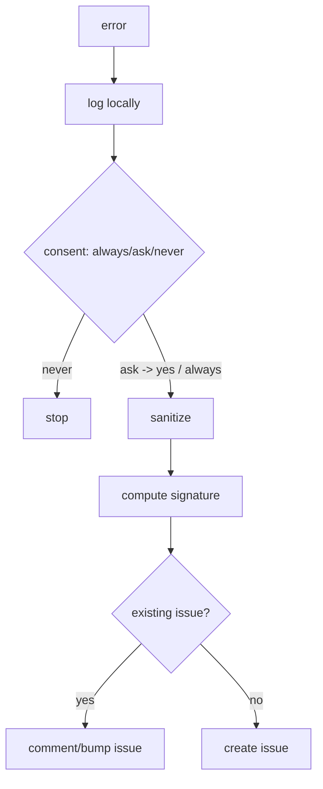

# GitHub Issue Reporting

**Version:** 1.0.0
**Status:** Stable
**Layer:** implementation
**Implements:** l1-error-reporting.md

## Overview

The concrete error reporter: on an unrepairable error, with user consent, it sanitizes diagnostics, de-duplicates against existing issues, and files or updates a GitHub issue.

## Related Specifications

- [l1-error-reporting.md](l1-error-reporting.md) - The model this implements.
- [l2-security.md](l2-security.md) - Egress gate and redaction the reporter uses.
- [l2-cli.md](l2-cli.md) - Command grammar standard.

## 1. Motivation

The model needs a concrete tracker integration with consent, scrubbing, and dedup so real failures become actionable issues without spam or leaks.

## 2. Constraints & Assumptions

- Target repository and enablement are configured (`<state>/config.json`).
- Filing passes the security egress gate (consent + audit).
- Dedup searches existing issues by an error signature.

## 3. Invariant Compliance (Layer 2 only)

| L1 Invariant | Implementation |
| --- | --- |
| ERR-1 Consent-gated | Filing requires a consent prompt or a remembered always/never preference; passes the egress gate. |
| ERR-2 Privacy-scrubbed | A sanitizer strips secrets/user content; only allowlisted diagnostic fields are sent. |
| ERR-3 De-duplicated | An error signature (type + sanitized stack hash + version) is searched; matches are updated, not duplicated. |
| ERR-4 Actionable | The issue includes app version, sanitized stack, environment summary, and repro hints. |
| ERR-5 Local-first | The error is written to the workspace logs regardless of filing. |

## 4. Detailed Design

### 4.1 Pipeline

Filing uses the GitHub CLI/API. Config: `report.enabled`, `report.repo`, `report.consent` (always|ask|never). <!-- TBD: default consent mode -->

### 4.2 Command surface

| Action | CLI | TUI | Library (no code) |
| --- | --- | --- | --- |
| report last error | `cronus report` | `/report` | `reporter.report() -> IssueRef` |
| set consent | `cronus report consent <always\|ask\|never>` | `/report consent …` | `reporter.setConsent(mode) -> void` |

## 5. Drawbacks & Alternatives

- **Signature collisions:** distinct errors may hash alike; mitigated by including error type + version in the signature.
- **Alternative — email/other tracker:** GitHub default; the reporter is adaptable to other trackers later.

## Canonical References

| Alias | Path | Purpose |
| --- | --- | --- |
| `[ERR]` | `.design/main/specifications/l1-error-reporting.md` | Invariants this implements |
| `[SECURITY]` | `.design/main/specifications/l2-security.md` | Egress gate + redaction |
