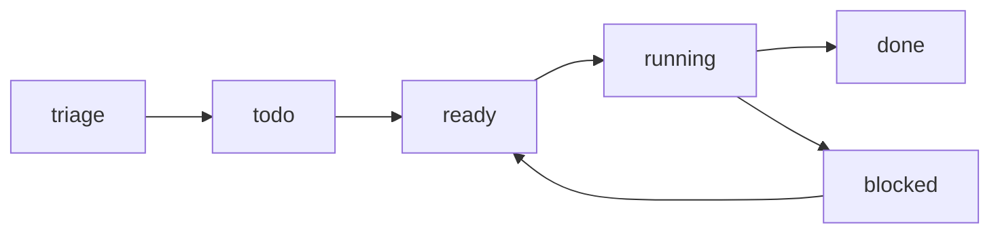

# Kanban Board

**Version:** 1.1.0
**Status:** Stable
**Layer:** implementation
**Implements:** l1-kanban-model.md

## Overview

The concrete realization of the office board: where the single canonical board lives in the workspace, how cards and their state are stored, how transitions and blocking work, how `done` cards are auto-archived to a durable store, and the board command surface across CLI / TUI / library.

## Related Specifications

- [l1-kanban-model.md](l1-kanban-model.md) - The board model this implements.
- [l2-filesystem-layout.md](l2-filesystem-layout.md) - The `kanban/` location within a workspace.
- [l2-core-library.md](l2-core-library.md) - Hosts the board service and the archival job.
- [l2-cli.md](l2-cli.md) - Command grammar standard the board commands follow.
- [l2-execution-workspace.md](l2-execution-workspace.md) - Isolated workspace assigned to a card via `executionWorkspaceId`.
- [l2-budget-engine.md](l2-budget-engine.md) - Budget exhaustion transitions running cards to `blocked`.

## 1. Motivation

The model requires a single per-office board, office-driven movement, and automatic, non-destructive archival. A file-backed board under the workspace keeps it isolated and inspectable; an archival job keeps the active board lean without losing history.

## 2. Constraints & Assumptions

- One board per workspace, stored under `<ws>/kanban/`; archived cards under `<ws>/kanban/archive/`.
- The canonical state set from the model is the mandatory backbone; custom columns/board views are mapped extensions per KAN-8 (each custom column stores an anchor to a canonical state; views are saved filters over the single card set).
- The frontend holds no logic; board operations are core calls (INV-2).
- Card content references the office's tasks; the board does not duplicate task bodies.

## 3. Invariant Compliance (Layer 2 only)

| L1 Invariant | Implementation |
| --- | --- |
| KAN-1 Canonical pipeline | A single board of record with the fixed ordered canonical states; the canonical state is an enum and cannot be removed or renamed. |
| KAN-2 Office-managed | Manager/agents call `board.move`; the client UI is read-first; no client setup required. |
| KAN-3 Auto-archival | A scheduled archival job moves `done` cards meeting the condition into `<ws>/kanban/archive/`. |
| KAN-4 Non-destructive archive | Archived cards are moved (not deleted); they remain readable in the archive store. |
| KAN-5 Card = unit of work | Each card record references a task and carries `state`; `blocked` requires a `reason`. |
| KAN-6 One board / isolation | Exactly one board per `<ws>/kanban/`; no cross-office board. |
| KAN-7 Traceable transitions | Each move appends a transition record (from, to, actor, time, reason). |
| KAN-8 Custom boards map to canon | `board.json` may declare custom columns, each with a mandatory `anchor` canonical enum value; the archival job, analytics, and projections read the anchor. Custom boards are saved view definitions (filter/scope) in `board.json` — no second card store; deleting a view never touches cards. Re-anchoring a column appends a transition-style audit record. |

## 4. Detailed Design

### 4.1 Storage

```plaintext
<ws>/kanban/
├── board.json                     # board meta + ordered state set (canonical + custom columns with anchors) + saved views + card index
├── cards/<card-id>.json           # card record (state, task ref, history[])
├── runs/<card-id>/<run-id>.json   # per-execution run records (§4.6)
├── events/<card-id>.jsonl         # append-only event log per card (§4.7)
├── comments/<card-id>.jsonl       # append-only comment log per card (§4.7)
└── archive/<card-id>.json         # auto-archived done cards (history preserved)
```

Card record (conceptual):

```text
[REFERENCE]
{
  id, task_ref, state,              // state in {triage,todo,ready,running,blocked,done}
  reason,                            // required when state = blocked (KAN-5)
  assignee: String | null,           // role/profile assigned to run this task
  priority: "low"|"medium"|"high"|"critical"|null,
  skills: String[],                  // skill IDs injected into the execution session context
  workspace_kind: "local"|"remote"|"ssh"|null,  // where the task executes
  workspace_path: String | null,     // local dir path or SSH remote path for execution
  max_retries: u8,                   // max retry attempts on failure; 0 = no retry (default)
  history[ {from, to, actor, at, reason} ],  // KAN-7 traceability
  created_at, updated_at
}
```

### 4.2 Transitions



Forward flow is normal; backward moves (`blocked → ready`, `running → todo`) are allowed but explicit. Every move appends to the card's `history`.

### 4.3 Auto-archival job

A scheduled job (run by the core, owned operationally by the archivist/curator) scans `done` cards and moves those meeting the condition into `archive/`. Default condition is configurable. <!-- TBD: default condition — age threshold (e.g. N days in done) vs only-on-project-closure -->

### 4.4 Command surface

Board operations across all three surfaces, conforming to the CLI grammar standard (verb-first, explicit verbs; see `l2-cli.md` §4.4). The library method is the source.

| Action | CLI | TUI | Library (no code) |
| --- | --- | --- | --- |
| show board | `cronus board show` | `/board show` | `board.show() -> Board` |
| list cards | `cronus board list [--state <s>]` | `/board list …` | `board.list({state?}) -> Card[]` |
| move card | `cronus board move <card-id> <state>` | `/board move <card-id> <state>` | `board.move(cardId, state) -> Card` |
| block card | `cronus board block <card-id> --reason <r>` | `/board block …` | `board.block(cardId, reason) -> Card` |
| unblock card | `cronus board unblock <card-id>` | `/board unblock <card-id>` | `board.unblock(cardId) -> Card` |
| archive (manual override) | `cronus board archive <card-id>` | `/board archive <card-id>` | `board.archive(cardId) -> void` |

Cards are created from the office's tasks by the manager (not a client command in v0.1.0); the client surface is primarily `show`/`list`. `move`/`block`/`unblock` are the office's operations, exposed for tooling/automation.

### 4.5 Execution semantics

Cards that are in `running` state carry additional execution metadata that the orchestration layer writes and reads. This layer is distinct from the board's state machine — the board transitions between states; the execution layer tracks *who* is running *what* inside a given state.

#### Ownership vs active execution

```text
[REFERENCE]
Card execution fields (added when state = running):
  checkoutRunId,        // run that claimed this card (ownership lock)
  executionRunId,       // run currently executing (may differ after delegation)
  executionLockedAt,    // timestamp of the most recent execution lock
  executionWorkspaceId  // workspace allocated to this run (see l2-execution-workspace.md)
```

`checkoutRunId` is set when a run picks up a card. It is cleared only by the stale-cleanup process (if the run is confirmed dead) — never by the run itself. `executionRunId` may change when a manager delegates a card to a sub-agent: the checkout owner remains unchanged while the active executor is updated.

This two-lock design ensures that a crash cannot leave a card permanently claimed: the cleanup process reads `executionLockedAt`, and if it is stale (no heartbeat seen since), it clears both fields and returns the card to `ready`.

#### Monitor scheduling for blocked cards

When a card is blocked waiting for an external condition (e.g. another card completing, a tool call timing out), the system schedules an auto-wake rather than polling:

```text
[REFERENCE]
Card monitor fields (set when state = blocked for external reason):
  monitorNextCheckAt,    // UTC timestamp when the scheduler should re-evaluate
  monitorAttemptCount    // number of times the monitor has checked without unblocking
```

On each monitor check: if the condition is resolved, the card transitions to `ready`; otherwise `monitorNextCheckAt` is advanced using exponential back-off capped at a configurable maximum interval.

#### Parent/child vs blockers (separate concerns)

Parent/child is structural hierarchy: card B is a sub-issue of card A (`parentId` on the card record). This is a decomposition relationship — A owns B.

Blockers are dependency: card B cannot start until card C is done (`blockerIds` list). This is a sequencing relationship — they are peers.

These two relationships must not be conflated. A card that is both a child and has blockers is valid and common. The board renders them separately; the orchestration layer enforces them separately.

#### Delegation depth

```text
[REFERENCE]
Card delegation field:
  requestDepth: u8   // 0 = top-level goal; incremented by 1 on each manager→sub-agent delegation
```

A hard cap (default: 10) prevents infinite delegation chains. When `requestDepth` reaches the cap, the next delegation attempt fails with `DelegationDepthExceeded`; the card transitions to `blocked` with that reason. The cap is configurable in the workspace config.

### 4.6 Run log

Each execution attempt on a `running` card is logged as a `KanbanRun` record. Multiple runs can exist per card (retries, delegation chains). The run log is the source of truth for execution history — distinct from the card's state-machine transitions.

```text
[REFERENCE]
KanbanRun {
  id: String,
  card_id: String,
  session_key: String,          // the isolated session key for this run (§ l2-scheduler §4.9)
  agent_role: String | null,    // which role/profile is executing
  status: "running"|"done"|"error"|"timeout"|"blocked",
  outcome: String | null,       // short natural-language summary of the result
  error: String | null,         // error description on failure
  started_at: i64,              // Unix ms
  ended_at: i64 | null,
  last_heartbeat_at: i64 | null // written periodically; used by stale-run detection (§4.5)
}
```

Storage: `<ws>/kanban/runs/<card-id>/<run-id>.json`

```text
[REFERENCE]
KANBAN_IPC_TIMEOUT_MS = 20_000   // board API response deadline for IPC operations
```

### 4.7 Event log and comments

Two append-only log types provide observability and collaboration context for each card.

**KanbanEvent** — audit trail of significant actions on the card:

```text
[REFERENCE]
KanbanEvent {
  id: String,
  card_id: String,
  run_id: String | null,   // set when the event is scoped to a specific run
  kind: String,            // "state_changed"|"skill_applied"|"retry_triggered"|"comment_added"
  payload: JSON | null,    // kind-specific data; e.g. {from, to} for state_changed
  created_at: i64          // Unix ms
}
```

**KanbanComment** — human or agent annotations on the card:

```text
[REFERENCE]
KanbanComment {
  id: String,
  card_id: String,
  author: String,     // role name or "user"
  body: String,       // Markdown text
  created_at: i64     // Unix ms
}
```

Both logs are stored alongside the card and move with it on archival (`archive/events/`, `archive/comments/`).

### 4.8 Sprint tracking status file

When a workspace is organized around sprint/epic/story planning, the board state is supplemented by a machine-readable sprint status file. This file is the single source of truth for story and epic completion status; the kanban board reflects running execution, while the sprint status file reflects planning and delivery state.

#### File structure

```text
[REFERENCE]
sprint-status.yaml (stored at {planning_artifacts}/sprint-status.yaml):

generated:    {ISO date}
last_updated: {ISO date}
project:      {project name}
project_key:  {short identifier}
tracking_system: file-system
story_location:  {path to story files}

development_status:
  {epic-key}: {epic_status}
  {story-key}: {story_status}
  ...
  {epic-key}-retrospective: optional | done

action_items:
  - epic:   {epic number}
    action: {committed improvement from retrospective}
    owner:  {role or name}
    status: open | in-progress | done
```

#### Story key format

Stories are named using a two-segment hierarchical key:

```text
[REFERENCE]
Story key format:  {epic-number}-{story-number}-{slug}
Examples:
  1-1-user-authentication
  1-2-account-management
  2-3-llm-integration

Epic key format:   epic-{epic-number}
  e.g. epic-1, epic-2
```

The slug is a lowercase-hyphenated summary of the story. Key segments are stable once assigned; renaming the slug requires updating all references.

#### Status values

**Epic status:**

| Value | Meaning |
| --- | --- |
| `backlog` | Epic not yet started |
| `in-progress` | At least one story is in-progress or done |
| `done` | All stories in the epic are completed |

**Story status:**

| Value | Meaning |
| --- | --- |
| `backlog` | Story exists only in the epic file; no story file created yet |
| `ready-for-dev` | Story file created, all ACs defined; waiting for implementation |
| `in-progress` | Developer actively working on implementation |
| `review` | Implementation complete; ready for code review |
| `done` | Story fully completed and reviewed |

**Retrospective status:**

| Value | Meaning |
| --- | --- |
| `optional` | Retrospective can be run but is not required |
| `done` | Retrospective has been completed |

#### Sequential story creation discipline

Stories within an epic are created **one at a time**, sequentially. A developer creates the next story file only after the previous story reaches `done` — this allows each story's implementation to inform the next story's AC definition, incorporating real discoveries rather than planning assumptions.

The code review step is a distinct phase: when a story reaches `review`, the review is performed in a fresh context (ideally by a different model or agent instance) to avoid the implementation bias of the author.

### 4.9 Task XML format for plan execution

Individual tasks within a plan file are declared using a structured XML format. The format encodes the task type (automatic, test-driven, or checkpoint), the files involved, the specific action, and the acceptance criteria. This structure makes tasks machine-parseable for executor agents and human-readable for review.

#### Automatic task (type="auto")

```text
[REFERENCE]
<task type="auto">
  <name>Short descriptive name</name>
  <files>path/to/file.ext</files>               <!-- files to create or modify -->
  <read_first>path/to/reference.ext</read_first> <!-- files to read before acting -->
  <action>
    Specific implementation instruction with concrete values.
    Must be precise enough that the executor does not need to guess.
    References D-NN decision IDs where applicable ("per D-02").
  </action>
  <verify>Shell command that proves the task is done (e.g. grep, cargo test, tsc)</verify>
  <acceptance_criteria>
    - Grep-verifiable condition
    - File exists at expected path
    - Command exits 0
  </acceptance_criteria>
  <done>Measurable acceptance criteria (observable, not "code written")</done>
</task>
```

#### Test-driven task (type="tdd")

Identical to `type="auto"` but the executor writes the test first, confirms it fails, then writes the implementation, and confirms the test passes. The `verify` step runs the test suite.

#### Decision checkpoint (type="checkpoint:decision", gate="blocking")

```text
[REFERENCE]
<task type="checkpoint:decision" gate="blocking">
  <decision>Exact question that must be decided before execution can continue</decision>
  <context>Why this decision matters and what downstream work it affects</context>
  <options>
    <option id="option-a">
      <name>Name</name>
      <pros>Why to choose this</pros>
      <cons>What this option gives up</cons>
    </option>
    <option id="option-b">
      <name>Name</name>
      <pros>Why to choose this</pros>
      <cons>What this option gives up</cons>
    </option>
  </options>
  <resume-signal>Select: option-a or option-b</resume-signal>
</task>
```

#### Human-verify checkpoint (type="checkpoint:human-verify", gate="blocking")

```text
[REFERENCE]
<task type="checkpoint:human-verify" gate="blocking">
  <what-built>Concise description of what the executor built in the preceding tasks</what-built>
  <how-to-verify>
    Visual or manual checks the human should perform.
    NO CLI commands here — this section is for human eyes.
    Examples: "Open the app, navigate to X, confirm Y is visible."
  </how-to-verify>
  <resume-signal>Type "approved" or describe what is wrong</resume-signal>
</task>
```

`gate="blocking"` on a checkpoint triggers writing `.planning/.continue-here.md` (see `l2-orchestration.md` §4.14). Execution halts until the user provides the `resume-signal`. Non-blocking checkpoints (`gate="advisory"`) emit a notice but do not halt execution.

### 4.10 Priority-ordered story cards

The board's phase-level grouping (§4.5) does not distinguish MVP work from nice-to-have work. Priority metadata on story cards enables the orchestrator to enforce cross-tier sequencing (see `l2-orchestration.md` §4.17) and gives the user a quick visual cue.

#### Priority field

```json
{
  "id": "card-007",
  "type": "story",
  "title": "User can log in with email and password",
  "priority": "P1",
  "independent_test": "Run `cronus login test@example.com password` against a seeded workspace; confirm exit 0 and token file written.",
  "depends_on": [],
  "status": "todo"
}
```

Priority values:

| Value | Meaning | Execution rule |
| --- | --- | --- |
| `P1` | MVP; launch-blocking | All P1 stories complete before any P2 starts |
| `P2` | Important, not blocking | All P2 stories complete before any P3 starts |
| `P3` | Nice-to-have | Deferred if capacity is constrained |

#### Board display

The TUI groups story cards under their priority tier within the current phase column:

```
Phase: story-auth
  🎯 P1  User can log in          [In Progress]
  🎯 P1  User can log out         [Todo]
       P2  Password reset email   [Todo]
       P3  Remember me checkbox   [Backlog]
```

`🎯` marks P1 cards. P3 cards move to Backlog automatically when the phase wave starts if capacity is below the P3 threshold in `config.json`.

#### Story completion gate

Before the orchestrator starts any P2 card, it confirms all P1 cards in the same phase are `Done`:

```text
✓ All P1 stories done — P2 stories may now begin.
```

Symmetrically for P2 → P3.

## 5. Drawbacks & Alternatives

- **File-per-card vs single board file:** per-card files ease concurrent updates and history; the index in `board.json` keeps reads cheap.
- **Alternative — store board rows in SQLite:** viable later for large boards; v0.1.0 uses files for inspectability (consistent with STO-8). <!-- TBD: switch to SQLite-backed board if card counts grow large -->
- **Alternative — manual archive column:** rejected (KAN-3/OFF-5).

## Canonical References

| Alias | Path | Purpose |
| --- | --- | --- |
| `[MODEL]` | `.design/main/specifications/l1-kanban-model.md` | Invariants this board satisfies |
| `[LAYOUT]` | `.design/main/specifications/l2-filesystem-layout.md` | `kanban/` location in a workspace |
| `[CLI]` | `.design/main/specifications/l2-cli.md` | Command grammar standard |

## Document History

| Version | Date | Notes |
| --- | --- | --- |
| ≤1.0.5 | 2026-06-24…2026-07-02 | Initial stable spec and incremental extensions (storage, transitions, archival job, execution semantics, event/comment logs) |
| 1.1.0 | 2026-07-03 | KAN-8 reconciliation — "no user-defined boards" constraint replaced with the mapped-extension model: custom columns carry a mandatory canonical `anchor` in `board.json`, custom boards are saved views over the single card set; compliance row added; storage comment extended. Aligns with l1-kanban-model 1.1.0. |
