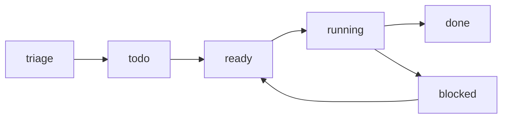

# Kanban Board

**Version:** 1.0.1
**Status:** Stable
**Layer:** implementation
**Implements:** l1-kanban-model.md

## Overview

The concrete realization of the office board: where the single canonical board lives in the workspace, how cards and their state are stored, how transitions and blocking work, how `done` cards are auto-archived to a durable store, and the board command surface across CLI / TUI / library.

## Related Specifications

- [l1-kanban-model.md](l1-kanban-model.md) - The board model this implements.
- [l2-filesystem-layout.md](l2-filesystem-layout.md) - The `kanban/` location within a workspace.
- [l2-core-library.md](l2-core-library.md) - Hosts the board service and the archival job.
- [l2-cli.md](l2-cli.md) - Command grammar standard the board commands follow.
- [l2-execution-workspace.md](l2-execution-workspace.md) - Isolated workspace assigned to a card via `executionWorkspaceId`.
- [l2-budget-engine.md](l2-budget-engine.md) - Budget exhaustion transitions running cards to `blocked`.

## 1. Motivation

The model requires a single per-office board, office-driven movement, and automatic, non-destructive archival. A file-backed board under the workspace keeps it isolated and inspectable; an archival job keeps the active board lean without losing history.

## 2. Constraints & Assumptions

- One board per workspace, stored under `<ws>/kanban/`; archived cards under `<ws>/kanban/archive/`.
- The fixed state set from the model; no user-defined boards in v0.1.0.
- The frontend holds no logic; board operations are core calls (INV-2).
- Card content references the office's tasks; the board does not duplicate task bodies.

## 3. Invariant Compliance (Layer 2 only)

| L1 Invariant | Implementation |
| --- | --- |
| KAN-1 Canonical pipeline | A single board with the fixed ordered states; state is an enum, not user-editable. |
| KAN-2 Office-managed | Manager/agents call `board.move`; the client UI is read-first; no client setup required. |
| KAN-3 Auto-archival | A scheduled archival job moves `done` cards meeting the condition into `<ws>/kanban/archive/`. |
| KAN-4 Non-destructive archive | Archived cards are moved (not deleted); they remain readable in the archive store. |
| KAN-5 Card = unit of work | Each card record references a task and carries `state`; `blocked` requires a `reason`. |
| KAN-6 One board / isolation | Exactly one board per `<ws>/kanban/`; no cross-office board. |
| KAN-7 Traceable transitions | Each move appends a transition record (from, to, actor, time, reason). |

## 4. Detailed Design

### 4.1 Storage

```plaintext
<ws>/kanban/
├── board.json        # board meta + ordered state set + card index
├── cards/<card-id>.json   # one card per file (state, task ref, reason?, history[])
└── archive/<card-id>.json # auto-archived done cards (history preserved)
```

Card record (conceptual):

```text
[REFERENCE]
{
  id, task_ref, state,            // state in {triage,todo,ready,running,blocked,done}
  reason,                          // required when state = blocked (KAN-5)
  history[ {from, to, actor, at, reason} ],  // KAN-7 traceability
  created_at, updated_at
}
```

### 4.2 Transitions



Forward flow is normal; backward moves (`blocked → ready`, `running → todo`) are allowed but explicit. Every move appends to the card's `history`.

### 4.3 Auto-archival job

A scheduled job (run by the core, owned operationally by the archivist/curator) scans `done` cards and moves those meeting the condition into `archive/`. Default condition is configurable. <!-- TBD: default condition — age threshold (e.g. N days in done) vs only-on-project-closure -->

### 4.4 Command surface

Board operations across all three surfaces, conforming to the CLI grammar standard (verb-first, explicit verbs; see `l2-cli.md` §4.4). The library method is the source.

| Action | CLI | TUI | Library (no code) |
| --- | --- | --- | --- |
| show board | `cronus board show` | `/board show` | `board.show() -> Board` |
| list cards | `cronus board list [--state <s>]` | `/board list …` | `board.list({state?}) -> Card[]` |
| move card | `cronus board move <card-id> <state>` | `/board move <card-id> <state>` | `board.move(cardId, state) -> Card` |
| block card | `cronus board block <card-id> --reason <r>` | `/board block …` | `board.block(cardId, reason) -> Card` |
| unblock card | `cronus board unblock <card-id>` | `/board unblock <card-id>` | `board.unblock(cardId) -> Card` |
| archive (manual override) | `cronus board archive <card-id>` | `/board archive <card-id>` | `board.archive(cardId) -> void` |

Cards are created from the office's tasks by the manager (not a client command in v0.1.0); the client surface is primarily `show`/`list`. `move`/`block`/`unblock` are the office's operations, exposed for tooling/automation.

### 4.5 Execution semantics

Cards that are in `running` state carry additional execution metadata that the orchestration layer writes and reads. This layer is distinct from the board's state machine — the board transitions between states; the execution layer tracks *who* is running *what* inside a given state.

#### Ownership vs active execution

```text
[REFERENCE]
Card execution fields (added when state = running):
  checkoutRunId,        // run that claimed this card (ownership lock)
  executionRunId,       // run currently executing (may differ after delegation)
  executionLockedAt,    // timestamp of the most recent execution lock
  executionWorkspaceId  // workspace allocated to this run (see l2-execution-workspace.md)
```

`checkoutRunId` is set when a run picks up a card. It is cleared only by the stale-cleanup process (if the run is confirmed dead) — never by the run itself. `executionRunId` may change when a manager delegates a card to a sub-agent: the checkout owner remains unchanged while the active executor is updated.

This two-lock design ensures that a crash cannot leave a card permanently claimed: the cleanup process reads `executionLockedAt`, and if it is stale (no heartbeat seen since), it clears both fields and returns the card to `ready`.

#### Monitor scheduling for blocked cards

When a card is blocked waiting for an external condition (e.g. another card completing, a tool call timing out), the system schedules an auto-wake rather than polling:

```text
[REFERENCE]
Card monitor fields (set when state = blocked for external reason):
  monitorNextCheckAt,    // UTC timestamp when the scheduler should re-evaluate
  monitorAttemptCount    // number of times the monitor has checked without unblocking
```

On each monitor check: if the condition is resolved, the card transitions to `ready`; otherwise `monitorNextCheckAt` is advanced using exponential back-off capped at a configurable maximum interval.

#### Parent/child vs blockers (separate concerns)

Parent/child is structural hierarchy: card B is a sub-issue of card A (`parentId` on the card record). This is a decomposition relationship — A owns B.

Blockers are dependency: card B cannot start until card C is done (`blockerIds` list). This is a sequencing relationship — they are peers.

These two relationships must not be conflated. A card that is both a child and has blockers is valid and common. The board renders them separately; the orchestration layer enforces them separately.

#### Delegation depth

```text
[REFERENCE]
Card delegation field:
  requestDepth: u8   // 0 = top-level goal; incremented by 1 on each manager→sub-agent delegation
```

A hard cap (default: 10) prevents infinite delegation chains. When `requestDepth` reaches the cap, the next delegation attempt fails with `DelegationDepthExceeded`; the card transitions to `blocked` with that reason. The cap is configurable in the workspace config.

## 5. Drawbacks & Alternatives

- **File-per-card vs single board file:** per-card files ease concurrent updates and history; the index in `board.json` keeps reads cheap.
- **Alternative — store board rows in SQLite:** viable later for large boards; v0.1.0 uses files for inspectability (consistent with STO-8). <!-- TBD: switch to SQLite-backed board if card counts grow large -->
- **Alternative — manual archive column:** rejected (KAN-3/OFF-5).

## Canonical References

| Alias | Path | Purpose |
| --- | --- | --- |
| `[MODEL]` | `.design/main/specifications/l1-kanban-model.md` | Invariants this board satisfies |
| `[LAYOUT]` | `.design/main/specifications/l2-filesystem-layout.md` | `kanban/` location in a workspace |
| `[CLI]` | `.design/main/specifications/l2-cli.md` | Command grammar standard |
