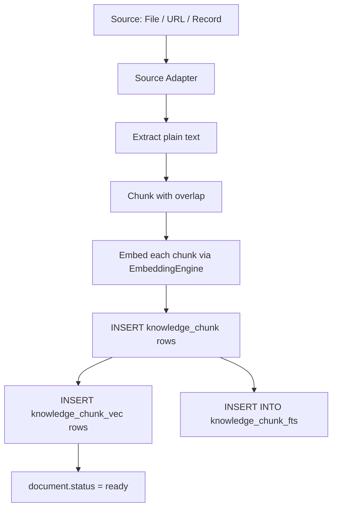

# Knowledge Store (Implementation)

**Version:** 1.1.0
**Status:** Stable
**Layer:** implementation
**Implements:** l1-knowledge-base.md

## Overview

Concrete implementation of the knowledge base subsystem: SQLite schema for collections, directories, and documents; sqlite-vec for dense vector search; FTS5 for keyword search; RRF fusion for hybrid retrieval; an async ingestion pipeline; storage-enforced authorship zones (human/agent write boundary) and a curation lifecycle (draft→reviewed→stable); an optional query-preparation seam; and the Rust crate that exposes a `KnowledgeStore` service.

## Related Specifications

- [l1-knowledge-base.md](l1-knowledge-base.md) - The concept this spec implements.
- [l2-memory-store.md](l2-memory-store.md) - Memory store also uses sqlite-vec; the embedding engine is shared.
- [l2-resource-sharing.md](l2-resource-sharing.md) - `access-grants` crate enforces KB-4 access control.
- [l2-file-store.md](l2-file-store.md) - Files are the source documents; `FileId` is referenced from `document`.
- [l2-source-layout.md](l2-source-layout.md) - Crate placement under `crates/knowledge-store/`.

## 1. Motivation

The memory store is per-user, conversational, and ephemeral by design. A separate knowledge store handles structured, long-lived, shared reference material that survives sessions and can be queried by multiple workers. Splitting the two keeps each concern clean and avoids embedding RAG pipeline complexity in the memory crate.

## 2. Constraints & Assumptions

- Embedding model must be the same for ingest and query; model change requires full re-index.
- sqlite-vec ANN indices are per-database-file; all collections live in one DB file for simplicity; the ANN index is partitioned by `collection_id` via a `WHERE` filter (post-ANN filtering).
- Ingestion is async and non-blocking to the caller; status is polled or subscribed via the event bus.
- Web URL sources are scraped at ingest time (one-shot); incremental re-scrape is a scheduled task.
- Authorship (`origin`) and curation (`curation`) are enforced at the store write seam, not by caller discipline: a human-zone write requires an explicit audited override, and a curation promotion to `reviewed`/`stable` requires human authorization.

## 3. Invariant Compliance (Layer 2)

| L1 Invariant | Implementation |
| --- | --- |
| KB-1 Collection isolation | Every ANN and FTS query is scoped to explicit `collection_ids`; no implicit cross-collection search. |
| KB-2 Hierarchical organisation | `knowledge_directory` table stores the tree; retrieval queries ignore directory structure. |
| KB-3 Incremental indexing | Ingestion job operates on one document; existing chunks for that document are deleted before re-insert. |
| KB-4 Access control | `access-grants` crate `has_access(Knowledge, collection_id, Permission::Read)` checked before any query. |
| KB-5 Source types | Ingestion pipeline has three source adapters: FileIngester, UrlIngester, RecordIngester. |
| KB-6 Source attribution | Each chunk row carries `document_id`, `position`, and `source_ref` (page/section/byte). |
| KB-7 Non-authoritative recall | Retrieval API returns `(text, source_ref, score)`; no assertion of correctness in the API surface. |
| KB-8 Soft deletion | `document.status = 'deleted'`; chunks excluded from all queries; GC job deletes rows + vector entries. |
| KB-9 Authorship zones | `knowledge_document.origin` (`human`/`agent`, NOT NULL). The `KnowledgeStore` write path refuses any update/replace of an `origin = 'human'` row unless an explicit `WriteOverride::HumanDirected` token (carrying an audit reference) is supplied — enforced at the single `db.rs` write seam, not by caller convention (§4.4). Orthogonal to KB-4: access-grants gate which workers reach the collection; the origin zone gates whether the agent may rewrite human material inside it. |
| KB-10 Curation lifecycle | `knowledge_document.curation` (`draft`/`reviewed`/`stable`; NULL for `origin='human'` rows; agent docs default `draft`). The store lets the agent create/revise `draft` rows freely; a transition to `reviewed`/`stable` is refused unless the caller presents human authorization (§4.4). `RetrievalRequest.min_curation` applies a trust floor at retrieval. Editorial-trust `curation` is distinct from the indexing `status` column. |
| KB-11 Query preparation | Optional `QueryPreparer` seam runs before embedding (§4.5): keyword extraction/expansion + compound-query decomposition. The prepared and raw queries are both recorded in the retrieval trace; an empty preparation falls back to the raw query (never an empty search). Sub-queries are retrieved independently and RRF-merged (§4.3). Preparation never alters `source_ref` attribution (KB-6) nor widens the access-bounded `collection_ids` set (KB-4). |

## 4. Detailed Design

### 4.1 Schema

```sql
[REFERENCE]
-- Collections
CREATE TABLE knowledge_collection (
    id          TEXT PRIMARY KEY,          -- col/ prefix
    owner_id    TEXT NOT NULL,
    name        TEXT NOT NULL,
    description TEXT NOT NULL DEFAULT '',
    meta        TEXT,                      -- JSON
    created_at  INTEGER NOT NULL,
    updated_at  INTEGER NOT NULL
);

-- Directory tree (optional per-collection hierarchy)
CREATE TABLE knowledge_directory (
    id            TEXT PRIMARY KEY,        -- kdir/ prefix
    collection_id TEXT NOT NULL REFERENCES knowledge_collection(id),
    parent_id     TEXT REFERENCES knowledge_directory(id),
    name          TEXT NOT NULL,
    created_at    INTEGER NOT NULL,
    updated_at    INTEGER NOT NULL,
    UNIQUE (collection_id, parent_id, name)
);
CREATE INDEX ix_kdir_collection ON knowledge_directory(collection_id);

-- Documents (one per source file/URL)
CREATE TABLE knowledge_document (
    id            TEXT PRIMARY KEY,        -- doc/ prefix
    collection_id TEXT NOT NULL REFERENCES knowledge_collection(id),
    directory_id  TEXT REFERENCES knowledge_directory(id),
    source_file_id TEXT,                   -- FileId if source is an uploaded file
    source_url    TEXT,                    -- URL if source is a web page
    name          TEXT NOT NULL,
    status        TEXT NOT NULL DEFAULT 'pending',  -- pending|indexing|ready|error|deleted (index state)
    origin        TEXT NOT NULL DEFAULT 'agent',    -- human|agent authorship zone (KB-9)
    curation      TEXT,                             -- draft|reviewed|stable (KB-10); NULL for origin='human'
    error_msg     TEXT,
    meta          TEXT,                    -- JSON: word count, language, custom tags
    created_at    INTEGER NOT NULL,
    updated_at    INTEGER NOT NULL
);
CREATE INDEX ix_kdoc_collection ON knowledge_document(collection_id);
CREATE INDEX ix_kdoc_status     ON knowledge_document(status);
CREATE INDEX ix_kdoc_curation   ON knowledge_document(collection_id, curation);

-- Chunks (split from documents)
CREATE TABLE knowledge_chunk (
    id          TEXT PRIMARY KEY,          -- chk/ prefix
    document_id TEXT NOT NULL REFERENCES knowledge_document(id),
    text        TEXT NOT NULL,
    position    INTEGER NOT NULL,          -- ordinal within document
    source_ref  TEXT,                      -- JSON: {page?, section?, byte_start?, byte_end?}
    created_at  INTEGER NOT NULL
);
CREATE INDEX ix_kchunk_doc ON knowledge_chunk(document_id);

-- FTS5 virtual table for keyword search
CREATE VIRTUAL TABLE knowledge_chunk_fts USING fts5(
    text,
    content='knowledge_chunk',
    content_rowid='rowid'
);

-- sqlite-vec virtual table for ANN (dense vectors)
-- Vector dimension matches the embedding model (e.g., 768 or 1536)
CREATE VIRTUAL TABLE knowledge_chunk_vec USING vec0(
    chunk_id TEXT PRIMARY KEY,
    embedding FLOAT[768]
);
```

### 4.2 Ingestion Pipeline



**Chunking parameters (defaults, configurable per collection):**

| Parameter | Default |
| --- | --- |
| Chunk size | 512 tokens |
| Overlap | 64 tokens |
| Splitter | Sentence boundary (Unicode sentence segmentation) |

**Re-indexing a document (KB-3):**

1. Delete all `knowledge_chunk` rows for the document.
2. Delete matching `knowledge_chunk_vec` and `knowledge_chunk_fts` entries.
3. Set `document.status = 'indexing'`.
4. Run the ingestion pipeline fresh.

### 4.3 Retrieval

```rust
[REFERENCE]
pub struct RetrievalRequest {
    pub query        : String,
    pub collection_ids: Vec<CollectionId>,
    pub top_k        : usize,             // default 5
    pub min_score    : Option<f32>,       // default 0.0
    pub min_curation : Option<Curation>,  // KB-10 trust floor; None = no filter
}

pub struct RetrievedChunk {
    pub chunk_id    : ChunkId,
    pub document_id : DocumentId,
    pub collection_id: CollectionId,
    pub text        : String,
    pub source_ref  : Option<SourceRef>,
    pub score       : f32,
}
```

**Retrieval steps:**

1. (KB-11, optional) Prepare the query via the `QueryPreparer` (§4.5): derive `retrieval_query` + any `subqueries`, falling back to the raw query when preparation yields nothing usable. With no preparer wired, use the raw query unchanged.
2. Embed the prepared (or raw) query — and each sub-query — via `EmbeddingEngine`, using the same model as ingestion.
3. ANN search in `knowledge_chunk_vec` filtered to chunks whose `document_id` is in a ready document from one of the target `collection_ids`. Return top `top_k * 2` candidates.
4. FTS5 search in `knowledge_chunk_fts` with the same filter. Return top `top_k * 2` candidates.
5. Merge the vector, keyword, and per-sub-query result sets using Reciprocal Rank Fusion (RRF, k=60).
6. Apply the `min_curation` trust floor (KB-10): drop chunks whose document `curation` is below the requested level; `origin='human'` rows (NULL curation) are treated as always-eligible authoritative sources.
7. Deduplicate by `chunk_id`, trim to `top_k`, apply `min_score` filter.
8. Return `Vec<RetrievedChunk>`.

### 4.4 Authorship Zones & Curation Lifecycle (KB-9 / KB-10)

Two orthogonal columns on `knowledge_document` govern how the agent may write, layered on the indexing `status`. Both are enforced at the store's single write seam (`db.rs`), so the boundary survives agent drift rather than living in a prompt.

**Authorship zone (KB-9).** `origin` places each document in a write-zone. Human-authored rows are agent-read-only; a write is refused unless the caller presents an explicit override — a typed token, never a default flag:

```rust
[REFERENCE]
pub enum WriteOverride {
    None,
    HumanDirected { audit_ref: AuditRef },   // user-directed correction routed through the agent
}

fn write_document(doc: &Document, ov: WriteOverride) -> Result<(), StoreError> {
    if let Some(existing) = get_document(doc.id)? {
        if existing.origin == Origin::Human && matches!(ov, WriteOverride::None) {
            return Err(StoreError::ReadOnlyZone);   // KB-9: refused at the store, not discouraged
        }
    }
    persist(doc)
}
```

`origin` is assigned from the ingestion source at document creation — an uploaded file or human-owned record is `human`, an agent-synthesized document is `agent` — not chosen by a later agent write, so the agent cannot mint a `human` row to smuggle authority. The `HumanDirected` override carries an `audit_ref` so every write into a human zone is attributable on the durable audit path — the override is audited, never a silent default.

**Curation lifecycle (KB-10).** Agent-synthesized rows carry `curation` advancing `draft → reviewed → stable`. The agent owns `draft`; advancing requires human authorization presented to the store:

```rust
[REFERENCE]
fn set_curation(id: DocumentId, next: Curation, auth: Option<HumanAuth>) -> Result<(), StoreError> {
    match (next, auth) {
        (Curation::Draft, _)                             => transition(id, next),  // agent-free
        (Curation::Reviewed | Curation::Stable, Some(_)) => transition(id, next),
        (Curation::Reviewed | Curation::Stable, None)    => Err(StoreError::HumanApprovalRequired),
    }
}
```

A new agent document defaults to `curation = 'draft'`; `origin = 'human'` rows leave `curation` NULL (editorial trust is an agent-document concept). Retrieval's `min_curation` filter (§4.3) lets a high-trust query exclude provisional `draft` chunks while keeping authoritative human sources always eligible.

### 4.5 Query Preparation (KB-11)

An optional preparation step sits between the caller's request and the embedding/search. It reshapes the query to improve recall but never narrows the caller's reach:

```rust
[REFERENCE]
pub trait QueryPreparer {
    /// Returns the prepared retrieval query plus any sub-queries; may return the
    /// input unchanged. MUST NOT touch collection scope or attribution.
    fn prepare(&self, raw: &str, meta: &CollectionMeta) -> PreparedQuery;
}

pub struct PreparedQuery {
    pub retrieval_query: String,       // == raw when preparation yields nothing usable
    pub subqueries     : Vec<String>,  // empty when the query is atomic
    pub raw            : String,       // always preserved for transparency + fallback
}
```

Three guarantees, all testable:

1. **Transparent** — the prepared query and the raw query are recorded together in the retrieval trace, so a reader sees exactly what was searched; a poor preparation is diagnosable, not invisible.
2. **Fallback-floored** — an empty or failed preparation degrades to `raw`; it can improve recall but never turns a real query into an empty search.
3. **Scope-preserving** — preparation reshapes the query only. Each sub-query is retrieved independently and the results RRF-merged (§4.3); every chunk still carries its own `source_ref` (KB-6) and access stays bounded by the caller's `collection_ids` (KB-4). Preparation never widens the accessible set.

Preparation is opt-in: with no `QueryPreparer` wired, retrieval embeds the raw query directly — the degenerate, always-available path.

### 4.6 Soft Delete and GC

- `DELETE /document/:id` sets `document.status = 'deleted'`. Chunks are excluded from all queries via `JOIN knowledge_document WHERE status != 'deleted'`.
- A GC job (runs at startup and periodically) finds documents with `status = 'deleted'` older than the retention window, deletes their `knowledge_chunk`, `knowledge_chunk_vec`, and `knowledge_chunk_fts` entries, then deletes the document row.

### 4.7 Crate Layout

```plaintext
crates/
└── knowledge-store/
    ├── src/
    │   ├── lib.rs            // KnowledgeStore service
    │   ├── model.rs          // Collection, Document (origin/curation), Chunk, RetrievalRequest, …
    │   ├── db.rs             // SQLite queries; authorship-zone + curation write guards (KB-9/KB-10)
    │   ├── ingest/
    │   │   ├── mod.rs
    │   │   ├── file.rs       // FileIngester
    │   │   ├── url.rs        // UrlIngester (HTTP fetch + HTML→text)
    │   │   └── record.rs     // RecordIngester (plain text / JSON)
    │   ├── query_prep.rs     // QueryPreparer seam (KB-11); no-op default
    │   ├── retrieval.rs      // query prep → hybrid search + RRF fusion + min_curation filter
    │   └── gc.rs             // soft-delete garbage collector
    ├── tests/
    │   └── integration.rs
    └── benches/
        └── retrieval_bench.rs
```

## 5. Implementation Notes

1. The `EmbeddingEngine` is shared with `crates/memory-store`; import from a shared `crates/embeddings` crate (or trait object) to avoid duplicating the model-load logic.
2. ANN post-filtering (filtering by `collection_id` after the ANN pass) may cause score degradation for small collections; a collection-partitioned ANN index (one vec table per collection) is an alternative for large collections.
3. Web scraping in `UrlIngester` should respect `robots.txt` and rate-limit requests.
4. Mark ingestion jobs with a correlation ID so status can be polled via the document `status` field without a separate job-tracking table.
5. Authorship-zone (KB-9) and curation (KB-10) checks live at the single `db.rs` write seam, never in the ingestion adapters or the service layer, so no caller can bypass them. The `WriteOverride::HumanDirected` path records an `audit_ref`; a human-zone write with no audit reference is a bug, not a fast path.
6. Query preparation (KB-11) is a pure `QueryPreparer` seam with a no-op default; a wired preparer (keyword expansion / decomposition) is model-backed and MUST honor the fallback-to-raw floor so a preparer outage degrades recall rather than breaking retrieval.

## 7. Drawbacks & Alternatives

- **Separate ANN index per collection:** stronger KB-1 isolation and no post-filter degradation, but more tables and more complex schema migration.
- **External vector DB (e.g., Qdrant):** better ANN at scale, but adds an operational dependency. sqlite-vec keeps the system embeddable.

## Canonical References

| Alias | Path | Purpose |
| --- | --- | --- |
| `[L1]` | `.design/main/specifications/l1-knowledge-base.md` | Invariants KB-1…KB-8. |
| `[MEMORY]` | `.design/main/specifications/l2-memory-store.md` | Shared EmbeddingEngine pattern and sqlite-vec usage. |
| `[FILES]` | `.design/main/specifications/l2-file-store.md` | FileId referenced in knowledge_document. |
| `[SHARING]` | `.design/main/specifications/l2-resource-sharing.md` | Access grant enforcement for collections. |

## Document History

| Version | Date | Author | Notes |
| --- | --- | --- | --- |
| 1.1.0 | 2026-07-18 | Core Team | Completed Invariant Compliance to the full KB-1…KB-11 parent (`l1-knowledge-base` v1.2.0). KB-9 authorship zones (`knowledge_document.origin` + store-enforced read-only human zone with an audited `WriteOverride::HumanDirected` token, §4.4). KB-10 curation lifecycle (`knowledge_document.curation` draft→reviewed→stable, human-gated transitions, `RetrievalRequest.min_curation` trust floor, §4.4). KB-11 query preparation (`QueryPreparer` seam with fallback-to-raw floor, transparent prepared+raw recording, sub-query RRF merge, §4.5). Schema gains `origin`/`curation` columns + `ix_kdoc_curation`; retrieval flow gains the prep step + curation filter. Reconciled the stale "Pending (v1.1.0 parent)" rows — the parent has defined KB-9/KB-10 since v1.1.0 and KB-11 since v1.2.0. Promoted RFC→Stable. |
| 1.0.0 | 2026-06-25 | Core Team | Initial RFC — SQLite schema (collection/directory/document/chunk), sqlite-vec ANN, FTS5 keyword, RRF hybrid fusion, async ingestion (file/URL/record adapters), soft-delete GC, crate layout. KB-1…KB-8 compliant; KB-9/KB-10 deferred pending the parent invariants. |
