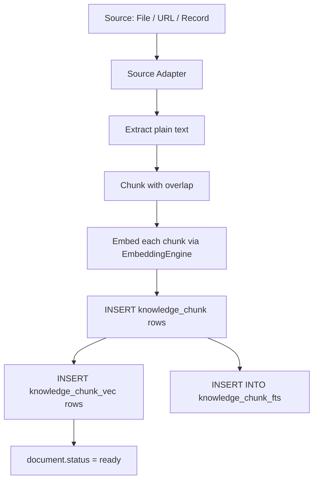

# Knowledge Store (Implementation)

**Version:** 1.0.0
**Status:** RFC
**Layer:** implementation
**Implements:** l1-knowledge-base.md

## Overview

Concrete implementation of the knowledge base subsystem: SQLite schema for collections, directories, and documents; sqlite-vec for dense vector search; FTS5 for keyword search; RRF fusion for hybrid retrieval; an async ingestion pipeline; and the Rust crate that exposes a `KnowledgeStore` service.

## Related Specifications

- [l1-knowledge-base.md](l1-knowledge-base.md) - The concept this spec implements.
- [l2-memory-store.md](l2-memory-store.md) - Memory store also uses sqlite-vec; the embedding engine is shared.
- [l2-resource-sharing.md](l2-resource-sharing.md) - `access-grants` crate enforces KB-4 access control.
- [l2-file-store.md](l2-file-store.md) - Files are the source documents; `FileId` is referenced from `document`.
- [l2-source-layout.md](l2-source-layout.md) - Crate placement under `crates/knowledge-store/`.

## 1. Motivation

The memory store is per-user, conversational, and ephemeral by design. A separate knowledge store handles structured, long-lived, shared reference material that survives sessions and can be queried by multiple workers. Splitting the two keeps each concern clean and avoids embedding RAG pipeline complexity in the memory crate.

## 2. Constraints & Assumptions

- Embedding model must be the same for ingest and query; model change requires full re-index.
- sqlite-vec ANN indices are per-database-file; all collections live in one DB file for simplicity; the ANN index is partitioned by `collection_id` via a `WHERE` filter (post-ANN filtering).
- Ingestion is async and non-blocking to the caller; status is polled or subscribed via the event bus.
- Web URL sources are scraped at ingest time (one-shot); incremental re-scrape is a scheduled task.

## 3. Invariant Compliance (Layer 2)

| L1 Invariant | Implementation |
|---|---|
| KB-1 Collection isolation | Every ANN and FTS query is scoped to explicit `collection_ids`; no implicit cross-collection search. |
| KB-2 Hierarchical organisation | `knowledge_directory` table stores the tree; retrieval queries ignore directory structure. |
| KB-3 Incremental indexing | Ingestion job operates on one document; existing chunks for that document are deleted before re-insert. |
| KB-4 Access control | `access-grants` crate `has_access(Knowledge, collection_id, Permission::Read)` checked before any query. |
| KB-5 Source types | Ingestion pipeline has three source adapters: FileIngester, UrlIngester, RecordIngester. |
| KB-6 Source attribution | Each chunk row carries `document_id`, `position`, and `source_ref` (page/section/byte). |
| KB-7 Non-authoritative recall | Retrieval API returns `(text, source_ref, score)`; no assertion of correctness in the API surface. |
| KB-8 Soft deletion | `document.status = 'deleted'`; chunks excluded from all queries; GC job deletes rows + vector entries. |
| KB-9 Authorship zones | **Pending (v1.1.0 parent).** Add `document.origin` (`human`/`agent`); the `KnowledgeStore` write path must refuse writes to `origin = 'human'` rows unless an explicit override flag is passed. Not yet implemented — drives status RFC. |
| KB-10 Curation lifecycle | **Pending (v1.1.0 parent).** Add `document.curation` (`draft`/`reviewed`/`stable`, agent docs default `draft`); human-gated transitions; expose a `min_curation` retrieval filter. Not yet implemented — drives status RFC. |

## 4. Detailed Design

### 4.1 Schema

```sql
[REFERENCE]
-- Collections
CREATE TABLE knowledge_collection (
    id          TEXT PRIMARY KEY,          -- col/ prefix
    owner_id    TEXT NOT NULL,
    name        TEXT NOT NULL,
    description TEXT NOT NULL DEFAULT '',
    meta        TEXT,                      -- JSON
    created_at  INTEGER NOT NULL,
    updated_at  INTEGER NOT NULL
);

-- Directory tree (optional per-collection hierarchy)
CREATE TABLE knowledge_directory (
    id            TEXT PRIMARY KEY,        -- kdir/ prefix
    collection_id TEXT NOT NULL REFERENCES knowledge_collection(id),
    parent_id     TEXT REFERENCES knowledge_directory(id),
    name          TEXT NOT NULL,
    created_at    INTEGER NOT NULL,
    updated_at    INTEGER NOT NULL,
    UNIQUE (collection_id, parent_id, name)
);
CREATE INDEX ix_kdir_collection ON knowledge_directory(collection_id);

-- Documents (one per source file/URL)
CREATE TABLE knowledge_document (
    id            TEXT PRIMARY KEY,        -- doc/ prefix
    collection_id TEXT NOT NULL REFERENCES knowledge_collection(id),
    directory_id  TEXT REFERENCES knowledge_directory(id),
    source_file_id TEXT,                   -- FileId if source is an uploaded file
    source_url    TEXT,                    -- URL if source is a web page
    name          TEXT NOT NULL,
    status        TEXT NOT NULL DEFAULT 'pending',  -- pending|indexing|ready|error|deleted
    error_msg     TEXT,
    meta          TEXT,                    -- JSON: word count, language, custom tags
    created_at    INTEGER NOT NULL,
    updated_at    INTEGER NOT NULL
);
CREATE INDEX ix_kdoc_collection ON knowledge_document(collection_id);
CREATE INDEX ix_kdoc_status     ON knowledge_document(status);

-- Chunks (split from documents)
CREATE TABLE knowledge_chunk (
    id          TEXT PRIMARY KEY,          -- chk/ prefix
    document_id TEXT NOT NULL REFERENCES knowledge_document(id),
    text        TEXT NOT NULL,
    position    INTEGER NOT NULL,          -- ordinal within document
    source_ref  TEXT,                      -- JSON: {page?, section?, byte_start?, byte_end?}
    created_at  INTEGER NOT NULL
);
CREATE INDEX ix_kchunk_doc ON knowledge_chunk(document_id);

-- FTS5 virtual table for keyword search
CREATE VIRTUAL TABLE knowledge_chunk_fts USING fts5(
    text,
    content='knowledge_chunk',
    content_rowid='rowid'
);

-- sqlite-vec virtual table for ANN (dense vectors)
-- Vector dimension matches the embedding model (e.g., 768 or 1536)
CREATE VIRTUAL TABLE knowledge_chunk_vec USING vec0(
    chunk_id TEXT PRIMARY KEY,
    embedding FLOAT[768]
);
```

### 4.2 Ingestion Pipeline



**Chunking parameters (defaults, configurable per collection):**

| Parameter | Default |
|---|---|
| Chunk size | 512 tokens |
| Overlap | 64 tokens |
| Splitter | Sentence boundary (Unicode sentence segmentation) |

**Re-indexing a document (KB-3):**

1. Delete all `knowledge_chunk` rows for the document.
2. Delete matching `knowledge_chunk_vec` and `knowledge_chunk_fts` entries.
3. Set `document.status = 'indexing'`.
4. Run the ingestion pipeline fresh.

### 4.3 Retrieval

```rust
[REFERENCE]
pub struct RetrievalRequest {
    pub query        : String,
    pub collection_ids: Vec<CollectionId>,
    pub top_k        : usize,          // default 5
    pub min_score    : Option<f32>,    // default 0.0
}

pub struct RetrievedChunk {
    pub chunk_id    : ChunkId,
    pub document_id : DocumentId,
    pub collection_id: CollectionId,
    pub text        : String,
    pub source_ref  : Option<SourceRef>,
    pub score       : f32,
}
```

**Retrieval steps:**

1. Embed `query` via `EmbeddingEngine`.
2. ANN search in `knowledge_chunk_vec` filtered to chunks whose `document_id` is in a ready document from one of the target `collection_ids`. Return top `top_k * 2` candidates.
3. FTS5 search in `knowledge_chunk_fts` with the same filter. Return top `top_k * 2` candidates.
4. Merge the two result sets using Reciprocal Rank Fusion (RRF, k=60).
5. Deduplicate by `chunk_id`, trim to `top_k`, apply `min_score` filter.
6. Return `Vec<RetrievedChunk>`.

### 4.4 Soft Delete and GC

- `DELETE /document/:id` sets `document.status = 'deleted'`. Chunks are excluded from all queries via `JOIN knowledge_document WHERE status != 'deleted'`.
- A GC job (runs at startup and periodically) finds documents with `status = 'deleted'` older than the retention window, deletes their `knowledge_chunk`, `knowledge_chunk_vec`, and `knowledge_chunk_fts` entries, then deletes the document row.

### 4.5 Crate Layout

```plaintext
crates/
└── knowledge-store/
    ├── src/
    │   ├── lib.rs            // KnowledgeStore service
    │   ├── model.rs          // Collection, Document, Chunk, RetrievalRequest, …
    │   ├── db.rs             // SQLite queries
    │   ├── ingest/
    │   │   ├── mod.rs
    │   │   ├── file.rs       // FileIngester
    │   │   ├── url.rs        // UrlIngester (HTTP fetch + HTML→text)
    │   │   └── record.rs     // RecordIngester (plain text / JSON)
    │   ├── retrieval.rs      // hybrid search + RRF fusion
    │   └── gc.rs             // soft-delete garbage collector
    ├── tests/
    │   └── integration.rs
    └── benches/
        └── retrieval_bench.rs
```

## 5. Implementation Notes

1. The `EmbeddingEngine` is shared with `crates/memory-store`; import from a shared `crates/embeddings` crate (or trait object) to avoid duplicating the model-load logic.
2. ANN post-filtering (filtering by `collection_id` after the ANN pass) may cause score degradation for small collections; a collection-partitioned ANN index (one vec table per collection) is an alternative for large collections.
3. Web scraping in `UrlIngester` should respect `robots.txt` and rate-limit requests.
4. Mark ingestion jobs with a correlation ID so status can be polled via the document `status` field without a separate job-tracking table.

## 7. Drawbacks & Alternatives

- **Separate ANN index per collection:** stronger KB-1 isolation and no post-filter degradation, but more tables and more complex schema migration.
- **External vector DB (e.g., Qdrant):** better ANN at scale, but adds an operational dependency. sqlite-vec keeps the system embeddable.

## Canonical References

| Alias | Path | Purpose |
|---|---|---|
| `[L1]` | `.design/main/specifications/l1-knowledge-base.md` | Invariants KB-1…KB-8. |
| `[MEMORY]` | `.design/main/specifications/l2-memory-store.md` | Shared EmbeddingEngine pattern and sqlite-vec usage. |
| `[FILES]` | `.design/main/specifications/l2-file-store.md` | FileId referenced in knowledge_document. |
| `[SHARING]` | `.design/main/specifications/l2-resource-sharing.md` | Access grant enforcement for collections. |
