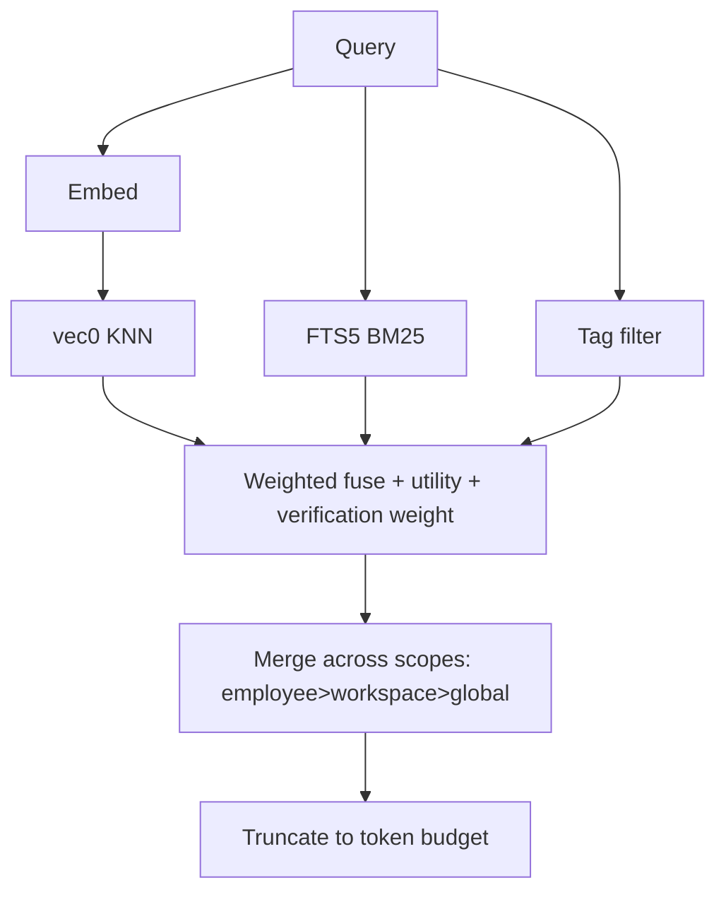

# Memory Store

**Version:** 1.0.0
**Status:** Stable
**Layer:** implementation
**Implements:** l1-memory-model.md

## Overview

The concrete realization of the memory model for v0.1.0: an embedded store using **SQLite + sqlite-vec** (semantic) plus **FTS5** (lexical) plus a **tags** table, with a synchronous core memory service and an asynchronous **archivist** curator role. The relationship graph is deferred and added incrementally; recall works on vector + lexical + tags from day one.

## Related Specifications

- [l1-memory-model.md](l1-memory-model.md) - The model this store implements.
- [l2-filesystem-layout.md](l2-filesystem-layout.md) - On-disk locations of the per-scope databases.
- [l2-technology-stack.md](l2-technology-stack.md) - SQLite + sqlite-vec; optional remote sync.
- [l2-core-library.md](l2-core-library.md) - Hosts the memory service on the hot path.

## 1. Motivation

The model demands cheap, multi-signal, local recall with clean forgetting and compounding learning. SQLite gives a single-file embedded store; sqlite-vec adds vectors without a separate service; FTS5 adds lexical search; a tags table adds deterministic filtering. Splitting hot-path access (core service) from curation (archivist role) keeps recall fast while still consolidating over time.

## 2. Constraints & Assumptions

- Embedded only; no memory daemon. Per-scope SQLite files (see filesystem layout).
- sqlite-vec is pre-1.0 — pin the version and isolate it behind a repository interface.
- Markdown notes are the source of truth; the databases are rebuildable indices (MEM-4).
- v0.1.0 ships vector + lexical + tags. No relationship graph yet.

## 3. Invariant Compliance (Layer 2 only)

| L1 Invariant | Implementation |
| --- | --- |
| MEM-1 Four scopes | Separate stores per scope: global `<state>/memory/`, workspace `<ws>/memory/`, employee `<role>/memory/`, session `<ws>/sessions/`. |
| MEM-2 Most-specific-first | Recall queries employee → workspace → global; merges with specificity precedence; truncates to a token budget. |
| MEM-3 Multi-signal recall | Fuse sqlite-vec similarity + FTS5 BM25 + tag filter into one ranked set. |
| MEM-4 Text source of truth | `notes/*.md` are authoritative; `*.db` indices are rebuildable from notes. |
| MEM-5 Decay & prune | `validity_scope` sets a half-life; a prune job deletes expired low-utility rows and old sessions. |
| MEM-6 Compounding, non-destructive | Archivist promotes/distills; contradictions set `invalid_at` (supersede), never hard-delete durable knowledge. |
| MEM-7 Ownership split | Core service exposes read/write/recall; archivist role runs consolidation; no agent writes the DB directly. |
| MEM-8 Classified & tagged | `type` column + `tags` table with index for deterministic filtering. |
| MEM-9 Provenance | `provenance` column records the producing session/source. |

## 4. Detailed Design

### 4.1 Schema (per-scope SQLite, conceptual)

```sql
-- [REFERENCE] illustrative, not final DDL
CREATE TABLE memory_item (
  id TEXT PRIMARY KEY,
  scope TEXT, type TEXT, content TEXT,
  validity_scope TEXT,           -- Forever|Domain|Project|Workaround
  verification TEXT,             -- Untested|Tested|Confirmed|Stable
  utility REAL, created_at INTEGER, valid_at INTEGER, invalid_at INTEGER,
  provenance TEXT
);
CREATE TABLE memory_tag (item_id TEXT, tag TEXT);             -- MEM-8
CREATE VIRTUAL TABLE memory_fts USING fts5(content, content=memory_item); -- MEM-3 lexical
CREATE VIRTUAL TABLE memory_vec USING vec0(embedding FLOAT[768]);         -- MEM-3 semantic
```

### 4.2 Recall fusion



### 4.3 Write path

Core service: classify scope/type/tags → embed → semantic dedup (cosine threshold) → upsert into the owning scope's DB and append/update the corresponding `notes/*.md`.

### 4.4 The archivist role (curator)

A bundled employee role that owns the asynchronous consolidation cycle, run on a schedule under a cost budget:

| Stage | Action |
| --- | --- |
| verify | advance `verification` for facts confirmed by outcomes |
| decay | reduce relevance by `validity_scope` half-life |
| promote | lift salient session memory into workspace/employee/global |
| distill | extract repeated patterns into reusable skills |
| reconcile | mark contradictions `invalid_at` (supersede) |
| prune | delete expired low-utility rows and stale sessions |

### 4.5 Deferred: relationship graph

The bi-temporal knowledge graph (entities/relations with validity windows, community detection) is **not** in v0.1.0. It will be added as an additional recall signal (MEM-3 allows it) writing to `<ws>/graph/graph.db`, without changing the item store. <!-- TBD: trigger to introduce the graph signal (e.g. office size / cross-reference density) -->

## 5. Drawbacks & Alternatives

- **sqlite-vec pre-1.0:** breaking changes possible; mitigated by version pinning and a repository abstraction.
- **Dual write (db + notes):** keeping notes authoritative adds a sync step; justified by inspectability (MEM-4).
- **Alternative — libSQL native vectors:** rejected for local default (Turso's vector engine is in flux); libSQL/PostgreSQL remain optional sync targets only.

## Canonical References

| Alias | Path | Purpose |
| --- | --- | --- |
| `[MODEL]` | `.design/main/specifications/l1-memory-model.md` | Invariants this store satisfies |
| `[LAYOUT]` | `.design/main/specifications/l2-filesystem-layout.md` | Per-scope database locations |
| `[STACK]` | `.design/main/specifications/l2-technology-stack.md` | Storage engine choices |
