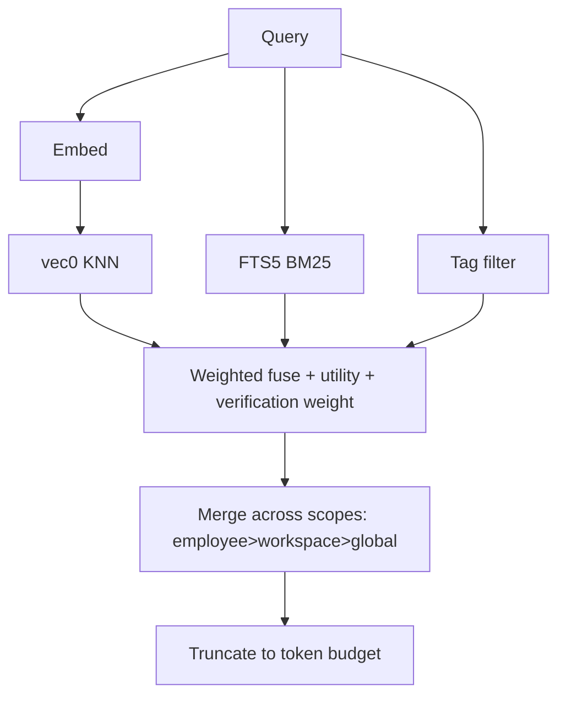

# Memory Store

**Version:** 1.3.0
**Status:** Stable
**Layer:** implementation
**Implements:** l1-memory-model.md

## Overview

The concrete realization of the memory model for v0.1.0: an embedded store using **SQLite + sqlite-vec** (semantic) plus **FTS5** (lexical) plus a **tags** table, with a synchronous core memory service and an asynchronous **archivist** curator role. The relationship graph is deferred and added incrementally; recall works on vector + lexical + tags from day one.

## Related Specifications

- [l1-memory-model.md](l1-memory-model.md) - The model this store implements.
- [l2-filesystem-layout.md](l2-filesystem-layout.md) - On-disk locations of the per-scope databases.
- [l2-technology-stack.md](l2-technology-stack.md) - SQLite + sqlite-vec; optional remote sync.
- [l2-core-library.md](l2-core-library.md) - Hosts the memory service on the hot path.

## 1. Motivation

The model demands cheap, multi-signal, local recall with clean forgetting and compounding learning. SQLite gives a single-file embedded store; sqlite-vec adds vectors without a separate service; FTS5 adds lexical search; a tags table adds deterministic filtering. Splitting hot-path access (core service) from curation (archivist role) keeps recall fast while still consolidating over time.

## 2. Constraints & Assumptions

- Embedded only; no memory daemon. Per-scope SQLite files (see filesystem layout).
- sqlite-vec is pre-1.0 — pin the version and isolate it behind a repository interface.
- Markdown notes are the source of truth; the databases are rebuildable indices (MEM-4).
- v0.1.0 ships vector + lexical + tags. No relationship graph yet.

## 3. Invariant Compliance (Layer 2 only)

| L1 Invariant | Implementation |
| --- | --- |
| MEM-1 Four scopes | Separate stores per scope: global `<state>/memory/`, workspace `<ws>/memory/`, employee `<role>/memory/`, session `<ws>/sessions/`. |
| MEM-2 Most-specific-first | Recall queries employee → workspace → global; merges with specificity precedence; truncates to a token budget. |
| MEM-3 Multi-signal recall | Fuse sqlite-vec similarity + FTS5 BM25 + tag filter into one ranked set. |
| MEM-4 Text source of truth | `notes/*.md` are authoritative; `*.db` indices are rebuildable from notes. |
| MEM-5 Decay & prune | `validity_scope` sets a half-life; a prune job deletes expired low-utility rows and old sessions. |
| MEM-6 Compounding, non-destructive | Archivist promotes/distills; contradictions set `invalid_at` (supersede), never hard-delete durable knowledge. |
| MEM-7 Ownership split | Core service exposes read/write/recall; archivist role runs consolidation; no agent writes the DB directly. |
| MEM-8 Classified & tagged | `type` column + `tags` table with index for deterministic filtering. |
| MEM-9 Provenance | `provenance` column records the producing session/source. |

## 4. Detailed Design

### 4.1 Schema (per-scope SQLite, conceptual)

```sql
-- [REFERENCE] illustrative, not final DDL
CREATE TABLE memory_item (
  id TEXT PRIMARY KEY,
  scope TEXT, type TEXT, content TEXT,
  validity_scope TEXT,                  -- Forever|Domain|Project|Workaround
  verification TEXT,                    -- Untested|TestsPass|Merged|StableNoRevert|ValidatedCrossProject
  utility REAL,
  trust_score REAL DEFAULT 0.5,         -- reliability in [0,1]; see §4.6
  helpful_count INTEGER DEFAULT 0,      -- accumulated positive feedback
  retrieval_count INTEGER DEFAULT 0,    -- auto-incremented on each recall hit
  created_at INTEGER, valid_at INTEGER, invalid_at INTEGER,
  provenance TEXT,
  hrr_phases BLOB                       -- optional phase vector; see §4.8
);
CREATE TABLE memory_tag (item_id TEXT, tag TEXT);                          -- MEM-8
CREATE TABLE memory_entity (
  id TEXT PRIMARY KEY,
  name TEXT NOT NULL,
  entity_type TEXT DEFAULT 'unknown',
  aliases TEXT DEFAULT ''
);                                                                          -- §4.7
CREATE TABLE memory_fact_entity (
  fact_id TEXT REFERENCES memory_item(id),
  entity_id TEXT REFERENCES memory_entity(id),
  PRIMARY KEY (fact_id, entity_id)
);                                                                          -- §4.7
CREATE INDEX idx_memory_trust ON memory_item(trust_score DESC);
CREATE INDEX idx_memory_entity_name ON memory_entity(name);
CREATE VIRTUAL TABLE memory_fts USING fts5(content, content=memory_item);  -- MEM-3 lexical
CREATE VIRTUAL TABLE memory_vec USING vec0(embedding FLOAT[768]);           -- MEM-3 semantic
```

### 4.2 Recall fusion



<!-- [ADDED] v1.3.0 -->
**Concurrent recall legs and scopes.** The recall legs are independent until the fuse: the FTS5 pass and the tag filter run while the query embedding is computed (the embedding call is the latency-dominant leg; lexical results never wait on it), and the vec0 KNN pass starts as soon as the embedding is ready. Because each scope (employee / workspace / global) is a separate database file, the per-scope leg sets execute concurrently on scope-local read connections and meet at the existing cross-scope merge step. The fuse remains a single deterministic reduction over the joined candidate sets — concurrency changes arrival order, never ranking (weights and the §4.2.2 refinements apply after the join).

#### 4.2.1 Multi-script lexical robustness

The default FTS5 tokenizer splits on whitespace and ASCII punctuation, so it under-tokenizes scripts that lack explicit word boundaries (e.g. CJK) or segment differently — a `MATCH` query over such content can return zero rows even when a matching fact exists. The lexical recall pass is therefore two-stage:

1. **Primary** — `memory_fts MATCH ?` (BM25-ranked), with the query's whitespace-separated terms OR-combined.
2. **Fallback** — only when the `MATCH` pass yields zero rows, run a substring scan, preserving the same trust and category filters and ordering by trust:

```sql
-- [REFERENCE] fallback when FTS5 MATCH returns no rows
SELECT … FROM memory_item
WHERE content LIKE '%' || ? || '%'
  AND trust_score >= ?           -- TRUST_MIN_SEARCH (§4.6)
  [AND type = ?]                 -- optional category filter
ORDER BY trust_score DESC
LIMIT ?;
```

The fallback keeps lexical recall functional for any script without bundling a language-specific tokenizer (e.g. an ICU build). It is lexical-only and engages just on empty `MATCH` results, so it adds no cost to the common path; semantic recall (`vec0`) and HRR similarity (§4.8) are unaffected and continue to supply cross-lingual signal. The same `MATCH`→`LIKE` degradation pattern is reusable by any FTS5 surface in the system (knowledge store, code index).

#### 4.2.2 Diversity and recency refinements

Two optional ranking refinements apply after the weighted fuse and before truncation to the token budget. Both are config-gated and default to behavior identical to the unrefined fuse, so they are non-breaking; their effect on recall quality is measurable via the retrieval-evaluation harness (see `l1-retrieval-evaluation.md`).

- **MMR diversity** — when enabled, the fused candidate list is re-ordered by Maximal Marginal Relevance instead of pure score: each next pick maximizes `λ · score − (1−λ) · max_similarity_to_already_picked`. `mmr_lambda ∈ [0,1]` trades relevance (1.0 = pure score, the default) for diversity (lower = less redundant). This suppresses near-duplicate memories crowding the top-K when several items restate the same fact.
- **Opt-in recency** — recency is a third ranking signal, **off by default** (`recency_weight = 0`). When enabled it joins the normalized fuse as `score = (sim_w·sim + util_w·util + rec_w·recency) / (sim_w + util_w + rec_w)`, where `recency` decays with a configurable half-life (`recency_halflife_days`, default 30). Useful for fast-moving projects where fresh memories should outrank stale-but-popular ones; left off, ranking is purely similarity + utility + verification weight as before.

```text
[REFERENCE] recall ranking knobs (config-gated, defaults = no behavior change)
mmr_lambda            = 1.0   // 1.0 = pure relevance (off); lower = more diverse
recency_weight        = 0.0   // 0 = recency off (opt-in)
recency_halflife_days = 30.0
```

### 4.3 Write path

Core service: classify scope/type/tags → embed → semantic dedup (cosine threshold) → upsert into the owning scope's DB and append/update the corresponding `notes/*.md`.

### 4.4 The archivist role (curator)

A bundled employee role that owns the asynchronous consolidation cycle, run on a schedule under a cost budget:

| Stage | Action |
| --- | --- |
| verify | advance `verification` for facts confirmed by outcomes |
| decay | reduce relevance by `validity_scope` half-life |
| promote | lift salient session memory into workspace/employee/global |
| distill | extract repeated patterns into reusable skills |
| reconcile | mark contradictions `invalid_at` (supersede) |
| prune | delete expired low-utility rows and stale sessions |

#### Verification state weights

Each verification level applies a multiplicative weight to learned `utility` during recall fusion — unverified outcomes rank lower than those confirmed by external signals.

| State | Trigger | Weight |
| --- | --- | --- |
| `Untested` | capture path (default) | 0.30 |
| `TestsPass` | test-runner hook records a passing run | 0.60 |
| `Merged` | git merge commit references the episode | 0.80 |
| `StableNoRevert` (< 30 days) | `Merged` with no revert after stability window | 0.85 |
| `StableNoRevert` (≥ 30 days) | same, beyond 30-day stability threshold | 0.95 |
| `ValidatedCrossProject` | multiple distinct projects cite as success-template | 1.00 |

Transitions are time-based (`StableNoRevert`), event-based (test hooks, merge commits), or dream-cycle-based (`ValidatedCrossProject` surfaces via the `templates` phase).

The `verify_advance` dream phase promotes `Merged` episodes past the stability threshold into `StableNoRevert`. Default stability window: **30 days**.

### 4.5 Deferred: relationship graph

The bi-temporal knowledge graph (entities/relations with validity windows, community detection) is **not** in v0.1.0. It will be added as an additional recall signal (MEM-3 allows it) writing to `<ws>/graph/graph.db`, without changing the item store. <!-- TBD: trigger to introduce the graph signal (e.g. office size / cross-reference density) -->

§4.7 introduces a **shallow** entity linking schema (`memory_entity` + `memory_fact_entity`) as the seed of this deferred graph. The shallow layer supports entity-based queries ("all facts mentioning this entity") without implementing validity windows or community detection; those remain deferred.

### 4.6 Trust scoring

`utility` (§4.1) measures how often a fact is relevant; `trust_score` measures how **reliable** it is. These are orthogonal: a popular fact can be untrustworthy, and a rare fact can be highly trusted. Both signals are used in recall fusion (§4.2).

#### Constants

```text
[REFERENCE]
TRUST_INITIAL         = 0.5   // neutral starting point
TRUST_DELTA_HELPFUL   = +0.05 // user confirmed the fact was correct
TRUST_DELTA_UNHELPFUL = -0.10 // user indicated the fact was wrong or unhelpful
TRUST_MIN             = 0.0
TRUST_MAX             = 1.0
TRUST_MIN_SEARCH      = 0.3   // facts below this threshold are excluded from recall
```

The asymmetry is intentional: facts lose trust faster than they gain it. This keeps the memory store epistemically conservative — a single "that was wrong" outweighs two confirmations, preventing stale facts from accumulating unearned trust over time.

#### Feedback API

```text
[REFERENCE]
record_feedback(id: &str, helpful: bool) -> TrustUpdate:
  old_trust = memory_item.trust_score
  delta     = TRUST_DELTA_HELPFUL if helpful else TRUST_DELTA_UNHELPFUL
  new_trust = clamp(old_trust + delta, TRUST_MIN, TRUST_MAX)
  UPDATE memory_item SET trust_score = new_trust,
    helpful_count = helpful_count + (1 if helpful else 0),
    updated_at = now()
    WHERE id = ?
  return TrustUpdate { id, old_trust, new_trust }
```

#### Recall integration

```text
[REFERENCE]
-- Exclude low-trust facts from recall
WHERE trust_score >= TRUST_MIN_SEARCH

-- Trust is an additive weight in the recall fusion score
recall_score = vec_similarity * w_vec
             + fts_bm25 * w_fts
             + trust_score * w_trust
             + utility * w_utility
```

`retrieval_count` is incremented automatically on every recall hit and provides a popularity signal for the archivist's `prune` stage (frequently recalled = higher keep priority).

### 4.7 Entity links (shallow graph)

A lightweight entity linking layer on top of the fact store. Provides entity-based recall ("all facts mentioning this person/project") without the full bi-temporal knowledge graph (still deferred per §4.5).

#### Schema

```text
[REFERENCE]
memory_entity (id, name, entity_type, aliases)
memory_fact_entity (fact_id → memory_item.id, entity_id → memory_entity.id)
```

Entity types follow the category taxonomy: `person`, `project`, `technology`, `preference`, `unknown`.

#### Entity extraction (heuristic)

On `add_fact`, entities are extracted from the content text using lightweight heuristics (no NLP model required):

```text
[REFERENCE]
extract_entities(text: &str) -> Vec<String>:
  candidates = []
  // 1. Capitalized multi-word phrases: "Project Alpha", "John Smith"
  candidates += regex r'\b([A-Z][a-z]+(?:\s+[A-Z][a-z]+)+)\b'
  // 2. Double-quoted strings: "the new dashboard"
  candidates += regex r'"([^"]+)"'
  // 3. Single-quoted strings: 'feature flag'
  candidates += regex r"'([^']+)'"
  return deduplicated(candidates)
```

Each extracted entity is resolved against `memory_entity` (case-insensitive name match) and linked via `memory_fact_entity`. A new entity record is created if no match is found.

#### Entity-based recall

```text
[REFERENCE]
recall_by_entity(entity_name: &str, min_trust: f64 = 0.3) -> Vec<MemoryItem>:
  SELECT m.* FROM memory_item m
    JOIN memory_fact_entity fe ON fe.fact_id = m.id
    JOIN memory_entity e ON e.id = fe.entity_id
   WHERE e.name LIKE ? AND m.trust_score >= ?
   ORDER BY m.trust_score DESC, m.utility DESC
```

### 4.8 HRR vector encoding (optional)

Holographic Reduced Representations (HRR) provide a **deterministic, model-free** structured vector encoding for facts. Unlike sqlite-vec embeddings (which require an embedding model call), HRR phases are computed from word content alone via SHA-256. They are stored in the `hrr_phases BLOB` column and used as a fallback when no embedding model is configured.

#### Phase encoding

```text
[REFERENCE]
HRR_DIM: usize = 1024   // phase vector dimension

encode_atom(word: &str, dim: usize) -> Vec<f64>:
  // Deterministic phase vector via SHA-256 counter blocks (16 u16 values per block)
  phases = []
  for i in 0..ceil(dim / 16):
    digest = sha256("{word}:{i}")
    phases += unpack_u16_le(digest)  // 16 u16 values per 32-byte digest
  return phases[..dim].map(|v| v as f64 * (2π / 65536.0))

encode_text(text: &str, dim: usize) -> Vec<f64>:
  tokens = tokenize(text)            // lowercase, strip punctuation
  return bundle(tokens.map(|t| encode_atom(t, dim)))
```

#### Binding operations

```text
[REFERENCE]
// bind: combine two concepts (circular convolution via phase addition)
bind(a: Vec<f64>, b: Vec<f64>) -> Vec<f64>:
  zip(a, b).map(|(x, y)| (x + y) % TWO_PI)

// unbind: retrieve a bound value (phase subtraction = inverse of bind)
unbind(memory: Vec<f64>, key: Vec<f64>) -> Vec<f64>:
  zip(memory, key).map(|(m, k)| (m - k).rem_euclid(TWO_PI))

// bundle: superpose multiple vectors (circular mean of complex exponentials)
bundle(vectors: &[Vec<f64>]) -> Vec<f64>:
  complex_sums = sum(vectors.map(|v| v.map(|p| (cos(p), sin(p)))))
  complex_sums.map(|(re, im)| atan2(im, re).rem_euclid(TWO_PI))

// similarity: phase cosine similarity in [-1, 1]
similarity(a: Vec<f64>, b: Vec<f64>) -> f64:
  mean(zip(a, b).map(|(x, y)| cos(x - y)))
```

#### Structured fact encoding

```text
[REFERENCE]
encode_fact(content: &str, entities: &[&str], dim: usize) -> Vec<f64>:
  ROLE_CONTENT = encode_atom("__role_content__", dim)
  ROLE_ENTITY  = encode_atom("__role_entity__", dim)

  components = [bind(encode_text(content, dim), ROLE_CONTENT)]
  for entity in entities:
    components.push(bind(encode_atom(entity.to_lowercase(), dim), ROLE_ENTITY))

  return bundle(&components)
```

Unbinding with `ROLE_ENTITY` from a stored HRR vector recovers an approximate representation of the entity concept, enabling similarity comparison without re-encoding.

#### Capacity guard

```text
[REFERENCE]
snr_estimate(dim: usize, n_items: usize) -> f64:
  sqrt(dim as f64 / n_items as f64)

// Warn when SNR < 2.0 — retrieval accuracy degrades below this threshold
// dim=1024: supports ~256 items before degradation (√1024/256 = 2.0)
```

When the archivist's `prune` stage runs, it checks `snr_estimate(HRR_DIM, n_items)`. If SNR < 2.0, low-trust + low-utility items are eligible for pruning ahead of schedule to restore capacity headroom.

### 4.9 Bellman propagation

Utility scores are not just updated on direct feedback — they propagate through the episode similarity graph. When episode A is marked helpful, nearby episodes (similar content, same session, or explicitly related) receive a discounted utility boost via a Bellman-style credit assignment. This surfaces items that tend to co-occur with successful outcomes even if they were not the directly retrieved item.

#### Constants

```text
[REFERENCE]
BELLMAN_GAMMA                   = 0.9    // discount factor per hop
BELLMAN_ALPHA                   = 0.1    // learning rate for utility updates
BELLMAN_MAX_PROPAGATION_DEPTH   = 2      // maximum hops in the similarity graph
BELLMAN_PROPAGATION_THRESHOLD   = 0.5    // minimum cosine similarity to propagate to
BELLMAN_TEMPORAL_CREDIT_WINDOW_H = 1     // lookback window for same-session credit (hours)
BELLMAN_DECAY_RATE_PER_DAY      = 0.01   // baseline utility decay for unused episodes
```

#### Propagation algorithm

```text
[REFERENCE]
propagate(source_id: &str, feedback: f32):
  source_utility = memory_item[source_id].utility
  new_utility    = source_utility + ALPHA * (feedback - source_utility)
  UPDATE memory_item SET utility = new_utility WHERE id = source_id

  neighbors = similarity_search(source_id, threshold=PROPAGATION_THRESHOLD,
                                depth=MAX_PROPAGATION_DEPTH)
  for (neighbor_id, sim, depth) in neighbors:
    discount     = GAMMA ** depth
    propagated   = ALPHA * discount * sim * feedback
    UPDATE memory_item SET utility = utility + propagated WHERE id = neighbor_id

  // Temporal credit: episodes retrieved in the same session window also benefit
  recent_ids = list_by_session_window(source_id, TEMPORAL_CREDIT_WINDOW_H)
  for neighbor_id in recent_ids:
    propagated = ALPHA * GAMMA * feedback
    UPDATE memory_item SET utility = utility + propagated WHERE id = neighbor_id
```

#### Decay

On each propagation run (typically scheduled daily), episodes that have not been retrieved recently have their utility reduced:

```text
[REFERENCE]
new_utility = old_utility * (1.0 - DECAY_RATE_PER_DAY)
```

The scope-aware decay rates in §4.4 (via `validity_scope`) override this baseline for fact items; Bellman decay applies to the episode utility signal.

### 4.10 Session chaining

Episodes that belong to the same logical work session are automatically linked to one another via `related_episodes`. The session is detected heuristically: two episodes for the same project within a **2-hour window** are considered part of the same session.

#### Session key

```text
[REFERENCE]
SESSION_LINK_WINDOW_HOURS = 2   // auto-link window for same-project episodes
```

When a new episode is captured:

1. Look back at episodes for the same project within the last 2 hours.
2. For each match, add a `RelatedEpisode { id, relationship: Continuation }` link on the new episode.
3. Optionally assign a shared `session_id` UUID to the cluster so retrieval can group them.

This feeds the Bellman temporal credit window: propagation uses the linked episodes to award credit to items that were co-retrieved in the same session, even if only one received explicit feedback.

#### Relationship types

| Relationship | Meaning |
| --- | --- |
| `Continuation` | Same task, next step in the same session |
| `Prerequisite` | This episode was needed before the other |
| `Alternative` | Different approach to the same problem |
| `Related` | Loosely related (explicit manual link) |

Continuation links are created automatically by session chaining. The other types are created explicitly by the session pipeline when the agent expresses the relationship.

### 4.11 Lightweight quick memory

A human-readable, immediately injectable complement to the vector/FTS store. Two Markdown files per role scope provide always-available context without embedding or search overhead.

#### File layout

```plaintext
<state>/employees/<role>/memories/
├── MEMORY.md   # fact entries delimited by § — injected verbatim every session
└── USER.md     # user profile context (free-form) — injected verbatim every session
```

#### Entry format (MEMORY.md)

Entries are separated by the Unicode section delimiter `\n§\n` (newline + `§` + newline). Each entry is free-form Markdown. Example:

```markdown
## SSH
- home-server → 192.168.1.100, user: admin

§

## Lessons
- The build cache at ~/.local/share/app must be cleared after dependency updates.
```

#### Character limits

Configurable in `<role>/config.yaml`. Writes that would exceed the limit are rejected with a descriptive error.

```yaml
memory:
  memory_char_limit: 2200   # default — MEMORY.md ceiling in characters
  user_char_limit: 1375     # default — USER.md ceiling in characters
```

#### Write API

```text
[REFERENCE]
add_quick_memory(content: &str, role: &str) -> Result<(), MemoryLimitError>
update_quick_memory(index: usize, content: &str, role: &str) -> Result<(), MemoryLimitError>
delete_quick_memory(index: usize, role: &str) -> Result<()>
set_user_context(content: &str, role: &str) -> Result<(), MemoryLimitError>
```

#### Relationship to the vector/FTS store

Quick memory files are the **working memory** — small, always injected, human-inspectable. The vector/FTS store (§4.1–4.10) is the **deep archive** — indexed, queried on demand. The archivist's distill stage may promote stable quick-memory items into the structured store; the quick-memory files then slim down to the most immediately relevant facts.

### 4.12 Two-phase memory consolidation pipeline

A structured pipeline converts raw session transcripts into consolidated role memories through two bounded phases that run independently.

#### Phase 1 — Rollout Extraction (per-session, bounded-parallel)

Runs at session startup. For each eligible session transcript ("rollout"):

```text
[REFERENCE]
Eligibility criteria (all must be true):
  idle_hours          >= MIN_ROLLOUT_IDLE_HOURS              // session ended long enough ago
  age_days            <= MAX_ROLLOUT_AGE_DAYS                // not too stale to extract value
  rate_remaining_pct  >= MIN_RATE_LIMIT_REMAINING_PERCENT    // preserve API budget headroom

Constants:
  MAX_ROLLOUTS_PER_STARTUP             = 2    // process at most N rollouts per startup
  MAX_ROLLOUT_AGE_DAYS                 = 10
  MIN_ROLLOUT_IDLE_HOURS               = 6
  MIN_RATE_LIMIT_REMAINING_PERCENT     = 25   // percent of hourly API budget remaining

Procedure per eligible rollout:
  1. Claim the rollout (lease/claim prevents double-processing across concurrent startups).
  2. Run LLM extraction sub-agent: extract structured facts from the session transcript.
  3. Append extracted facts to raw_memories.md in the role's memories directory.
  4. Write a per-rollout summary to rollout_summaries/<thread_id>.md.
```

Phase 1 agents run with a concurrency cap (at most 2 concurrent extractions) to avoid saturating the model API.

#### Phase 2 — Global Consolidation (single global lock)

Runs after Phase 1 completes (or independently on a schedule). At most one Phase 2 can run at a time:

```text
[REFERENCE]
Constants:
  MAX_RAW_MEMORIES_FOR_CONSOLIDATION  = 256   // clamp raw input to protect context window
  MAX_UNUSED_DAYS                     = 30    // prune entries not referenced in this window

Procedure:
  1. Acquire global lock (prevents concurrent Phase 2 runs).
  2. Clamp: read at most MAX_RAW_MEMORIES_FOR_CONSOLIDATION entries from raw_memories.md.
  3. Capture git-baseline snapshot of the current MEMORY.md.
  4. Run diff-driven consolidation sub-agent:
       reads baseline + raw memories → produces unified MEMORY.md;
       eliminates duplicates, resolves contradictions, prunes entries
       not referenced within MAX_UNUSED_DAYS.
  5. Write phase2_workspace_diff.md (diff vs baseline, audit trail).
  6. Apply: update MEMORY.md and memory_summary.md.
  7. Release lock.
```

#### Extended file layout

Phase 2 extends the quick-memory layout from §4.11:

```plaintext
<state>/employees/<role>/memories/
├── MEMORY.md                          # consolidated output (§4.11 writer, §4.12 updater)
├── USER.md                            # user profile context (§4.11)
├── raw_memories.md                    # Phase 1 accumulator (structured extracted facts)
├── rollout_summaries/<thread_id>.md   # per-session Phase 1 extraction results
├── phase2_workspace_diff.md           # last Phase 2 diff (audit trail)
└── memory_summary.md                  # narrative summary updated by Phase 2
```

#### Relationship to the archivist role

The two-phase pipeline is the data-ingestion layer that keeps `MEMORY.md` current between archivist cycles. The archivist's `distill` and `reconcile` stages (§4.4) operate on the already-consolidated MEMORY.md; Phase 1/2 handle the raw transcript-to-memory conversion that feeds the archivist.

### 4.13 Quick memory recall lifecycle

The §4.11 quick memory files (`MEMORY.md`, `USER.md`) are authoritative reference text
injected at session start. This section specifies three complementary operations that
complete the lifecycle: an extract cursor that prevents double-processing of transcript
slices, a dual-path strategy for selecting relevant entries per turn, and a forget
operation for targeted entry removal.

#### Extract cursor

Phase 1 of the consolidation pipeline (§4.12) may receive multiple concurrent startup
requests across sessions. An extract cursor prevents the same transcript slice from
being extracted twice:

```text
[REFERENCE]
ExtractCursor {
  session_id:        String,    // session whose transcript is being processed
  processed_offset:  usize,    // count of already-processed messages in this transcript
  updated_at:        Timestamp,
}

Procedure per eligible rollout:
  1. Read extract-cursor.json for this role scope.
  2. If session_id changed: reset processed_offset to 0.
  3. Load transcript messages[processed_offset..] ("unprocessed slice").
  4. If slice is empty → return (no patches needed).
  5. Run LLM extraction sub-agent against the slice.
  6. Write patches; update processed_offset = transcript.len().
  7. Write extract-cursor.json.

Skip triggers (extraction is skipped when):
  memory_tool    — the current agent turn already wrote memory files directly this turn
  already_running — extraction is in progress and the queue is full
  queued         — a later extraction will subsume this one (only one queue slot)

Patch filtering before write (discard a candidate patch when):
  - summary length < 12 characters
  - summary ends with '?' (questions are not facts)
  - summary contains transient keywords: today / now / currently / temporary / this week
  - (type, summary) pair already present in the file (exact duplicate)
```

#### Recall dual-path

Before each turn the quick memory files relevant to the user's query are injected into
the system prompt. Two selection paths are tried in order:

```text
[REFERENCE]
RecallStrategy: "model" | "heuristic" | "none"

Path 1 — Model-driven (preferred when LLM available):
  Issue a lightweight side-query: given the user's current message, which memory files
  (identified by their description line) are relevant? The model returns a ranked subset.
  → strategy: "model"

Path 2 — Heuristic fallback (tokenize query, score each file):
  score(doc, query) =
    + 2 for each query token found in doc body or description
    + 1 for each query token that is a type-characteristic keyword (see below)
    + 1 if doc body is non-empty
  Rank by score descending; discard documents with score == 0.
  → strategy: "heuristic"

Type-characteristic keywords (boost by +1 per match):
  user      → user, preference, background, role, habit
  feedback  → feedback, rule, avoid, style, correction
  project   → project, goal, deadline, milestone, incident
  reference → reference, dashboard, link, ticket, docs

Injection limits:
  MAX_RECALL_DOCS     = 5       // maximum files injected into the system prompt per turn
  MAX_DOC_BODY_CHARS  = 1200   // body truncated to this many characters before injection

When a body is truncated, append:
  "NOTE: memory entry truncated for prompt budget."

strategy: "none" is returned (no injection) when:
  - the query is empty
  - no memory files exist in scope
  - all files score 0 on the heuristic path
  - Path 1 and Path 2 both fail or return empty results
```

#### Forget operation

Users may delete a specific memory entry via `/forget <query>`. The forget operation
locates the matching entry and removes it without disturbing other entries in the file.

```text
[REFERENCE]
ForgetResult {
  removed_entries: Vec<ForgetEntry>,
  strategy:        RecallStrategy,   // how the target was selected
}

ForgetEntry {
  entry_id: String,   // stable identifier (see below)
  topic:    String,   // relative file path (e.g. "feedback/style.md")
}

Stable entry ID scheme:
  Single-entry file → entry_id = relative_path (e.g. "feedback/no-summary.md")
  Multi-entry file  → entry_id = "relative_path:index" (e.g. "feedback/style.md:2")
  index is 0-based, determined at scan time, stable within one forget operation.

Procedure:
  1. Scan all memory files; enumerate entries; assign stable IDs.
  2. Select target entry via model (side-query, temperature = 0) or heuristic.
  3. Single-entry file → delete the file.
  4. Multi-entry file → parse all entries, remove target, rewrite file.
  5. Rebuild MEMORY.md index.

On teardown of a connection/session with an outstanding forget in progress,
abort and do not apply partial writes.
```

#### MEMORY.md index limits

The `MEMORY.md` index summarizes all memory topics for fast scanning and injection.
To keep it injectable at low token cost:

```text
[REFERENCE]
MEMORY_INDEX_MAX_LINES      = 200      // maximum entry count
MEMORY_INDEX_MAX_LINE_CHARS = 150      // each line truncated with "…" if longer
MEMORY_INDEX_MAX_BYTES      = 25_000   // total file size ceiling in bytes

Entry format:
  - [Title](relative_path.md) — one-line hook (≤150 chars total)

The index is rebuilt after every successful Extract, Dream, or Forget operation.
```

### 4.14 Bi-temporal metadata model

[ADDED] Explicit separation of world time (when knowledge became true) from system time
(when it was recorded), enabling point-in-time history queries without conflating the two
clocks. This extends the `valid_at` / `invalid_at` columns in §4.1 with a transaction-time
axis and supersession tracking.

#### Timestamp model

```text
[REFERENCE]
TemporalMetadata {
  valid_at:      Timestamp,          // when the fact became true in the world
  invalid_at:    Option<Timestamp>,  // when it ceased to be true (None = still valid)
  created_at:    Timestamp,          // when this record entered the system
  superseded_at: Option<Timestamp>,  // when this record was replaced by a newer version
  commit_hash:   Option<String>,     // code snapshot at time of knowledge capture
  version_tag:   Option<String>,     // release tag at time of knowledge capture
}
```

Two distinct time axes:

- **Valid time** (`valid_at`/`invalid_at`): "was this fact true in the world at time T?"
- **Transaction time** (`created_at`/`superseded_at`): "was this record the authoritative
  version in the system at time T?"

The distinction matters when a fact is captured late (e.g. a bug found days after it was
introduced) or corrected retroactively.

#### Point-in-time query methods

```text
[REFERENCE]
is_current() -> bool:
  match invalid_at {
    None          => true,
    Some(t) => t > now(),
  }

was_valid_at(time: Timestamp) -> bool:
  valid_at <= time
  && match invalid_at {
    None    => true,
    Some(t) => t > time,
  }

was_current_at(time: Timestamp) -> bool:
  created_at <= time
  && match superseded_at {
    None    => true,
    Some(t) => t > time,
  }

invalidate():    invalid_at    = now()
supersede():     superseded_at = now()
```

#### MEM-6 compliance

`invalid_at` + `superseded_at` are the non-destructive contradiction mechanism required by
MEM-6. When the archivist's `reconcile` stage detects a contradiction between two facts, it
calls `supersede()` on the older record and writes a new one — no hard deletes. This
preserves the full history for audit and rollback.

#### Schema integration

The §4.1 schema already carries `valid_at` and `invalid_at`. Add `created_at` (auto-set on
insert) and `superseded_at` (nullable, set by reconcile):

```sql
-- [REFERENCE] additions to memory_item
ALTER TABLE memory_item ADD COLUMN created_at INTEGER NOT NULL DEFAULT (unixepoch());
ALTER TABLE memory_item ADD COLUMN superseded_at INTEGER;
ALTER TABLE memory_item ADD COLUMN commit_hash TEXT;
ALTER TABLE memory_item ADD COLUMN version_tag TEXT;
```

The `superseded_at` index accelerates the common "current version only" filter:

```sql
CREATE INDEX idx_memory_superseded ON memory_item(superseded_at)
  WHERE superseded_at IS NULL;
```

### 4.15 Typed memory kind taxonomy

[ADDED] Structured memory kind variants replace the untyped `type TEXT` column. Each variant
carries only the fields meaningful to its domain, making pattern-matching exhaustive and
field access type-safe. Five kinds cover the full project-knowledge space.

#### MemoryKind enum

```text
[REFERENCE]
MemoryKind:
  ArchitecturalDecision {
    decision:               String,
    rationale:              String,
    alternatives_considered: Option<Vec<String>>,
    stakeholders:           Vec<String>,          // e.g. ["backend-team", "security"]
  }
  DebugContext {
    problem_description:  String,
    root_cause:           Option<String>,
    solution:             String,
    symptoms:             Vec<String>,
    related_errors:       Vec<String>,
  }
  KnownIssue {
    description:  String,
    severity:     IssueSeverity,   // Critical | High | Medium | Low | Info
    workaround:   Option<String>,
    tracking_id:  Option<String>,  // issue tracker reference
  }
  Convention {
    name:          String,
    description:   String,
    pattern:       Option<String>,      // positive example
    anti_pattern:  Option<String>,      // negative example
  }
  ProjectContext {
    topic:        String,
    description:  String,
    tags:         Vec<String>,
  }
```

Kind storage: the `type` column stores the discriminant name
(`architectural_decision`, `debug_context`, `known_issue`, `convention`, `project_context`)
for SQL filtering; the full structured payload is stored in a JSON `kind_data` column.

#### MemorySource typed provenance

Replaces the untyped `provenance TEXT` column with a sum type that encodes the full
origin chain:

```text
[REFERENCE]
MemorySource:
  UserProvided      { author: Option<String> }
  CodeExtracted     { file_path: String }
  ConversationDerived { session_id: String }
  ExternalDoc       { url: String }
  GitHistory        { commit_hash: String }
```

Storage: discriminant in `provenance_kind TEXT`, payload in `provenance_data JSON`.

#### MemoryNode confidence

A `confidence: f32 ∈ [0.0, 1.0]` field records extraction certainty at write time.
Distinct from `trust_score` (§4.6), which accumulates over feedback cycles:

- `confidence` is set once at write time by the extracting agent or user.
- `trust_score` starts at 0.5 and drifts based on outcome signals.

Recall fusion weight:

```text
recall_score = vec_similarity * w_vec
             + fts_bm25 * w_fts
             + (trust_score * confidence) * w_trust   // product of both reliability signals
             + utility * w_utility
```

### 4.16 Code node links and auto-invalidation

[ADDED] Memories may be explicitly bound to specific code-graph nodes. When the bound node
changes (signature, delete, rename), the memory is automatically flagged for review or
invalidation rather than silently becoming stale.

#### CodeLink structure

```text
[REFERENCE]
CodeLink {
  node_id:    String,            // stable code-graph node identifier
  node_type:  LinkedNodeType,    // Function | Class | Module | File | Variable |
                                  // Import | Interface | Trait
  relevance:  f32,               // [0.0, 1.0] — how tightly bound this memory is to
                                  // the node (1.0 = about nothing else)
  line_range: Option<(u32, u32)>, // specific lines within the file, if known
}
```

A memory may have zero or more `CodeLink` entries. Zero = general project knowledge.
Multiple links = spans several nodes (e.g. "the interaction between auth() and session()").

Schema:

```sql
-- [REFERENCE]
CREATE TABLE memory_code_link (
  memory_id  TEXT REFERENCES memory_item(id),
  node_id    TEXT NOT NULL,
  node_type  TEXT NOT NULL,
  relevance  REAL NOT NULL DEFAULT 1.0,
  line_start INTEGER,
  line_end   INTEGER,
  PRIMARY KEY (memory_id, node_id)
);
```

Graph proximity recall: when the agent is focused on a specific code node (e.g. editing a
function), memories with `CodeLink.node_id = <current node>` receive a `graph_proximity`
boost in recall fusion:

```text
[REFERENCE]
graph_score(memory, active_node_ids: &[String]) -> f32:
  if active_node_ids.is_empty() || memory.code_links.is_empty() { return 0.0 }
  max(memory.code_links
    .filter(|l| active_node_ids.contains(&l.node_id))
    .map(|l| l.relevance))

recall_score += graph_score * w_graph   // w_graph = 0.2 (configurable)
```

#### Auto-invalidation on code change

When the code watcher (file-change events) detects a change to a file referenced by
`CodeLink.node_id`, the archivist schedules a review pass using the change type to
determine urgency:

```text
[REFERENCE]
CodeChangeType → SuggestedAction, confidence:
  Deleted          → Invalidate   (1.0)   // node gone; memory is almost certainly stale
  SignatureChanged  → Review      (0.9)   // contract changed; likely stale
  MajorRefactor    → Review      (0.8)   // semantics may have changed
  MinorEdit        → None        (0.0)   // formatting/comments; memory still valid
  Renamed          → Update      (0.7)   // memory content valid, code link path stale
  Moved            → Update      (0.7)   // same as rename

MemoryReviewSuggestion {
  memory_id:        MemoryId,
  reason:           String,         // human-readable description of the code change
  suggested_action: SuggestedAction,
  confidence:       f32,
}
```

The archivist's `reconcile` stage reads the pending review queue and either:

- **Invalidate** at confidence ≥ 0.9: calls `temporal.invalidate()` automatically.
- **Review** at 0.5–0.9: surfaces to the user with a diff of the code change before acting.
- **Update** at 0.7: prompts the agent to refresh the `CodeLink.node_id` / `line_range`.
- **None**: discards the suggestion without action.

## Document History

| Version | Change |
| --- | --- |
| 1.3.0 | Concurrent recall legs and scopes (§4.2): FTS5 + tag legs run during query-embedding computation, KNN starts when the embedding is ready; per-scope database files queried concurrently on scope-local read connections; fuse unchanged — a deterministic reduction after the join |
| 1.2.0 | Added §4.2.2 diversity & recency ranking refinements — config-gated MMR diversity (`mmr_lambda`) and opt-in recency weight (`recency_weight`/`recency_halflife_days`), defaults = no behavior change; effect measurable via the retrieval-evaluation harness |
| 1.1.0 | Added §4.2.1 multi-script lexical robustness — FTS5 `MATCH`→`LIKE` fallback for scripts the default tokenizer under-segments (CJK / unsegmented text), engaged only on empty `MATCH` results |
| 1.0.6 | Baseline (history tracking introduced at 1.1.0; see INDEX for prior change log) |

## 5. Drawbacks & Alternatives

- **sqlite-vec pre-1.0:** breaking changes possible; mitigated by version pinning and a repository abstraction.
- **Dual write (db + notes):** keeping notes authoritative adds a sync step; justified by inspectability (MEM-4).
- **Trust asymmetry (+0.05/−0.10):** over many corrections, a fact converges toward 0 even if mostly correct. The archivist's `verify` stage should promote facts that outcome-verification confirms as stable, resetting trust toward 1.0.
- **HRR capacity:** dim=1024 supports ~256 items at SNR=2.0. For large memory stores, increase dim or rely on sqlite-vec embeddings instead; HRR is only the fallback when no embedding model is configured.
- **Alternative — libSQL native vectors:** rejected for local default (Turso's vector engine is in flux); libSQL/PostgreSQL remain optional sync targets only.

## Canonical References

| Alias | Path | Purpose |
| --- | --- | --- |
| `[MODEL]` | `.design/main/specifications/l1-memory-model.md` | Invariants this store satisfies |
| `[LAYOUT]` | `.design/main/specifications/l2-filesystem-layout.md` | Per-scope database locations |
| `[STACK]` | `.design/main/specifications/l2-technology-stack.md` | Storage engine choices |
