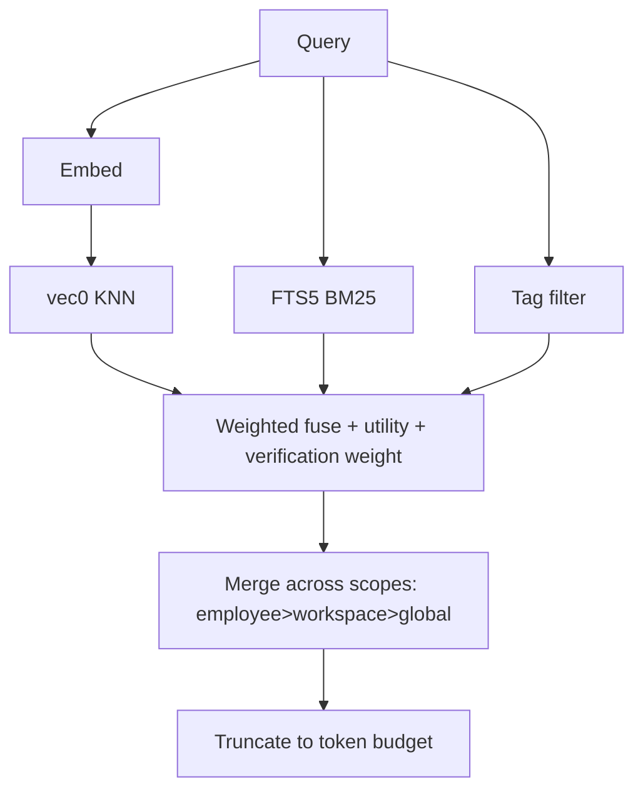

# Memory Store

**Version:** 1.0.1
**Status:** Stable
**Layer:** implementation
**Implements:** l1-memory-model.md

## Overview

The concrete realization of the memory model for v0.1.0: an embedded store using **SQLite + sqlite-vec** (semantic) plus **FTS5** (lexical) plus a **tags** table, with a synchronous core memory service and an asynchronous **archivist** curator role. The relationship graph is deferred and added incrementally; recall works on vector + lexical + tags from day one.

## Related Specifications

- [l1-memory-model.md](l1-memory-model.md) - The model this store implements.
- [l2-filesystem-layout.md](l2-filesystem-layout.md) - On-disk locations of the per-scope databases.
- [l2-technology-stack.md](l2-technology-stack.md) - SQLite + sqlite-vec; optional remote sync.
- [l2-core-library.md](l2-core-library.md) - Hosts the memory service on the hot path.

## 1. Motivation

The model demands cheap, multi-signal, local recall with clean forgetting and compounding learning. SQLite gives a single-file embedded store; sqlite-vec adds vectors without a separate service; FTS5 adds lexical search; a tags table adds deterministic filtering. Splitting hot-path access (core service) from curation (archivist role) keeps recall fast while still consolidating over time.

## 2. Constraints & Assumptions

- Embedded only; no memory daemon. Per-scope SQLite files (see filesystem layout).
- sqlite-vec is pre-1.0 — pin the version and isolate it behind a repository interface.
- Markdown notes are the source of truth; the databases are rebuildable indices (MEM-4).
- v0.1.0 ships vector + lexical + tags. No relationship graph yet.

## 3. Invariant Compliance (Layer 2 only)

| L1 Invariant | Implementation |
| --- | --- |
| MEM-1 Four scopes | Separate stores per scope: global `<state>/memory/`, workspace `<ws>/memory/`, employee `<role>/memory/`, session `<ws>/sessions/`. |
| MEM-2 Most-specific-first | Recall queries employee → workspace → global; merges with specificity precedence; truncates to a token budget. |
| MEM-3 Multi-signal recall | Fuse sqlite-vec similarity + FTS5 BM25 + tag filter into one ranked set. |
| MEM-4 Text source of truth | `notes/*.md` are authoritative; `*.db` indices are rebuildable from notes. |
| MEM-5 Decay & prune | `validity_scope` sets a half-life; a prune job deletes expired low-utility rows and old sessions. |
| MEM-6 Compounding, non-destructive | Archivist promotes/distills; contradictions set `invalid_at` (supersede), never hard-delete durable knowledge. |
| MEM-7 Ownership split | Core service exposes read/write/recall; archivist role runs consolidation; no agent writes the DB directly. |
| MEM-8 Classified & tagged | `type` column + `tags` table with index for deterministic filtering. |
| MEM-9 Provenance | `provenance` column records the producing session/source. |

## 4. Detailed Design

### 4.1 Schema (per-scope SQLite, conceptual)

```sql
-- [REFERENCE] illustrative, not final DDL
CREATE TABLE memory_item (
  id TEXT PRIMARY KEY,
  scope TEXT, type TEXT, content TEXT,
  validity_scope TEXT,                  -- Forever|Domain|Project|Workaround
  verification TEXT,                    -- Untested|Tested|Confirmed|Stable
  utility REAL,
  trust_score REAL DEFAULT 0.5,         -- reliability in [0,1]; see §4.6
  helpful_count INTEGER DEFAULT 0,      -- accumulated positive feedback
  retrieval_count INTEGER DEFAULT 0,    -- auto-incremented on each recall hit
  created_at INTEGER, valid_at INTEGER, invalid_at INTEGER,
  provenance TEXT,
  hrr_phases BLOB                       -- optional phase vector; see §4.8
);
CREATE TABLE memory_tag (item_id TEXT, tag TEXT);                          -- MEM-8
CREATE TABLE memory_entity (
  id TEXT PRIMARY KEY,
  name TEXT NOT NULL,
  entity_type TEXT DEFAULT 'unknown',
  aliases TEXT DEFAULT ''
);                                                                          -- §4.7
CREATE TABLE memory_fact_entity (
  fact_id TEXT REFERENCES memory_item(id),
  entity_id TEXT REFERENCES memory_entity(id),
  PRIMARY KEY (fact_id, entity_id)
);                                                                          -- §4.7
CREATE INDEX idx_memory_trust ON memory_item(trust_score DESC);
CREATE INDEX idx_memory_entity_name ON memory_entity(name);
CREATE VIRTUAL TABLE memory_fts USING fts5(content, content=memory_item);  -- MEM-3 lexical
CREATE VIRTUAL TABLE memory_vec USING vec0(embedding FLOAT[768]);           -- MEM-3 semantic
```

### 4.2 Recall fusion



### 4.3 Write path

Core service: classify scope/type/tags → embed → semantic dedup (cosine threshold) → upsert into the owning scope's DB and append/update the corresponding `notes/*.md`.

### 4.4 The archivist role (curator)

A bundled employee role that owns the asynchronous consolidation cycle, run on a schedule under a cost budget:

| Stage | Action |
| --- | --- |
| verify | advance `verification` for facts confirmed by outcomes |
| decay | reduce relevance by `validity_scope` half-life |
| promote | lift salient session memory into workspace/employee/global |
| distill | extract repeated patterns into reusable skills |
| reconcile | mark contradictions `invalid_at` (supersede) |
| prune | delete expired low-utility rows and stale sessions |

### 4.5 Deferred: relationship graph

The bi-temporal knowledge graph (entities/relations with validity windows, community detection) is **not** in v0.1.0. It will be added as an additional recall signal (MEM-3 allows it) writing to `<ws>/graph/graph.db`, without changing the item store. <!-- TBD: trigger to introduce the graph signal (e.g. office size / cross-reference density) -->

§4.7 introduces a **shallow** entity linking schema (`memory_entity` + `memory_fact_entity`) as the seed of this deferred graph. The shallow layer supports entity-based queries ("all facts mentioning this entity") without implementing validity windows or community detection; those remain deferred.

### 4.6 Trust scoring

`utility` (§4.1) measures how often a fact is relevant; `trust_score` measures how **reliable** it is. These are orthogonal: a popular fact can be untrustworthy, and a rare fact can be highly trusted. Both signals are used in recall fusion (§4.2).

#### Constants

```text
[REFERENCE]
TRUST_INITIAL         = 0.5   // neutral starting point
TRUST_DELTA_HELPFUL   = +0.05 // user confirmed the fact was correct
TRUST_DELTA_UNHELPFUL = -0.10 // user indicated the fact was wrong or unhelpful
TRUST_MIN             = 0.0
TRUST_MAX             = 1.0
TRUST_MIN_SEARCH      = 0.3   // facts below this threshold are excluded from recall
```

The asymmetry is intentional: facts lose trust faster than they gain it. This keeps the memory store epistemically conservative — a single "that was wrong" outweighs two confirmations, preventing stale facts from accumulating unearned trust over time.

#### Feedback API

```text
[REFERENCE]
record_feedback(id: &str, helpful: bool) -> TrustUpdate:
  old_trust = memory_item.trust_score
  delta     = TRUST_DELTA_HELPFUL if helpful else TRUST_DELTA_UNHELPFUL
  new_trust = clamp(old_trust + delta, TRUST_MIN, TRUST_MAX)
  UPDATE memory_item SET trust_score = new_trust,
    helpful_count = helpful_count + (1 if helpful else 0),
    updated_at = now()
    WHERE id = ?
  return TrustUpdate { id, old_trust, new_trust }
```

#### Recall integration

```text
[REFERENCE]
-- Exclude low-trust facts from recall
WHERE trust_score >= TRUST_MIN_SEARCH

-- Trust is an additive weight in the recall fusion score
recall_score = vec_similarity * w_vec
             + fts_bm25 * w_fts
             + trust_score * w_trust
             + utility * w_utility
```

`retrieval_count` is incremented automatically on every recall hit and provides a popularity signal for the archivist's `prune` stage (frequently recalled = higher keep priority).

### 4.7 Entity links (shallow graph)

A lightweight entity linking layer on top of the fact store. Provides entity-based recall ("all facts mentioning this person/project") without the full bi-temporal knowledge graph (still deferred per §4.5).

#### Schema

```text
[REFERENCE]
memory_entity (id, name, entity_type, aliases)
memory_fact_entity (fact_id → memory_item.id, entity_id → memory_entity.id)
```

Entity types follow the category taxonomy: `person`, `project`, `technology`, `preference`, `unknown`.

#### Entity extraction (heuristic)

On `add_fact`, entities are extracted from the content text using lightweight heuristics (no NLP model required):

```text
[REFERENCE]
extract_entities(text: &str) -> Vec<String>:
  candidates = []
  // 1. Capitalized multi-word phrases: "Project Alpha", "John Smith"
  candidates += regex r'\b([A-Z][a-z]+(?:\s+[A-Z][a-z]+)+)\b'
  // 2. Double-quoted strings: "the new dashboard"
  candidates += regex r'"([^"]+)"'
  // 3. Single-quoted strings: 'feature flag'
  candidates += regex r"'([^']+)'"
  return deduplicated(candidates)
```

Each extracted entity is resolved against `memory_entity` (case-insensitive name match) and linked via `memory_fact_entity`. A new entity record is created if no match is found.

#### Entity-based recall

```text
[REFERENCE]
recall_by_entity(entity_name: &str, min_trust: f64 = 0.3) -> Vec<MemoryItem>:
  SELECT m.* FROM memory_item m
    JOIN memory_fact_entity fe ON fe.fact_id = m.id
    JOIN memory_entity e ON e.id = fe.entity_id
   WHERE e.name LIKE ? AND m.trust_score >= ?
   ORDER BY m.trust_score DESC, m.utility DESC
```

### 4.8 HRR vector encoding (optional)

Holographic Reduced Representations (HRR) provide a **deterministic, model-free** structured vector encoding for facts. Unlike sqlite-vec embeddings (which require an embedding model call), HRR phases are computed from word content alone via SHA-256. They are stored in the `hrr_phases BLOB` column and used as a fallback when no embedding model is configured.

#### Phase encoding

```text
[REFERENCE]
HRR_DIM: usize = 1024   // phase vector dimension

encode_atom(word: &str, dim: usize) -> Vec<f64>:
  // Deterministic phase vector via SHA-256 counter blocks (16 u16 values per block)
  phases = []
  for i in 0..ceil(dim / 16):
    digest = sha256("{word}:{i}")
    phases += unpack_u16_le(digest)  // 16 u16 values per 32-byte digest
  return phases[..dim].map(|v| v as f64 * (2π / 65536.0))

encode_text(text: &str, dim: usize) -> Vec<f64>:
  tokens = tokenize(text)            // lowercase, strip punctuation
  return bundle(tokens.map(|t| encode_atom(t, dim)))
```

#### Binding operations

```text
[REFERENCE]
// bind: combine two concepts (circular convolution via phase addition)
bind(a: Vec<f64>, b: Vec<f64>) -> Vec<f64>:
  zip(a, b).map(|(x, y)| (x + y) % TWO_PI)

// unbind: retrieve a bound value (phase subtraction = inverse of bind)
unbind(memory: Vec<f64>, key: Vec<f64>) -> Vec<f64>:
  zip(memory, key).map(|(m, k)| (m - k).rem_euclid(TWO_PI))

// bundle: superpose multiple vectors (circular mean of complex exponentials)
bundle(vectors: &[Vec<f64>]) -> Vec<f64>:
  complex_sums = sum(vectors.map(|v| v.map(|p| (cos(p), sin(p)))))
  complex_sums.map(|(re, im)| atan2(im, re).rem_euclid(TWO_PI))

// similarity: phase cosine similarity in [-1, 1]
similarity(a: Vec<f64>, b: Vec<f64>) -> f64:
  mean(zip(a, b).map(|(x, y)| cos(x - y)))
```

#### Structured fact encoding

```text
[REFERENCE]
encode_fact(content: &str, entities: &[&str], dim: usize) -> Vec<f64>:
  ROLE_CONTENT = encode_atom("__role_content__", dim)
  ROLE_ENTITY  = encode_atom("__role_entity__", dim)

  components = [bind(encode_text(content, dim), ROLE_CONTENT)]
  for entity in entities:
    components.push(bind(encode_atom(entity.to_lowercase(), dim), ROLE_ENTITY))

  return bundle(&components)
```

Unbinding with `ROLE_ENTITY` from a stored HRR vector recovers an approximate representation of the entity concept, enabling similarity comparison without re-encoding.

#### Capacity guard

```text
[REFERENCE]
snr_estimate(dim: usize, n_items: usize) -> f64:
  sqrt(dim as f64 / n_items as f64)

// Warn when SNR < 2.0 — retrieval accuracy degrades below this threshold
// dim=1024: supports ~256 items before degradation (√1024/256 = 2.0)
```

When the archivist's `prune` stage runs, it checks `snr_estimate(HRR_DIM, n_items)`. If SNR < 2.0, low-trust + low-utility items are eligible for pruning ahead of schedule to restore capacity headroom.

## 5. Drawbacks & Alternatives

- **sqlite-vec pre-1.0:** breaking changes possible; mitigated by version pinning and a repository abstraction.
- **Dual write (db + notes):** keeping notes authoritative adds a sync step; justified by inspectability (MEM-4).
- **Trust asymmetry (+0.05/−0.10):** over many corrections, a fact converges toward 0 even if mostly correct. The archivist's `verify` stage should promote facts that outcome-verification confirms as stable, resetting trust toward 1.0.
- **HRR capacity:** dim=1024 supports ~256 items at SNR=2.0. For large memory stores, increase dim or rely on sqlite-vec embeddings instead; HRR is only the fallback when no embedding model is configured.
- **Alternative — libSQL native vectors:** rejected for local default (Turso's vector engine is in flux); libSQL/PostgreSQL remain optional sync targets only.

## Canonical References

| Alias | Path | Purpose |
| --- | --- | --- |
| `[MODEL]` | `.design/main/specifications/l1-memory-model.md` | Invariants this store satisfies |
| `[LAYOUT]` | `.design/main/specifications/l2-filesystem-layout.md` | Per-scope database locations |
| `[STACK]` | `.design/main/specifications/l2-technology-stack.md` | Storage engine choices |
