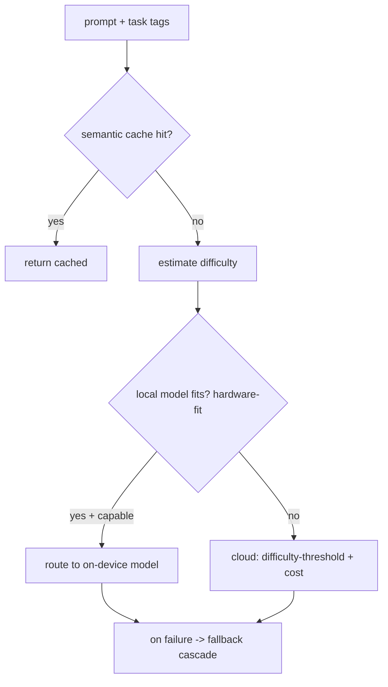

# Model Router

**Version:** 1.0.0
**Status:** Stable
**Layer:** implementation
**Implements:** l1-routing.md

## Overview

The concrete model router: how Cronus chooses which model answers a prompt — local-first with cloud fallback, difficulty- and cost-aware, with a fallback cascade and a semantic cache. Policy lives in `routing.json`; the model catalog in `models.json`.

## Related Specifications

- [l1-routing.md](l1-routing.md) - The router pattern this implements.
- [l2-technology-stack.md](l2-technology-stack.md) - Local execution (llama.cpp via FFI) and cloud providers.
- [l1-architecture.md](l1-architecture.md) - Hub-and-spoke (local on capable host) and security (INV-7).
- [l2-cli.md](l2-cli.md) - Command grammar standard for routing commands.

## 1. Motivation

The router pattern needs concrete signals and tools for model selection: estimate difficulty, check local feasibility against hardware, compare cost/capability, and fall back resiliently — defaulting to on-device for privacy and cost.

## 2. Constraints & Assumptions

- Local models run via the on-device runtime (llama.cpp through FFI); cloud via provider APIs.
- Policy is read from `<state>/routing.json`; the catalog from `<state>/models.json`.
- Decisions run on the hot path and must be fast; a semantic cache fronts the router.
- Default policy is local-first (chosen product stance).

## 3. Invariant Compliance (Layer 2 only)

| L1 Invariant | Implementation |
| --- | --- |
| RTG-1 Multi-signal | Score by difficulty, cost, token count, capability match, latency, quota headroom, local feasibility. |
| RTG-2 Fallback | Ordered cascade: subscription -> API key -> cheap -> free; on error/unavailable, advance. |
| RTG-3 Short-circuit cache | A semantic cache is checked before routing; a hit returns without a model call. |
| RTG-4 Scope resolution | N/A for models (applies to context router); model policy is global with per-task overrides. |
| RTG-5 Configurable | All weights/thresholds/cascade live in `routing.json`. |
| RTG-6 Privacy-preserving | Local-first: prefer an on-device model when hardware-fit says it can handle the task; else cloud. |
| RTG-7 Bounded & traceable | Each decision logs chosen model + reason; bounded by run budget (orchestration). |
| RTG-8 Lifecycle | N/A (session lifecycle handled by the context router). |

## 4. Detailed Design

### 4.1 Signals and decision



- **Difficulty threshold:** a cheap predictor decides weak-vs-strong tier (RouteLLM-style).
- **Hardware-fit:** estimates whether an on-device model of sufficient capability fits memory/perf (llmfit-style) before choosing local.
- **Cost/quality dial:** a single `cost_quality_tradeoff` knob biases the choice when multiple candidates qualify (OpenRouter-style).

### 4.2 Fallback cascade

`subscription -> api-key -> cheap -> free`, switching on quota exhaustion, error, or unavailability (OmniRoute-style). Local sits ahead of the cascade when local-first applies.

### 4.3 Semantic cache

Before routing, the request is matched against a semantic cache; a sufficiently-similar prior answer short-circuits the call (GPTCache-style), with a configurable similarity threshold and eviction. <!-- TBD: cache similarity threshold + TTL/eviction defaults -->

### 4.4 Policy & catalog files

```text
[REFERENCE]
routing.json: { strategy, cost_quality_tradeoff, fallback[], semantic_cache{}, local_first{ enabled, max_local_params_b } }
models.json:  [ { id, name, provider, model, baseUrl } ]
```

### 4.5 Command surface

Routing commands conform to the CLI grammar standard (see `l2-cli.md` §4.4).

| Action | CLI | TUI | Library (no code) |
| --- | --- | --- | --- |
| list models | `cronus model list` | `/model list` | `models.list() -> Model[]` |
| show policy | `cronus route policy` | `/route policy` | `router.policy() -> Policy` |
| explain a routing decision | `cronus route explain "<task>"` | `/route explain …` | `router.explain(task) -> Decision` |

## 5. Drawbacks & Alternatives

- **Difficulty estimation cost:** a wrong estimate mis-tiers; mitigated by the fallback cascade catching failures.
- **Local capability ceiling:** on-device models cap at smaller sizes; local-first yields to cloud when hardware-fit fails (honest about limits).
- **Alternative — always cloud:** rejected as default; loses privacy/cost benefits of the personal-server model.

## Canonical References

| Alias | Path | Purpose |
| --- | --- | --- |
| `[ROUTING]` | `.design/main/specifications/l1-routing.md` | Invariants this implements |
| `[STACK]` | `.design/main/specifications/l2-technology-stack.md` | Local/cloud execution options |
| `[CLI]` | `.design/main/specifications/l2-cli.md` | Command grammar standard |
