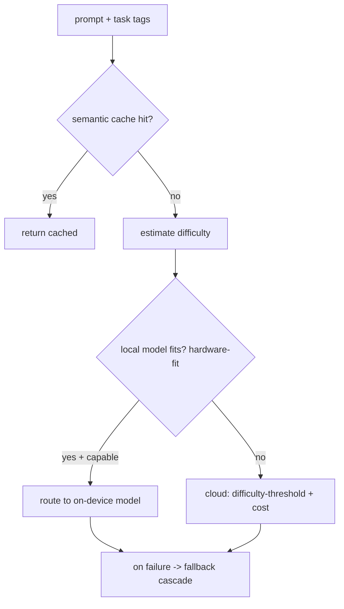

# Model Router

**Version:** 1.0.3
**Status:** Stable
**Layer:** implementation
**Implements:** l1-routing.md

## Overview

The concrete model router: how Cronus chooses which model answers a prompt — local-first with cloud fallback, difficulty- and cost-aware, with a fallback cascade and a semantic cache. Policy lives in `routing.json`; the model catalog in `models.json`.

## Related Specifications

- [l1-routing.md](l1-routing.md) - The router pattern this implements.
- [l2-technology-stack.md](l2-technology-stack.md) - Local execution (llama.cpp via FFI) and cloud providers.
- [l1-architecture.md](l1-architecture.md) - Hub-and-spoke (local on capable host) and security (INV-7).
- [l2-cli.md](l2-cli.md) - Command grammar standard for routing commands.
- [l2-model-error-recovery.md](l2-model-error-recovery.md) - Error taxonomy and credential pool (multi-key rotation) that interacts with the fallback cascade.

## 1. Motivation

The router pattern needs concrete signals and tools for model selection: estimate difficulty, check local feasibility against hardware, compare cost/capability, and fall back resiliently — defaulting to on-device for privacy and cost.

## 2. Constraints & Assumptions

- Local models run via the on-device runtime (llama.cpp through FFI); cloud via provider APIs.
- Policy is read from `<state>/routing.json`; the catalog from `<state>/models.json`.
- Decisions run on the hot path and must be fast; a semantic cache fronts the router.
- Default policy is local-first (chosen product stance).

## 3. Invariant Compliance (Layer 2 only)

| L1 Invariant | Implementation |
| --- | --- |
| RTG-1 Multi-signal | Score by difficulty, cost, token count, capability match, latency, quota headroom, local feasibility. |
| RTG-2 Fallback | Ordered cascade: subscription -> API key -> cheap -> free; on error/unavailable, advance. |
| RTG-3 Short-circuit cache | A semantic cache is checked before routing; a hit returns without a model call. |
| RTG-4 Scope resolution | N/A for models (applies to context router); model policy is global with per-task overrides. |
| RTG-5 Configurable | All weights/thresholds/cascade live in `routing.json`. |
| RTG-6 Privacy-preserving | Local-first: prefer an on-device model when hardware-fit says it can handle the task; else cloud. |
| RTG-7 Bounded & traceable | Each decision logs chosen model + reason; bounded by run budget (orchestration). |
| RTG-8 Lifecycle | N/A (session lifecycle handled by the context router). |

## 4. Detailed Design

### 4.1 Signals and decision



- **Difficulty threshold:** a cheap predictor decides weak-vs-strong tier (RouteLLM-style).
- **Hardware-fit:** estimates whether an on-device model of sufficient capability fits memory/perf (llmfit-style) before choosing local.
- **Cost/quality dial:** a single `cost_quality_tradeoff` knob biases the choice when multiple candidates qualify (OpenRouter-style).

### 4.2 Fallback cascade

`subscription -> api-key -> cheap -> free`, switching on quota exhaustion, error, or unavailability (OmniRoute-style). Local sits ahead of the cascade when local-first applies.

### 4.3 Semantic cache

Before routing, the request is matched against a semantic cache; a sufficiently-similar prior answer short-circuits the call (GPTCache-style), with a configurable similarity threshold and eviction. <!-- TBD: cache similarity threshold + TTL/eviction defaults -->

### 4.4 Policy & catalog files

```text
[REFERENCE]
routing.json: { strategy, cost_quality_tradeoff, fallback[], semantic_cache{}, local_first{ enabled, max_local_params_b } }
models.json:  [ { id, name, provider, model, baseUrl } ]
```

### 4.5 Command surface

Routing commands conform to the CLI grammar standard (see `l2-cli.md` §4.4).

| Action | CLI | TUI | Library (no code) |
| --- | --- | --- | --- |
| list models | `cronus model list` | `/model list` | `models.list() -> Model[]` |
| show policy | `cronus route policy` | `/route policy` | `router.policy() -> Policy` |
| explain a routing decision | `cronus route explain "<task>"` | `/route explain …` | `router.explain(task) -> Decision` |

### 4.6 Semantic router pool

The difficulty threshold in §4.1 uses a cheap heuristic (prompt length, token count, task tags). For workloads with a catalog of candidate models where cost varies significantly, a lightweight semantic router can replace or supplement the heuristic by predicting each model's accuracy on the current prompt and selecting the cheapest option that meets a tolerance threshold.

#### Router pool configuration

```text
[REFERENCE]
RouterPoolConfig {
  routing: RouterPoolRouting {
    // Routing algorithm:
    // "prefill" — use a fine-tuned checkpoint to predict P(correct) via prefill encoding.
    method: "prefill",

    // Path to the fine-tuned router checkpoint (relative to state dir or absolute).
    checkpoint: String,

    // Accuracy-cost tolerance: how far below the best-accuracy model's score a
    // cheaper model may fall and still be selected. 0.20 = 20 percentage points.
    tolerance: f32,   // default 0.20

    // Embedding model used to encode prompts for the checkpoint.
    encoder: String,              // e.g. a small open-weights encoder

    // Runtime backend for running the encoder.
    encoder_backend: "transformers" | "onnx",
  },

  models: Vec<RouterPoolModelEntry>,
}

RouterPoolModelEntry {
  name:                    String,
  display_name:            String,
  litellm_model:           String,          // provider-prefixed model ID for API calls
  cost_per_m_input_tokens: f64,             // USD per million input tokens
  cost_per_m_output_tokens: f64,            // USD per million output tokens
  api_base:                String,          // endpoint URL for this model
}
```

When the on-device runtime is used for the managed inference endpoint, the virtual hostname `https://inference.local/v1` maps to the local inference process, decoupling the policy file from the actual host address.

#### Selection algorithm

```text
[REFERENCE]
select_model(prompt, pool_config) -> RouterPoolModelEntry:
  embedding = encoder.encode(prompt)
  scores    = checkpoint.predict(embedding)  // P(correct) per model, same order as pool_config.models

  best_p    = max(scores)
  threshold = best_p - pool_config.routing.tolerance

  candidates = [(model, score) for (model, score) in zip(models, scores) if score >= threshold]

  // Among candidates, pick the cheapest by estimated total cost
  // (input cost dominates for most routing workloads, so rank on input cost as primary signal)
  return min(candidates, key = model.cost_per_m_input_tokens)
```

If the checkpoint is unavailable or the pool config is absent, the router falls back to the heuristic difficulty estimator (§4.1).

#### Configuration location

`RouterPoolConfig` is stored in `<state>/router-pool.json` (alongside `routing.json`). The catalog in `models.json` is the source for the full model list; `router-pool.json` references a subset of those models that are candidates for semantic routing.

### 4.7 Three-layer provider resilience

Three independent mechanisms with different scope. Keep them separate when debugging routing failures.

```text
[REFERENCE]
Layer               | Scope                              | Skips when …
────────────────────────────────────────────────────────────────────────────
Circuit Breaker     | Whole provider (e.g. "anthropic")  | Provider-level errors (408/500/502/503/504) exceed threshold
Connection Cooldown | Single API key / account           | That key returns account-level errors (429, auth failures)
Model Lockout       | Provider + connection + model      | That model returns per-model errors (404, per-model quota)
```

#### Circuit Breaker (four states)

```text
[REFERENCE]
CircuitBreaker states: CLOSED → DEGRADED → OPEN → HALF_OPEN → CLOSED

  CLOSED    — normal; all requests pass through
  DEGRADED  — elevated failure rate; requests pass but alerting fires
  OPEN      — provider blocked; routing skips it
  HALF_OPEN — probe allowed after reset timeout; success → CLOSED, failure → OPEN

Thresholds per provider class:
  | Class   | Degraded at | Opens at    | Reset timeout |
  | oauth   | 5 failures  | 8 failures  | 60 s          |
  | api-key | 7 failures  | 12 failures | 30 s          |
  | local   | derived     | 2 failures  | 15 s          |

degradation_threshold: default 60% of failure_threshold (configurable)

Adaptive backoff:
  max_backoff_multiplier   = 16   // escalates on repeated OPEN→HALF_OPEN→OPEN cycles
  backoff_escalation_count = 3    // cycles before backoff escalates
  openCycleCount tracked per breaker for diagnostics

Per-kind thresholds: failure_kind = rate_limit | quota_exhausted | transient
  Each kind may carry a separate threshold and cooldown; transient triggers immediate OPEN

Transition history: last 20 { from, to, timestamp, failure_count, reason }

Trip codes (provider-level only): [408, 500, 502, 503, 504]
Do NOT trip for: 401, 403, 429 — those belong to Connection Cooldown

Lazy recovery: getStatus() refreshes OPEN → HALF_OPEN when reset_timeout expires;
               no background timer required
```

#### Connection Cooldown

When one key fails, other keys for the same provider keep serving.

```text
[REFERENCE]
Connection fields:
  rate_limited_until: Timestamp  // connection skipped while this is in the future
  test_status: "unavailable"     // set on failure; cleared by clear_account_error() on success
  backoff_level: u8              // incremented on each recoverable failure

Default cooldowns:
  oauth base:   5 s
  api-key base: 3 s
  api-key 429:  prefer upstream Retry-After / reset headers when present
  backoff:      base_cooldown_ms * 2 ** backoff_level

Terminal states (NOT cooldowns — persist until credentials change or operator reset):
  "banned" | "expired" | "credits_exhausted"
  Do NOT overwrite terminal states with transient cooldown state.

Anti-thundering-herd guard: concurrent failures on the same connection do NOT
  double-increment backoff_level or extend the cooldown redundantly.
```

#### Model Lockout

When only one model fails, the connection continues serving other models.

```text
[REFERENCE]
Scope: provider + connection + model triple

Trigger examples:
  - Per-model quota (429)
  - Missing model (404) on local providers
  - Provider-specific permission failures

API:
  lock_model(provider, connection, model, expires_at)
  clear_model_lock(provider, connection, model)
  list_model_lockouts() -> [ {provider, connection, model, reason, expires_at} ]
```

#### Resilience debugging guide

```text
All keys for a provider skipped → check circuit breaker state AND each connection's rate_limited_until
Provider excluded after reset window → use getStatus() instead of reading raw state field
One key fails, others should work → connection cooldown (not circuit breaker)
Only one model fails → model lockout (not connection cooldown)
State should self-recover but doesn't → check future-timestamp + lazy-read path
```

### 4.8 Multi-factor candidate scoring

When multiple model candidates qualify, a weighted 9-factor score ranks them. All weights sum to 1.0; `validateWeights()` enforces this at startup.

#### Score factors

```text
[REFERENCE]
Factor            | Default | Description
──────────────────────────────────────────────────────────────────────────────
health            | 0.22    | Circuit breaker: CLOSED=1.0, HALF_OPEN=0.5, OPEN=0.0
quota             | 0.17    | Remaining quota / rate-limit headroom [0..1]
cost_inv          | 0.17    | Inverse blended cost (60% input + 40% output, normalized)
latency_inv       | 0.13    | Inverse p95 latency normalized across pool
task_fit          | 0.08    | Task-type fitness: coding|review|planning|analysis|debugging|docs
specificity_match | 0.08    | Match between request specificity and model tier
stability         | 0.05    | Variance-based stability (low latency stdDev + error rate)
tier_priority     | 0.05    | Account tier: Ultra=1.0, Pro=0.67, Standard=0.33, Free=0.0
tier_affinity     | 0.05    | Affinity between candidate tier and recommended tier
```

Candidates with score < 0.2 are temporarily excluded (5 min initial, progressive backoff, max 30 min).

In incident mode (>50% of candidates OPEN), exploration is disabled and stability is maximized.

#### Mode packs

Four pre-defined weight profiles for common optimization goals:

```text
[REFERENCE]
Mode pack     | Primary signal     | Weight | Goal
──────────────────────────────────────────────────
"ship-fast"   | latency_inv        | 0.32   | Lowest latency
"cost-saver"  | cost_inv           | 0.37   | Cheapest per token
"quality"     | task_fit           | 0.37   | Best task fit + stability
"offline"     | quota              | 0.37   | Max quota headroom

Usage: routing.json `strategy_mode` = "ship-fast" | "cost-saver" | "quality" | "offline"
```

#### LKGP (Last-Known-Good-Path)

Routes to the most recently successful candidate. Falls back to the next-best scored candidate on failure. Session-sticky with health safety: if the LKGP candidate is OPEN or DEGRADED, scoring resumes.

#### Reset-aware tiebreaker

When scores are within 0.05 of each other, prefer the candidate whose quota resets soonest:

```text
[REFERENCE]
reset_boost(candidate):
  if candidate.quota_resets_at is set:
    time_to_reset_ms = max(0, candidate.quota_resets_at - now_ms())
    return 1.0 - (time_to_reset_ms / MAX_RESET_WINDOW_MS)   // [0..1]
  else: 0.5                                                   // neutral
```

#### Exploration (bandit)

5% of requests (configurable `exploration_rate`) route to random candidates. Exploration is disabled in incident mode.

### 4.9 Hardware-Fit Layer

The `FIT` decision node in §4.1 is implemented as a hardware-fit evaluator that maps each on-device candidate to a `FitLevel` and selects the best `RunMode`.

#### FitLevel taxonomy

```text
[REFERENCE]
Level    | Condition                                    | Routing behaviour
─────────────────────────────────────────────────────────────────────────────
Perfect  | GPU mode; recommended_ram ≤ available VRAM  | Always route local
Good     | GPU mode tight, or CPU offload with headroom | Route local
Marginal | Minimum met but tight; CPU-only always here  | Route local only when no cloud candidate and policy allows degraded
TooTight | required_mem > available mem                 | Skip local → cloud cascade
```

`Perfect` is only achievable in GPU mode. `CpuOffload` caps at `Good`. `CpuOnly` always caps at `Marginal`.

#### RunMode taxonomy

```text
[REFERENCE]
Mode             | Description                                              | TPS factor
─────────────────────────────────────────────────────────────────────────────────────────
Gpu              | All weights in VRAM                                      | 1.0
TensorParallel   | Weights sharded across multiple same-model GPUs          | 0.9
MoeOffload       | MoE experts in RAM, active experts loaded per-token      | 0.8
CpuOffload       | Weights in RAM; hot layers in VRAM                       | 0.5
CpuOnly          | Weights in RAM; no GPU                                   | 0.3
```

`CpuOffload` is skipped on unified-memory platforms (Apple Silicon, NVIDIA Grace/ATS): the GPU and CPU share the same physical pool, so there is no distinct offload path.

#### TPS estimation

Bandwidth-based (preferred when GPU bandwidth is known):

```text
[REFERENCE]
max_tps = bandwidth_GB_s / model_size_GB × 0.55 × run_mode_factor
model_size_GB = params_B × bytes_per_param(quantization)
```

Fixed-constant fallback when GPU bandwidth is unknown:

```text
[REFERENCE]
Backend    | tok/s constant
─────────────────────────
Metal/MLX  | 250
Metal/llama.cpp | 160
CUDA       | 220
ROCm       | 180
CpuArm     | 90
CpuX86     | 70
Ascend     | 390
```

#### Memory estimation

```text
[REFERENCE]
memory_total_GB = model_weights + kv_cache + overhead(0.5 GB)

model_weights = params_B × bpp(quantization)

kv_cache (precise, when n_layers/n_kv_heads/head_dim known):
  bytes = 2 × n_layers × n_kv_heads × head_dim × context × dtype_bytes
  kv_cache_GB = bytes / 1_073_741_824

kv_cache (fallback):
  kv_cache_GB = 0.000008 × params_B × context × kv_quant_scale

kv_quant_scale: fp16=1.0, fp8=0.5, q8_0=0.5, q4_0=0.25, TurboQuant≈0.17
```

KV cache context cap for planning: `min(model_advertised_context, 8192)` — the full advertised window is used for actual inference but a capped estimate avoids inflating planning budgets for 128k+ models.

#### FitLevel thresholds

```text
[REFERENCE]
GPU path:      Perfect if recommended_GB ≤ available; Good if available ≥ required × 1.2; else Marginal
CpuOffload:    Good if available ≥ required × 1.2; else Marginal
CpuOnly:       Always Marginal

VRAM pressure penalty (GPU mode):
  utilization 50–80% → no penalty (sweet spot)
  utilization 80–90% → fit_score penalty −30 pts
  utilization > 90%  → linear cache-thrash penalty, floor 0.30
```

### 4.10 Per-Use-Case Scoring Weights

When multiple on-device candidates qualify (FitLevel ≥ Good), composite score = Σ(weight_i × score_i) over four dimensions, with weights tuned per use-case.

#### Score dimensions (0–100 each)

```text
[REFERENCE]
quality  — base_quality + quant_quality_penalty + generation_bonus
           generation_bonus = (gen - 1.0) × 3.0, capped +9 (gen 4.0)
           quant penalties: F16/Q8_0=0, Q6_K=−1, Q5_K_M=−2, Q4_K_M=−5, Q3_K_M=−8, Q2_K=−12

speed    — derived from TPS estimate, normalized to [0,100]
           optimal range ≈ 25–60 tok/s maps to high scores

fit      — VRAM/RAM utilization sweet spot 50–80% = 100
           < 50%  → 60–100 (under-utilised)
           80–90% → 70 (light pressure)
           > 90%  → 50 (cache thrash risk)

context  — model_context_tokens vs requested, capped at 8 192 for KV planning
```

#### Weight table

```text
[REFERENCE]
Use case    | quality | speed | fit   | context
────────────────────────────────────────────────
General     | 0.45    | 0.30  | 0.15  | 0.10
Coding      | 0.50    | 0.20  | 0.15  | 0.15
Reasoning   | 0.55    | 0.15  | 0.15  | 0.15
Chat        | 0.40    | 0.35  | 0.15  | 0.10
Multimodal  | 0.50    | 0.20  | 0.15  | 0.15
Embedding   | 0.30    | 0.40  | 0.20  | 0.10
```

Use-case inference priority: explicit tag on task > `use_case` field in model catalog > name heuristics (e.g. "code" in name → Coding; "deepseek-r1" → Reasoning; "embed"/"bge" → Embedding).

### 4.11 Hardware Planning Protocol

When the selected model is `TooTight` or the user requests a fit report, the router produces a `PlanEstimate` — not a hard error — so the user can act.

#### Plan structure

```text
[REFERENCE]
PlanEstimate {
  model_name, provider, quantization, context, kv_quant,
  current: { fit_level, run_mode, estimated_tps },  // current hardware status

  run_paths: [                                        // evaluated in preference order
    { path: Gpu,        feasible, minimum: HW, recommended: HW, estimated_tps, fit_level, notes },
    { path: CpuOffload, feasible, minimum: HW, recommended: HW, estimated_tps, fit_level, notes },
    { path: CpuOnly,    feasible, minimum: HW, recommended: HW, estimated_tps, fit_level, notes },
  ],

  upgrade_deltas: [                                   // gaps vs current hardware
    { resource, add_GB, target_fit, description },    // e.g. "+4.2 GB VRAM -> Good"
  ],

  kv_alternatives: [                                  // "what-if" memory savings table
    { kv_quant, memory_required_GB, kv_cache_GB, savings_fraction, supported, note },
  ],
}

HardwareEstimate { vram_gb, ram_gb, cpu_cores }
```

Preference order for preferred path: Gpu → CpuOffload → CpuOnly. `CpuOffload` is `feasible: false` on unified-memory systems (Apple Silicon, NVIDIA Grace).

#### TurboQuant gating

TurboQuant KV compression (~0.34 bytes/element vs 2.0 for fp16) is gated on vLLM + CUDA. It only compresses full-attention layers in hybrid architectures (models that mix self-attention with linear/Mamba-style state-space layers see partial savings proportional to their full-attention fraction). Always shown in the `kv_alternatives` table; marked `supported: false` on non-CUDA backends with an explanatory note.

## 5. Drawbacks & Alternatives

- **Difficulty estimation cost:** a wrong estimate mis-tiers; mitigated by the fallback cascade catching failures.
- **Local capability ceiling:** on-device models cap at smaller sizes; local-first yields to cloud when hardware-fit fails (honest about limits).
- **Semantic router cold-start:** the encoder must load on first use; add to the warm-up sequence to avoid latency on the first request.
- **Alternative — always cloud:** rejected as default; loses privacy/cost benefits of the personal-server model.

## Canonical References

| Alias | Path | Purpose |
| --- | --- | --- |
| `[ROUTING]` | `.design/main/specifications/l1-routing.md` | Invariants this implements |
| `[STACK]` | `.design/main/specifications/l2-technology-stack.md` | Local/cloud execution options |
| `[CLI]` | `.design/main/specifications/l2-cli.md` | Command grammar standard |
