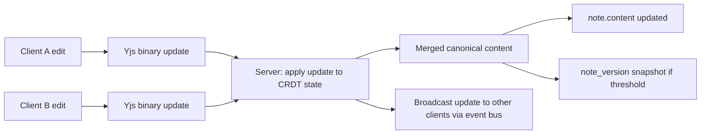

# Notes (Implementation)

**Version:** 1.0.0
**Status:** Stable
**Layer:** implementation
**Implements:** l1-notes.md

## Overview

Concrete implementation of the notes subsystem: SQLite schema, rich-text content storage using a structured JSON document tree, CRDT-based concurrent merge (Yjs/Automerge-compatible binary encoding on the frontend; server stores the canonical snapshot), version history via append-only edit log, pinning, access control integration, and agent authorship tracking.

## Related Specifications

- [l1-notes.md](l1-notes.md) - The concept this spec implements.
- [l2-resource-sharing.md](l2-resource-sharing.md) - `access-grants` crate enforces NOT-3.
- [l2-file-store.md](l2-file-store.md) - Inline image references in note content use `FileId`.
- [l2-agent-session.md](l2-agent-session.md) - Agent sessions may create notes via the `NoteService`.
- [l2-source-layout.md](l2-source-layout.md) - Crate placement under `crates/notes/`.

## 1. Motivation

Notes are user-facing artifacts distinct from sessions and memory. A dedicated notes crate keeps the schema and CRDT merge logic isolated from session storage and memory management, enabling each to evolve independently.

## 2. Constraints & Assumptions

- The server stores one canonical snapshot of note content per note (the latest merged state). Full CRDT state vectors are stored for conflict resolution during concurrent edits; they are not the primary storage format.
- CRDT library choice is frontend-driven (Yjs for SvelteKit UI); the server-side stores and merges CRDT binary updates forwarded from the frontend.
- Version history stores a snapshot at each significant save (not every keystroke); coalescing minor edits is acceptable.
- Real-time cursor sharing / presence is optional; collaborative editing operates through the event bus without requiring a dedicated websocket per note.

## 3. Invariant Compliance (Layer 2)

| L1 Invariant | Implementation |
| --- | --- |
| NOT-1 Artifact | `note` table with stable PK, `created_at`/`updated_at`, never deleted on session close. |
| NOT-2 Rich structure | `content` stored as JSON document tree (`ProseMirror`-compatible node format). |
| NOT-3 Access control | `access-grants` crate; `has_access(Note, note_id, Permission::Read/Write)` enforced at service boundary. |
| NOT-4 Pin / star | `pinned_note(user_id, note_id)` join table; per-user, no effect on note state. |
| NOT-5 Agent authorship | `author_type TEXT` column (`'user'` \| `'agent'`), `agent_id TEXT` column (nullable). |
| NOT-6 Edit history | `note_version` append-only table; snapshot on each significant save. |
| NOT-7 Concurrent merge | CRDT update binary stored in `note_crdt_update` table; merged snapshot written to `note.content`. |
| NOT-8 Soft deletion | `deleted_at` nullable column; soft-deleted notes excluded from list queries; GC after retention window. |

## 4. Detailed Design

### 4.1 Schema

```sql
[REFERENCE]
CREATE TABLE note (
    id          TEXT PRIMARY KEY,          -- nte/ prefix
    owner_id    TEXT NOT NULL,
    title       TEXT NOT NULL DEFAULT '',
    content     TEXT NOT NULL DEFAULT '{}',  -- JSON document tree
    author_type TEXT NOT NULL DEFAULT 'user',
    agent_id    TEXT,
    meta        TEXT,                        -- JSON
    created_at  INTEGER NOT NULL,
    updated_at  INTEGER NOT NULL,
    deleted_at  INTEGER                      -- NULL = active
);
CREATE INDEX ix_note_owner    ON note(owner_id);
CREATE INDEX ix_note_deleted  ON note(owner_id, deleted_at);

-- Per-user pin table
CREATE TABLE pinned_note (
    id        TEXT PRIMARY KEY,
    user_id   TEXT NOT NULL,
    note_id   TEXT NOT NULL REFERENCES note(id) ON DELETE CASCADE,
    pinned_at INTEGER NOT NULL,
    UNIQUE (user_id, note_id)
);
CREATE INDEX ix_pinned_note_user ON pinned_note(user_id);

-- Append-only version history (significant saves only)
CREATE TABLE note_version (
    id          TEXT PRIMARY KEY,          -- nver/ prefix
    note_id     TEXT NOT NULL REFERENCES note(id) ON DELETE CASCADE,
    content     TEXT NOT NULL,             -- JSON snapshot
    saved_by    TEXT NOT NULL,             -- user_id or agent_id
    created_at  INTEGER NOT NULL
);
CREATE INDEX ix_note_version_note ON note_version(note_id, created_at);

-- CRDT update log (for concurrent merge)
CREATE TABLE note_crdt_update (
    id          TEXT PRIMARY KEY,
    note_id     TEXT NOT NULL REFERENCES note(id) ON DELETE CASCADE,
    update_data BLOB NOT NULL,             -- binary Yjs update
    origin_id   TEXT NOT NULL,             -- client session ID that sent the update
    applied_at  INTEGER NOT NULL
);
CREATE INDEX ix_note_crdt_note ON note_crdt_update(note_id, applied_at);
```

### 4.2 Content Format

Note content is stored as a ProseMirror-compatible JSON document tree:

```json
[REFERENCE]
{
  "type": "doc",
  "content": [
    { "type": "heading", "attrs": { "level": 1 }, "content": [{ "type": "text", "text": "Title" }] },
    { "type": "paragraph", "content": [{ "type": "text", "text": "Body text." }] },
    { "type": "code_block", "attrs": { "language": "rust" }, "content": [{ "type": "text", "text": "fn main() {}" }] },
    { "type": "image", "attrs": { "file_id": "fil/...", "alt": "diagram" } }
  ]
}
```

Image nodes reference `FileId` (not raw URLs); the renderer resolves file access at display time.

### 4.3 Concurrent Edit Flow



The server maintains an in-memory Yjs document per active note (loaded from the `note_crdt_update` log on first access). When an update arrives, it is applied, the new JSON snapshot is written to `note.content`, and the update binary is persisted to `note_crdt_update`. The in-memory Yjs doc is evicted after a configurable idle timeout.

### 4.4 Version History Policy

- A new `note_version` row is created when:
  - The note is explicitly saved by the user (manual save action).
  - The note has not been versioned in the last 5 minutes and a non-trivial edit is detected (content diff > 20 characters).
- Coalescing: rapid successive edits within a 30-second window are merged into one version row.
- Retention: version rows older than 90 days may be pruned to the nearest daily snapshot.

### 4.5 Soft Deletion and GC

- `DELETE note/:id` sets `deleted_at = now()`. Soft-deleted notes are excluded from all list queries via `WHERE deleted_at IS NULL`.
- GC: after 30 days, hard-delete the note, cascade-delete `note_version`, `note_crdt_update`, `pinned_note`. `access_grant` rows are deleted by the `access-grants` crate's `delete_grants_for_resource`.

### 4.6 Crate Layout

```plaintext
crates/
└── notes/
    ├── src/
    │   ├── lib.rs         // NoteService: create, get, update, delete, pin, list
    │   ├── model.rs       // Note, NoteVersion, PinnedNote, NoteForm, ContentTree
    │   ├── db.rs          // SQLite queries
    │   ├── crdt.rs        // Yjs binary update application, in-memory doc cache
    │   └── version.rs     // versioning policy, snapshot creation
    └── tests/
        └── notes_tests.rs
```

## 5. Implementation Notes

1. The in-memory Yjs document cache is keyed by `NoteId`; use a `DashMap` with an idle-eviction background task.
2. Image references in note content must be validated at save time: referenced `FileId` must exist and the note owner must hold at least `read` access to the file (or the file must be public).
3. When listing notes for a user, include notes where the user is the owner OR where a read/write grant exists for the user or their groups — use the batch grant loader from `access-grants`.

## 7. Drawbacks & Alternatives

- **Storing full CRDT state vector:** larger storage but enables offline client sync without server history replay. Trade-off is disk usage vs. client simplicity; update log + merge-on-read is chosen for minimal storage.
- **Operational transform (OT):** server-side transform is more deterministic but requires a central transform server; CRDT is peer-to-peer and simpler for the edge-case handling.

## Canonical References

| Alias | Path | Purpose |
| --- | --- | --- |
| `[L1]` | `.design/main/specifications/l1-notes.md` | Invariants NOT-1…NOT-8. |
| `[SHARING]` | `.design/main/specifications/l2-resource-sharing.md` | Grant enforcement for note access. |
| `[FILES]` | `.design/main/specifications/l2-file-store.md` | File references embedded in note content. |
