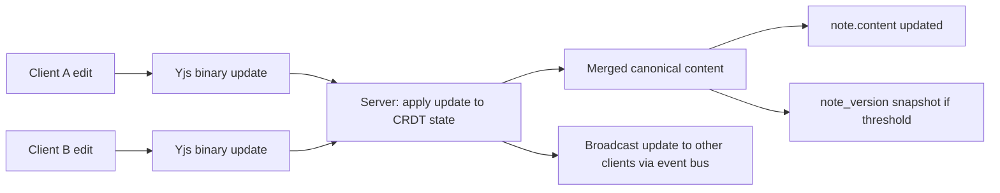

# Notes (Implementation)

**Version:** 1.1.0
**Status:** Stable
**Layer:** implementation
**Implements:** l1-notes.md

## Overview

Realization of the notes subsystem, in two disclosed layers. **Built today**: a domain-tier
CRDT algebra (`crates/domain/src/notes.rs`) proving order-independent concurrent-merge
convergence, append-only version history, and non-destructive soft deletion over a minimal
insertion-set model — pure, I/O-free, directly tested against the convergence property. **Not
yet built**: the production mechanism — a SQLite schema, a rich structured-document content
tree (headings/paragraphs/code blocks/images), Yjs/Automerge-compatible binary CRDT encoding,
pinning, access-control integration, and agent-authorship tracking. §4.1 marks exactly which
parts of the design below are live and which are the target design this module has not yet
grown into.

## Related Specifications

- [l1-notes.md](l1-notes.md) - The concept this spec implements.
- [l2-resource-sharing.md](l2-resource-sharing.md) - `access-grants`; NOT-3 is unbuilt at this layer (§4.1) and would compose with this the way `knowledge_access.rs`'s `GatedKnowledge` already composes with the knowledge store.
- [l2-file-store.md](l2-file-store.md) - Inline image references via `FileId` are part of the target rich-content-tree design (§4.1); the current flat-fragment content model has nothing to attach a `FileId` to yet.
- [l2-agent-session.md](l2-agent-session.md) - Agent sessions creating notes via a `NoteService`, and per-note agent-authorship tracking, are both part of the unbuilt production mechanism (§4.1) — the current `Note` struct carries no author field at all.

## 1. Motivation

Notes are user-facing artifacts distinct from sessions and memory. A dedicated notes crate keeps the schema and CRDT merge logic isolated from session storage and memory management, enabling each to evolve independently.

## 2. Constraints & Assumptions

- The server stores one canonical snapshot of note content per note (the latest merged state). Full CRDT state vectors are stored for conflict resolution during concurrent edits; they are not the primary storage format.
- CRDT library choice is frontend-driven (Yjs for SvelteKit UI); the server-side stores and merges CRDT binary updates forwarded from the frontend.
- Version history stores a snapshot at each significant save (not every keystroke); coalescing minor edits is acceptable.
- Real-time cursor sharing / presence is optional; collaborative editing operates through the event bus without requiring a dedicated websocket per note.

## 3. Invariant Compliance (Layer 2)

| L1 Invariant | Implementation |
| --- | --- |
| NOT-1 Artifact | `Note` is a standalone value with its own identity and history, independent of any session — holds structurally, though the algebra has no persistence layer yet (nothing to "not delete on session close"). |
| NOT-2 Rich structure | **Partial.** Content today is a flat, ordered set of text fragments (`ops: BTreeMap<OpId, String>`), not a typed node tree — no headings, paragraphs, code blocks, or image nodes exist. The CRDT convergence property holds over this simpler model; the *rich* half of NOT-2 is unbuilt. |
| NOT-3 Access control | **Unbuilt at this layer.** No access-control wrapper exists around `Note` (unlike `knowledge_access.rs`'s `GatedKnowledge`); the module has no caller-identity parameter at all. |
| NOT-4 Pin / star | **Unbuilt.** No pin state exists on `Note` or elsewhere in the module. |
| NOT-5 Agent authorship | **Unbuilt.** `Note` carries no author/agent field; nothing distinguishes a user-authored insertion from an agent-authored one. |
| NOT-6 Edit history | `history: Vec<Version>`, populated by `snapshot()` — append-only, proven by `history_is_append_only_snapshots`. |
| NOT-7 Concurrent merge | `Note::merge()` — set union over op-id-keyed fragments, commutative/associative/idempotent by construction; `concurrent_merges_converge_regardless_of_order` and `merge_is_idempotent` prove the CRDT property directly. This is the algebra's strongest, most faithfully realized invariant. |
| NOT-8 Soft deletion | `deleted: bool` + `soft_delete()`/`restore()`; content and history are retained across a soft delete — `soft_delete_is_non_destructive_and_recoverable` proves rendering is unaffected. |

## 4. Detailed Design

### 4.1 Realization Status

| Piece | Status | Where |
| --- | --- | --- |
| Convergent CRDT merge, append-only history, non-destructive soft deletion | **Built** | `crates/domain/src/notes.rs` |
| Rich structured-document content tree | Unbuilt — content is flat text fragments today | — |
| SQLite schema (§4.1.1), ProseMirror content format (§4.2), Yjs binary CRDT encoding (§4.3), pinning, access control, agent authorship | **Unbuilt** — target design | §4.1.1–§4.5 below describe the design to build against, not current state |

Everything from §4.1.1 onward was authored as the production target before the domain-tier
CRDT algebra existed and has not been updated since the algebra landed instead. Retained
because the design is not wrong, only unbuilt — the merge algebra it describes (server holds
an in-memory Yjs doc, applies updates, persists the binary log) is a real superset of what
`Note::merge()` already proves converges; building it means adding the binary encoding and
persistence around the existing convergence proof, not replacing it.

### 4.1.1 Schema (target design, unbuilt)

```sql
[REFERENCE]
CREATE TABLE note (
    id          TEXT PRIMARY KEY,          -- nte/ prefix
    owner_id    TEXT NOT NULL,
    title       TEXT NOT NULL DEFAULT '',
    content     TEXT NOT NULL DEFAULT '{}',  -- JSON document tree
    author_type TEXT NOT NULL DEFAULT 'user',
    agent_id    TEXT,
    meta        TEXT,                        -- JSON
    created_at  INTEGER NOT NULL,
    updated_at  INTEGER NOT NULL,
    deleted_at  INTEGER                      -- NULL = active
);
CREATE INDEX ix_note_owner    ON note(owner_id);
CREATE INDEX ix_note_deleted  ON note(owner_id, deleted_at);

-- Per-user pin table
CREATE TABLE pinned_note (
    id        TEXT PRIMARY KEY,
    user_id   TEXT NOT NULL,
    note_id   TEXT NOT NULL REFERENCES note(id) ON DELETE CASCADE,
    pinned_at INTEGER NOT NULL,
    UNIQUE (user_id, note_id)
);
CREATE INDEX ix_pinned_note_user ON pinned_note(user_id);

-- Append-only version history (significant saves only)
CREATE TABLE note_version (
    id          TEXT PRIMARY KEY,          -- nver/ prefix
    note_id     TEXT NOT NULL REFERENCES note(id) ON DELETE CASCADE,
    content     TEXT NOT NULL,             -- JSON snapshot
    saved_by    TEXT NOT NULL,             -- user_id or agent_id
    created_at  INTEGER NOT NULL
);
CREATE INDEX ix_note_version_note ON note_version(note_id, created_at);

-- CRDT update log (for concurrent merge)
CREATE TABLE note_crdt_update (
    id          TEXT PRIMARY KEY,
    note_id     TEXT NOT NULL REFERENCES note(id) ON DELETE CASCADE,
    update_data BLOB NOT NULL,             -- binary Yjs update
    origin_id   TEXT NOT NULL,             -- client session ID that sent the update
    applied_at  INTEGER NOT NULL
);
CREATE INDEX ix_note_crdt_note ON note_crdt_update(note_id, applied_at);
```

### 4.2 Content Format (target design, unbuilt — today's content is flat text fragments, see NOT-2)

Note content is stored as a ProseMirror-compatible JSON document tree:

```json
[REFERENCE]
{
  "type": "doc",
  "content": [
    { "type": "heading", "attrs": { "level": 1 }, "content": [{ "type": "text", "text": "Title" }] },
    { "type": "paragraph", "content": [{ "type": "text", "text": "Body text." }] },
    { "type": "code_block", "attrs": { "language": "rust" }, "content": [{ "type": "text", "text": "fn main() {}" }] },
    { "type": "image", "attrs": { "file_id": "fil/...", "alt": "diagram" } }
  ]
}
```

Image nodes reference `FileId` (not raw URLs); the renderer resolves file access at display time.

### 4.3 Concurrent Edit Flow (target design — the convergence property itself is real, see NOT-7; the server-side Yjs doc, persistence, and event-bus broadcast are unbuilt)


```mermaid
graph LR
    CLA[Client A edit] --> UPD_A[Yjs binary update]
    CLB[Client B edit] --> UPD_B[Yjs binary update]
    UPD_A --> SERVER[Server: apply update to CRDT state]
    UPD_B --> SERVER
    SERVER --> MERGE[Merged canonical content]
    MERGE --> NOTE[note.content updated]
    MERGE --> VERSION[note_version snapshot if threshold]
    SERVER --> EMIT[Broadcast update to other clients via event bus]
```

The server maintains an in-memory Yjs document per active note (loaded from the `note_crdt_update` log on first access). When an update arrives, it is applied, the new JSON snapshot is written to `note.content`, and the update binary is persisted to `note_crdt_update`. The in-memory Yjs doc is evicted after a configurable idle timeout.

### 4.4 Version History Policy (target design — the append-only mechanism is real (NOT-6); the threshold/coalescing/retention policy below is unbuilt, `snapshot()` is called explicitly with no auto-trigger yet)

- A new `note_version` row is created when:
  - The note is explicitly saved by the user (manual save action).
  - The note has not been versioned in the last 5 minutes and a non-trivial edit is detected (content diff > 20 characters).
- Coalescing: rapid successive edits within a 30-second window are merged into one version row.
- Retention: version rows older than 90 days may be pruned to the nearest daily snapshot.

### 4.5 Soft Deletion and GC (soft delete is real, see NOT-8; hard-delete-after-30-days GC and the cascade below are unbuilt)

- `DELETE note/:id` sets `deleted_at = now()`. Soft-deleted notes are excluded from all list queries via `WHERE deleted_at IS NULL`.
- GC: after 30 days, hard-delete the note, cascade-delete `note_version`, `note_crdt_update`, `pinned_note`. `access_grant` rows are deleted by the `access-grants` crate's `delete_grants_for_resource`.

### 4.6 Module Layout

**Today (real):** a single domain-tier module, no dedicated crate.

```plaintext
crates/domain/src/
└── notes.rs      // Note: insert, merge, render, soft_delete, restore, snapshot, and their tests
```

**Target (unbuilt), if the production seam is ever built as its own crate** — retained as a
plausible future shape, not a current claim:

```plaintext
crates/
└── notes/
    ├── src/
    │   ├── lib.rs         // NoteService: create, get, update, delete, pin, list
    │   ├── model.rs       // Note, NoteVersion, PinnedNote, NoteForm, ContentTree
    │   ├── db.rs          // SQLite queries
    │   ├── crdt.rs        // Yjs binary update application, in-memory doc cache
    │   └── version.rs     // versioning policy, snapshot creation
    └── tests/
        └── notes_tests.rs
```

## 5. Implementation Notes

1. The in-memory Yjs document cache is keyed by `NoteId`; use a `DashMap` with an idle-eviction background task.
2. Image references in note content must be validated at save time: referenced `FileId` must exist and the note owner must hold at least `read` access to the file (or the file must be public).
3. When listing notes for a user, include notes where the user is the owner OR where a read/write grant exists for the user or their groups — use the batch grant loader from `access-grants`.

## 7. Drawbacks & Alternatives

- **Storing full CRDT state vector:** larger storage but enables offline client sync without server history replay. Trade-off is disk usage vs. client simplicity; update log + merge-on-read is chosen for minimal storage.
- **Operational transform (OT):** server-side transform is more deterministic but requires a central transform server; CRDT is peer-to-peer and simpler for the edge-case handling.

## Canonical References

| Alias | Path | Purpose |
| --- | --- | --- |
| `[L1]` | `.design/main/specifications/l1-notes.md` | Invariants NOT-1…NOT-8. |
| `[SHARING]` | `.design/main/specifications/l2-resource-sharing.md` | Grant enforcement for note access. |
| `[FILES]` | `.design/main/specifications/l2-file-store.md` | File references embedded in note content — a target-design dependency, not yet wired. |
| `[REAL]` | `crates/domain/src/notes.rs` | The actual, current implementation — the source of truth for §3's Invariant Compliance table. |

## Document History

| Version | Date | Notes |
| --- | --- | --- |
| 1.1.0 | 2026-09-12 | **Realization Status correction** (Retro L2 finding, `/magic.spec main`): this spec described a production mechanism (SQLite schema, ProseMirror rich-content tree, Yjs binary CRDT encoding, pinning, access control, agent authorship) that was never built, as though it were current — `crates/notes/` was never minted as a crate. What actually exists is a domain-tier CRDT algebra at `crates/domain/src/notes.rs`, faithfully proving NOT-6/NOT-7/NOT-8 and a structural (session-independent) reading of NOT-1; NOT-2 is realized only for its flat-content half, and NOT-3/NOT-4/NOT-5 are unbuilt entirely. Every §4 subsection describing the unbuilt mechanism is now explicitly labelled target design; §4.1 added as the disclosure table; Invariant Compliance (§3) rewritten against the real module; the dead `l2-source-layout.md` citation dropped (that spec never covered this placement). No L1 invariant added, removed, or reworded — `l1-notes.md` is unchanged. |
| 1.0.0 | 2026-06-24 | Initial spec. |
