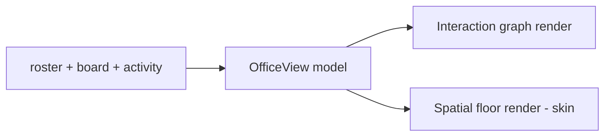

# Office View

**Version:** 1.0.1
**Status:** Stable
**Layer:** implementation
**Implements:** l1-office-visualization.md

## Overview

The concrete office visualization: the data it projects from (roster, board, activity), the two render modes (interaction graph and spatial floor skin), where cosmetic layout is persisted, the home-only building overview, drill-down inspection, and the `office` command surface.

## Related Specifications

- [l1-office-visualization.md](l1-office-visualization.md) - The model this implements.
- [l2-workspace-management.md](l2-workspace-management.md) - Roster (`config.json` manager/team) feeding nodes.
- [l2-kanban-board.md](l2-kanban-board.md) - Cards and assignment feeding task nodes/edges.
- [l2-filesystem-layout.md](l2-filesystem-layout.md) - The `office/` location for persisted layout.
- [l2-cli.md](l2-cli.md) - Command grammar standard the `office` commands follow.

## 1. Motivation

The model wants a live, dual-mode, projection-only office picture. Binding it to concrete sources and a layout store makes it consistent by construction and stable across sessions.

## 2. Constraints & Assumptions

- The view is rebuilt from sources on demand/refresh; it stores only cosmetic layout.
- Both render modes consume the same projected model (no per-mode data).
- The building overview reads across workspaces but never writes to them.
- The frontend renders; projection and aggregation are core calls (INV-2).

## 3. Invariant Compliance (Layer 2 only)

| L1 Invariant | Implementation |
| --- | --- |
| OVZ-1 Projection, not source | The view model is computed from roster + board + activity; nothing authoritative is stored except cosmetic layout. |
| OVZ-2 Live | The core emits office state changes; the view refreshes on roster/board/activity events. |
| OVZ-3 Two representations | Graph and spatial-floor renderers consume one `OfficeView` model. |
| OVZ-4 Observational + inspect | Default is view-only; `office inspect` drills into a node; no client operation is required. |
| OVZ-5 Per-office + building | `office show` renders the current office; `office building` (home only) aggregates all offices. |
| OVZ-6 Isolation | `office show` reads only the active workspace; the building view reads across `<state>/workspaces/*` read-only. |
| OVZ-7 Cosmetic, persistent layout | Placement persists in `<ws>/office/layout.json`; it feeds rendering only, never behavior. |

## 4. Detailed Design

### 4.1 Data sources (projection)

| View element | Source |
| --- | --- |
| agent nodes | workspace roster: `<ws>/config.json` (`manager`, `team`) + `<state>/employees/<role>/` |
| reporting edges | `reportsTo` relationships in roster |
| task nodes | board cards: `<ws>/kanban/` |
| assignment edges | card → assignee |
| activity (who's running) | `<ws>/sessions/` (live) |

### 4.2 Render modes



- **Graph:** nodes + edges (network diagram) — the canonical, always-available mode.
- **Spatial floor:** rooms/seats with employees placed, using office/employee skins; an alternate render of the same model.

### 4.3 Layout storage

```plaintext
<ws>/office/
└── layout.json   # cosmetic node/room placement (positions, seats); presentation only
```

Layout is the only thing the view writes; deleting it loses placement but not office data (it re-lays-out from the model).

### 4.4 Building overview (home only)

In the home workspace, `office building` aggregates a read-only map: each project workspace as a floor (its office summarized) plus the building boss. It never mutates project offices (OVZ-6).

### 4.5 Command surface

Office operations conform to the CLI grammar standard (see `l2-cli.md` §4.4).

| Action | CLI | TUI | Library (no code) |
| --- | --- | --- | --- |
| show office | `cronus office show` | `/office show` | `office.show() -> OfficeView` |
| building overview (home) | `cronus office building` | `/office building` | `office.building() -> BuildingView` |
| inspect a node | `cronus office inspect <node-id>` | `/office inspect <id>` | `office.inspect(nodeId) -> NodeDetail` |

The view is primarily `show`/`building`; `inspect` drills into an agent (role, current task, memory summary) or a task (card detail). Layout edits happen via the app's drag interactions, persisted to `layout.json`.

### 4.6 3D visualization subprocess architecture

The spatial floor render (§4.2) runs as a dedicated web application in a separate subprocess rather than embedding 3D in the main Tauri shell. A second subprocess bridges the desktop app's IPC to the renderer's WebSocket API.

#### Subprocess layout

```
Process 1 — 3D renderer (React + Three.js):
  source: <state>/office/renderer/   (extracted from bundle at first use)
  config: <state>/office/renderer/.env
  port:   configurable, default 3000
  PID:    <state>/office/renderer.pid

Process 2 — WebSocket gateway adapter:
  bundled with the desktop application
  port:   configurable, default 18989
  PID:    <state>/office/adapter.pid
```

#### Lifecycle

```text
[REFERENCE]
Setup (one-time):
  1. Extract renderer sources into <state>/office/renderer/
  2. Run npm install in renderer directory
  3. Write .env (PORT, HOST, NEXT_PUBLIC_GATEWAY_URL, OFFICE_MODEL)

Start:
  1. Spawn adapter subprocess → write adapter.pid → health probe
  2. Spawn renderer subprocess → write renderer.pid → health probe (GET / on renderer port)

Stop:
  1. SIGTERM adapter → await exit (5 s timeout, then SIGKILL)
  2. SIGTERM renderer → await exit (5 s timeout, then SIGKILL)
  3. Remove PID files
```

#### Status model

```text
[REFERENCE]
OfficeVisualizationStatus {
  sourcesReady: bool,
  dependenciesInstalled: bool,
  adapterRunning: bool,
  rendererRunning: bool,
  running: bool,              // = adapterRunning && rendererRunning
  rendererPort: u16 | null,
  portInUse: bool,            // true if the renderer port is occupied by another process
  wsUrl: String | null,       // WebSocket URL the desktop connects to
  error: String | null,
  remoteUrl: String | null,   // populated in remote mode (SSH probe)
  remoteSource: String | null // host identifier for the remote renderer
}
```

#### Remote (SSH) mode

When the workspace is remote, the desktop probes the remote host for a running renderer service before spawning local subprocesses:

```text
[REFERENCE]
probe_remote(host: &str, port: u16) -> Option<OfficeVisualizationStatus>:
  GET http://{host}:{port}/status   timeout 5 s
  on 200 OK with { running: true }: populate remoteUrl and remoteSource, return status
  on timeout / error: return None
```

If found, the desktop opens a WebSocket connection to the remote renderer directly. If not found, the user is offered to start the renderer on the remote host.

#### PID file management

Each subprocess writes its PID on startup and removes it on clean shutdown. On restart: read PID from file, check whether the process is alive, remove the stale PID and restart if not. Stale PIDs from crashes are cleared automatically on the next start.

## 5. Drawbacks & Alternatives

- **Refresh cost on busy offices:** mitigated by event-driven incremental updates rather than full rebuilds.
- **Spatial skin asset work:** the floor render needs room/seat assets; the graph mode works without them, so the spatial skin can ship slightly behind.
- **Alternative — store the view model:** rejected; storing a derived model risks drift (OVZ-1). Only cosmetic layout is persisted.

## Canonical References

| Alias | Path | Purpose |
| --- | --- | --- |
| `[MODEL]` | `.design/main/specifications/l1-office-visualization.md` | Invariants this view satisfies |
| `[BOARD]` | `.design/main/specifications/l2-kanban-board.md` | Task/assignment source |
| `[CLI]` | `.design/main/specifications/l2-cli.md` | Command grammar standard |
