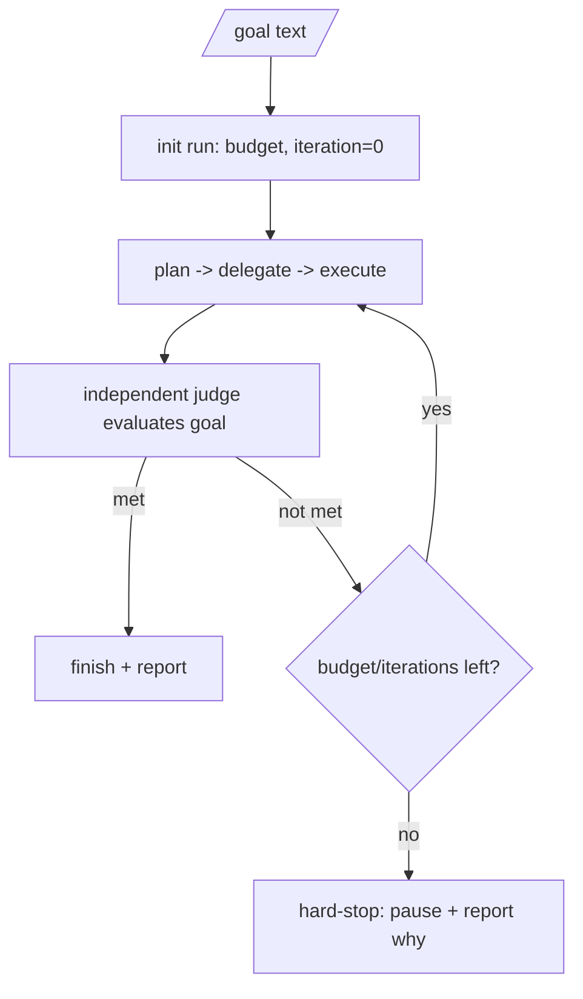

# Orchestration

**Version:** 1.0.0
**Status:** Stable
**Layer:** implementation
**Implements:** l1-orchestration.md

## Overview

The concrete coordination mechanics: how the orchestrator delegates via assigned board cards, how agents message each other, how executors are isolated, how the independent judge and the budget circuit-breaker bound a `/goal` run, how the topology adapts as the office grows, and how orchestration state persists for resume.

## Related Specifications

- [l1-orchestration.md](l1-orchestration.md) - The protocol this implements.
- [l2-kanban-board.md](l2-kanban-board.md) - Delegation creates/assigns cards; `done` consumes quality gate results.
- [l1-office-model.md](l1-office-model.md) - Roles and adaptive staffing the orchestrator delegates to (concrete role catalog specified separately).
- [l2-quality-pipeline.md](l2-quality-pipeline.md) - Gate results the orchestrator requires before `done`.
- [l2-cli.md](l2-cli.md) - `/goal`, `plan`, `task`, `run`, `status` entry points.

## 1. Motivation

The protocol needs concrete, local, resumable mechanics: a delegation channel (the board), an inter-agent channel (messages), isolation (per-agent sessions), a judge call, and budget accounting — all file-backed so an unattended run survives restarts.

## 2. Constraints & Assumptions

- Delegation rides on the existing board; no parallel task store.
- Executors run in isolated sessions; only summaries return to the orchestrator.
- The judge is a separate evaluation (may use a different/cheaper model) than the executor.
- Budgets come from configuration (per-run and per-agent).

## 3. Invariant Compliance (Layer 2 only)

| L1 Invariant | Implementation |
| --- | --- |
| ORC-1 One orchestrator | The office `manager` (from `<ws>/config.json`) is the sole coordinator; it issues delegations, not implementations. |
| ORC-2 Adaptive topology | When direct reports or domain spread cross a threshold, the orchestrator hires a sub-manager and re-parents agents under it. |
| ORC-3 Intent → board | Plans decompose into board cards (`<ws>/kanban/`) assigned to roles. |
| ORC-4 Delegate/monitor | The orchestrator watches card states and re-assigns/unblocks; it never self-assigns implementation. |
| ORC-5 Context isolation | Each delegated card runs in its own agent session (`<ws>/sessions/`); only a result/summary returns. |
| ORC-6 Judged termination | A `/goal` loop calls an independent judge to decide completion before finishing. |
| ORC-7 Budget circuit-breaker | A per-run budget/iteration counter pauses the loop when exhausted (ties to per-agent budgets). |
| ORC-8 Synchronization | Scheduled briefing routines reconcile agent state into shared office state. |
| ORC-9 Approval gate | High-impact actions require a recorded approval (sub-manager or client) before execution. |
| ORC-10 Resumable | Goal/plan/delegation state persists (board + office state) and reloads on restart. |

## 4. Detailed Design

### 4.1 Delegation and messaging

- **Delegation:** the orchestrator creates a board card with an `assignee` (a hired role) and the task reference; a missing role triggers a hire (role catalog).
- **Messaging:** agents exchange messages (a mailbox) for hand-offs and questions; the orchestrator is the hub for cross-role coordination.
- **Shared task list:** the board is the single shared work list; claiming/assignment is atomic to avoid two agents grabbing the same card.

### 4.2 Context-isolated execution

Each delegated unit runs in a fresh agent session with only the context it needs (its card, relevant memory, role persona). Intermediate reasoning stays in that session; the orchestrator receives a concise result and the card's new state (ORC-5) — preventing context rot over long runs.

### 4.3 `/goal` run with judge + budget

- **Judge:** a separate evaluation step (distinct from the executor, may use a cheaper model) returns met / not-met with reasoning; only it can end the run as "done" (ORC-6).
- **Budget:** the run carries a token/cost/iteration budget; on exhaustion it pauses safely and reports remaining work (ORC-7).

### 4.4 Adaptive topology mechanism

The orchestrator tracks team size and domain spread; crossing a threshold causes it to hire a sub-manager, assign it a department, and re-parent the relevant agents' `reportsTo`. Shrinking reverses this (release sub-manager, flatten). <!-- TBD: concrete thresholds for promoting/flattening sub-managers -->

### 4.5 Command surface

The `/goal` entry point is the autonomy trigger; planning/execution reuse existing core commands.

| Action | CLI | TUI | Library (no code) |
| --- | --- | --- | --- |
| start autonomous goal | `cronus goal <text>` | `/goal <text>` | `orchestrator.goal(text) -> Run` |
| view run progress | `cronus status` | `/status` | `orchestrator.status() -> RunStatus` |
| stop a run | `cronus goal stop` | `/goal stop` | `orchestrator.stop() -> void` |

## 5. Drawbacks & Alternatives

- **Judge model choice:** too weak a judge mis-confirms; too strong is costly. Mitigated by making the judge model configurable.
- **Mailbox overhead:** message passing adds bookkeeping; justified for coherent multi-agent hand-offs.
- **Alternative — orchestrator executes trivial tasks itself:** rejected; it erodes ORC-1 clarity. Trivial work still goes through a (cheap) role.

## Canonical References

| Alias | Path | Purpose |
| --- | --- | --- |
| `[PROTOCOL]` | `.design/main/specifications/l1-orchestration.md` | Invariants this implements |
| `[BOARD]` | `.design/main/specifications/l2-kanban-board.md` | Delegation channel |
| `[OFFICE]` | `.design/main/specifications/l1-office-model.md` | Roles and staffing that execute delegated work |
