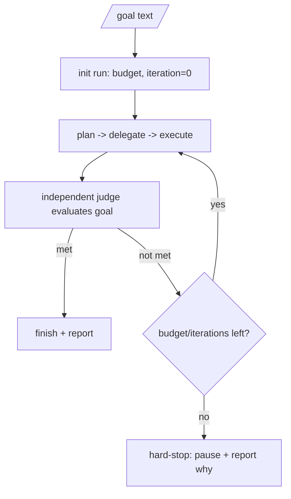

# Orchestration

**Version:** 1.0.4
**Status:** Stable
**Layer:** implementation
**Implements:** l1-orchestration.md

## Overview

The concrete coordination mechanics: how the orchestrator delegates via assigned board cards, how agents message each other, how executors are isolated, how the independent judge and the budget circuit-breaker bound a `/goal` run, how the topology adapts as the office grows, and how orchestration state persists for resume.

## Related Specifications

- [l1-orchestration.md](l1-orchestration.md) - The protocol this implements.
- [l2-kanban-board.md](l2-kanban-board.md) - Delegation creates/assigns cards; `done` consumes quality gate results.
- [l1-office-model.md](l1-office-model.md) - Roles and adaptive staffing the orchestrator delegates to (concrete role catalog specified separately).
- [l2-quality-pipeline.md](l2-quality-pipeline.md) - Gate results the orchestrator requires before `done`.
- [l2-cli.md](l2-cli.md) - `/goal`, `plan`, `task`, `run`, `status` entry points.
- [l2-agent-autonomy.md](l2-agent-autonomy.md) - Approval gate that governs high-impact orchestrator decisions and agent hires.
- [l2-trigger-triage.md](l2-trigger-triage.md) - Triage hands `SpawnOrchestrator` decisions to this layer's goal-execution loop.

## 1. Motivation

The protocol needs concrete, local, resumable mechanics: a delegation channel (the board), an inter-agent channel (messages), isolation (per-agent sessions), a judge call, and budget accounting — all file-backed so an unattended run survives restarts.

## 2. Constraints & Assumptions

- Delegation rides on the existing board; no parallel task store.
- Executors run in isolated sessions; only summaries return to the orchestrator.
- The judge is a separate evaluation (may use a different/cheaper model) than the executor.
- Budgets come from configuration (per-run and per-agent).

## 3. Invariant Compliance (Layer 2 only)

| L1 Invariant | Implementation |
| --- | --- |
| ORC-1 One orchestrator | The office `manager` (from `<ws>/config.json`) is the sole coordinator; it issues delegations, not implementations. |
| ORC-2 Adaptive topology | When direct reports or domain spread cross a threshold, the orchestrator hires a sub-manager and re-parents agents under it. |
| ORC-3 Intent → board | Plans decompose into board cards (`<ws>/kanban/`) assigned to roles. |
| ORC-4 Delegate/monitor | The orchestrator watches card states and re-assigns/unblocks; it never self-assigns implementation. |
| ORC-5 Context isolation | Each delegated card runs in its own agent session (`<ws>/sessions/`); only a result/summary returns. |
| ORC-6 Judged termination | A `/goal` loop calls an independent judge to decide completion before finishing. |
| ORC-7 Budget circuit-breaker | A per-run budget/iteration counter pauses the loop when exhausted (ties to per-agent budgets). |
| ORC-8 Synchronization | Scheduled briefing routines reconcile agent state into shared office state. |
| ORC-9 Approval gate | High-impact actions require a recorded approval (sub-manager or client) before execution. |
| ORC-10 Resumable | Goal/plan/delegation state persists (board + office state) and reloads on restart. |

## 4. Detailed Design

### 4.1 Delegation and messaging

- **Delegation:** the orchestrator creates a board card with an `assignee` (a hired role) and the task reference; a missing role triggers a hire (role catalog).
- **Messaging:** agents exchange messages (a mailbox) for hand-offs and questions; the orchestrator is the hub for cross-role coordination.
- **Shared task list:** the board is the single shared work list; claiming/assignment is atomic to avoid two agents grabbing the same card.

### 4.2 Context-isolated execution

Each delegated unit runs in a fresh agent session with only the context it needs (its card, relevant memory, role persona). Intermediate reasoning stays in that session; the orchestrator receives a concise result and the card's new state (ORC-5) — preventing context rot over long runs.

### 4.3 `/goal` run with judge + budget



- **Judge:** a separate evaluation step (distinct from the executor, may use a cheaper model) returns met / not-met with reasoning; only it can end the run as "done" (ORC-6).
- **Budget:** the run carries a token/cost/iteration budget; on exhaustion it pauses safely and reports remaining work (ORC-7).

### 4.4 Adaptive topology mechanism

The orchestrator tracks team size and domain spread; crossing a threshold causes it to hire a sub-manager, assign it a department, and re-parent the relevant agents' `reportsTo`. Shrinking reverses this (release sub-manager, flatten). <!-- TBD: concrete thresholds for promoting/flattening sub-managers -->

### 4.5 Command surface

The `/goal` entry point is the autonomy trigger; planning/execution reuse existing core commands.

| Action | CLI | TUI | Library (no code) |
| --- | --- | --- | --- |
| start autonomous goal | `cronus goal <text>` | `/goal <text>` | `orchestrator.goal(text) -> Run` |
| view run progress | `cronus status` | `/status` | `orchestrator.status() -> RunStatus` |
| stop a run | `cronus goal stop` | `/goal stop` | `orchestrator.stop() -> void` |

### 4.6 Agent tier hierarchy

Agents are classified into three tiers at definition time. The tier determines the allowed toolsets, iteration budget defaults, and workspace scope.

```text
[REFERENCE]
AgentTier: "chat" | "reasoning" | "worker"

AgentDefinition {
  name:             String,
  tier:             AgentTier,
  role_id:          Option<String>,          // links to a hired role in the role catalog
  toolsets:         Vec<String>,             // declared toolset names
  iteration_budget: Option<u32>,             // overrides tier default
  workspace_scope:  "session" | "execution" | "isolated",
}
```

| Tier | Typical use | Default iteration budget | Toolset restrictions | Workspace scope |
| --- | --- | --- | --- | --- |
| `chat` | Short interactive turns, clarifications, brief Q&A | 10 | Read-only tools only; `shell` and `code_execution` forbidden | `session` |
| `reasoning` | Planning, analysis, multi-step problem decomposition | 50 | All tools except `code_execution`; `shell` allowed read-only | `session` or `execution` |
| `worker` | Full implementation, file editing, command execution | 90 | All toolsets; must have an execution workspace | `execution` or `isolated` |

#### Static loader validation

At agent definition load time (extension registry activation, workspace bootstrap), each `AgentDefinition` is validated against its tier:

- `chat` agents declaring `shell` or `code_execution` toolsets are rejected with a hard load error.
- `worker` agents without an `execution` or `isolated` workspace scope are rejected.
- Unknown toolset names are rejected (no implicit fallback).

Validation failures are logged as `AgentDefinitionError` and prevent the agent from being loaded. They do not affect other agents in the same workspace.

#### Runtime spawn depth limit

Agents can spawn sub-agents, which can spawn further sub-agents, but the chain is capped:

```text
[REFERENCE]
MAX_SPAWN_DEPTH: u32 = 3
```

When an agent at depth 3 attempts to spawn a child, the call returns `MaxSpawnDepthError` to the parent. The error is surfaced in the parent's tool result and logged. The orchestrator is always at depth 0; its direct delegates are at depth 1, and so on.

#### Toolkit action ranking

When a `reasoning` or `worker` agent has a large tool catalog (> 50 entries), an action-ranking pass narrows the effective tool list before each provider call:

```text
[REFERENCE]
rank_tools(task_description: &str, tools: &[ToolDefinition], top_n: u32) -> Vec<ToolDefinition>:
  scores = []
  for tool in tools:
    verb_score  = verb_overlap(task_description, tool.name)   // CPU-only: match leading verb
    token_score = token_overlap(task_description, tool.description)  // unigram overlap
    scores.push((tool, verb_score + token_score))
  scores.sort_by(|a, b| b.score.partial_cmp(&a.score))
  return scores[..top_n].map(|s| s.tool)
```

- **Default `top_n`**: 20.
- **Ranking is CPU-only** (no LLM call): verb detection extracts the leading verb from the task description and checks if it appears in the tool name; token overlap counts shared unigrams between the task description and the tool's one-line description.
- Ranked tools are placed first in the tool list sent to the provider; remaining tools are omitted.
- Action ranking runs only when the catalog exceeds the threshold; smaller catalogs are sent in full.

### 4.7 Permission ruleset evaluation

Tool calls and agent actions that require user approval go through a ruleset evaluator.
Rulesets are ordered lists of rules; **the last matching rule wins** (not the first).
This allows coarse-grained allow/deny earlier in the list to be overridden by fine-grained
rules appended by the current context.

```text
[REFERENCE]
PermissionRule {
  permission: Pattern,   // e.g. "fs:write:*"
  pattern:    Pattern,   // e.g. "/home/**"
  action:     "allow" | "deny" | "ask"
}

evaluate(permission: String, path: String, rulesets: Vec<Ruleset>) -> PermissionResult:
  // merge rulesets in order; then findLast matching rule
  merged = concat(rulesets)
  rule = merged.findLast(|r|
    Wildcard.match(permission, r.permission) AND Wildcard.match(path, r.pattern)
  )
  return rule?.action ?? "ask"   // default: ask the user

// "ask" triggers an async approval cycle:
PendingApproval {
  id:       PermissionId,
  info:     ApprovalRequest,
  deferred: Deferred<void, RejectedError | CorrectedError>,
}
```

#### Deferred async approval

When `evaluate()` returns `"ask"`, a `Deferred` is created and the pending approval is
registered. The agent suspends at the approval point; execution resumes when the user
responds.

```text
[REFERENCE]
request_approval(request: ApprovalRequest) -> Effect<void, RejectedError>:
  deferred = Deferred.make()
  pending_approvals.insert(request.id, { info: request, deferred })
  yield* deferred.await()   // agent suspends here

approve(id: PermissionId):
  pending_approvals.remove(id)?.deferred.resolve(())

reject(id: PermissionId):
  pending_approvals.remove(id)?.deferred.reject(RejectedError)
```

#### Scope-based finalizer cleanup

All pending approvals are registered in a scoped context. When the scope closes (session
end, agent cancellation, turn abort), the finalizer rejects every unresolved Deferred:

```text
[REFERENCE]
scope.finalizer:
  for (id, entry) in pending_approvals.drain():
    entry.deferred.reject(RejectedError { reason: "scope_closed" })
```

This prevents the agent from being permanently suspended waiting for an approval that
will never arrive (e.g., after a client disconnects).

### 4.8 Agent mode and on-demand generation

#### Agent mode

Every agent definition carries a `mode` that determines which messages it receives in a
multi-agent session:

```text
[REFERENCE]
AgentMode: "subagent" | "primary" | "all"

"primary"  — receives the conversation from the user's perspective;
             owns the session lifecycle; default for interactive agents.
"subagent" — receives only the delegation request from its parent;
             returns a structured result; never sees the full user history.
"all"      — receives every message regardless of source; used for monitor/observer
             roles that need full visibility (e.g., duplicate-PR detectors, audit agents).
```

`mode` is declared in the agent definition frontmatter (see `l2-extension-registry.md §4.10`).
The orchestrator uses it when routing a delegation to select the correct message slice.

#### On-demand agent generation

When the orchestrator needs an agent for a task that has no pre-defined definition, it can
generate one on demand from a description:

```text
[REFERENCE]
generate_agent(description: String, model?: ModelRef) -> AgentDefinition:
  // Issues a structured LLM call with the description as input.
  // Returns a validated AgentDefinition (name, mode, tool access, system prompt).
  // The generated definition is ephemeral — not persisted to the registry unless
  // the user explicitly saves it via `cronus ext add --from-generated <id>`.
```

Generated agents receive a `source: "generated"` tag; the quality pipeline scans them
before the orchestrator uses them for the first time.

### 4.9 Tool terminate batch semantics

Each tool's `execute()` call may return an optional `terminate` hint that signals the
agent loop to stop after the current tool batch without issuing another model call.

```text
[REFERENCE]
AgentToolResult {
  content:    Vec<TextContent | ImageContent>,
  details:    T,
  terminate?: bool,   // hint: agent should stop after this batch
}
```

**Batch rule**: `terminate` causes an early stop only when **all** tools in the current
batch return `terminate: true`. A single tool returning `terminate: false` (or not
setting the field) allows the batch to complete normally and the agent loop to continue.

This prevents a sub-task tool from prematurely halting the agent when it is invoked in
parallel with other tools that have not yet completed their work. The all-or-nothing
check ensures every concurrently-running tool has completed before the loop decides to
stop.

```text
[REFERENCE]
executeToolCalls(tool_calls, config) -> ToolResultMessage[]:
  results = run_in_configured_mode(tool_calls)   // sequential or parallel per §4.10
  hasMoreWork = not all(r.terminate == true for r in results)
  if not hasMoreWork:
    // signal outer loop to break — no further model call
    mark_terminate_batch()
  return results
```

### 4.10 Agent loop configuration hooks

The agent loop exposes a set of configuration hooks that allow callers (orchestrator,
TUI, extension layer) to customise execution without touching the loop's core logic.
Hooks cover: tool pre/post-processing, stop conditions, and per-turn context mutation.

```text
[REFERENCE]
AgentLoopConfig {
  // Tool lifecycle
  beforeToolCall(tool_name, args, signal) -> BeforeToolCallResult?
    // Run before every tool execution. Return { block: true, reason: string }
    // to prevent the tool from running and return an error result to the model.
    // Mutation of args in place is the mechanism for argument patching.

  afterToolCall(tool_name, args, result) -> AfterToolCallResult?
    // Run after every tool execution. Return a partial override object:
    //   { content?, details?, isError?, terminate? }
    // Fields are applied field-by-field (no deep merge). Omit a field to keep the
    // tool's original value. Use to inject structured details, mask errors, or force
    // terminate semantics.

  // Stop control
  shouldStopAfterTurn(assistant_message) -> bool
    // Called after each model response, before checking for tool calls.
    // Return true to exit the inner loop after the current turn.

  // Context preparation
  prepareNextTurn(context, outcome) -> PreparedTurn?
    // Called between inner loop iterations. May return a new context, model ref,
    // or thinking level for the next provider call. Enables mid-run adaptive model
    // switching without restarting the session.

  transformContext(messages) -> AgentMessage[]
    // Called before every provider call. Prune, reorder, or inject messages at the
    // AgentMessage[] level. The returned list replaces the current context for this
    // provider call only — persistent context is unchanged.

  convertToLlm(messages) -> ProviderMessage[]
    // Convert AgentMessage[] to the provider's wire format. Required when custom
    // message types (see CustomAgentMessages) exist in the context; the provider
    // SDK cannot handle unknown role types.

  // Message injection
  getSteeringMessages(messages) -> AgentMessage[]
    // Return messages to inject before the next provider call (inner loop).
    // Empty list = no injection. Called every turn so the hook can decide
    // dynamically whether steering is needed.

  getFollowUpMessages(result_messages) -> AgentMessage[]?
    // Return messages to inject after the inner loop exits (outer loop).
    // Non-empty = re-enter inner loop with injected messages appended.
    // None or empty = outer loop exits.

  // Authentication
  getApiKey(provider_id) -> string?
    // Called before each provider request. Returning a fresh key handles
    // expiring OAuth tokens without restarting the session.
}

BeforeToolCallResult { block?: bool, reason?: string }

AfterToolCallResult {
  content?:   Vec<TextContent | ImageContent>,
  details?:   T,
  isError?:   bool,
  terminate?: bool,
  // Each field independently overrides the tool's original value.
  // Absent fields preserve the original.
}
```

#### Tool execution modes

Tool execution mode governs whether tools in a batch run sequentially or in parallel:

```text
[REFERENCE]
ToolExecutionMode: "sequential" | "parallel"

Resolution order (first match wins):
  1. Per-tool executionMode on the tool definition (ToolDefinition.executionMode)
  2. Global AgentLoopConfig.toolExecution.mode
  3. Default: "sequential"

When mixing modes in one batch:
  Tools declared "parallel" may run concurrently with each other.
  Tools declared "sequential" (or defaulting to it) run one at a time, in order.
  A "sequential" tool that is batched with "parallel" tools waits for the parallel
  group to finish before it executes (serialized after the parallel group).
```

#### File-mutation queue (multi-agent safety)

When multiple agents operate in the same working directory, concurrent writes to the
same file corrupt content. Each write/edit operation acquires a per-file serialization
lock before touching the filesystem:

```text
[REFERENCE]
withFileMutationQueue(filePath, fn):
  // Resolve real path to handle symlinks (two paths → same file)
  key = realpath(filePath)    // or resolved path if file not yet created
  queue = fileMutationQueues.get(key) ?? Promise.resolve()
  // Chain fn after the current queue head — operations for different files run in parallel
  fileMutationQueues.set(key, queue.then(fn))
  await current_queue_head   // blocks until previous operation on this file completes
  return fn()                // exclusive access window
  // After fn: release the slot; remove key if no further waiters
```

The queue is process-global (shared across all concurrent tool invocations) and uses
path canonicalization to treat symlinks to the same file as the same key. Operations
targeting different files are never blocked by each other.

### 4.11 Architecture spine format

An architecture spine is an **invariants-only consistency contract** — the smallest set of decisions a future builder cannot read off compliant code. It does not describe the implementation; it binds what the implementation must not violate. Everything not in the spine is intentionally deferred.

#### Altitude hierarchy

Spines are authored at three altitudes, each scoping which level of detail they bind:

| Altitude | Governs | Inherits |
| --- | --- | --- |
| `initiative` | Cross-feature constraints; keeps feature-level decisions in scope | — |
| `feature` | Cross-epic constraints; keeps epic-level decisions in scope | initiative |
| `epic` | Story-level constraints | feature, initiative |

An epic-altitude spine is typically thin: mostly "Inherited Invariants" from its parent feature spine plus a small local Deferred section.

#### AD-n invariant format

Each decision carries three mandatory fields and optional tags:

```text
[REFERENCE]
### AD-{n} — {decision title}

- **Binds:** {capability IDs, unit IDs, areas, or "all"}
- **Prevents:** {the divergence this decision stops}
- **Rule:** {the enforceable constraint downstream must follow}
```

- IDs are stable and ascending; once assigned they are **never reused or renumbered** (a future builder may reference them in commit messages or issue bodies).
- Tag `[ADOPTED]` when the decision records existing reality rather than a new choice. Adopted decisions require no approval; they document what is already true.
- A decision that contradicts an inherited AD is a conflict to surface explicitly — not a silent override.

#### Inherited invariants table

When a spine inherits from a higher-altitude parent, it carries the parent's ADs/conventions/paradigm as read-only inherited invariants:

```text
[REFERENCE]
| Inherited | From parent | Binds here |
| {AD-id / convention} | {parent spine name} | {what it constrains in this scope} |
```

These entries are never renumbered or re-derived. A local decision that contradicts one must surface the conflict rather than overriding silently.

#### Deferred section

The Deferred section is the other half of the spine contract — it makes explicit what the spine intentionally does not decide and why:

```text
[REFERENCE]
## Deferred

- {decision}: {why it can wait or which altitude should own it}
```

A small Deferred section signals a lean, focused spine. Decisions with open questions belong in Deferred until enough information exists to make them ADs.

#### Consistency conventions table

Spines carry a `Consistency Conventions` table for concerns where independent builders would otherwise drift:

```text
[REFERENCE]
| Concern | Convention |
| Naming (entities, files, interfaces, events) | |
| Data & formats (ids, dates, error shapes, envelopes) | |
| State & cross-cutting (mutation, errors, logging, config, auth) | |
```

Only rows that bind are included; empty rows are omitted.

#### Spine purpose variants

```text
[REFERENCE]
purpose: build-substrate   // default: drives a real implementation (most spines)
purpose: discussion        // exploration spine; not yet binding
purpose: report            // post-hoc architecture review artifact
purpose: deck              // presentation spine; not binding
```

Only `build-substrate` spines create real implementation obligations. Other purposes are informational artifacts that may later be promoted.

## 5. Drawbacks & Alternatives

- **Judge model choice:** too weak a judge mis-confirms; too strong is costly. Mitigated by making the judge model configurable.
- **Mailbox overhead:** message passing adds bookkeeping; justified for coherent multi-agent hand-offs.
- **Alternative — orchestrator executes trivial tasks itself:** rejected; it erodes ORC-1 clarity. Trivial work still goes through a (cheap) role.
- **MAX_SPAWN_DEPTH = 3:** arbitrary but prevents runaway recursion; configurable via workspace config for teams that need deeper delegation chains.

## Canonical References

| Alias | Path | Purpose |
| --- | --- | --- |
| `[PROTOCOL]` | `.design/main/specifications/l1-orchestration.md` | Invariants this implements |
| `[BOARD]` | `.design/main/specifications/l2-kanban-board.md` | Delegation channel |
| `[OFFICE]` | `.design/main/specifications/l1-office-model.md` | Roles and staffing that execute delegated work |
