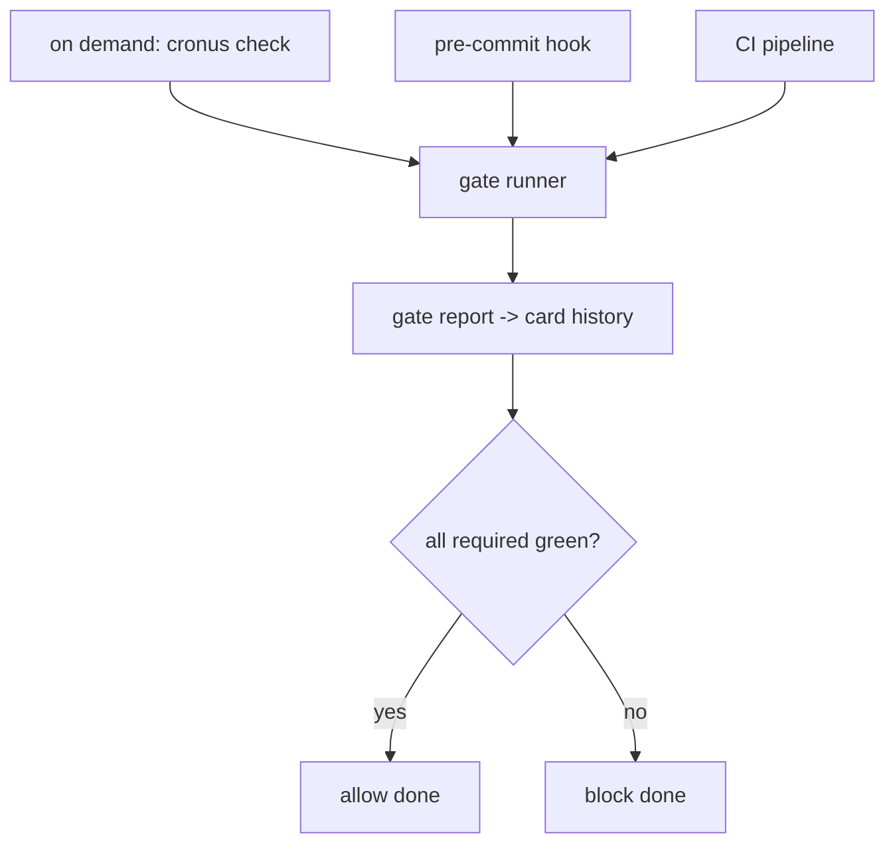

# Quality Pipeline

**Version:** 1.1.0
**Status:** Stable
**Layer:** implementation
**Implements:** l1-quality-standards.md

## Overview

The concrete realization of the quality gates: how Cronus detects a project's language and maps each gate to that ecosystem's standard tool, how gates run locally / pre-commit / in CI / on demand, Cronus's own toolchain, and the `check` command surface.

## Related Specifications

- [l1-quality-standards.md](l1-quality-standards.md) - The gates this pipeline runs.
- [l2-technology-stack.md](l2-technology-stack.md) - Cronus's own toolchain (Rust + TS).
- [l2-kanban-board.md](l2-kanban-board.md) - A card's transition to `done` consumes gate results.
- [l2-cli.md](l2-cli.md) - Command grammar standard the `check` command follows.

## 1. Motivation

Gates are conceptual; this spec binds them to real tools per language and defines where they run, so "ideal code" is enforced automatically for any project and for Cronus itself.

## 2. Constraints & Assumptions

- Language is auto-detected from project markers (e.g. `Cargo.toml`, `package.json`, `pyproject.toml`, `go.mod`).
- Each gate maps to the ecosystem's de-facto standard tool; tools are configurable per project.
- Gates run locally on demand, as a pre-commit hook, and in CI; results are recorded.
- The frontend holds no logic; gate execution is a core service (INV-2).

## 3. Invariant Compliance (Layer 2 only)

| L1 Invariant | Implementation |
| --- | --- |
| QLY-1 Gate = DoD | The board's `done` transition requires a green gate report for the card. |
| QLY-2 Always-on gates | tests + lint + type/format run on every change, per the detected toolchain. |
| QLY-3 Conditional gates | benchmarks and security checks run when the change is tagged performance-relevant / security-sensitive. |
| QLY-4 Review & refactor | review/refactor steps are required board transitions owned by their roles. |
| QLY-5 Role-enforced | each gate is executed/owned by its role (see model §4.3). |
| QLY-6 Universal + dogfood | per-language toolchain map covers any project; Cronus uses the Rust + TS rows on itself. |
| QLY-7 Blocking & traceable | a failed required gate returns non-zero and is written to the card history; `done` is refused. |
| QLY-8 Continuous improvement | refactor gate runs continuously; quality debt is reported, not suppressed. |

## 4. Detailed Design

### 4.1 Per-language toolchain map

| Language | tests | lint | type/format | benchmarks | security |
| --- | --- | --- | --- | --- | --- |
| Rust | `cargo test` | `cargo clippy` | `cargo fmt --check` | `cargo bench` (criterion) | `cargo audit` / `cargo deny` |
| TypeScript / JS | `vitest` | `eslint` or `biome` | `tsc --noEmit` / `biome format` | `vitest bench` / tinybench | `npm audit` / `osv-scanner` |
| Python | `pytest` | `ruff` | `mypy` / `ruff format` | `pytest-benchmark` | `pip-audit` |
| Go | `go test` | `golangci-lint` | `gofmt -l` | `go test -bench` | `govulncheck` |

The map is extensible; unknown languages fall back to project-declared commands. Cronus itself uses the Rust (core) and TypeScript (frontend) rows (QLY-6).

**Structural analysis (JS/TS):** beyond lint/format/types, the TypeScript/JS gate adds a codebase-intelligence tool (`fallow`) for the structural dimension — dead code (unused files/exports/dependencies), duplication, circular dependencies, complexity hotspots, and **architecture-boundary enforcement**. It runs in the always-on static-analysis tier: `fallow audit --changed-since <base> --format json` (exit 0 pass/warn, 1 fail), with saved baselines for incremental adoption. Boundary rules mechanically enforce presentation-only frontends with inward-pointing dependencies (consistent with INV-2). It is a dev/CI tool (free static layer), not a runtime dependency, so it does not affect the embeddable/mobile build. <!-- TBD: choose a `.fallowrc.json` boundaries preset vs custom zones for packages/ui -->

Rust gets the equivalent structural coverage from `cargo clippy` plus dependency/cycle checks; the JS/TS ecosystem lacks an equivalent, which is why a dedicated tool is named there.

### 4.2 Where gates run

Pre-commit hooks live under a workspace's `hooks/`; CI runs the same gate runner so local and CI verdicts match.

### 4.3 Conditional-gate triggers

A change is routed to benchmarks when it touches performance-relevant areas, and to security review when it touches security-sensitive areas. The exact classifiers are tuned over time. <!-- TBD: concrete classifiers for performance-relevant / security-sensitive changes -->

### 4.4 Command surface

Quality operations conform to the CLI grammar standard (see `l2-cli.md` §4.4). `check` is a top-level command with an optional gate argument.

| Action | CLI | TUI | Library (no code) |
| --- | --- | --- | --- |
| run all required gates | `cronus check` | `/check` | `quality.check() -> Report` |
| run one gate | `cronus check <gate>` (`tests`\|`lint`\|`types`\|`format`\|`bench`\|`security`) | `/check <gate>` | `quality.run(gate) -> Result` |
| last report | `cronus check status` | `/check status` | `quality.report() -> Report` |

## 5. Drawbacks & Alternatives

- **Toolchain drift:** ecosystems change default tools (e.g. eslint vs biome); mitigated by making the map configurable per project.
- **Detection ambiguity in polyglot repos:** multiple language markers require running multiple toolchains; the runner aggregates their reports.
- **Alternative — one fixed toolchain:** rejected; the office builds projects in many languages (QLY-6).

## Canonical References

| Alias | Path | Purpose |
| --- | --- | --- |
| `[STANDARDS]` | `.design/main/specifications/l1-quality-standards.md` | Gates this pipeline enforces |
| `[STACK]` | `.design/main/specifications/l2-technology-stack.md` | Cronus's own toolchain |
| `[CLI]` | `.design/main/specifications/l2-cli.md` | Command grammar standard |
