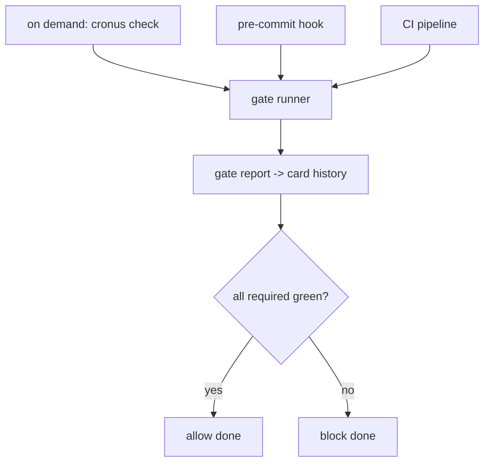

# Quality Pipeline

**Version:** 1.1.6
**Status:** Stable
**Layer:** implementation
**Implements:** l1-quality-standards.md

## Overview

The concrete realization of the quality gates: how Cronus detects a project's language and maps each gate to that ecosystem's standard tool, how gates run locally / pre-commit / in CI / on demand, Cronus's own toolchain, and the `check` command surface.

## Related Specifications

- [l1-quality-standards.md](l1-quality-standards.md) - The gates this pipeline runs.
- [l2-technology-stack.md](l2-technology-stack.md) - Cronus's own toolchain (Rust + TS).
- [l2-kanban-board.md](l2-kanban-board.md) - A card's transition to `done` consumes gate results.
- [l2-cli.md](l2-cli.md) - Command grammar standard the `check` command follows.

## 1. Motivation

Gates are conceptual; this spec binds them to real tools per language and defines where they run, so "ideal code" is enforced automatically for any project and for Cronus itself.

## 2. Constraints & Assumptions

- Language is auto-detected from project markers (e.g. `Cargo.toml`, `package.json`, `pyproject.toml`, `go.mod`).
- Each gate maps to the ecosystem's de-facto standard tool; tools are configurable per project.
- Gates run locally on demand, as a pre-commit hook, and in CI; results are recorded.
- The frontend holds no logic; gate execution is a core service (INV-2).

## 3. Invariant Compliance (Layer 2 only)

| L1 Invariant | Implementation |
| --- | --- |
| QLY-1 Gate = DoD | The board's `done` transition requires a green gate report for the card. |
| QLY-2 Always-on gates | tests + lint + type/format run on every change, per the detected toolchain. |
| QLY-3 Conditional gates | benchmarks and security checks run when the change is tagged performance-relevant / security-sensitive. |
| QLY-4 Review & refactor | review/refactor steps are required board transitions owned by their roles. |
| QLY-5 Role-enforced | each gate is executed/owned by its role (see model §4.3). |
| QLY-6 Universal + dogfood | per-language toolchain map covers any project; Cronus uses the Rust + TS rows on itself. |
| QLY-7 Blocking & traceable | a failed required gate returns non-zero and is written to the card history; `done` is refused. |
| QLY-8 Continuous improvement | refactor gate runs continuously; quality debt is reported, not suppressed. |

## 4. Detailed Design

### 4.1 Per-language toolchain map

| Language | tests | lint | type/format | benchmarks | security |
| --- | --- | --- | --- | --- | --- |
| Rust | `cargo test` | `cargo clippy` | `cargo fmt --check` | `cargo bench` (criterion) | `cargo audit` / `cargo deny` |
| TypeScript / JS | `vitest` | `eslint` or `biome` | `tsc --noEmit` / `biome format` | `vitest bench` / tinybench | `npm audit` / `osv-scanner` |
| Python | `pytest` | `ruff` | `mypy` / `ruff format` | `pytest-benchmark` | `pip-audit` |
| Go | `go test` | `golangci-lint` | `gofmt -l` | `go test -bench` | `govulncheck` |

The map is extensible; unknown languages fall back to project-declared commands. Cronus itself uses the Rust (core) and TypeScript (frontend) rows (QLY-6).

**Structural analysis (JS/TS):** beyond lint/format/types, the TypeScript/JS gate adds a codebase-intelligence tool (`fallow`) for the structural dimension — dead code (unused files/exports/dependencies), duplication, circular dependencies, complexity hotspots, and **architecture-boundary enforcement**. It runs in the always-on static-analysis tier: `fallow audit --changed-since <base> --format json` (exit 0 pass/warn, 1 fail), with saved baselines for incremental adoption. Boundary rules mechanically enforce presentation-only frontends with inward-pointing dependencies (consistent with INV-2). It is a dev/CI tool (free static layer), not a runtime dependency, so it does not affect the embeddable/mobile build. <!-- TBD: choose a `.fallowrc.json` boundaries preset vs custom zones for packages/ui -->

Rust gets the equivalent structural coverage from `cargo clippy` plus dependency/cycle checks; the JS/TS ecosystem lacks an equivalent, which is why a dedicated tool is named there.

### 4.2 Where gates run



Pre-commit hooks live under a workspace's `hooks/`; CI runs the same gate runner so local and CI verdicts match.

### 4.3 Conditional-gate triggers

A change is routed to benchmarks when it touches performance-relevant areas, and to security review when it touches security-sensitive areas. The exact classifiers are tuned over time. <!-- TBD: concrete classifiers for performance-relevant / security-sensitive changes -->

### 4.4 Command surface

Quality operations conform to the CLI grammar standard (see `l2-cli.md` §4.4). `check` is a top-level command with an optional gate argument.

| Action | CLI | TUI | Library (no code) |
| --- | --- | --- | --- |
| run all required gates | `cronus check` | `/check` | `quality.check() -> Report` |
| run one gate | `cronus check <gate>` (`tests`\|`lint`\|`types`\|`format`\|`bench`\|`security`) | `/check <gate>` | `quality.run(gate) -> Result` |
| last report | `cronus check status` | `/check status` | `quality.report() -> Report` |

### 4.5 Codebase audit workflow

A structured four-phase process for evaluating any project — or Cronus itself — and producing prioritised, executor-ready improvement plans. Roles: an **advisor** (expensive/high-ceiling model) performs analysis and generates plans; an **executor** (cheaper model) implements in an isolated worktree and never touches the main branch.

#### Phase 1 — Recon

Map the project before judging it. Collect: language(s), framework(s), package manager, exact build/test/lint/typecheck commands, test coverage shape, deployment target, and Git churn hotspots. Also ingest intent and design documents where present (ADRs, PRDs, design specs, product briefs) — decided trade-offs recorded there are not findings, and plans must speak the project's own vocabulary.

If no working verification command exists (missing tests, broken build), record it: "establish a verification baseline" is finding #1 and a prerequisite for all risky plans.

#### Phase 2 — Parallel audit

Fan out read-only subagents across the nine audit categories (§4.6). Effort level determines scope:

| Level | Coverage | Concurrent subagents | Finding depth |
| --- | --- | --- | --- |
| `quick` | Recon hotspots only (highest churn + criticality) | 0–1 | Top ~6 HIGH-confidence findings |
| `standard` (default) | Hotspot-weighted, key packages | ≤4 | Full table; correctness + security very thorough |
| `deep` | Whole repo, every package | ≤8, one per category | Full table including LOW-confidence "investigate" items |

Every subagent prompt must include: (a) absolute path to the audit playbook section it covers; (b) recon facts scoping the search; (c) domain-specific risk hints; (d) decided trade-offs that are not findings; (e) explicit instruction to return findings only; (f) verbatim copy of the secret-reproduction prohibition (§4.11 of `l2-security.md`) and the repo-content-as-data rule (§4.8 of `l2-tool-security.md`). Subagents do not inherit these rules; omitting them is how a live credential ends up quoted in a finding.

Always report what was *not* audited.

#### Phase 3 — Vet, prioritise, confirm

**Subagents over-report; vet before showing anything.** For every finding: open the cited location and confirm it. Three failure classes: (a) by-design behaviour (honour standard platform conventions and ADR decisions), (b) mis-attributed evidence (real finding, wrong file/line), (c) duplicates across subagents. Downgrade, correct, or reject accordingly; record rejections with one-line rationale so they are not re-audited next run.

Present **direction findings** (§4.6 category 9) separately after the main table — they are options for the maintainer to weigh, not problems ranked against bugs.

Surface dependency ordering: "characterization tests for module X (plan 02) must land before the refactor of X (plan 05)."

Wait for plan selection. If running non-interactively, write plans for the top 3–5 by leverage and record that default in `plans/README.md`.

#### Phase 4 — Write plans

For each selected finding, write one plan file using the template in §4.7. **Excerpts come from the advisor's own reads, never from a subagent's report** — subagent line numbers and attributions are leads, not facts.

Record `git rev-parse --short HEAD` before writing: every plan stamps the commit it was written against for drift detection. If `plans/` already exists from a prior run, reconcile (§4.8 of `l2-self-improvement.md`): keep numbering monotonic, skip already-planned findings, mark superseded plans stale in the index.

#### Invocation variants

| Variant | Behaviour |
| --- | --- |
| bare | Full workflow above |
| `quick` / `deep` | Overrides effort level for Phase 2 |
| `<category>` (e.g. `security`, `perf`, `tests`) | Recon + audit that category only + plan |
| `branch` | Scope = files changed since merge-base with default branch; tag findings `introduced` (by this branch) or `pre-existing` |
| `next` / `roadmap` | Recon + direction category in depth (4–6 grounded suggestions) → design/spike plans |
| `plan <description>` | Skip audit; investigate just enough to specify one plan; ambiguities resolved from the codebase first |
| `review-plan <file>` | Critique an existing plan against §4.7 quality bar; have a fresh-context subagent read it cold |
| `execute <plan>` | Dispatch executor subagent in isolated worktree; review diff (see `l2-execution-workspace.md`); render verdict |
| `reconcile` | Process `plans/` backlog since last session (see §4.8 of `l2-self-improvement.md`) |

### 4.6 Audit categories and finding format

#### Nine audit categories

| # | Category | Focus |
| --- | --- | --- |
| 1 | **Correctness / bugs** | Swallowed exceptions, async hazards, null flows, boundary conditions, state machines, type escape hatches, resource leaks |
| 2 | **Security** | Credential hygiene, interpreter injection (SQL/shell/XSS), access control, input contracts, dependency advisories, production config, data minimisation |
| 3 | **Performance** | N+1 queries, algorithmic complexity, caching gaps, payload size, bundle composition, synchronous work that belongs in a queue |
| 4 | **Test coverage** | Untested critical paths, high-churn+no-tests modules, test quality (assertions, mocking, flakiness), missing test layers, verification infrastructure |
| 5 | **Tech debt & architecture** | Duplication (3+ sites), layering violations, dead code, god objects, inconsistent patterns, abstraction mismatches |
| 6 | **Dependencies & migrations** | Major-version EOL lag, deprecated APIs with removal timelines, abandoned dependencies, duplicates solving the same problem, lockfile drift |
| 7 | **DX & tooling** | Missing/broken typecheck/lint/format/hooks, slow feedback loops, onboarding friction, unstructured logging, missing `AGENTS.md` |
| 8 | **Docs** | Public API without reference docs, unrecoverable architectural decisions, actively wrong setup instructions |
| 9 | **Direction** | Evidence-based feature direction only (must cite repo evidence): unfinished intent (TODO clusters, stubs), stated-but-undelivered (README promises with no code), surface asymmetries (one-directional pairs), adjacent possible (disproportionately cheap capabilities), friction worth productizing |

Direction findings present 2–4 grounded suggestions after the main table. Plans for selected direction findings are design/spike plans (investigate, prototype, define the API, list open questions) — not build-everything plans.

#### Finding format

Every finding, from every category and every subagent:

```text
[REFERENCE]
### [CATEGORY-NN] Short imperative title

- **Evidence**: `path/file.rs:123` — one-sentence description. (Repeat per location; 2–5 strongest; "and ~N similar sites" when widespread.)
- **Impact**: Concrete production cost. Not "suboptimal" — "every order-list render issues 1+N queries".
- **Effort**: S (hours) / M (a day-ish) / L (multi-day) — for the fix, including tests.
- **Risk**: What the fix could break; LOW / MED / HIGH + one line why.
- **Confidence**: HIGH (read the code, certain) / MED (strong signal, needs verification) / LOW (smell, needs investigation). LOW → "investigate" plan, not "fix" plan.
- **Fix sketch**: 1–3 sentences — enough to judge effort honestly, not the full plan.
```

#### Leverage ordering

Order findings by: **leverage = impact ÷ effort, discounted by confidence and fix-risk**.

Tiebreakers:

1. Verification-baseline finders float to the top (they unblock all risky plans).
2. HIGH-confidence security findings rank above equivalent-leverage non-security ones.
3. Prefer findings whose fix has a clean, command-verifiable done criterion.

Record "not worth doing" verdicts with one line of reasoning so they are not re-audited.

### 4.7 Self-contained plan template

Plans are written for the weakest plausible executor — a model that has never seen the advisor session, the audit, or any prior conversation. Three properties make a plan executor-safe:

1. **Self-contained context** — everything needed is in the file: exact paths, current-state code excerpts, repo conventions with an exemplar, verified commands.
2. **Verification gates** — every step ends with a command and its expected result. The executor never has to judge success.
3. **Hard boundaries and STOP conditions** — explicit out-of-scope list; "STOP and report" conditions instead of letting the executor improvise when reality diverges.

#### Plan file structure

```text
[REFERENCE]
plans/
  README.md          ← index: execution order, dependency graph, status table
  001-<slug>.md
  002-<slug>.md
```

Each plan file (`plans/NNN-<slug>.md`):

```text
[REFERENCE]
# Plan NNN: <Imperative title — what will be true after this plan>

> **Drift check (run first)**: git diff --stat <planned-at SHA>..HEAD -- <in-scope paths>
> On any mismatch, treat it as a STOP condition.

## Status
- Priority: P1 | P2 | P3
- Effort: S | M | L
- Risk: LOW | MED | HIGH
- Depends on: plans/NNN-*.md (or "none")
- Category: bug | security | perf | tests | tech-debt | migration | dx | docs | direction
- Planned at: commit <short SHA>, <YYYY-MM-DD>

## Why this matters
2–5 sentences: the problem, its concrete cost, what improves when this lands.

## Current state
- Relevant files, each with one line on its role and exact line ranges.
- Current-state code excerpts (with file:line markers) — enough to confirm drift.
- Repo conventions that apply, with a pointer to one exemplar file to match.
- Any design vocabulary or decided constraints the plan must honor (quoted, not referenced).

## Commands you will need
| Purpose   | Command                  | Expected on success |
| Install   | <exact command>          | exit 0              |
| Tests     | <exact command>          | all pass            |
| Lint      | <exact command>          | exit 0              |

## Scope
**In scope** (only files to modify): ...
**Out of scope** (do NOT touch, even if they look related): ... — reason why.

## Git workflow
Branch: advisor/NNN-<slug>. Commit per step. Message style: <match repo convention>. Do NOT push or open a PR.

## Steps
### Step N: <imperative title>
Exact files/symbols. Target code shape when load-bearing.
**Verify**: `<command>` → <expected output>

## Test plan
New tests, in which file, covering which cases (happy path, regression, named edge cases). Pattern file to model after.

## Done criteria
Machine-checkable. ALL must hold:
- [ ] <command> exits 0 / passes / returns no matches
- [ ] No files outside in-scope list are modified (git status)
- [ ] plans/README.md status row updated

## STOP conditions
Stop and report (do not improvise) if:
- The code at the Current state locations does not match the excerpts.
- A step's verification fails twice.
- The fix requires touching an out-of-scope file.
- The assumption "<X>" turns out false.

## Maintenance notes
- Future changes that interact with this and why.
- What a reviewer should scrutinize.
- Follow-ups explicitly deferred and why.
```

#### Plans index (`plans/README.md`)

```text
[REFERENCE]
# Implementation Plans
Generated <date>. Execute in order unless dependencies say otherwise.

| Plan | Title | Priority | Effort | Depends on | Status |
| 001  | ...   | P1       | S      | —          | TODO   |

Status values: TODO | IN PROGRESS | DONE | BLOCKED (<one-line reason>) | REJECTED (<one-line rationale>)

## Dependency notes
- 002 requires 001 because <reason>.

## Findings considered and rejected
- <finding>: not worth doing because <one line>.
```

#### Quality bar (check before finishing each plan)

- Could an executor with only this file and the repo execute every step without the advisor session?
- Is every verification a command with an expected result — not a judgment ("make sure it works")?
- Does every step name exact files and symbols, not "the relevant module"?
- Are STOP conditions specific to this plan's actual risks, not boilerplate?
- No secret values anywhere — locations and credential types only.
- Is the "Planned at" SHA filled in and the drift check's in-scope paths matching the Scope section?

### 4.8 Live Dependency Vulnerability Lookup

The security gate supplements per-ecosystem audit tools (§4.1) with a cross-ecosystem live lookup against the OSV.dev public vulnerability database. This covers dependency declarations in skill manifests and any project-level lockfile parsed during the audit workflow.

```text
[REFERENCE]
Lookup procedure:
  1. Parse dependency declarations: requirements.txt / pyproject.toml (PyPI),
     package.json / package-lock.json (npm), Cargo.toml / Cargo.lock (crates.io),
     go.mod (Go Modules).
  2. Batch-query OSV.dev:
       POST https://api.osv.dev/v1/querybatch
       Body: { queries: [{ package: { name, ecosystem }, version? }, ...] }
       Request timeout: 10 s
  3. Cache results in-memory: key = (name.lower().replace("_","-"), version, ecosystem)
     TTL = 3 600 s (1 hour); evict on TTL expiry, not on process exit.
  4. On network failure or timeout: emit a WARNING in the gate report and continue.
     The security gate never hard-blocks solely due to an unreachable CVE API.
  5. Findings carry: vuln_id, summary, severity, CVE/GHSA aliases.

Offline fallback: a small bundled static list covers the highest-severity known packages
  (updated at release time). The live lookup supplements this list; it does not replace it.
```

No API key is required for OSV.dev. The batch endpoint is rate-limit-lenient for typical project sizes; no authentication or registration is needed.

### 4.9 SARIF Output Format

The quality pipeline gate runner emits findings in SARIF 2.1.0 format when the `--format sarif` flag is specified or when any security finding is present in a CI run. SARIF is consumed by GitHub Code Scanning, VS Code problem pane, and most CI security dashboards.

```text
[REFERENCE]
Gate runner SARIF output:

  CLI:   cronus check security --format sarif [--output findings.sarif]
  CI:    automatic when CRONUS_SARIF_OUTPUT env var is set to an output path

SARIF severity mapping:
  gate finding CRITICAL / HIGH  → level: "error"
  gate finding MEDIUM           → level: "warning"
  gate finding LOW / INFO       → level: "note"

Result location schema:
  artifactLocation.uri:    file path relative to project root
  region.startLine:        first affected line
  region.endLine:          last affected line (= startLine when single-line)
  rule.id:                 gate-qualified finding ID (e.g. "security/TT3", "security/SC4")
  rule.shortDescription:   one-line finding message

The skill scanner (`l2-tool-security.md §4.13`) uses the same SARIF schema for
skill-level findings, so both streams can be merged in a single CI SARIF upload.
```

### 4.10 Capability contract (spec kernel)

Every feature or capability added to Cronus (or to a user project managed by Cronus) is described in a five-field spec kernel. The kernel is the minimal, complete statement of intent; implementation details live in the architecture spine and code, not here.

```text
[REFERENCE]
Spec kernel fields (required in order):

Why:
  The force behind this work — pain, opportunity, vision mandate, or obligation.
  One concise paragraph. Answers "why build this at all?"

Capabilities:
  One or more capability entries in CAP-N format (see below).

Constraints:
  Non-negotiables that bend the design before any implementation choice is made.
  Each constraint is a fact the implementation must accept, not a preference.

Non-goals:
  At least one entry required. Explicit out-of-scope signals to prevent scope creep
  and preserve the spec's clarity. "Not a goal" is as important as what is a goal.

Success signal:
  A concrete, observable world-change moment. Not a metric dashboard —
  the specific event that, when it occurs, unambiguously confirms the work delivered value.
```

#### CAP-N capability format

Each capability entry carries three sub-fields:

```text
[REFERENCE]
CAP-{N}: {capability name}
  Intent:  WHAT this capability does — not HOW (no implementation).
           Written as a verb phrase from the user's perspective.
  Success: A testable criterion. Must be verifiable without reading code;
           written as "Given … When … Then …" or an equivalent observable outcome.
```

Capabilities are numbered monotonically (CAP-1, CAP-2, …). Numbers are stable — once assigned, a CAP-N id is never reused or renumbered. If a capability is removed, its id is retired with a "Removed: reason" note.

### 4.11 Adversarial review protocol

The adversarial review protocol runs as an independent quality gate on any artifact (spec, architecture spine, diff, user story, plan document). Its role is to surface problems the primary author is too close to see — missing requirements, hidden assumptions, untestable success criteria, scope ambiguities.

#### Single-reviewer (general)

The reviewer adopts a cynical, skeptical posture: it assumes problems exist and looks for what is missing, not just what is wrong.

```text
[REFERENCE]
Adversarial review procedure:
  1. Receive the artifact. Identify its type (spec, diff, plan, story, etc.).
  2. Review with extreme skepticism. Find at least 10 issues — missing items count.
  3. Present findings as a Markdown list with one-line descriptions.
  4. HALT if zero findings are produced — zero is a signal of insufficient analysis,
     not a signal of a perfect artifact. Re-analyze or escalate.
```

The 10-finding floor is a discipline check, not a target. On a high-quality artifact, 10 findings may be minor or low-confidence — that is expected and acceptable. The floor prevents premature sign-off.

#### Parallel multi-lane review

For high-stakes artifacts (architecture spines, security-sensitive plans, major spec revisions), dispatch three independent reviewers in parallel, each assigned a distinct analysis lens. Each reviewer writes a full finding report to a file and returns only a compact summary to the parent:

```text
[REFERENCE]
Review lanes (run in parallel):

Lane 1 — Blind Hunter:
  Review the artifact as if seeing it for the first time with no context.
  Find structural gaps, undefined terms, missing preconditions.

Lane 2 — Edge Case Hunter:
  Focus on boundary conditions, failure modes, and off-happy-path scenarios.
  What happens when assumptions are violated?

Lane 3 — Acceptance Auditor:
  Evaluate whether the stated success criteria are actually testable.
  Flag criteria that require reading source code, subjective judgment, or future knowledge to verify.

Parent assembly:
  - Surface critical + high findings first, one per line.
  - Roll up medium + low findings as "N medium / M low findings — see <file>".
  - Require an explicit acknowledgment or mitigation before proceeding.
```

### 4.12 Goal-backward verification protocol

Standard code review verifies that tasks were completed. Goal-backward verification takes the opposite stance: **assume the goal was NOT achieved and look for codebase evidence that proves otherwise**. This posture surfaces gaps that task-completion checklists miss — particularly phantom implementations, stub code left in place, and integration points that are wired in tests but broken at runtime.

#### Adversarial stance

```text
[REFERENCE]
Verifier posture:
  - Start from the goal (PLAN.md must_haves), not from the task list.
  - Assume every must_haves.truths item is false until code evidence proves it true.
  - Assume every must_haves.artifacts item contains a stub until its real content is confirmed.
  - "SUMMARY.md claims are not evidence." The verifier reads actual code, not the executor's own summary.
  - If a truth or artifact cannot be verified from the codebase alone, classify it as UNCERTAIN.
```

#### Finding classification

Every finding is classified into one of three levels:

| Level | Meaning | Effect |
| --- | --- | --- |
| `VERIFIED` | Codebase evidence confirms this item is satisfied | No action |
| `FAILED` | Codebase evidence contradicts this item, or item is demonstrably absent | **BLOCKER — must not proceed** |
| `UNCERTAIN` | Not enough information to confirm or deny | WARNING — human decision required |

A phase cannot advance to `Executed` status if any `must_haves` item is `FAILED`. `UNCERTAIN` items require explicit user acknowledgment before the phase can be marked `Complete`.

#### VERIFICATION.md format

```text
[REFERENCE]
VERIFICATION.md frontmatter:

---
phase: XX-name
plan: NN
status: passed | failed | needs-review
verified-at: YYYY-MM-DD
---

## Goal Verification

### must_haves.truths
- [VERIFIED] <truth statement> — evidence: <file:line or command output>
- [FAILED] <truth statement> — reason: <what the verifier found instead>
- [UNCERTAIN] <truth statement> — gap: <what is missing to confirm>

### must_haves.artifacts
- [VERIFIED] <artifact path> — content confirmed: <key implementation detail>
- [FAILED] <artifact path> — is stub / does not exist / missing required implementation

### must_haves.key_links
- [VERIFIED] <link description> — confirmed via: <evidence>
- [FAILED] <link description> — broken: <what is missing>

## Summary
<One-paragraph interpretation of the results. Does the phase deliver its goal?>

## Escalation (if status: failed or needs-review)
<What must be fixed before the phase can advance. Be specific — name files and functions.>
```

The verifier must write `VERIFICATION.md` even if every item passes — a `status: passed` file is the gate signal that the orchestrator uses to advance the phase.

### 4.13 Decision ladder for code generation

When an agent generates code, it evaluates a strict ordered ladder of options and stops at the **first rung that holds**. This prevents over-engineering: if a platform already ships a solution, writing custom code violates the rule.

```text
[REFERENCE]
Decision ladder (evaluated top to bottom, stops at first true rung):

  Rung 1 — YAGNI: Does this need to exist at all?
    If the requirement is speculative, never-triggered, or serves a use case not yet demonstrated:
    skip it. Do not build for hypothetical future needs.

  Rung 2 — Stdlib: Does the standard library of the project's language ship this?
    Use the stdlib function. Name it explicitly. Do not rewrite what ships with the language.

  Rung 3 — Platform native: Does the runtime, browser, or OS provide this natively?
    Use the native feature. Importing a dependency to do what the platform already does is an error.

  Rung 4 — Already-installed dependency: Does a dependency already installed in the project do this?
    Use it. Installing a new dependency to do what an existing one does is an error.

  Rung 5 — One-liner: Can this be expressed in one line within the project's idioms?
    Write one line. Do not extract a helper for a one-line operation.

  Rung 6 — Minimum viable implementation: Write the minimum code that correctly solves the problem.
    Correctness is non-negotiable. Minimal means: no unused parameters, no extra abstraction layers,
    no speculative flexibility.

Hard exceptions (never apply the ladder):
  - Input validation at system boundaries
  - Error handling on production paths
  - Security invariants (secrets, auth, egress)
  - Tests and quality gates
```

When two rungs both hold, take the **higher rung** (simpler option). The ladder is reflexive — applied before writing, not as a post-hoc review.

### 4.14 Over-engineering audit

The over-engineering audit is a **deletion-focused** specialized review. It runs orthogonally to correctness, security, and performance reviews — its sole question is: "what can be removed or simplified while preserving correct behavior?"

#### Deletion finding vocabulary

Every finding in an over-engineering audit uses one of five tags. The tag determines the replacement path:

| Tag | Meaning | Replacement |
| --- | --- | --- |
| `delete:` | Dead code, unused flexibility, speculative feature with no current caller | No replacement — just delete |
| `stdlib:` | Hand-rolled function that the language's standard library already ships | Name the stdlib function |
| `native:` | Dependency or custom code doing what the runtime/OS/browser provides natively | Name the native feature |
| `yagni:` | Abstraction with exactly one implementation (interface, wrapper, indirection) | Inline the single implementation |
| `shrink:` | Same logic expressible in fewer lines with no behavior change | Show the shorter form |

#### Single-file audit output format

```text
[REFERENCE]
Per-finding format (single file):
  L<line>: <tag> <what>. <replacement>.

Examples:
  L45: stdlib: custom base64 encoder. Use Buffer.from(x).toString('base64').
  L112: yagni: TokenStore interface has one implementation (JwtTokenStore). Inline it.
  L203: delete: isFeatureFlagEnabled() is always-false; feature shipped in v0.3. Delete.
  L278: shrink: 14-line merge sort on a list that is always ≤5 items. Use arr.sort().

Final line:
  net: -<N> lines possible.

If nothing to remove:
  Lean already. Ship.
```

#### Whole-repo audit output format

```text
[REFERENCE]
Per-finding format (multi-file):
  <tag> <what to cut>. <replacement>. [path:line]

Ranked: largest line reduction first.

Final line:
  net: -<N> lines, -<M> deps possible.
```

#### Audit scope boundaries

The over-engineering audit does NOT review:

- Correctness (handled by adversarial review, §4.11)
- Security (handled by security gate)
- Performance (handled by performance audit)
- Test coverage (a test for an unused function is reviewed under `delete:`, not coverage)

When a finding overlaps with correctness (removing it might break behavior), the audit marks it `delete: (verify no callers before removing)` — not a finding to act on immediately but a signal for human review.

### 4.15 Comment ledger convention

Intentional simplifications made by applying the decision ladder (§4.13) should be marked in-code with a structured comment. This prevents future developers from treating deliberate minimalism as ignorance, and makes known ceilings machine-harvestable.

#### Comment format

```text
[REFERENCE]
Format: <comment-marker> cronus: <ceiling description>, <upgrade trigger>

Examples (by language):
  # cronus: global lock, per-account locks if throughput > 1000 req/s
  // cronus: naive O(n²) sort, switch to TimSort if list ever exceeds 100 items
  -- cronus: single-table query, add index if EXPLAIN ANALYZE shows seq scan
  <!-- cronus: inline CSS, extract to stylesheet if reused in >2 components -->

Rules:
  - The comment-marker prefix (# // -- <!--) prevents grep from matching prose.
  - <ceiling description>: the known limitation — why this is intentionally simple.
  - <upgrade trigger>: the observable condition that should prompt revisiting.
    Use measurable thresholds: "if X > N", "when feature Y lands", "before v2.0".
    Avoid vague triggers: "if needed", "when performance matters", "someday".
  - A marker with no trigger is tracked as ROT RISK — it marks code that may need
    attention but has no clear condition to evaluate.
```

#### Ledger harvest

The audit subsystem can scan a project for all `cronus:` markers and produce a ledger:

```text
[REFERENCE]
Ledger format (per marker found):
  <file>:<line>, <ceiling>. trigger: <trigger>.

Summary line:
  <N> markers, <M> with no trigger (rot risk).
```

The ledger is a snapshot of all known ceilings in a project. It differs from the mistake log (§4.2 in l2-self-improvement.md) in scope: the ledger covers intentional design choices; the mistake log covers errors that already hurt.

### 4.16 Three-dimensional verification

Three-dimensional verification evaluates implementation against a phase's intent across three independent, non-overlapping dimensions. The three-lane adversarial review (§4.11) asks "what could be wrong with this spec?" — three-dimensional verification asks "was this spec actually delivered?"

#### The three dimensions

| Dimension | Question | Scope |
| --- | --- | --- |
| **Completeness** | Was everything specified actually built? | All tasks done, all requirements implemented, all scenarios covered by tests |
| **Correctness** | Was it built as specified? | Implementation matches spec intent, edge cases handled, error states match requirement text |
| **Coherence** | Does everything fit together? | Design decisions reflected in code, naming consistent, no drift between artifacts |

The three dimensions are independent — a phase can be complete but incorrect (all tasks checked, but behavior diverges from spec), or correct but incoherent (implementation is right but naming and structure contradict the design). Each dimension must pass independently.

#### Dimension check protocols

```text
[REFERENCE]
COMPLETENESS checks:
  - All tasks in the plan's task list are marked done (no unchecked boxes)
  - Each requirement in the phase's capability contract has identifiable corresponding code
  - Each Given/When/Then scenario in the requirements has a test (or documented reason for absence)
  - All SUMMARY.md `requirements-completed` IDs reference real requirements in the plan

CORRECTNESS checks:
  - Implementation behavior matches the requirement's WHEN/THEN clauses
  - Error states specified in requirements are actually handled (not swallowed silently)
  - Edge cases named in requirements are reachable in code
  - SHALL requirements are always enforced; SHOULD requirements have documented exceptions

COHERENCE checks:
  - Architecture decisions (AD-n, D-NN) are traceable in the implementation
  - Naming in code matches terminology in design documents (no renamed concepts)
  - If design says "event-driven", code must not use polling (or document the deviation)
  - No artifact claims something that other artifacts contradict
```

#### Three-dimensional output format

```text
[REFERENCE]
VERIFICATION output sections:

COMPLETENESS
  ✓ All N tasks checked
  ✓ All M requirements have corresponding code
  ✗ Scenario "Timeout handling" has no test — [FAILED]
  ⚠ Scenario "Empty list" has stub test — [UNCERTAIN]

CORRECTNESS
  ✓ Implementation behavior matches spec intent
  ✗ Error state "invalid token" returns 500, spec requires 401 — [FAILED]
  ⚠ Edge case "null user" is handled but not tested — [UNCERTAIN]

COHERENCE
  ✓ Design decisions reflected in code structure
  ⚠ Design mentions "event bus" but implementation uses direct call — [UNCERTAIN]
  ✗ Naming: spec says "workspace", code says "project" — [FAILED]

SUMMARY
  FAILED: N critical issues — must not archive without fixes
  UNCERTAIN: M items — require human decision
  Ready to archive: Yes | No | With acknowledgments
```

A phase cannot be archived (moved to `Complete`) if any dimension has a `FAILED` finding. `UNCERTAIN` findings require explicit user acknowledgment recorded in the VERIFICATION.md before archiving.

### 4.17 RFC 2119 requirement language enforcement

All requirements in capability contracts (§4.10), decision documents (D-NN), and user stories (prd.json) MUST use precise RFC 2119 modal verbs. Vague language ("should probably", "might", "ideally") is a validation error.

#### RFC 2119 vocabulary and strength

| Keyword | Strength | Obligation | Verification mapping |
| --- | --- | --- | --- |
| `SHALL` / `MUST` | Absolute | No deviation permitted | Violation → `FAILED` (BLOCKER) |
| `SHALL NOT` / `MUST NOT` | Absolute prohibition | No exception permitted | Violation → `FAILED` (BLOCKER) |
| `SHOULD` | Strong recommendation | Deviations require documented rationale | Violation → `UNCERTAIN` (WARNING) |
| `SHOULD NOT` | Strong anti-recommendation | Same as above | Violation → `UNCERTAIN` (WARNING) |
| `MAY` | Optional | Free choice | Absence → `VERIFIED` (no gap) |

#### Validation rules

```text
[REFERENCE]
RFC 2119 validation (applies to all spec-layer requirements):

  Rule 1: Every requirement MUST contain at least one RFC 2119 keyword.
    Error: "The system logs errors." → missing modal verb
    Fix:   "The system SHALL log errors."

  Rule 2: SHALL/MUST requirements map to FAILED findings on violation.
    In three-dimensional verification: a SHALL clause not met in code is always FAILED, never UNCERTAIN.

  Rule 3: SHOULD requirements with known deviations MUST document the rationale.
    Format: "(SHOULD: <rationale for deviation>)" inline in code or design doc.

  Rule 4: Scenario Given/When/Then blocks MUST use SHALL or MUST in the THEN clause.
    Error: "THEN the user might see an error" → weak assertion
    Fix:   "THEN the system SHALL return status 401 with error body"

  Rule 5: MAY requirements are informational only; their absence is never a verification finding.
```

#### Well-formed requirement examples

```text
[REFERENCE]
Good (SHALL):
  The session manager SHALL invalidate all tokens on logout.
  The executor SHALL write SUMMARY.md before marking a plan complete.

Good (SHOULD with known exception):
  The verifier SHOULD produce findings within 30 seconds. (SHOULD: allowed to exceed for repos >100k LOC)

Good (MAY):
  The user MAY provide a custom template for CONTEXT.md.

Bad (no modal verb):
  The system logs errors to the file.
  → Fix: The system SHALL log errors to the designated log file.

Bad (weak modal):
  The agent should probably ask for confirmation before destructive actions.
  → Fix: The agent MUST request explicit confirmation before any destructive action.
```

## 5. Drawbacks & Alternatives

- **Toolchain drift:** ecosystems change default tools (e.g. eslint vs biome); mitigated by making the map configurable per project.
- **Detection ambiguity in polyglot repos:** multiple language markers require running multiple toolchains; the runner aggregates their reports.
- **Alternative — one fixed toolchain:** rejected; the office builds projects in many languages (QLY-6).
- **OSV.dev latency:** live CVE lookup adds a network round-trip to the security gate. Mitigated by the 1-hour cache and the offline fallback list; the gate never blocks solely on a network failure.

## Canonical References

| Alias | Path | Purpose |
| --- | --- | --- |
| `[STANDARDS]` | `.design/main/specifications/l1-quality-standards.md` | Gates this pipeline enforces |
| `[STACK]` | `.design/main/specifications/l2-technology-stack.md` | Cronus's own toolchain |
| `[CLI]` | `.design/main/specifications/l2-cli.md` | Command grammar standard |
