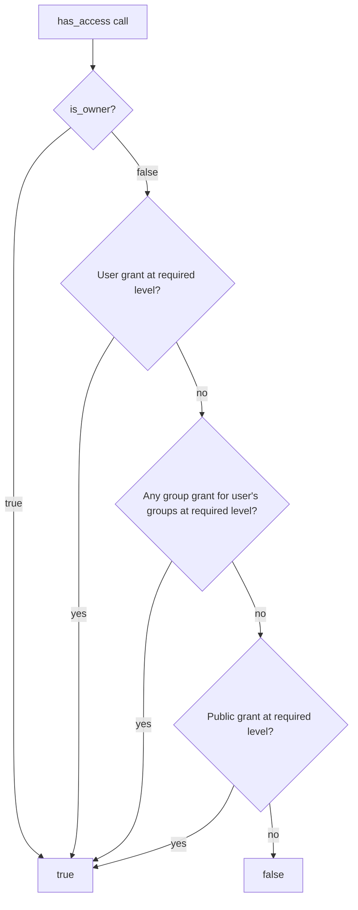

# Resource Sharing (Implementation)

**Version:** 1.0.0
**Status:** Stable
**Layer:** implementation
**Implements:** l1-resource-sharing.md

## Overview

Concrete implementation of the resource-sharing model: a single `access_grant` SQLite table shared by all resource types, Rust types for grant management, batch-load query patterns, group membership resolution, and the public utility functions used by every resource router.

## Related Specifications

- [l1-resource-sharing.md](l1-resource-sharing.md) - The model this spec implements.
- [l1-groups.md](l1-groups.md) - Group principal type resolved here.
- [l2-multi-user-auth.md](l2-multi-user-auth.md) - User identity and admin privilege used in grant management.
- [l2-core-library.md](l2-core-library.md) - Typed ID system; `res/` prefix for resource IDs, `grn/` for grant IDs.
- [l2-security.md](l2-security.md) - Audit log that records grant events.

## 1. Motivation

Each resource type (skills, tools, notes, channels, knowledge) needs sharing support. Without a shared table and shared query functions, each crate would implement its own join logic, creating maintenance burden and security inconsistency. One table + one crate (`access-grants`) keeps enforcement uniform.

## 2. Constraints & Assumptions

- SQLite is the storage backend; queries must be compatible with SQLite syntax (no `ARRAY_AGG`, no lateral joins without CTE fallback).
- Group membership lookups may be cached per request; the cache must be invalidated on membership change via the event bus.
- `access_grant` rows are always owned by the resource (deleted when the resource is deleted — ON DELETE CASCADE keyed on resource_id is NOT used because resource_id is an untyped `TEXT`; deletion is explicit).

## 3. Invariant Compliance (Layer 2)

| L1 Invariant | Implementation |
| --- | --- |
| RS-1 Uniform grant primitive | Single `access_grant` table. The `resource_type` column distinguishes entity kinds; no per-entity grant table. |
| RS-2 Principal types | `principal_type IN ('user', 'group', 'public')`. `public` has `principal_id = '*'`. |
| RS-3 Permission levels | `permission IN ('read', 'write')`. `write` implies `read` enforced at the query layer. |
| RS-4 Default private | Absence of any grant row = private. No "grant all" by default. |
| RS-5 Owner invariant | Owner check precedes grant check in all access resolution functions; owner always wins. |
| RS-6 Additive grants | Grant rows are additive; `UNION ALL` semantics — no precedence between user and group grants. |
| RS-7 Audit trail | Every insert/delete on `access_grant` emits an `AuditEvent::GrantChange` to the audit log. |
| RS-8 Applicable scope | `resource_type` is validated against a compile-time enumeration; out-of-scope types are rejected. |

## 4. Detailed Design

### 4.1 Schema

```sql
[REFERENCE]
CREATE TABLE access_grant (
    id             TEXT PRIMARY KEY,         -- grn/ prefixed ID
    resource_type  TEXT NOT NULL,            -- 'knowledge'|'skill'|'tool'|'note'|'channel'|'file'|'prompt'
    resource_id    TEXT NOT NULL,
    principal_type TEXT NOT NULL,            -- 'user'|'group'|'public'
    principal_id   TEXT NOT NULL,            -- user_id | group_id | '*'
    permission     TEXT NOT NULL,            -- 'read'|'write'
    created_at     INTEGER NOT NULL,         -- epoch nanoseconds

    UNIQUE (resource_type, resource_id, principal_type, principal_id, permission)
);

CREATE INDEX ix_access_grant_resource ON access_grant (resource_type, resource_id);
CREATE INDEX ix_access_grant_principal ON access_grant (principal_type, principal_id);
```

### 4.2 Rust Types

```rust
[REFERENCE]
/// Principal type discriminant — compile-time checked resource scope.
#[derive(Debug, Clone, PartialEq, Eq)]
pub enum ResourceKind {
    Knowledge,
    Skill,
    Tool,
    Note,
    Channel,
    File,
    Prompt,
}

#[derive(Debug, Clone, PartialEq, Eq)]
pub enum PrincipalKind {
    User,
    Group,
    Public,
}

#[derive(Debug, Clone, PartialEq, Eq, PartialOrd, Ord)]
pub enum Permission {
    Read,
    Write, // implies Read
}

pub struct AccessGrant {
    pub id            : GrantId,
    pub resource_type : ResourceKind,
    pub resource_id   : String,
    pub principal_type: PrincipalKind,
    pub principal_id  : String,       // user_id | group_id | "*"
    pub permission    : Permission,
    pub created_at    : i64,
}
```

### 4.3 Core Query Functions

```rust
[REFERENCE]
/// Check whether `user_id` holds at least `required` permission on resource.
/// Checks: owner flag → direct user grant → group grant → public grant.
pub async fn has_access(
    db          : &SqlitePool,
    user_id     : &str,
    is_owner    : bool,        // caller pre-computes ownership
    resource_type: ResourceKind,
    resource_id : &str,
    required    : Permission,
    groups      : &[GroupId],  // caller pre-fetches user's groups
) -> Result<bool>;

/// Load all grants for a single resource.
pub async fn get_grants(
    db           : &SqlitePool,
    resource_type: ResourceKind,
    resource_id  : &str,
) -> Result<Vec<AccessGrant>>;

/// Batch-load grants for N resources in a single query (avoids N+1).
pub async fn get_grants_batch(
    db           : &SqlitePool,
    resource_type: ResourceKind,
    resource_ids : &[&str],
) -> Result<HashMap<String, Vec<AccessGrant>>>;

/// Set the complete grant list for a resource (replace-all semantics):
/// delete all existing grants, insert the new set, emit audit events.
pub async fn set_grants(
    db           : &SqlitePool,
    resource_type: ResourceKind,
    resource_id  : &str,
    grants       : &[GrantInput],
) -> Result<()>;

/// Remove all grants for a deleted resource (call on resource deletion).
pub async fn delete_grants_for_resource(
    db           : &SqlitePool,
    resource_type: ResourceKind,
    resource_id  : &str,
) -> Result<()>;
```

### 4.4 Access Resolution Flow



`write` grants satisfy a `Read` required-level check (implied read).

### 4.5 Batch Loading Pattern

When listing resources (e.g., the skill list endpoint returns 30 items), load all grants in one query:

```sql
[REFERENCE]
SELECT * FROM access_grant
WHERE resource_type = ?
  AND resource_id IN (?, ?, ?, ...)
```

Then map each row into a `HashMap<resource_id, Vec<AccessGrant>>` for O(1) per-item enrichment. This is the primary pattern for eliminating N+1 in listing endpoints.

### 4.6 Group Membership Caching

Group membership is read once per request (or session) and passed to `has_access` as a pre-fetched slice:

```rust
[REFERENCE]
// At request start:
let user_groups: Vec<GroupId> = groups::get_user_groups(db, &user_id).await?;

// Passed into every has_access call during the request.
```

A short-lived in-process cache (TTL = 60 s) may be used; invalidated when `GroupMemberChanged` event is published.

### 4.7 Crate Layout

```plaintext
crates/
└── access-grants/
    ├── src/
    │   ├── lib.rs         // public API: has_access, get_grants, set_grants, …
    │   ├── model.rs       // AccessGrant, GrantInput, ResourceKind, Permission
    │   ├── db.rs          // SQLite query implementations
    │   ├── audit.rs       // AuditEvent emission on grant changes
    │   └── cache.rs       // group membership cache
    └── tests/
        └── access_tests.rs
```

## 5. Implementation Notes

1. `GrantId` uses the `grn/` prefix from the typed ID system (`l2-core-library.md`).
2. The `set_grants` function uses a transaction: delete old rows, insert new rows, emit audit events — all atomic.
3. `has_access` never queries the database for the owner check — the caller provides `is_owner` (derived from the resource's `owner_id` field already loaded).
4. Avoid per-row audit events on batch operations; emit a single `GrantsReplaced` event with before/after summary.

## 7. Drawbacks & Alternatives

- **One table per resource type:** per-type tables allow foreign-key CASCADE deletes and typed constraints, but fragment the enforcement logic. The single-table approach keeps the access-grant crate self-contained.
- **Embedded JSON grants per resource:** avoids the join but makes cross-resource queries and auditing expensive.

## Canonical References

| Alias | Path | Purpose |
| --- | --- | --- |
| `[L1]` | `.design/main/specifications/l1-resource-sharing.md` | The model this spec implements; invariants RS-1…RS-8. |
| `[CORE]` | `.design/main/specifications/l2-core-library.md` | Typed ID system: `grn/` prefix, branded type enforcement. |
| `[SEC]` | `.design/main/specifications/l2-security.md` | Audit log that receives `AuditEvent::GrantChange` entries. |
