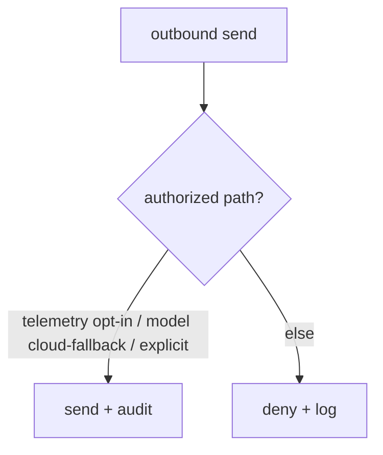

# Security

**Version:** 1.0.1
**Status:** Stable
**Layer:** implementation
**Implements:** l1-security.md

## Overview

The concrete security mechanisms: where secrets are stored and how they are excluded from VCS/backups/logs, the safe-default gitignore, the data-egress gate, the execution sandbox, and the audit log.

## Related Specifications

- [l1-security.md](l1-security.md) - The model this implements.
- [l2-filesystem-layout.md](l2-filesystem-layout.md) - `.env` location; state-tier boundary.
- [l2-technology-stack.md](l2-technology-stack.md) - Sandbox backends per OS.
- [l2-backup.md](l2-backup.md) - Backups exclude secrets.
- [l2-tool-security.md](l2-tool-security.md) - Two-layer runtime defense (skill scanner + tool guard) that enforces SEC-3/SEC-6 at the tool-call level.

## 1. Motivation

The model's guarantees need concrete enforcement points: file locations, ignore rules, redaction, a sandbox, and a gate on outbound data.

## 2. Constraints & Assumptions

- Secrets in `<state>/.env` (or OS keychain); `.env.example` is the only committed template.
- All outbound network sends pass a single gate.
- Agent shell/code runs in a sandbox by default.

## 3. Invariant Compliance (Layer 2 only)

| L1 Invariant | Implementation |
| --- | --- |
| SEC-1 Secret isolation | Secrets in `<state>/.env` / keychain; `.gitignore` excludes `.env*` (except example), state, cache, logs. |
| SEC-2 Safe defaults | Shipped `.gitignore` + config defaults; logging redacts known secret keys. |
| SEC-3 No exfiltration | A single egress gate; default-deny outbound except user-authorized paths. |
| SEC-4 Data vs telemetry | Telemetry payloads are built from a program-metrics allowlist; user content is never included. |
| SEC-5 No leakage | Output/log writers run secret redaction. |
| SEC-6 Sandboxed execution | Shell/code runs via a sandbox backend (e.g. OS-native isolation/containers); escalation is explicit and approved. |
| SEC-7 Auditable | Auth use, egress, and sandbox escalations append to an audit log. |

## 4. Detailed Design

### 4.1 Secret handling

Secrets read from `<state>/.env` or the OS keychain at runtime; never written to VCS, backups, exports, or logs. Redaction scrubs known secret patterns from any rendered output.

### 4.2 Egress gate



### 4.3 Execution sandbox

Agent-run commands/code execute in a sandbox with least privilege (no network unless granted, scoped filesystem); escalation requires an approval (consistent with the orchestration approval gate). Concrete backend per OS is from the stack. <!-- TBD: confirm default sandbox backend per OS (container vs OS-native) -->

### 4.4 SSRF protection

Server-Side Request Forgery is a risk whenever the agent fetches a user-supplied or externally-sourced URL. The SSRF guard runs on every outbound HTTP request before the egress gate permits it.

#### Scheme allowlist

Only `http` and `https` are permitted. Any other scheme (`file://`, `ftp://`, `gopher://`, `javascript://`, etc.) is rejected immediately with a `SsrfBlockedError` before a connection is attempted.

#### Link-local and loopback block

After URL parsing, the target IP is resolved and checked against blocked ranges:

```text
[REFERENCE]
BLOCKED_RANGES = [
  "127.0.0.0/8",      // IPv4 loopback
  "::1/128",           // IPv6 loopback
  "169.254.0.0/16",   // IPv4 link-local (AWS/GCP/Azure IMDS)
  "fe80::/10",         // IPv6 link-local
  "10.0.0.0/8",       // RFC-1918 private (optional, operator configurable)
  "172.16.0.0/12",    // RFC-1918 private (optional)
  "192.168.0.0/16",   // RFC-1918 private (optional)
]
```

Link-local blocking is mandatory and not operator-configurable — it prevents cloud-metadata endpoint access (`169.254.169.254`). Private IP blocking (RFC-1918 ranges) is enabled by default but can be disabled for deployments that legitimately reach internal services.

#### Injectable resolver

To support unit testing and isolated environments, the DNS resolver used by the SSRF guard is injectable:

```text
[REFERENCE]
SsrfGuard {
  resolver: Option<Arc<dyn DnsResolver>>,  // None = system resolver
  block_private_ips: bool,                 // default true
}
```

In tests, a mock resolver returns controlled IPs; the guard logic runs unchanged. In production, the system resolver is used.

#### Error type

```text
[REFERENCE]
SsrfBlockedError {
  url: String,
  reason: "disallowed_scheme" | "link_local" | "loopback" | "private_ip" | "dns_failure"
}
```

All SSRF blocks are logged at WARN and appended to the audit trail with `category: "ssrf_block"`.

### 4.5 Internal tool loopback

Some agent functionality is exposed as internal "tools" that the model can call via the tool-call protocol (e.g. memory recall, document lookup). These internal tools must not be reachable from any external HTTP request — they exist only inside the process.

#### Startup token

At process startup, a random loopback token is generated and held in memory:

```text
[REFERENCE]
INTERNAL_TOOL_TOKEN = secrets.token_hex(32)   // generated once at startup
```

The token is **never written to disk, never logged, never included in any response or export**. It exists only in the process memory for the lifetime of the process.

#### Binding and authentication

The internal tool handler binds to `127.0.0.1:<ephemeral_port>` only — it never listens on any external interface. Every request to the internal tool endpoint must present the `X-Internal-Token` header with the startup token. Requests missing or with an incorrect token receive `403 Forbidden` with no further information.

#### require_admin guard

Certain internal tools (e.g. privilege escalation, config write) additionally require that the session's `current_user` satisfies `require_admin`. The check order is:

1. Token validation (loopback token).
2. `require_admin` check (if the tool is admin-only).
3. Tool execution.

A valid token does not bypass `require_admin`; the two checks are independent.

## 5. Drawbacks & Alternatives

- **Redaction gaps:** unknown secret formats could slip; mitigated by allowlist-based telemetry and conservative defaults.
- **Alternative — no sandbox:** rejected; agents execute untrusted code.

## Canonical References

| Alias | Path | Purpose |
| --- | --- | --- |
| `[SECURITY]` | `.design/main/specifications/l1-security.md` | Invariants this implements |
| `[LAYOUT]` | `.design/main/specifications/l2-filesystem-layout.md` | Secret/state locations |
