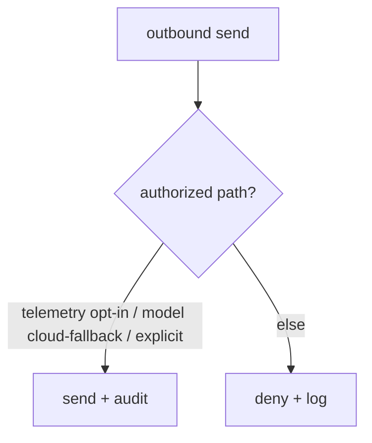

# Security

**Version:** 1.0.8
**Status:** Stable
**Layer:** implementation
**Implements:** l1-security.md

## Overview

The concrete security mechanisms: where secrets are stored and how they are excluded from VCS/backups/logs, the safe-default gitignore, the data-egress gate, the execution sandbox, and the audit log.

## Related Specifications

- [l1-security.md](l1-security.md) - The model this implements.
- [l2-filesystem-layout.md](l2-filesystem-layout.md) - `.env` location; state-tier boundary.
- [l2-technology-stack.md](l2-technology-stack.md) - Sandbox backends per OS.
- [l2-backup.md](l2-backup.md) - Backups exclude secrets.
- [l2-tool-security.md](l2-tool-security.md) - Two-layer runtime defense (skill scanner + tool guard) that enforces SEC-3/SEC-6 at the tool-call level.

## 1. Motivation

The model's guarantees need concrete enforcement points: file locations, ignore rules, redaction, a sandbox, and a gate on outbound data.

## 2. Constraints & Assumptions

- Secrets in `<state>/.env` (or OS keychain); `.env.example` is the only committed template.
- All outbound network sends pass a single gate.
- Agent shell/code runs in a sandbox by default.

## 3. Invariant Compliance (Layer 2 only)

| L1 Invariant | Implementation |
| --- | --- |
| SEC-1 Secret isolation | Secrets in `<state>/.env` / keychain; `.gitignore` excludes `.env*` (except example), state, cache, logs. |
| SEC-2 Safe defaults | Shipped `.gitignore` + config defaults; logging redacts known secret keys. |
| SEC-3 No exfiltration | A single egress gate; default-deny outbound except user-authorized paths. |
| SEC-4 Data vs telemetry | Telemetry payloads are built from a program-metrics allowlist; user content is never included. |
| SEC-5 No leakage | Output/log writers run secret redaction. |
| SEC-6 Sandboxed execution | Shell/code runs via a sandbox backend (e.g. OS-native isolation/containers); escalation is explicit and approved. |
| SEC-7 Auditable | Auth use, egress, and sandbox escalations append to an audit log. |

## 4. Detailed Design

### 4.1 Secret handling

Secrets read from `<state>/.env` or the OS keychain at runtime; never written to VCS, backups, exports, or logs. Redaction scrubs known secret patterns from any rendered output.

### 4.2 Egress gate



### 4.3 Execution sandbox

Agent-run commands/code execute in a sandbox with least privilege (no network unless granted, scoped filesystem); escalation requires an approval (consistent with the orchestration approval gate). Concrete backend per OS is from the stack. <!-- TBD: confirm default sandbox backend per OS (container vs OS-native) -->

### 4.4 SSRF protection

Server-Side Request Forgery is a risk whenever the agent fetches a user-supplied or externally-sourced URL. The SSRF guard runs on every outbound HTTP request before the egress gate permits it.

#### Scheme allowlist

Only `http` and `https` are permitted. Any other scheme (`file://`, `ftp://`, `gopher://`, `javascript://`, etc.) is rejected immediately with a `SsrfBlockedError` before a connection is attempted.

#### Link-local and loopback block

After URL parsing, the target IP is resolved and checked against blocked ranges:

```text
[REFERENCE]
BLOCKED_RANGES = [
  "127.0.0.0/8",      // IPv4 loopback
  "::1/128",           // IPv6 loopback
  "169.254.0.0/16",   // IPv4 link-local (AWS/GCP/Azure IMDS)
  "fe80::/10",         // IPv6 link-local
  "10.0.0.0/8",       // RFC-1918 private (optional, operator configurable)
  "172.16.0.0/12",    // RFC-1918 private (optional)
  "192.168.0.0/16",   // RFC-1918 private (optional)
]
```

Link-local blocking is mandatory and not operator-configurable — it prevents cloud-metadata endpoint access (`169.254.169.254`). Private IP blocking (RFC-1918 ranges) is enabled by default but can be disabled for deployments that legitimately reach internal services.

#### Injectable resolver

To support unit testing and isolated environments, the DNS resolver used by the SSRF guard is injectable:

```text
[REFERENCE]
SsrfGuard {
  resolver: Option<Arc<dyn DnsResolver>>,  // None = system resolver
  block_private_ips: bool,                 // default true
}
```

In tests, a mock resolver returns controlled IPs; the guard logic runs unchanged. In production, the system resolver is used.

#### Error type

```text
[REFERENCE]
SsrfBlockedError {
  url: String,
  reason: "disallowed_scheme" | "link_local" | "loopback" | "private_ip" | "dns_failure"
}
```

All SSRF blocks are logged at WARN and appended to the audit trail with `category: "ssrf_block"`.

### 4.5 Internal tool loopback

Some agent functionality is exposed as internal "tools" that the model can call via the tool-call protocol (e.g. memory recall, document lookup). These internal tools must not be reachable from any external HTTP request — they exist only inside the process.

#### Startup token

At process startup, a random loopback token is generated and held in memory:

```text
[REFERENCE]
INTERNAL_TOOL_TOKEN = secrets.token_hex(32)   // generated once at startup
```

The token is **never written to disk, never logged, never included in any response or export**. It exists only in the process memory for the lifetime of the process.

#### Binding and authentication

The internal tool handler binds to `127.0.0.1:<ephemeral_port>` only — it never listens on any external interface. Every request to the internal tool endpoint must present the `X-Internal-Token` header with the startup token. Requests missing or with an incorrect token receive `403 Forbidden` with no further information.

#### require_admin guard

Certain internal tools (e.g. privilege escalation, config write) additionally require that the session's `current_user` satisfies `require_admin`. The check order is:

1. Token validation (loopback token).
2. `require_admin` check (if the tool is admin-only).
3. Tool execution.

A valid token does not bypass `require_admin`; the two checks are independent.

### 4.6 Config integrity shields

Certain configuration files (routing policy, sandbox policy, workspace constitution files) must not be tampered with by the sandboxed agent or any process running inside the execution environment. The integrity shield mechanism enforces this through a three-state lock model backed by OS-native write protection and a SHA-256 content seal.

#### Shield states

```text
[REFERENCE]
ShieldsMode: "mutable_default" | "locked" | "temporarily_unlocked"

// "mutable_default"      — initial state; files are writable by the host process.
// "locked"               — shields are up; files are read-only + sealed.
// "temporarily_unlocked" — shields are down for a bounded time window; auto-restore pending.
```

#### Shields up (locking)

When shields are raised on a file:

1. Write the file contents (host-side, before locking).
2. Set file permission to read-only (`chmod 444` on Unix; read-only attribute on Windows).
3. Apply OS-native immutability (`chattr +i` on Linux; `chflags uchg` on macOS; read-only + system attribute on Windows) to prevent deletion or overwrite even by elevated privilege without first removing the flag.
4. Compute and store a SHA-256 hex digest of the file content as the content seal.

```text
[REFERENCE]
ShieldsState {
  shields_down:         bool?,                    // true while temporarily unlocked
  shields_down_at:      Timestamp?,
  shields_down_timeout: u64?,                     // seconds until auto-restore; 0 = manual only
  shields_down_reason:  String?,
  chattr_applied:       bool?,                    // whether OS immutability flag was successfully set
  file_hashes:          Map<String, String>?,     // path → SHA-256 hex digest (the content seal)
  updated_at:           Timestamp?,
}
```

#### Shields down (temporary unlock)

Shields may be lowered temporarily to allow a trusted host-side update (e.g. config rotation):

1. Remove the OS immutability flag.
2. Restore write permission.
3. If `shields_down_timeout > 0`, start a timer; on expiry, automatically re-raise shields.
4. Re-raising recomputes the SHA-256 seal from the updated file content.

**Security invariant:** the sandboxed agent process cannot lower or raise its own shields. Shield control is exclusively a host-process operation; the agent has no elevated privilege to modify OS immutability flags. This prevents an agent from using a shield-manipulation exploit to tamper with its own policy files.

#### Drift detection

When shields are verified (by the Doctor health check or on startup), each sealed file's current SHA-256 is compared to the stored seal. A mismatch indicates content drift — the file was modified while supposedly locked:

```text
[REFERENCE]
HASH_ISSUE_PATTERNS = [
  "content drifted",              // seal mismatch: stored hash ≠ current hash
  "sha256sum failed",             // hash computation error
  "sha256sum output unparsable",  // unexpected output format from hash tool
  "no seal recorded",             // file is locked but has no stored hash
]

isHashVerificationIssue(msg: String) -> bool:
  HASH_ISSUE_PATTERNS.any(p => msg.contains(p))
```

A drift event is logged at ERROR and included in the Doctor health report with severity `Critical`. The host process is notified; the recommended recovery is to restore the file from backup (see `l2-backup.md`) and re-raise shields.

### 4.7 Credential storage modes

API keys, session tokens, and OAuth credentials use a configurable storage backend rather than a single fixed location.

```text
[REFERENCE]
AuthCredentialsStoreMode {
  File      — encrypted file in <state>/.credentials/; survives process restarts;
               key material on disk (less secure, more portable)
  Keyring   — OS keychain (Keychain on macOS, Secret Service on Linux,
               Credential Manager on Windows); survives restarts; requires OS keychain
  Auto      — prefer Keyring; fall back to File when the OS keychain is unavailable (default)
  Ephemeral — held in process memory only; lost on process exit; use for sandboxed or
               temporary sessions where persisting credentials is undesirable
}

AuthKeyringBackendKind {
  Direct  — credential stored directly in the OS keyring entry
  Secrets — credential encrypted in a local file; encryption key alone is in the OS keyring
             (default on Windows — DPAPI does not provide generic cross-session secrets entries)
}
```

`OAuthCredentialsStoreMode` (`Auto | File | Keyring`) applies to MCP/OAuth refresh tokens. It intentionally excludes `Ephemeral` because OAuth tokens must survive process restarts to avoid forcing re-authentication on every launch.

#### Security ordering

`Keyring` is the most secure option (key material never touches disk in plaintext). `Secrets` is the Windows default because DPAPI's generic keyring does not offer the same cross-session durability as macOS Keychain. `Ephemeral` is the most constrained — a sandboxed agent running in this mode cannot exfiltrate credentials across session boundaries, limiting the blast radius of a credential theft attack.

### 4.8 Workspace trust model

When Cronus opens a project directory for the first time, it cannot know whether that directory's `.cronus/settings.json` and hook definitions are safe to execute. The workspace trust model provides a first-run gate that presents the user with a discovery summary before loading any project-level configuration.

#### Trust registry

Workspace trust decisions are recorded in a per-user registry file that persists across sessions:

```text
[REFERENCE]
<state>/trusted_workspaces.json

Entry {
  path:       String,        // canonical absolute path of the trusted folder
  trust_level: TrustLevel,   // see below
  granted_at: Timestamp,
  hooks_hash: Map<String, String>,  // hook-file-path → SHA-256 at time of trust grant
                                    // (same mechanism as l2-plugin-hooks.md §4.13)
}

TrustLevel: "trusted" | "trusted-parent" | "denied"
  // "trusted"        — this specific directory is trusted.
  // "trusted-parent" — any subdirectory of this path is trusted (blanket grant).
  // "denied"         — this directory is explicitly untrusted; run in safe mode.
```

Trust decisions apply at directory granularity. A `trusted-parent` entry at `/projects/` automatically trusts `/projects/foo/`, `/projects/bar/`, etc. Lookup walks from the project root upward, first match wins.

#### Discovery phase

Before presenting the trust dialog, the runtime performs a read-only **discovery scan** of the project directory. The scan reports what would be loaded if the user grants trust:

```text
[REFERENCE]
DiscoveryScan {
  commands:         Vec<String>,    // .cronus/commands/**/*.toml — custom command files found
  mcp_servers:      Vec<String>,    // MCP server entries in .cronus/settings.json
  hooks:            Vec<HookEntry>, // hook definitions in hooks/hooks.json
  skills:           Vec<String>,    // skill names found in .cronus/skills/
  settings_summary: Vec<String>,    // non-default settings keys in .cronus/settings.json
  security_warnings: Vec<String>,   // flagged dangerous settings (see below)
  discovery_errors:  Vec<String>,   // parse errors encountered during scan
}

HookEntry { event: String, type: "command" | "prompt" | "agent", command_preview: String? }
```

The scan is entirely read-only; no code from the project directory is executed during discovery.

#### Security warnings

The discovery scan flags settings that elevate risk:

```text
[REFERENCE]
Security warnings (emitted when .cronus/settings.json contains):
  approval_mode: "yolo"          → "Auto-approve all tool calls is enabled"
  sandbox.enabled: false         → "Tool sandboxing is disabled"
  hooks with async: true         → "Async (non-blocking) hooks are present — they run without awaiting approval"
  any hook command containing environment variable expansion not from the approved set
                                 → "Hook command references untrusted env vars"
```

Any security warning must be displayed prominently in the trust dialog before the user can grant trust.

#### Trust dialog (interactive)

When no trust entry matches the current directory, the runtime presents a structured dialog:

```text
[REFERENCE]
Trust dialog flow:
  1. Display DiscoveryScan summary.
  2. Display security_warnings (if any) in highlighted WARNING blocks.
  3. Display discovery_errors (if any).
  4. Present exactly three choices:
       [T] Trust this folder: grants TrustLevel "trusted" for <project_root> only.
       [P] Trust parent folder: grants TrustLevel "trusted-parent" for <project_root>/.
       [D] Don't trust (safe mode): records TrustLevel "denied"; project settings are ignored.
  5. Write the chosen entry to trusted_workspaces.json.
  6. Proceed according to the outcome (§ safe mode below).
```

Non-interactive mode (headless / CI): if `CRONUS_TRUST_MODE=auto-trust` env var is set, the runtime grants `"trusted"` silently and logs the grant. If `CRONUS_TRUST_MODE=deny`, it grants `"denied"` silently. Any other value or absence → prompt is required; headless mode fails with a clear error if a TTY is unavailable.

#### Safe mode (denied workspace)

When a workspace is denied, the runtime loads only user-scope and system-scope configuration. Project-level settings are completely ignored:

```text
[REFERENCE]
In safe mode:
  - .cronus/settings.json is NOT loaded (workspace settings ignored).
  - hooks/hooks.json is NOT loaded (project hooks do not fire).
  - .cronus/commands/ are NOT loaded (project commands unavailable).
  - .cronus/skills/ are NOT loaded (project skills unavailable).
  - MCP servers defined in .cronus/settings.json are NOT connected.
  - User-scope settings (~/<state>/settings.json) ARE loaded normally.
  - A persistent banner "⚠ Untrusted workspace — project settings ignored" is shown.
```

Safe mode does not prevent the user from running the agent; it prevents untrusted project configuration from influencing execution.

#### Hook fingerprint rotation

When a previously trusted hook file is modified (its SHA-256 changes relative to `hooks_hash` in the registry entry), the hook is treated as **new and untrusted**. The user is prompted once to review and re-approve the changed hook:

```text
[REFERENCE]
Hook fingerprint check (on each session start for trusted workspaces):
  for hook in discovered_hooks:
    stored_hash = registry.hooks_hash.get(hook.path)
    current_hash = sha256(read(hook.path))
    if stored_hash == None:
      // new hook added since trust was granted → prompt to approve
    elif stored_hash != current_hash:
      // existing hook modified (e.g. via git pull) → prompt to re-approve
    else:
      // unchanged → execute normally

Re-approval dialog shows: old command preview, new command preview, diff if text-comparable.
Outcome: "approve" updates hooks_hash entry; "deny" disables this hook for the session (not globally).
```

This guards against supply-chain attacks where a malicious `git pull` replaces a trusted hook with a harmful command.

### 4.9 Telemetry data contract

[ADDED] Cronus may collect anonymous usage statistics to inform which features and
integrations receive the most development attention. The contract below defines the
exact collection boundary; any field not listed here is NEVER collected.

#### Collection scope (allowlist)

Every telemetry payload carries this envelope (no exceptions):

```text
[REFERENCE]
TelemetryEnvelope {
  machine_id:        String,   // random UUID, minted on first send, stored in <state>/telemetry.json
  cronus_version:    String,
  os:                String,   // "darwin" | "windows" | "linux" (platform identifier only)
  arch:              String,   // "arm64" | "x64" (CPU architecture only)
  ci:                bool,     // whether the CI env var was set
  schema_version:    u8,       // bumped when the allowlist changes
}
```

And exactly one event from this set:

```text
[REFERENCE]
TelemetryEvent:
  install {
    agents: Vec<String>,   // agent IDs configured (e.g. ["claude", "cursor"])
    scope:  "global" | "local",
    kind:   "fresh" | "upgrade" | "rerun",
  }
  index_complete {
    languages:    Vec<String>,    // language names present (e.g. ["rust", "typescript"])
    file_bucket:  FileCountBucket,  // see bucketing below
    duration_bucket: DurationBucket,
  }
  usage_rollup {
    // one entry per tool per day — aggregated locally, not a per-call stream
    tool_name:  String,   // e.g. "cronus_recall", "cronus_context"
    call_count: u32,
    error_count: u32,
    agent_name:  Option<String>,   // from MCP handshake (e.g. "Claude Code 2.1")
    date:        String,           // "YYYY-MM-DD" (UTC)
  }
  uninstall {
    agents: Vec<String>,
  }

FileCountBucket: "<100" | "100-1k" | "1k-10k" | "10k+"
DurationBucket:  "<10s" | "10-60s" | "1-5m" | "5m+"
```

Bucketing replaces exact counts and durations — the endpoint receives a category, not a
number. This makes it structurally impossible to derive precise workspace size from telemetry.

#### What is NEVER collected (hard constraints)

```text
[REFERENCE]
Never collected — enforced at the ingest endpoint (any unlisted field is DROPPED):
  × Source code (any fragment)
  × File paths, file names, directory names
  × Repository names or URLs
  × Symbol names, function names, query strings
  × Error messages containing user content
  × IP addresses (not read, not logged, IP discarding enabled at the analytics backend)
  × Username, hostname, email, environment variables
  × Any personally identifying information
```

The machine ID is a **random UUID** stored in `<state>/telemetry.json`. It is derived from
nothing — not hardware fingerprint, not username, not any OS identifier. Deleting the file
(or running `cronus telemetry off` then `on`) creates a new UUID with no link to the old
one.

#### Transmission model

```text
[REFERENCE]
Aggregation:   events are accumulated as in-memory counters during a session; they are
               merged into daily totals in <state>/telemetry.json at session end.
               Nothing is sent in real time, per-call, or per-turn.

Buffering:     the local buffer is capped at TELEMETRY_BUFFER_MAX_BYTES.
               Writes that would exceed the cap drop the oldest entry.

Sending:       fires once at session start (flush-on-open), fire-and-forget with a
               short timeout. Failures are silently discarded — telemetry never
               slows a session down, never logs errors, never retries in a loop.

Constants:
  TELEMETRY_BUFFER_MAX_BYTES = 262_144   // 256 KB local buffer cap
  TELEMETRY_SEND_TIMEOUT_MS  =   3_000   // network timeout; fire-and-forget
```

#### Opt-out

```text
[REFERENCE]
Priority order (highest wins):
  1. DO_NOT_TRACK=1 env var (cross-tool standard; always honored)
  2. CRONUS_TELEMETRY=0 env var (per-shell override)
  3. telemetry.enabled: false in <state>/settings.json (persisted choice)
  4. Default: enabled (with one-time notice on first send if the interactive
     installer was not run)

Opt-out is stored in <state>/telemetry.json { enabled: false }.
Off means off: when disabled, Cronus records nothing, opens no connection,
and sends no "opted-out" ping.
```

The interactive installer (`cronus install`) presents an explicit opt-in toggle with a
visible default and does not re-ask on subsequent runs. Silent mode (`--non-interactive`)
inherits the stored preference or defaults to disabled.

#### SEC-4 compliance

This design enforces SEC-4 (data vs telemetry) by construction: the telemetry payload is
built from the allowlist above; user content cannot appear because no collection path
touches it. The endpoint validates against the allowlist server-side — any unlisted field
is dropped rather than stored, providing defense-in-depth.

### 4.10 Pre-parse safety guards

#### File size cap (memory-bomb prevention)

Any data file loaded for graph construction or analysis must be size-checked before
parsing. Passing a multi-GiB file directly to a JSON parser can exhaust process memory
before a single node is read.

```text
[REFERENCE]
DATA_FILE_SIZE_CAP_BYTES = 512 * 1024 * 1024  // 512 MiB default

Configurable via environment variable with optional unit suffix:
  CRONUS_MAX_DATA_BYTES=<N>      // plain bytes
  CRONUS_MAX_DATA_BYTES=<N>MB    // mebibytes (N × 1 048 576)
  CRONUS_MAX_DATA_BYTES=<N>GB    // gibibytes (N × 1 073 741 824)

Enforcement:
  1. Before any parse: stat the file, compare st_size to cap.
  2. On breach: raise SizeCapExceeded { path, size_bytes, cap_bytes } — never
     attempt to read, never log partial content.
  3. On stat error: allow parse to proceed (caller's path/existence checks surface
     clearer errors in that case).
```

#### Path containment guard

Paths for index and graph output files must resolve inside the designated output
directory. Symlinks and `..` traversals are resolved before comparison.

```text
[REFERENCE]
validate_output_path(path, base_dir):
  resolved = path.resolve()
  base     = base_dir.resolve()
  if not base.exists():
    raise OutputDirMissing { base }   // index not yet built
  if not resolved.is_relative_to(base):
    raise PathEscapesBase { path, base }
  return resolved
```

#### Metadata recursive sanitization

Graph node metadata accepted from external sources must be sanitized before storage
or export to prevent stored-XSS in rendered graph views.

```text
[REFERENCE]
sanitize_metadata(value):
  string  → strip_control_chars(U+0000–U+001F, U+007F)
            + html_escape(& < > " ')
            + cap(512 chars)
  list    → sanitize_metadata(each item), cap(50 items)
  dict    → sanitize_metadata(key) + sanitize_metadata(value), drop empty keys
  int / float / bool / null → pass through unchanged
  other   → coerce to string, then apply string rule
```

#### DNS rebind TOCTOU prevention

Standard SSRF guards validate a URL's resolved IP, but a naive validate-then-connect
sequence allows DNS rebinding: the hostname resolves to a public IP during validation
and a private IP (e.g., `169.254.169.254`) during the actual TCP connect.

Prevention: resolve DNS exactly once, validate the resulting IP, then connect directly
to that validated IP — never re-resolve the hostname at connect time.

```text
[REFERENCE]
resolve_and_connect(host, port, server_name):
  addrs = dns.resolve(host, port)              // single resolution only
  for addr in addrs:
    if is_private_or_reserved(addr.ip):
      raise SSRFBlocked { host, addr.ip }
  // Connect to the validated IP, not to `host`
  // (connecting to `host` would trigger a second DNS lookup)
  conn = tcp.connect(addr.ip, port)
  // TLS handshake uses original hostname for SNI + certificate validation
  if tls_required:
    conn = tls.wrap(conn, server_hostname=server_name)
  return conn

redirect_handler: every redirect target re-validated through the same pipeline.
                  Prevents open-redirect SSRF (http→file://, http→internal).
```

### 4.11 Credential finding protocol

When an audit workflow (§4.5 of `l2-quality-pipeline.md`) or any agent discovers a credential in the repository, the finding must be recorded and remediated following a strict protocol. The constraint is asymmetric: **a secret committed to git history is burned even after deletion** — the commit containing the secret remains accessible via `git log` and any clones made before deletion. Remediation therefore requires rotation as the primary action, not just removal.

#### Finding format for credentials

```text
[REFERENCE]
Credential findings MUST:
  - Name the credential type: "Stripe live key", "AWS_SECRET_ACCESS_KEY", "private RSA key", etc.
  - Reference the location: file path + line number (e.g. `config/secrets.ts:12`).
  - NEVER reproduce the actual secret value — not in findings, plans, issue bodies, logs, or any other artifact.

Credential findings MUST NOT:
  - Include the token/key/password string itself in any form (redacted, partial, or encoded).
  - Include reproduction steps that would allow a reader to locate the credential from the finding alone
    beyond what a `git log --all -S <hint>` would trivially reveal.
```

#### Remediation sketch (mandatory in every credential finding's fix sketch)

```text
[REFERENCE]
Remediation order:
  1. Rotate first — invalidate the exposed credential at the provider before removing it from code.
     A removed but un-rotated credential is still valid in every prior commit and any clone.
  2. Remove from code — replace with a reference to a secret store or environment variable.
  3. Purge from git history — use git filter-repo (preferred) or BFG Repo-Cleaner.
     Inform all contributors: their local clones still contain the credential until they re-clone or
     run git fetch --force.
  4. Notify downstream — if the credential had production access, treat it as compromised and initiate
     the relevant incident response for any systems it protected.
  5. Add a pre-commit hook (or CI check) that prevents future secret commits:
     e.g. gitleaks, git-secrets, or trufflehog in pre-push mode.

The fix sketch in the plan must include steps 1 and 2 at minimum.
Step 1 (rotate) must precede all other steps, even if the credential appears internal or low-risk.
```

#### Agent behavior on discovery

If an agent encounters a credential value during file reads (not an audit finding — e.g. incidental discovery while reading config files):

```text
[REFERENCE]
- Do NOT include the value in any response, log, or tool output.
- Do NOT pass the value as an argument to any tool.
- Stop the current operation if it would cause the value to be propagated.
- Surface a security note to the user: credential type + file:line only.
  Example: "Found what appears to be a live API key at config/secrets.ts:12 — recommend rotation."
```

### 4.12 API Key Redaction Pattern

Sensitive credentials stored in settings structures are wrapped in a newtype whose `Debug` implementation prints only key names, never values. This prevents API keys from appearing in logs, panic traces, and debug output even when the containing struct is `{:?}` formatted.

```text
[REFERENCE]
struct SecretMap(HashMap<String, String>);

impl fmt::Debug for SecretMap {
    fn fmt(&self, f: &mut fmt::Formatter<'_>) -> fmt::Result {
        let redacted: HashMap<&String, &str> =
            self.0.keys().map(|k| (k, "[REDACTED]")).collect();
        write!(f, "{:?}", redacted)
    }
}
// Output: SecretMap { "openai": "[REDACTED]", "anthropic": "[REDACTED]" }
// Key names are visible for diagnostics; values are never emitted.
```

Apply the pattern to every `HashMap<provider_id, secret>` field in settings. Do NOT store plaintext secrets in any struct that derives or implements `Display` / `Debug` without the redaction wrapper.

#### Platform feature availability guard

Some platform-specific APIs advertise availability but abort the process when called on early OS versions (e.g., calling a framework method that shipped in a later OS release). Guard such features by deferring the capability check to the first actual call site, not at startup:

```text
[REFERENCE]
Availability guard pattern:
  // Check at the call site, not at process start
  if os_version() < FEATURE_MINIMUM_VERSION {
      return Err("Feature requires OS X.Y or later");
  }
  call_platform_api()

Rationale: calling platform APIs at startup on an incompatible OS version can emit
  SIGABRT before any error handler is in place, producing a silent crash-at-launch.
  Deferring the check to first use allows the rest of the app to start normally and
  surface a clean error message to the user.
```

## 5. Drawbacks & Alternatives

- **Redaction gaps:** unknown secret formats could slip; mitigated by allowlist-based telemetry and conservative defaults.
- **Alternative — no sandbox:** rejected; agents execute untrusted code.
- **Workspace trust adds friction on first use:** mitigated by the `trusted-parent` option (grant once per projects directory) and the `CRONUS_TRUST_MODE=auto-trust` env var for CI environments.
- **Hook fingerprint rotation prompts on every `git pull`:** intentional — silent re-trust of changed hooks would defeat the guard. Teams that frequently update hooks should commit `hooks_hash` values to their project config so approvals propagate via version control.

## Canonical References

| Alias | Path | Purpose |
| --- | --- | --- |
| `[SECURITY]` | `.design/main/specifications/l1-security.md` | Invariants this implements |
| `[LAYOUT]` | `.design/main/specifications/l2-filesystem-layout.md` | Secret/state locations |
