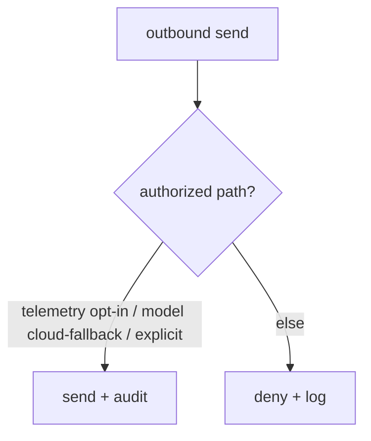

# Security

**Version:** 1.0.3
**Status:** Stable
**Layer:** implementation
**Implements:** l1-security.md

## Overview

The concrete security mechanisms: where secrets are stored and how they are excluded from VCS/backups/logs, the safe-default gitignore, the data-egress gate, the execution sandbox, and the audit log.

## Related Specifications

- [l1-security.md](l1-security.md) - The model this implements.
- [l2-filesystem-layout.md](l2-filesystem-layout.md) - `.env` location; state-tier boundary.
- [l2-technology-stack.md](l2-technology-stack.md) - Sandbox backends per OS.
- [l2-backup.md](l2-backup.md) - Backups exclude secrets.
- [l2-tool-security.md](l2-tool-security.md) - Two-layer runtime defense (skill scanner + tool guard) that enforces SEC-3/SEC-6 at the tool-call level.

## 1. Motivation

The model's guarantees need concrete enforcement points: file locations, ignore rules, redaction, a sandbox, and a gate on outbound data.

## 2. Constraints & Assumptions

- Secrets in `<state>/.env` (or OS keychain); `.env.example` is the only committed template.
- All outbound network sends pass a single gate.
- Agent shell/code runs in a sandbox by default.

## 3. Invariant Compliance (Layer 2 only)

| L1 Invariant | Implementation |
| --- | --- |
| SEC-1 Secret isolation | Secrets in `<state>/.env` / keychain; `.gitignore` excludes `.env*` (except example), state, cache, logs. |
| SEC-2 Safe defaults | Shipped `.gitignore` + config defaults; logging redacts known secret keys. |
| SEC-3 No exfiltration | A single egress gate; default-deny outbound except user-authorized paths. |
| SEC-4 Data vs telemetry | Telemetry payloads are built from a program-metrics allowlist; user content is never included. |
| SEC-5 No leakage | Output/log writers run secret redaction. |
| SEC-6 Sandboxed execution | Shell/code runs via a sandbox backend (e.g. OS-native isolation/containers); escalation is explicit and approved. |
| SEC-7 Auditable | Auth use, egress, and sandbox escalations append to an audit log. |

## 4. Detailed Design

### 4.1 Secret handling

Secrets read from `<state>/.env` or the OS keychain at runtime; never written to VCS, backups, exports, or logs. Redaction scrubs known secret patterns from any rendered output.

### 4.2 Egress gate



### 4.3 Execution sandbox

Agent-run commands/code execute in a sandbox with least privilege (no network unless granted, scoped filesystem); escalation requires an approval (consistent with the orchestration approval gate). Concrete backend per OS is from the stack. <!-- TBD: confirm default sandbox backend per OS (container vs OS-native) -->

### 4.4 SSRF protection

Server-Side Request Forgery is a risk whenever the agent fetches a user-supplied or externally-sourced URL. The SSRF guard runs on every outbound HTTP request before the egress gate permits it.

#### Scheme allowlist

Only `http` and `https` are permitted. Any other scheme (`file://`, `ftp://`, `gopher://`, `javascript://`, etc.) is rejected immediately with a `SsrfBlockedError` before a connection is attempted.

#### Link-local and loopback block

After URL parsing, the target IP is resolved and checked against blocked ranges:

```text
[REFERENCE]
BLOCKED_RANGES = [
  "127.0.0.0/8",      // IPv4 loopback
  "::1/128",           // IPv6 loopback
  "169.254.0.0/16",   // IPv4 link-local (AWS/GCP/Azure IMDS)
  "fe80::/10",         // IPv6 link-local
  "10.0.0.0/8",       // RFC-1918 private (optional, operator configurable)
  "172.16.0.0/12",    // RFC-1918 private (optional)
  "192.168.0.0/16",   // RFC-1918 private (optional)
]
```

Link-local blocking is mandatory and not operator-configurable — it prevents cloud-metadata endpoint access (`169.254.169.254`). Private IP blocking (RFC-1918 ranges) is enabled by default but can be disabled for deployments that legitimately reach internal services.

#### Injectable resolver

To support unit testing and isolated environments, the DNS resolver used by the SSRF guard is injectable:

```text
[REFERENCE]
SsrfGuard {
  resolver: Option<Arc<dyn DnsResolver>>,  // None = system resolver
  block_private_ips: bool,                 // default true
}
```

In tests, a mock resolver returns controlled IPs; the guard logic runs unchanged. In production, the system resolver is used.

#### Error type

```text
[REFERENCE]
SsrfBlockedError {
  url: String,
  reason: "disallowed_scheme" | "link_local" | "loopback" | "private_ip" | "dns_failure"
}
```

All SSRF blocks are logged at WARN and appended to the audit trail with `category: "ssrf_block"`.

### 4.5 Internal tool loopback

Some agent functionality is exposed as internal "tools" that the model can call via the tool-call protocol (e.g. memory recall, document lookup). These internal tools must not be reachable from any external HTTP request — they exist only inside the process.

#### Startup token

At process startup, a random loopback token is generated and held in memory:

```text
[REFERENCE]
INTERNAL_TOOL_TOKEN = secrets.token_hex(32)   // generated once at startup
```

The token is **never written to disk, never logged, never included in any response or export**. It exists only in the process memory for the lifetime of the process.

#### Binding and authentication

The internal tool handler binds to `127.0.0.1:<ephemeral_port>` only — it never listens on any external interface. Every request to the internal tool endpoint must present the `X-Internal-Token` header with the startup token. Requests missing or with an incorrect token receive `403 Forbidden` with no further information.

#### require_admin guard

Certain internal tools (e.g. privilege escalation, config write) additionally require that the session's `current_user` satisfies `require_admin`. The check order is:

1. Token validation (loopback token).
2. `require_admin` check (if the tool is admin-only).
3. Tool execution.

A valid token does not bypass `require_admin`; the two checks are independent.

### 4.6 Config integrity shields

Certain configuration files (routing policy, sandbox policy, workspace constitution files) must not be tampered with by the sandboxed agent or any process running inside the execution environment. The integrity shield mechanism enforces this through a three-state lock model backed by OS-native write protection and a SHA-256 content seal.

#### Shield states

```text
[REFERENCE]
ShieldsMode: "mutable_default" | "locked" | "temporarily_unlocked"

// "mutable_default"      — initial state; files are writable by the host process.
// "locked"               — shields are up; files are read-only + sealed.
// "temporarily_unlocked" — shields are down for a bounded time window; auto-restore pending.
```

#### Shields up (locking)

When shields are raised on a file:

1. Write the file contents (host-side, before locking).
2. Set file permission to read-only (`chmod 444` on Unix; read-only attribute on Windows).
3. Apply OS-native immutability (`chattr +i` on Linux; `chflags uchg` on macOS; read-only + system attribute on Windows) to prevent deletion or overwrite even by elevated privilege without first removing the flag.
4. Compute and store a SHA-256 hex digest of the file content as the content seal.

```text
[REFERENCE]
ShieldsState {
  shields_down:         bool?,                    // true while temporarily unlocked
  shields_down_at:      Timestamp?,
  shields_down_timeout: u64?,                     // seconds until auto-restore; 0 = manual only
  shields_down_reason:  String?,
  chattr_applied:       bool?,                    // whether OS immutability flag was successfully set
  file_hashes:          Map<String, String>?,     // path → SHA-256 hex digest (the content seal)
  updated_at:           Timestamp?,
}
```

#### Shields down (temporary unlock)

Shields may be lowered temporarily to allow a trusted host-side update (e.g. config rotation):

1. Remove the OS immutability flag.
2. Restore write permission.
3. If `shields_down_timeout > 0`, start a timer; on expiry, automatically re-raise shields.
4. Re-raising recomputes the SHA-256 seal from the updated file content.

**Security invariant:** the sandboxed agent process cannot lower or raise its own shields. Shield control is exclusively a host-process operation; the agent has no elevated privilege to modify OS immutability flags. This prevents an agent from using a shield-manipulation exploit to tamper with its own policy files.

#### Drift detection

When shields are verified (by the Doctor health check or on startup), each sealed file's current SHA-256 is compared to the stored seal. A mismatch indicates content drift — the file was modified while supposedly locked:

```text
[REFERENCE]
HASH_ISSUE_PATTERNS = [
  "content drifted",              // seal mismatch: stored hash ≠ current hash
  "sha256sum failed",             // hash computation error
  "sha256sum output unparsable",  // unexpected output format from hash tool
  "no seal recorded",             // file is locked but has no stored hash
]

isHashVerificationIssue(msg: String) -> bool:
  HASH_ISSUE_PATTERNS.any(p => msg.contains(p))
```

A drift event is logged at ERROR and included in the Doctor health report with severity `Critical`. The host process is notified; the recommended recovery is to restore the file from backup (see `l2-backup.md`) and re-raise shields.

### 4.7 Credential storage modes

API keys, session tokens, and OAuth credentials use a configurable storage backend rather than a single fixed location.

```text
[REFERENCE]
AuthCredentialsStoreMode {
  File      — encrypted file in <state>/.credentials/; survives process restarts;
               key material on disk (less secure, more portable)
  Keyring   — OS keychain (Keychain on macOS, Secret Service on Linux,
               Credential Manager on Windows); survives restarts; requires OS keychain
  Auto      — prefer Keyring; fall back to File when the OS keychain is unavailable (default)
  Ephemeral — held in process memory only; lost on process exit; use for sandboxed or
               temporary sessions where persisting credentials is undesirable
}

AuthKeyringBackendKind {
  Direct  — credential stored directly in the OS keyring entry
  Secrets — credential encrypted in a local file; encryption key alone is in the OS keyring
             (default on Windows — DPAPI does not provide generic cross-session secrets entries)
}
```

`OAuthCredentialsStoreMode` (`Auto | File | Keyring`) applies to MCP/OAuth refresh tokens. It intentionally excludes `Ephemeral` because OAuth tokens must survive process restarts to avoid forcing re-authentication on every launch.

#### Security ordering

`Keyring` is the most secure option (key material never touches disk in plaintext). `Secrets` is the Windows default because DPAPI's generic keyring does not offer the same cross-session durability as macOS Keychain. `Ephemeral` is the most constrained — a sandboxed agent running in this mode cannot exfiltrate credentials across session boundaries, limiting the blast radius of a credential theft attack.

## 5. Drawbacks & Alternatives

- **Redaction gaps:** unknown secret formats could slip; mitigated by allowlist-based telemetry and conservative defaults.
- **Alternative — no sandbox:** rejected; agents execute untrusted code.

## Canonical References

| Alias | Path | Purpose |
| --- | --- | --- |
| `[SECURITY]` | `.design/main/specifications/l1-security.md` | Invariants this implements |
| `[LAYOUT]` | `.design/main/specifications/l2-filesystem-layout.md` | Secret/state locations |
