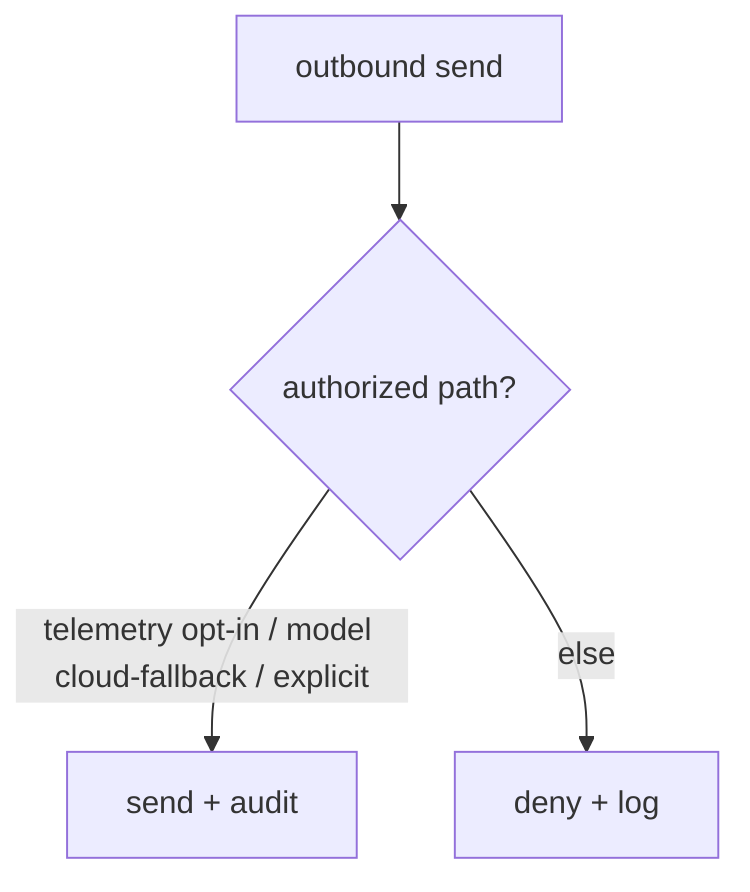

# Security

**Version:** 1.0.0
**Status:** Stable
**Layer:** implementation
**Implements:** l1-security.md

## Overview

The concrete security mechanisms: where secrets are stored and how they are excluded from VCS/backups/logs, the safe-default gitignore, the data-egress gate, the execution sandbox, and the audit log.

## Related Specifications

- [l1-security.md](l1-security.md) - The model this implements.
- [l2-filesystem-layout.md](l2-filesystem-layout.md) - `.env` location; state-tier boundary.
- [l2-technology-stack.md](l2-technology-stack.md) - Sandbox backends per OS.
- [l2-backup.md](l2-backup.md) - Backups exclude secrets.
- [l2-tool-security.md](l2-tool-security.md) - Two-layer runtime defense (skill scanner + tool guard) that enforces SEC-3/SEC-6 at the tool-call level.

## 1. Motivation

The model's guarantees need concrete enforcement points: file locations, ignore rules, redaction, a sandbox, and a gate on outbound data.

## 2. Constraints & Assumptions

- Secrets in `<state>/.env` (or OS keychain); `.env.example` is the only committed template.
- All outbound network sends pass a single gate.
- Agent shell/code runs in a sandbox by default.

## 3. Invariant Compliance (Layer 2 only)

| L1 Invariant | Implementation |
| --- | --- |
| SEC-1 Secret isolation | Secrets in `<state>/.env` / keychain; `.gitignore` excludes `.env*` (except example), state, cache, logs. |
| SEC-2 Safe defaults | Shipped `.gitignore` + config defaults; logging redacts known secret keys. |
| SEC-3 No exfiltration | A single egress gate; default-deny outbound except user-authorized paths. |
| SEC-4 Data vs telemetry | Telemetry payloads are built from a program-metrics allowlist; user content is never included. |
| SEC-5 No leakage | Output/log writers run secret redaction. |
| SEC-6 Sandboxed execution | Shell/code runs via a sandbox backend (e.g. OS-native isolation/containers); escalation is explicit and approved. |
| SEC-7 Auditable | Auth use, egress, and sandbox escalations append to an audit log. |

## 4. Detailed Design

### 4.1 Secret handling

Secrets read from `<state>/.env` or the OS keychain at runtime; never written to VCS, backups, exports, or logs. Redaction scrubs known secret patterns from any rendered output.

### 4.2 Egress gate

### 4.3 Execution sandbox

Agent-run commands/code execute in a sandbox with least privilege (no network unless granted, scoped filesystem); escalation requires an approval (consistent with the orchestration approval gate). Concrete backend per OS is from the stack. <!-- TBD: confirm default sandbox backend per OS (container vs OS-native) -->

## 5. Drawbacks & Alternatives

- **Redaction gaps:** unknown secret formats could slip; mitigated by allowlist-based telemetry and conservative defaults.
- **Alternative — no sandbox:** rejected; agents execute untrusted code.

## Canonical References

| Alias | Path | Purpose |
| --- | --- | --- |
| `[SECURITY]` | `.design/main/specifications/l1-security.md` | Invariants this implements |
| `[LAYOUT]` | `.design/main/specifications/l2-filesystem-layout.md` | Secret/state locations |
