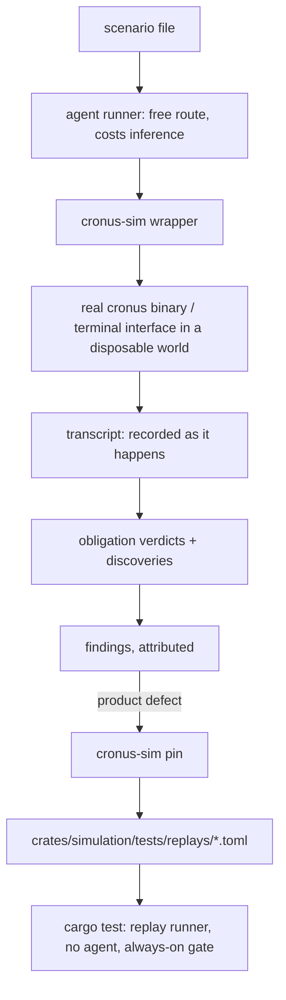

# Simulation Suite

**Version:** 1.0.2
**Status:** Stable
**Layer:** implementation
**Implements:** l1-usage-simulation.md

## Overview

The concrete realization of usage simulation in this project's stack: a **scenario corpus**
authored as declarative files that live with the product, a **harness crate** that builds and
destroys disposable worlds and records every byte the product emits as it is emitted, and a
**replay lane** in which the routes worth keeping run as ordinary deterministic tests at no
inference cost.

The split into two runners is the whole design. The **agent runner** is the expensive,
free-route instrument: an agent receives a persona, a goal, a vantage and a perturbation
schedule, drives the real `cronus` binary or the terminal interface however it decides to,
and hands back a transcript plus findings. The **replay runner** is `cargo test`: it takes
routes that were recorded by past agent runs and pinned deliberately, and re-executes them
with no agent in the loop. Discovery happens in the first; regression guarding happens in the
second; the project's always-on gate pays for only the second.

Its sibling [l2-surface-conformance.md](l2-surface-conformance.md) proves that two surfaces
agree on a fixed fixture. This spec covers the class that survives that proof: what happens
when nobody supplies the fixture and someone just tries to get something done.

## Related Specifications

- [l1-usage-simulation.md](l1-usage-simulation.md) — Parent concept. USM-1…USM-12 are this spec's subject.
- [l2-surface-conformance.md](l2-surface-conformance.md) — The deterministic sibling harness. Same "drive the surface's real projection" discipline, opposite determinism class: fixed fixtures that must gate every change, versus free routes that must not.
- [l2-invocable-registry.md](l2-invocable-registry.md) — The single action catalog. It is the denominator of every coverage claim (USM-8); an entry no scenario names is a gap.
- [l2-cli.md](l2-cli.md) · [l2-tui.md](l2-tui.md) — The two surfaces in scope at v1.0.0. The desktop shell joins when its own track resumes.
- [l2-crate-topology.md](l2-crate-topology.md) · [l2-source-layout.md](l2-source-layout.md) — Where the harness crate sits and why it depends only on the ports tier.
- [l2-quality-pipeline.md](l2-quality-pipeline.md) — Where the replay lane and the tiered agent runs attach to the project's gates.
- [l1-acceptance-oracle.md](l1-acceptance-oracle.md) — Obligations are acceptance criteria; the validator refuses a malformed set rather than passing it.
- [l1-execution-sandbox.md](l1-execution-sandbox.md) — The isolation discipline a disposable world realizes at process level.

## 1. Motivation

**The command line has already outgrown what anyone can hold in mind.** Twenty-nine command
groups, each with verbs, each verb with flags, reachable in any order against a workspace in
any state. The existing smoke suite covers one success path per group by design — that is what
a smoke suite is for — and the combinatorics past that point are not something more smoke tests
reach. What reaches them is an actor that decides its own next command.

**The product is already multi-surface, and the surfaces are already crossed in one session.**
The terminal interface mirrors each command-line verb with a leading slash, and a user moves
between them freely. No suite in the repository exercises *"did it on the command line, looked
for it in the terminal interface"*, because every suite is scoped to one surface and stops at
its edge.

**An agent that reports its own commands is not evidence.** The cheapest implementation of
"AI drives the product" is to ask an agent what it did and believe the answer. That produces a
narrative — reconstructed after the fact, smoothed by the same model that took the actions, and
unfalsifiable. A harness that wraps every invocation and records inputs and outputs *as they
happen* is what converts the exercise from a story into a measurement, and it is the reason
this spec ships code rather than only a procedure.

**Free-route runs must never become the thing CI waits on.** They cost inference, they take
minutes, and they do not repeat. Put them in the per-commit gate and either the gate becomes
expensive and flaky or the runs get skipped — in practice both, in that order. The replay lane
exists so the valuable part of a free-route discovery survives into a lane that *is* cheap,
deterministic, and safe to block on.

**Real effects need a real, disposable place to land.** The product writes a `.cronus/` state
directory into the working directory it is run from. That makes containment easy and makes
getting it wrong easy too: a run that forgets to relocate its working directory writes into the
repository, or into the developer's own workspace. The world builder exists to make the safe
path the only path.

## 2. Constraints & Assumptions

- **The subject is the built binary, not a library call.** Scenarios drive `cronus` as a
  subprocess and the terminal interface as a process, exactly as `crates/cli/tests/cli_smoke.rs`
  already does.
- **The harness stays in the ports tier.** It names `cronus-contract` shapes and nothing from
  the domain tier, for the same reason the conformance crate does: the desktop shell builds in a
  detached workspace and must be able to join later without the harness demanding types it
  cannot link.
- **Windows is a first-class host.** Worlds are built under the platform temp directory,
  teardown retries because open handles delay deletion, and nothing assumes a POSIX shell.
- **Ambient environment is hostile until cleared.** The developer's own `CRONUS_*` variables,
  working directory, and configuration must not leak into a run, or the run measures the
  developer's machine.
- **Transcripts are verbatim and therefore sensitive.** They land under `target/`, which is
  untracked, and a route is reviewed before `pin` promotes any part of it into a checked-in
  replay case.
- **Scenario files are product artifacts.** They live in the repository, ship with it, and carry
  no reference to any planning or specification artifact; a checkout with the design layer removed
  still runs every one of them.
- **The agent runner is invoked deliberately.** It is not wired into any build, package, or
  release step; nothing in the product's lifecycle depends on an agent being available.

## 3. Invariant Compliance (Layer 2 only)

| L1 Invariant | Implementation |
| --- | --- |
| **USM-1** Intent fixed, route free | A scenario file carries `persona`, `goal`, `vantage`, `world`, `perturbations`, `obligations` and has **no field in which a command can be written**. The parser rejects unknown keys, so a route cannot be smuggled in as an extra field; a `goal` that names a product verb is flagged by the validator as vocabulary leakage. |
| **USM-2** Real surfaces, real effects, disposable world | `world::build` creates a fresh directory under the platform temp root, makes it the working directory of every spawned process, and clears all `CRONUS_*` variables plus `HOME`/`USERPROFILE` overrides used for configuration discovery. The product then writes its real `.cronus/` state there. `world::drop` removes the tree with bounded retries. The harness refuses to spawn if the resolved working directory is inside the repository. |
| **USM-3** Obligations vs. discoveries | The scenario schema has two disjoint sections. `[[obligation]]` entries produce verdicts and decide the run's exit status. Everything else the agent reports lands in the transcript's `discovery` stream, which the runner **cannot** use to fail a run — the exit status is computed from obligation verdicts alone. |
| **USM-4** Declared vantage | `vantage` is a required enum: `none`, `builtin-help`, `published-docs`, `prior-use`. The agent contract document hands the agent only what the vantage admits, and every obligation whose `decided_by` is `judgement` must record a `vantage_basis` naming the observation inside the vantage that supports it. A judgement verdict with no `vantage_basis` is recorded `void`, and `void` is not a pass. |
| **USM-5** Observed output is the only evidence | Every product invocation goes through the harness wrapper, which records the exact argv, stdin, stdout, stderr, exit code, wall duration, and a state digest of the world before and after — appended to the transcript at the moment it happens. Verdicts cite transcript entries by index. A verdict citing no entry is `unmet`. The agent never supplies output text; it supplies only the index it is citing. |
| **USM-6** Perturbation is scenario content | `[[perturbation]]` entries name a class from the eleven-class catalog and the point at which it is introduced. A scenario with zero perturbations parses, and is emitted in reports labelled `smoke`; the coverage roll-up counts it separately and never folds it into simulation coverage. |
| **USM-7** Replayable, and findings are pinned | The transcript is a complete route: argv sequence, stdin, seeds, environment, and the product version stamped at world build. `cronus-sim pin <transcript>` distils it into a checked-in replay case under `crates/simulation/tests/replays/`, which `tests/replays.rs` executes with no agent. A finding's disposition cannot be recorded as closed unless a replay case or an ordinary test names its identifier. |
| **USM-8** Coverage against the catalog | `cronus-sim coverage` enumerates the invocable catalog from `cronus-contract`, intersects it with the `surfaces`, `covers`, and `roles` declarations of every scenario, and prints the complement — the actions, and the action-by-role pairs, that nothing simulates. The complement is the report's headline number, not a percentage. While the product has a single role, the role axis degenerates to one value and the complement is action-shaped; it becomes meaningful without a schema change when multi-user rights land. |
| **USM-9** Tiers, cadence, and bounds | Directory placement is the tier: `simulations/short/`, `simulations/broad/`, `simulations/exhaustive/`. The replay lane runs in the ordinary `cargo test` gate on every change. The agent-driven `short` set runs at the merge gate, `broad` at a milestone or release candidate, `exhaustive` on demand. No tier is wired into a build or packaging step. Every scenario carries a `bound` table (steps, wall seconds, spend); the wrapper refuses further `run` invocations once any limit is reached, and `finish` on a bounded-out or interrupted world writes an `incomplete` report naming the undecided obligations and tears the world down. `incomplete` is its own exit status, distinct from both pass and fail, so no caller can collapse it into either. |
| **USM-10** Companion artifact | A change that adds or alters user-observable behaviour lands its scenario in the same change. The check is mechanical where it can be: `cronus-sim coverage --changed` reports catalog entries whose descriptors changed without any scenario naming them, and that report is what the review reads. Where a behaviour genuinely has no scenario yet, it is recorded as quality debt rather than passing silently. |
| **USM-11** Obligations must be falsifiable | The scenario validator refuses, at parse time: an obligation with no `evidence`; an activity-shaped `statement` (matched against a verb list — *exercise*, *check*, *improve*, *review*, *handle*); an `expect` whose only signal is a word failure output also produces; an absence claim with no declared positive control; and an empty or duplicate-identity obligation set. A refusal is an error, never a skip. The report states the judged-to-runnable ratio of every set it ran. |
| **USM-12** Reports, does not repair | The agent contract forbids edits to tracked files during a run, and the harness records a repository dirtiness digest at world build and at teardown; a run that ends with the working tree changed is reported `contaminated` and its verdicts are discarded. Findings are written to the run directory as Markdown and are transcribed into the project's issue channel by a human decision, never by the harness. |
| **USM-13** Discoveries may be classified and may propose | **Pending** — no realization yet. The wrapper's discovery-recording command accepts free text only today; it has no field for a class or a proposed remedy, and `finish`'s report has no place to render either. Reconciled at the next `/magic.task main` pass. |

## 4. Detailed Design

### 4.1 Layout

```plaintext
simulations/                         # scenario corpus — product artifact, language-neutral
├── README.md                        # how to author one; the eleven perturbation classes
├── short/*.md                       # merge-gate set: journeys whose breakage makes it unusable
├── broad/*.md                       # milestone set: one per catalog area, perturbed
└── exhaustive/*.md                  # on-demand sweep: every action x role x perturbation

crates/simulation/                   # cronus-simulation — harness, ports tier only
├── src/
│   ├── lib.rs
│   ├── scenario.rs                  # parse + validate; refuses malformed obligation sets
│   ├── world.rs                     # build / inspect / drop a disposable world
│   ├── transcript.rs                # append-as-it-happens record of every invocation
│   ├── replay.rs                    # execute a pinned route with no agent
│   ├── coverage.rs                  # catalog complement: what nothing simulates
│   ├── findings.rs                  # attribution + disposition
│   └── bin/cronus_sim.rs            # the wrapper the agent runner drives
└── tests/
    ├── replays.rs                   # runs every pinned route — the always-on lane
    └── replays/*.toml               # pinned routes, checked in, one per closed finding

target/simulation-runs/<id>/<utc>/   # transcripts + reports — untracked, disposable
```

The corpus sits at the repository root rather than inside a crate because a scenario crosses
surfaces: one journey may start on the command line and continue in the terminal interface, and
later in a package that is not Rust at all. Owning it from any single crate would make the
first cross-surface scenario a refactor.

### 4.2 Scenario File Format

Markdown with a TOML frontmatter block: the machine-checkable fields are structured, and the
parts a human and an agent both have to *understand* — who this person is, what they want, what
they are allowed to know — are prose, because compressing them into enum values is what turns a
persona back into a script.

```text
[REFERENCE]  TOML frontmatter, then prose
---
id        = "first-run-three-boards"
tier      = "short"
surfaces  = ["cli", "tui"]
covers    = ["board.create", "board.list", "card.add", "card.move", "workspace.init"]
roles     = ["owner"]          # the actor's rights; the catalog's role set is the domain
vantage   = "builtin-help"
world     = "fresh"
bound     = { steps = 60, wall_secs = 900, spend_usd = 2.00 }

[[perturbation]]
class = "reversal"
at    = "after the second board exists"

[[perturbation]]
class = "return"
at    = "after abandoning the third board"

[[obligation]]
id         = "goal-reachable"
statement  = "all three boards exist and are listed by the product at the end of the run"
decided_by = "observation-of-state"
evidence   = "a listing invocation whose output names all three"

[[obligation]]
id         = "no-silent-failure"
statement  = "no invocation exits non-zero without naming a cause on stderr"
decided_by = "observation-of-output"
evidence   = "every non-zero exit in the transcript has non-empty stderr naming what failed"
positive_control = "replays/known-silent-exit.toml"
---

## Persona

...prose...

## Goal

...prose, in the persona's words...

## Notes

What a discovery here would most likely mean.
```

`positive_control` on an absence-shaped obligation is the AO-5 mechanism made concrete: it
names a pinned replay in which the thing being denied *does* occur, and the validator refuses
the obligation if the check passes against that replay.

### 4.3 The Wrapper, and Why It Exists

```text
[REFERENCE]
cronus-sim world new <scenario>     -> prints a world id; builds the disposable tree,
                                       stamps product version + env + repo digest
cronus-sim run <world> -- <argv>    -> spawns the product in that world, records
                                       argv/stdin/stdout/stderr/exit/duration/state-digest
                                       to the transcript, echoes stdout back to the caller
cronus-sim note <world> <text>      -> appends a discovery to the transcript
cronus-sim verdict <world> <oblig>  -> records a verdict with cited transcript indices
cronus-sim finish <world>           -> computes exit status from obligations only —
                                       pass / fail / incomplete — writes the report,
                                       tears the world down
cronus-sim pin <transcript> <name>  -> distils the route into a checked-in replay case
cronus-sim coverage [--changed]     -> catalog complement
```

Every product invocation an agent makes goes through `run`. That is not convenience — it is the
USM-5 boundary. An agent that could invoke the product directly would be free to summarize what
it saw, and a summary written by the actor is the one form of evidence the parent spec refuses.
Routing through the wrapper means the transcript exists whether or not the agent chooses to
mention what happened, which also makes a silently abandoned attempt visible.

### 4.4 The Two Runners



The replay runner is deliberately dumb: it reads a pinned route, builds a world, executes the
recorded argv sequence in order, and asserts the recorded outcome. It makes no judgements, needs
no vantage, and costs nothing. Everything interesting happened when the route was discovered;
the replay's only job is to notice when it stops holding.

### 4.5 Attribution and Disposition

A failed obligation is attributed before it is filed, and the harness supplies the evidence for
two of the three verdicts mechanically:

- **Environment defect** — the wrapper itself failed, the world could not be built or torn down,
  or the repository digest changed during the run. The run is `void`; no product finding is filed.
- **Scenario defect** — the obligation cites transcript entries that do not support it, or it
  failed on this route and passed on an earlier route through the same scenario with no product
  change in between. Route-dependence is the diagnosis; the scenario is repaired.
- **Product defect** — everything else. It is pinned before it is closed (USM-7): a replay case,
  or an ordinary test in the owning crate, naming the finding's identifier.

### 4.6 Where the Tiers Attach

| Lane | What runs | Cost | Blocks |
| --- | --- | --- | --- |
| `cargo test -p cronus-simulation` | every pinned replay | none | every change, with the ordinary gates |
| agent runner, `short` | the merge-gate scenario set | minutes + inference | the merge |
| agent runner, `broad` | one scenario per catalog area | longer | milestone / release candidate |
| agent runner, `exhaustive` | the full sweep | hours | nothing — informs |
| `cronus-sim coverage` | catalog complement | none | nothing — surfaces gaps |

Nothing in this table is referenced by a build script, a package manifest task, or a release
step. The harness is a crate in the workspace and its tests run with the workspace's tests; the
agent-driven lanes are invoked by a person or by an agent acting on a person's instruction.

## 5. Implementation Notes

1. **`world.rs` first, and its refusals before its happy path.** The guard that refuses to spawn
   when the resolved working directory is inside the repository is the one piece whose absence is
   destructive rather than merely wrong.
2. **`transcript.rs` next.** Until invocations are recorded as they happen, every later piece is
   reasoning over a narrative.
3. **`replay.rs` and `tests/replays.rs`** — with one hand-written replay case, so the always-on
   lane exists and is green before any agent runs.
4. **`scenario.rs` with its validator**, including the refusal set in the USM-11 row. A validator
   added after scenarios exist is a validator that gets weakened to admit them.
5. **`bin/cronus_sim.rs`**, then the first `short` scenario, then `coverage.rs` once there is a
   corpus for its complement to be meaningful against.
6. The terminal-interface surface needs a driver that can feed keystrokes and read the rendered
   frame; the command line needs only process spawning. Ship the command-line half first and let
   the first cross-surface scenario motivate the second.

## 6. Drawbacks & Alternatives

- **Alternative — extend `cronus-conformance` instead of a new crate.** Rejected: that crate's
  value is that it is deterministic and blocks every change. Admitting free-route machinery into
  it couples a lane that must never be flaky to one that is non-repeatable by design.
- **Alternative — put scenarios in `crates/cli/tests/`.** Rejected: the first scenario that
  crosses from the command line to the terminal interface would have to move, and the frontend
  package is not a Rust crate at all.
- **Alternative — let the agent run the product directly and report.** Rejected: it removes the
  only mechanism that makes the record evidence rather than testimony (§4.3).
- **Alternative — generate scenarios from the catalog automatically.** Rejected for now: a
  generated goal is the product's vocabulary reflected back, which is exactly the vantage
  violation USM-4 exists to catch. Generation is defensible for the *exhaustive* tier's
  enumeration and nowhere else. <!-- TBD: whether the exhaustive tier should enumerate mechanically from the catalog once the corpus is large enough to compare against -->
- **The wrapper adds a layer between agent and product**, and a bug in it looks like a product
  bug. The environment-defect attribution and the repository-digest check exist to make that
  distinguishable, but the first few runs will spend their findings on the harness.
- **Teardown on Windows is best-effort.** A held handle can delay deletion past the retry budget,
  leaving a temp tree behind. Worlds are named with their scenario and timestamp so a stale one is
  identifiable, and the builder never reuses a world.

## Canonical References

| Alias | Path | Purpose |
| --- | --- | --- |
| `[SMOKE]` | `crates/cli/tests/cli_smoke.rs` | The existing precedent for driving the built binary as a subprocess — the spawn pattern the harness generalizes. |
| `[CONFORMANCE]` | `crates/conformance/src/harness.rs` | The sibling harness whose shape, ports-tier dependency rule, and report-rather-than-assert return this crate mirrors. |
| `[PORTS]` | `crates/contract/src/lib.rs` | The only tier this crate may depend on; the source of catalog and invocable shapes used by coverage. |
| `[STATEROOT]` | `crates/cli/src/commands.rs` | Where the product decides its `.cronus/` state directory — the fact the disposable world must relocate. |
| `[WORKSPACE]` | `Cargo.toml` | The workspace member list the new crate is added to. |

## Document History

| Version | Date | Author | Notes |
| --- | --- | --- | --- |
| 1.0.0 | 2026-09-11 | Core Team | Initial spec — the realization of usage simulation in this stack: a root-level `simulations/` scenario corpus tiered by directory (short/broad/exhaustive); a ports-tier `cronus-simulation` harness crate providing disposable worlds under the platform temp root with a refusal guard against spawning inside the repository, an append-as-it-happens transcript, a scenario validator that refuses unfalsifiable obligation sets at parse time, and a catalog-complement coverage report; the `cronus-sim` wrapper every product invocation passes through, which is what makes the record evidence rather than agent testimony; and the two-runner split in which the expensive free-route agent runner discovers while pinned replays under `crates/simulation/tests/replays/` guard in the ordinary `cargo test` gate at no inference cost. Every scenario declares a `bound` (steps, wall seconds, spend) and `finish` emits `incomplete` as an exit status distinct from pass and fail; `roles` sits beside `covers` so the coverage complement becomes role-aware without a schema change when multi-user rights land. Attribution separates product, scenario, and environment defects; a run that leaves the working tree dirty is reported contaminated and its verdicts discarded. |
| 1.0.1 | 2026-09-12 | Core Team | Registry sync — L1 parent `l1-usage-simulation` gained USM-13 (a discovery may be classified against the improvement loop's own taxonomy and may carry a proposed remedy) and reverted `Stable → RFC` for its own Post-Update Review; this L2 is quarantined to `RFC` in step (C12), since its own realization has not yet reconciled USM-13. New §3 row records the gap as **Pending**: today's discovery-recording command carries free text only, with no class field and no proposed-remedy field. No code changed; the gap is planned at the next `/magic.task main` pass. |
| 1.0.2 | 2026-09-12 | Core Team | Un-quarantined (C12 upward reversal) — L1 parent `l1-usage-simulation` passed its second review and returned `RFC → Stable` (1.1.1). This L2 follows it back to `Stable`: the §3 USM-13 row stays **Pending** — a disclosed implementation gap, not a blocker, the same standing several already-Stable L2 tables in this project carry for a newly-added invariant (Stable records the design as settled, not every invariant as coded). No code changed; USM-13's realization is still reconciled at the next `/magic.task main` pass. |
