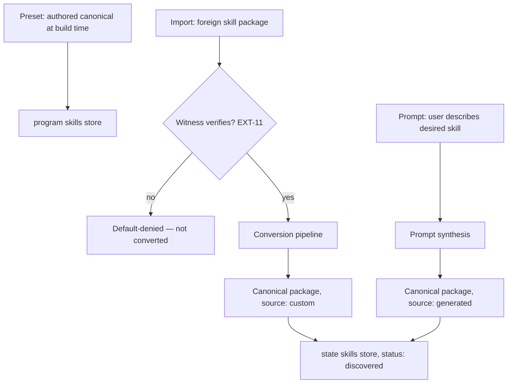

# Skill System (Two-Tier Stores & Canonical Stack)

**Version:** 1.0.0
**Status:** Stable
**Layer:** implementation
**Implements:** l1-extensions.md, l1-storage-model.md

## Overview

The concrete realization of the **skill** extension kind: where skills live on disk, what they are made of, and how foreign material becomes a skill. Two stores mirror the two storage tiers — an **immutable preset store** in the program tier (`<program>/skills/`, visualized as `.release/program/skills/`) shipped with the product and replaced wholesale on upgrade, and a **mutable store** in the state tier (`<state>/skills/`, visualized as `.release/state/skills/`) holding user-added and office-generated skills. Every executable part of a skill runs on one **canonical stack**: procedural logic is a **nodus workflow**; side-effecting operations are **built-in Rust commands** exposed through the nodus vocabulary — no interpreted scripts on the execution path. Skills enter the mutable store through a **conversion pipeline** (foreign packages are transpiled into the canonical stack) or through **prompt synthesis** (the user describes the desired skill in natural language and the office authors it in canonical form directly).

## Related Specifications

- [l1-extensions.md](l1-extensions.md) - Parent invariants: unified kinds, lifecycle, default-deny trust, preset+custom, generation, manifest, attestation.
- [l1-storage-model.md](l1-storage-model.md) - Parent invariants: two-tier separation (STO-1) and catalog-vs-instance (STO-3) that the two stores realize.
- [l1-workflow-language.md](l1-workflow-language.md) - The workflow language (nodus) in which skill procedures are expressed; dual rendering, validation, bounded execution.
- [l2-workflow-runtime.md](l2-workflow-runtime.md) - The runtime that validates and executes skill workflows.
- [l2-extension-registry.md](l2-extension-registry.md) - Manifest schema, SKILL.md frontmatter, discovery algorithm, trust levels, lifecycle states, catalog; this spec pins the on-disk stores those mechanisms index.
- [l2-filesystem-layout.md](l2-filesystem-layout.md) - The tier roots (`<program>`, `<state>`) under which both stores live.
- [l2-learning-loop.md](l2-learning-loop.md) - The review fork and curator that deposit generated skills into the mutable store.
- [l1-security.md](l1-security.md) - Sandbox, least privilege, and default-deny egress governing skill execution.

## 1. Motivation

Preset skills are part of the product: they must survive upgrades byte-identical, never drift under user edits, and be trustable without per-install review. User skills are the opposite: free-form to add, but potentially hostile to run. Splitting the two across the existing storage tiers gives each the right property for free — the program tier is already immutable (STO-1), the state tier already mutable and backed up. A single canonical execution stack (nodus + built-in Rust commands) closes the remaining gap: instead of sandboxing arbitrary shell/Python scripts carried by imported skills, the system converts them into validated workflow steps over a closed, capability-checked command surface — the attack surface of "a skill's script" collapses to the attack surface of the core itself.

## 2. Constraints & Assumptions

- The program tier is read-only at runtime (STO-1); nothing in this spec ever writes under `<program>/`.
- nodus is the **only** workflow dialect for skills; built-in Rust commands are the **only** script substrate. No shell, no embedded interpreters on the skill execution path.
- The built-in command surface is closed and versioned; it grows only via core releases, never via skill installation.
- Conversion is best-effort: what cannot be mapped onto the canonical stack degrades to instruction-only, it is never executed in its original form.
- `.release/program/skills/` and `.release/state/skills/` are repository visualization stubs of the two stores, not build artifacts (consistent with the `.release/` sandbox convention).

## 3. Invariant Compliance (Layer 2 only)

| L1 Invariant | Implementation |
| --- | --- |
| EXT-1 Unified model | Skills remain one kind in the single extension registry; the two stores are *locations* the registry indexes, not a parallel subsystem. |
| EXT-2 Lifecycle | Ingestion never activates: converted and synthesized skills land in the mutable store as `discovered` (inactive); activation follows the standard grant gate. |
| EXT-3 Default-deny trust | A skill whose scripts could not be converted gains no execution capability — it runs instruction-only; nothing quarantined is ever executed. |
| EXT-4 Sandboxed execution | The only executable path is the nodus runtime invoking built-in Rust commands inside the core sandbox; per-call grant checks apply. |
| EXT-5 Preset + custom | Presets live read-only in `<program>/skills/`; custom and generated skills live in `<state>/skills/`. |
| EXT-6 Scoped, minimal grants | The skill manifest declares minimal permissions; each built-in command validates the calling skill's grants before acting; network passes the egress gate. |
| EXT-7 Skill generation | Prompt-synthesized and curator-distilled skills are written to `<state>/skills/` with `source: generated`, pending review. |
| EXT-8 Provenance & audit | `source: preset \| custom \| generated` plus a persisted conversion report; originals of imported material are preserved verbatim for audit. |
| EXT-9 Manifest contract | Every canonical package carries the registry manifest; validated against schema before activation. |
| EXT-11 Verifiable import attestation | An imported package's signed witness is verified **before** conversion begins; missing/failed witness → default-denied, never converted. |
| STO-1 Two-tier separation | Preset store ships inside the program tier and is replaced wholesale on upgrade; conversion, synthesis, and overrides write only to the state tier. |
| STO-3 Catalog vs instance | A preset skill is a blueprint: overriding it copies into `<state>/skills/`; the preset is never mutated in place. |

## 4. Detailed Design

### 4.1 Two-tier stores and precedence

```plaintext
<program>/skills/                 # PRESET store: read-only, shipped, replaced on upgrade
└── <pack>/<name>/                #   canonical packages, authored at build time
<state>/skills/                   # MUTABLE store: user-added + office-generated
├── <pack>/<name>/                #   canonical packages (converted or synthesized)
└── .curator_state                #   curator persistence (per l2-learning-loop §4.4)
```

Name-shadowing resolution follows the registry's override contract, re-rooted to these stores (first match wins):

```text
[REFERENCE]
1. workspace skills   <ws>/skills/<pack>/<name>          (highest precedence)
2. state skills       <state>/skills/<pack>/<name>/       (user + generated)
3. preset skills      <program>/skills/<pack>/<name>/     (shipped, read-only)
```

Role-attached skills (`<state>/employees/<role>/skills/`) scope *activation* to a role; they do not participate in name shadowing. Upgrades replace the preset store wholesale and never touch user copies; an override semantically identical to its preset produces a warning, never an error.

### 4.2 Canonical skill package

Each skill is a directory in canonical form:

```plaintext
<pack>/<name>/
├── SKILL.md          # frontmatter (registry SKILL.md schema) + instruction body
├── DESCRIPTION.md    # optional lightweight discovery file (per l2-learning-loop §4.2)
├── extension.json    # manifest: kind "skill", source, permissions (EXT-9)
├── workflow.nd       # optional: procedure in nodus compact form (machine rendering)
├── workflow.md       # human rendering of workflow.nd (WFL-1, generated, lossless)
├── references/  templates/  assets/   # support directories (never scanned as skill roots)
└── origin/           # imported originals preserved verbatim — audit only, never executed
```

There is **no `scripts/` directory in canonical form**. What a foreign skill expresses as scripts becomes either nodus workflow steps or references to built-in commands. Preset skills carry no interpreted code either: their operational muscle is native Rust compiled into the core and addressed by command id from `workflow.nd`.

### 4.3 Canonical execution stack

A skill is executable at up to three layers, each strictly safer than a general-purpose script:

| Layer | Substance | Guarantees |
| --- | --- | --- |
| Instructions | `SKILL.md` body injected into agent context | no execution surface (registry `markdown_only` trust level) |
| Procedure | `workflow.nd` executed by the nodus runtime | schema-validated (WFL-2/5), bounded (WFL-6), hard constraints inviolable (WFL-3) |
| Operations | built-in Rust commands invoked from workflow steps | closed versioned surface, sandboxed, per-call grant check (EXT-4/6) |

The built-in command surface is the bridge between nodus and the core:

```text
[REFERENCE]
CommandSpec {
  id,                      // stable identifier addressed from workflow steps
  category,                // data/io | memory | effects | validation | ... (WFL vocabulary categories)
  input_schema,            // typed parameters, validated before dispatch
  required_grants,         // fs / network / secrets scopes checked against the skill manifest
  surface_version          // bumped only by core releases
}
```

Commands register into the nodus schema (vocabulary contract, WFL-2), so a skill workflow validated against a schema version is portable across installs carrying that surface version.

### 4.4 Ingestion paths and the conversion pipeline



**Conversion pipeline** (foreign package → canonical package):

1. **Verify** — check the signed witness (EXT-11) before reading anything else; failure stops the pipeline.
2. **Classify** — partition package content into instructions, procedural steps, scripts, and static assets.
3. **Retain** — instructions map to `SKILL.md`; assets/templates/references copy into support directories.
4. **Transpile** — procedural steps become a nodus workflow; each script's behavior is matched against the built-in command surface and rewritten as workflow steps calling those commands.
5. **Degrade** — a script with no command-surface equivalent is **not** converted and **not** executed: the skill is marked `degraded: instruction-only`, the original is preserved under `origin/`, and the gap is surfaced at the grant gate. The plugin kind remains the escape hatch for genuinely code-shaped extensions.
6. **Report** — a conversion report (what mapped where, what degraded, why) is persisted with the package for audit (EXT-8) and review.

The pipeline is atomic: a package that fails classification, transpilation validation, or manifest validation lands **nothing** in the store — no partial canonical packages exist.

**Prompt synthesis** (prompt → canonical package): the office authors `SKILL.md` and, when the skill is procedural, a `workflow.nd` directly against the loaded nodus schema; the result is validated (WFL-5) and linted before landing. Synthesized skills enter as `source: generated`, `status: discovered`, and pass the same review gate as distilled skills (EXT-7). <!-- TBD: whether prompt-synthesized skills may auto-activate for the requesting user after validation, or always require the explicit review step -->

### 4.5 Execution model

Activation loads instructions into the agent's skill context. If the package declares a workflow, invocation hands `workflow.nd` to the workflow runtime: validate → execute bounded → return the structured result (WFL-8). Every operation step dispatches a built-in command; the core checks the skill's manifest grants per call, and outbound network passes the egress gate (SEC-3). A `degraded: instruction-only` skill never reaches the runtime.

### 4.6 Command surface (CLI/TUI/library)

Extends the registry's `cronus skill` group; the library method is the source of truth, CLI/TUI are thin bindings:

| Action | CLI | TUI | Library |
| --- | --- | --- | --- |
| import + convert | `cronus skill import <path>` | `/skill import <path>` | `ext.importSkill({path}) -> ConversionReport` |
| create from prompt | `cronus skill create --prompt "<text>"` | `/skill create <text>` | `ext.synthesizeSkill({prompt}) -> Extension` |
| show conversion state | `cronus skill status [<id>]` | `/skill status` | `ext.skillStatus({id?}) -> SkillStatus[]` |

`skill status` reports store origin (preset / state / workspace override), degradation flags, and pending-review state.

## 5. Drawbacks & Alternatives

- **Transpilation fidelity:** LLM-assisted conversion of arbitrary scripts can be wrong or incomplete. Mitigated by validation before landing, the `discovered` review gate, verbatim originals under `origin/`, and honest degradation instead of silent best-guess execution.
- **Closed command surface pressure:** skills wanting operations the surface lacks must wait for a core release or ship as plugins. Accepted: the alternative (arbitrary script execution) reopens the interpreter attack surface this design exists to close.
- **Preset rigidity:** fixing a preset skill requires a product upgrade, not a hot edit. Accepted per STO-1/STO-3; users override by copy into the state store immediately.
- **Alternative — sandbox original scripts (shell/Python) instead of converting:** rejected; embeds interpreters, multiplies platform variance, and makes grants coarse (per-process instead of per-command).
- **Alternative — keep skill stores under `<program>/extensions/skills/` and `<state>/extensions/skills/`:** rejected; skills are the most user-visible extension kind, the state tier layout already used a top-level `skills/`, and the flat store matches the `.release/` visualization. Other kinds (mcp/plugins/connectors) remain under `extensions/`.

## Canonical References

| Alias | Path | Purpose |
| --- | --- | --- |
| `[STUB-P]` | `.release/program/skills/` | On-disk visualization of the preset store |
| `[STUB-S]` | `.release/state/skills/` | On-disk visualization of the mutable store |
| `[SKILL-FMT]` | `.design/main/specifications/l2-extension-registry.md` | SKILL.md frontmatter, discovery, trust levels, lifecycle |
| `[WFL-RT]` | `.design/main/specifications/l2-workflow-runtime.md` | Runtime that validates/executes skill workflows |

## Document History

| Version | Date | Notes |
| --- | --- | --- |
| 1.0.0 | 2026-07-08 | Initial spec — two-tier skill stores (`<program>/skills/` preset read-only, `<state>/skills/` mutable), canonical execution stack (nodus workflows + built-in Rust command surface, no interpreted scripts), conversion pipeline for imported packages (verify → classify → retain → transpile → degrade → report), prompt synthesis path, precedence/override semantics, CLI/TUI/library command surface. |
