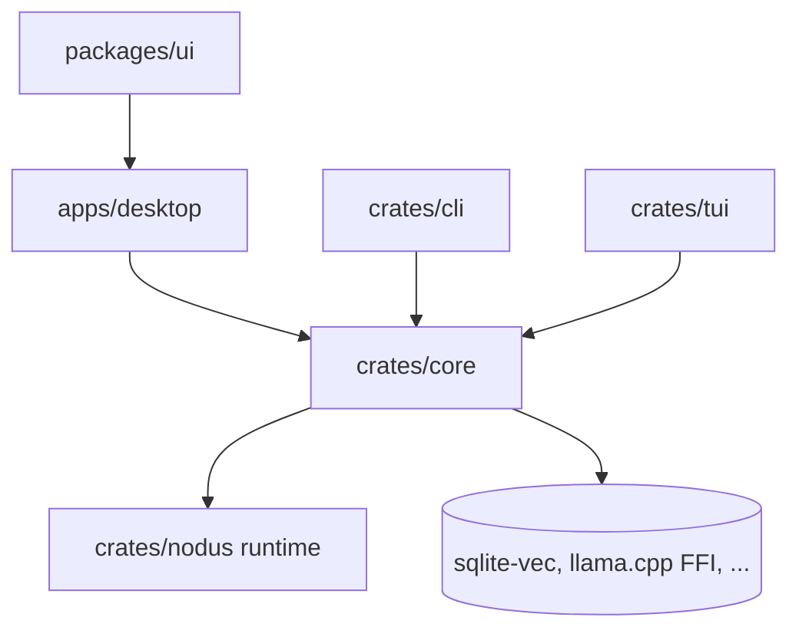

# Source Layout (Monorepo)

**Version:** 1.2.0
**Status:** RFC
**Layer:** implementation
**Implements:** l1-architecture.md

## Overview

The development-time organization of the Cronus repository: a polyglot monorepo with a Rust workspace for the core and binaries, an apps layer for the desktop/mobile shell, and a JS/TS package layer for the UI. It maps the architecture's layers (core library + CLI/TUI/GUI frontends) onto concrete workspace members and clarifies that the workflow runtime is an external crate dependency.

> Scope: this is the **developer/source** layout. The **user/install** layout (program vs state tiers) is specified separately in [l2-filesystem-layout.md](l2-filesystem-layout.md).

## Related Specifications

- [l1-architecture.md](l1-architecture.md) - The layer model (core + frontends) realized here.
- [l2-technology-stack.md](l2-technology-stack.md) - Monorepo tooling (moon/Nx) + Rust workspace + Tauri + React.
- [l2-workflow-runtime.md](l2-workflow-runtime.md) - The workflow runtime is an external crate the core depends on.
- [l2-filesystem-layout.md](l2-filesystem-layout.md) - The complementary user-install layout.
- [l2-crate-topology.md](l2-crate-topology.md) - How `crates/core` is partitioned into crates; resolves the §4.4 granularity question.

## 1. Motivation

The architecture separates a reusable core from thin frontends; the source tree should make that boundary obvious and enforce dependency direction. A polyglot monorepo also has to host Rust and JS side by side without one tool pretending to own the other (see the stack spec's monorepo verdict).

## 2. Constraints & Assumptions

- Dependency direction is inward: frontends/apps depend on the core; the core depends on nothing in this product (INV-1/INV-2).
- Rust members live in a Cargo workspace; JS members in a pnpm workspace; the polyglot runner (moon/Nx) sequences both.
- The workflow runtime is an **in-tree** Rust crate (`crates/nodus`), a self-contained workspace member; it may be extracted to a standalone crate later if another consumer needs it (per the adopted decision).

## 3. Invariant Compliance (Layer 2 only)

| L1 Invariant | Implementation |
| --- | --- |
| INV-1 Embeddable core | `crates/core` is a library crate with no frontend dependencies; apps/bins depend on it. |
| INV-2 Logic in core only | UI (`packages/ui`) and shells (`apps/`, `crates/cli`, `crates/tui`) hold no domain logic. |
| INV-3 Frontend interchangeability | CLI, TUI, and the app are separate members over the same `core`. |
| INV-4 Hub-and-spoke | `apps/desktop` can host the always-on engine; the same shell builds the mobile thin client. |

## 4. Detailed Design

### 4.1 Repository layout

```plaintext
cronus/
├── crates/                 # Rust workspace (Cargo)
│   ├── core/               # engine library: orchestration, memory, scheduler, routers, quality, board, office projection
│   ├── nodus/              # workflow-language runtime (lexer/parser/validator/executor/transpiler); core depends on it
│   ├── cli/                # `cronus` binary (depends on core)
│   └── tui/                # `cronus-tui` binary (depends on core)
├── apps/
│   └── desktop/            # Tauri v2 shell; src-tauri depends on core (desktop + mobile targets)
├── packages/               # JS/TS workspace (pnpm)
│   └── ui/                 # React 19 + Vite frontend (office view, kanban board, dashboard, editor)
├── .design/                # SDD artifacts (engine-managed; excluded from product releases)
└── (build config: Cargo workspace, pnpm-workspace, moon/Nx)
```

The **workflow-runtime crate** (`crates/nodus`) is an in-tree workspace member that `crates/core` depends on; it is self-contained so it can be lifted out to its own repository later if reused elsewhere.

### 4.2 Dependency direction



Arrows point inward to `core`; `core` points only outward to libraries, never to a frontend (INV-1/INV-2).

### 4.3 Tooling split (polyglot)

Cargo owns Rust builds/caching; pnpm + the polyglot runner (moon/Nx) own JS and sequence the Tauri build; the runner does not try to cache Rust output (delegated to Cargo/sccache). See [l2-technology-stack.md](l2-technology-stack.md) §monorepo.

### 4.4 Migration from the initial flat layout

The initial placeholder `src/{app,cli,core,dashboard,kanban,office,tui}` mixed Rust modules with UI views. It is superseded by this layout: domain logic → `crates/core`; CLI/TUI → `crates/{cli,tui}`; shell → `apps/desktop`; `dashboard`/`office`/`kanban` were **UI views** → `packages/ui`.

### 4.5 Crate granularity [ADDED v1.2.0]

The question this spec previously left open — a single `core` crate versus `engine`/`memory`/`scheduler` sub-crates — is **resolved in [l2-crate-topology.md](l2-crate-topology.md)**, and resolved *against* the domain-split proposal sketched above.

Measurement showed domain-to-domain coupling is already near zero, so splitting `core` along domain lines would cut where there is no pain. The decomposition axis is instead **dependency weight and provider seams**: a module earns its own crate when it requires an infrastructure dependency the domain tier may not hold, when it backs one of the deployment-neutrality provider planes, or when it gains a consumer outside this workspace — never merely because it is large.

`crates/core` therefore becomes a facade over `crates/{contract,domain,store-local,auth-local}`. The directory tree in §4.1 and the dependency graph in §4.2 describe the layout **before** that migration; see the topology spec for the target state and its ordered migration steps.

## 5. Drawbacks & Alternatives

- **Root-level crates/apps/packages vs everything under src/:** root-level is the polyglot-monorepo norm and keeps Rust/JS workspaces clean; chosen over a single `src/`.
- **In-tree workflow-runtime crate:** vendored as `crates/nodus` since no other consumer needs it yet; the self-contained crate boundary keeps later extraction cheap.
- **Alternative — standalone repository now:** deferred; revisit if the runtime gains consumers outside Cronus.

## Canonical References

| Alias | Path | Purpose |
| --- | --- | --- |
| `[ARCH]` | `.design/main/specifications/l1-architecture.md` | Layer model realized here |
| `[STACK]` | `.design/main/specifications/l2-technology-stack.md` | Monorepo tooling + Rust workspace |
| `[USER-LAYOUT]` | `.design/main/specifications/l2-filesystem-layout.md` | Complementary user-install layout |
| `[TOPOLOGY]` | `.design/main/specifications/l2-crate-topology.md` | The crate decomposition of `crates/core` |

## Document History

| Version | Date | Notes |
| --- | --- | --- |
| 1.2.0 | 2026-07-10 | Resolved the §4.4 crate-granularity TBD by delegating to the new `l2-crate-topology.md`: decomposition follows the dependency/seam axis, not the domain axis. Added §4.5 recording the decision and marking §4.1/§4.2 as pre-migration state. Status → RFC pending review of the topology spec (amendment rule). History table added with this entry. |
