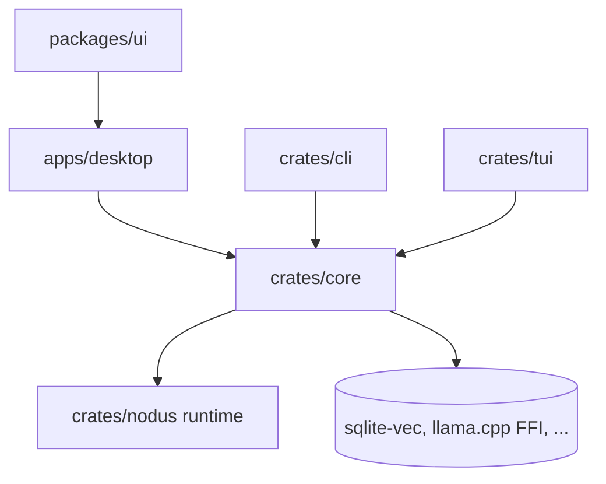

# Source Layout (Monorepo)

**Version:** 1.3.0
**Status:** Stable
**Layer:** implementation
**Implements:** l1-architecture.md

## Overview

The development-time organization of the Cronus repository: a polyglot monorepo with a Rust workspace for the core and binaries, an apps layer for the desktop/mobile shell, and a JS/TS package layer for the UI. It maps the architecture's layers (core library + CLI/TUI/GUI frontends) onto concrete workspace members and clarifies that the workflow runtime is an external crate dependency.

> Scope: this is the **developer/source** layout. The **user/install** layout (program vs state tiers) is specified separately in [l2-filesystem-layout.md](l2-filesystem-layout.md).

## Related Specifications

- [l1-architecture.md](l1-architecture.md) - The layer model (core + frontends) realized here.
- [l2-technology-stack.md](l2-technology-stack.md) - Monorepo tooling (moon/Nx) + Rust workspace + Tauri + React.
- [l2-workflow-runtime.md](l2-workflow-runtime.md) - The workflow runtime is an external crate the core depends on.
- [l2-filesystem-layout.md](l2-filesystem-layout.md) - The complementary user-install layout.
- [l2-crate-topology.md](l2-crate-topology.md) - How `crates/core` is partitioned into crates; resolves the §4.4 granularity question.
- [l2-ui-module-topology.md](l2-ui-module-topology.md) - The same delegation for the frontend package: how `packages/ui` is partitioned into modules and which may import which (§4.6).

## 1. Motivation

The architecture separates a reusable core from thin frontends; the source tree should make that boundary obvious and enforce dependency direction. A polyglot monorepo also has to host Rust and JS side by side without one tool pretending to own the other (see the stack spec's monorepo verdict).

## 2. Constraints & Assumptions

- Dependency direction is inward: frontends/apps depend on the core; the core depends on nothing in this product (INV-1/INV-2).
- Rust members live in a Cargo workspace; JS members in a pnpm workspace; the polyglot runner (moon/Nx) sequences both.
- The workflow runtime is an **in-tree** Rust crate (`crates/nodus`), a self-contained workspace member; it may be extracted to a standalone crate later if another consumer needs it (per the adopted decision).

## 3. Invariant Compliance (Layer 2 only)

| L1 Invariant | Implementation |
| --- | --- |
| INV-1 Embeddable core | `crates/core` is a library crate with no frontend dependencies; apps/bins depend on it. |
| INV-2 Logic in core only | UI (`packages/ui`) and shells (`apps/`, `crates/cli`, `crates/tui`) hold no domain logic. |
| INV-3 Frontend interchangeability | CLI, TUI, and the app are separate members over the same `core`. |
| INV-4 Hub-and-spoke | `apps/desktop` can host the always-on engine; the same shell builds the mobile thin client. |
| INV-5 Durable, restartable state | Not a source-tree property: durable runtime state lives in the user/install layout (`l2-filesystem-layout`), written by the persistence adapter, not in the developer tree. This layout's only bearing is giving that adapter crate its own home; it neither enables nor constrains restart behavior. |
| INV-6 Graceful capability scaling | A runtime-contract property, not a layout one, with a mild structural aid: placing each frontend as its own workspace member lets a host build only the subset it needs (e.g. the TUI without the desktop shell). Which capabilities a running frontend then exposes is decided by the core contract, not by directory structure. |
| INV-7 Security of client data | Enforced at runtime in the core/adapters, not by layout; the tree's related discipline is repo hygiene — secret-bearing files (`.env`, key material) stay out of the tracked tree via `.gitignore`. The invariant itself is realized in `l2-security` and the adapter crates. |
| INV-8 Single-deployable modular monolith | The workspace layout structurally realizes the modular monolith: `crates/` is one Cargo workspace whose members link into a single deployable, not independently-deployed services; the tree carries no per-service manifest, deployment descriptor, or orchestration file. The crate boundaries this layout draws are compile-time seams (detailed in `l2-crate-topology`), never process boundaries. |
| INV-9 Shipped-surface honesty | N/A to a directory layout: which verbs a frontend advertises is a runtime surface property realized in the frontend specs (`l2-cli`/`l2-tui`/`l2-app-ui`). The tree neither lists nor hides a verb. |
| INV-10 Representation isolation at the inward seam | The invariant is a code property of the crates, not the tree — but the layout is its precondition: keeping adapter crates (`crates/store-local`, …) separate from the domain crate is what lets representation isolation be compiler-enforced (`l2-crate-topology` INV-10). The mapping discipline itself lives in those crates. |

## 4. Detailed Design

### 4.1 Repository layout

```plaintext
cronus/
├── crates/                 # Rust workspace (Cargo)
│   ├── core/               # engine library: orchestration, memory, scheduler, routers, quality, board, office projection
│   ├── nodus/              # workflow-language runtime (lexer/parser/validator/executor/transpiler); core depends on it
│   ├── cli/                # `cronus` binary (depends on core)
│   └── tui/                # `cronus-tui` binary (depends on core)
├── apps/
│   └── desktop/            # Tauri v2 shell; src-tauri depends on core (desktop + mobile targets)
├── packages/               # JS/TS workspace (pnpm)
│   └── ui/                 # React 19 + Vite frontend (office view, kanban board, dashboard, editor)
├── .design/                # SDD artifacts (engine-managed; excluded from product releases)
└── (build config: Cargo workspace, pnpm-workspace, moon/Nx)
```

The **workflow-runtime crate** (`crates/nodus`) is an in-tree workspace member that `crates/core` depends on; it is self-contained so it can be lifted out to its own repository later if reused elsewhere.

### 4.2 Dependency direction


```mermaid
graph TD
    UI[packages/ui] --> DESKTOP[apps/desktop]
    DESKTOP --> CORE[crates/core]
    CLI[crates/cli] --> CORE
    TUI[crates/tui] --> CORE
    CORE --> WFL[crates/nodus runtime]
    CORE --> DEPS[(sqlite-vec, llama.cpp FFI, ...)]
```

Arrows point inward to `core`; `core` points only outward to libraries, never to a frontend (INV-1/INV-2).

### 4.3 Tooling split (polyglot)

Cargo owns Rust builds/caching; pnpm + the polyglot runner (moon/Nx) own JS and sequence the Tauri build; the runner does not try to cache Rust output (delegated to Cargo/sccache). See [l2-technology-stack.md](l2-technology-stack.md) §monorepo.

### 4.4 Migration from the initial flat layout

The initial placeholder `src/{app,cli,core,dashboard,kanban,office,tui}` mixed Rust modules with UI views. It is superseded by this layout: domain logic → `crates/core`; CLI/TUI → `crates/{cli,tui}`; shell → `apps/desktop`; `dashboard`/`office`/`kanban` were **UI views** → `packages/ui`.

### 4.5 Crate granularity [ADDED v1.2.0]

The question this spec previously left open — a single `core` crate versus `engine`/`memory`/`scheduler` sub-crates — is **resolved in [l2-crate-topology.md](l2-crate-topology.md)**, and resolved *against* the domain-split proposal sketched above.

Measurement showed domain-to-domain coupling is already near zero, so splitting `core` along domain lines would cut where there is no pain. The decomposition axis is instead **dependency weight and provider seams**: a module earns its own crate when it requires an infrastructure dependency the domain tier may not hold, when it backs one of the deployment-neutrality provider planes, or when it gains a consumer outside this workspace — never merely because it is large.

`crates/core` therefore becomes a facade over `crates/{contract,domain,store-local,auth-local}`. The directory tree in §4.1 and the dependency graph in §4.2 describe the layout **before** that migration; see the topology spec for the target state and its ordered migration steps.

### 4.6 Frontend package decomposition [ADDED v1.3.0]

§4.1 and §4.2 stop at the workspace member: they name `packages/ui` and fix its dependency direction relative to `apps/desktop` and the core, but say nothing about the package's internals. That is deliberate and symmetrical with §4.5 — this spec settles *which members exist and how they depend on each other*, and delegates each member's internal decomposition to a spec of its own.

For the frontend package the delegate is **[l2-ui-module-topology.md](l2-ui-module-topology.md)**. It establishes a four-tier model inside `packages/ui/src` (composition root → shell → surfaces → shared) with one-way imports, a declared public API per surface, grouping by surface rather than by file kind, and a single seam to the core.

The two delegations answer the same question in two languages with different starting positions. Rust receives module boundaries from the crate graph, so `l2-crate-topology` decides *where to cut* and the compiler enforces the result. TypeScript has no compile-time module boundary within a package, so `l2-ui-module-topology` must also specify *what enforces the cut* — delegating that in turn to the structural gate in [l2-quality-pipeline.md](l2-quality-pipeline.md) §4.1.

## 5. Drawbacks & Alternatives

- **Root-level crates/apps/packages vs everything under src/:** root-level is the polyglot-monorepo norm and keeps Rust/JS workspaces clean; chosen over a single `src/`.
- **In-tree workflow-runtime crate:** vendored as `crates/nodus` since no other consumer needs it yet; the self-contained crate boundary keeps later extraction cheap.
- **Alternative — standalone repository now:** deferred; revisit if the runtime gains consumers outside Cronus.

## Canonical References

| Alias | Path | Purpose |
| --- | --- | --- |
| `[ARCH]` | `.design/main/specifications/l1-architecture.md` | Layer model realized here |
| `[STACK]` | `.design/main/specifications/l2-technology-stack.md` | Monorepo tooling + Rust workspace |
| `[USER-LAYOUT]` | `.design/main/specifications/l2-filesystem-layout.md` | Complementary user-install layout |
| `[TOPOLOGY]` | `.design/main/specifications/l2-crate-topology.md` | The crate decomposition of `crates/core` |
| `[UI-TOPOLOGY]` | `.design/main/specifications/l2-ui-module-topology.md` | The module decomposition of `packages/ui` |

## Document History

| Version | Date | Notes |
| --- | --- | --- |
| 1.2.0 | 2026-07-10 | Resolved the §4.4 crate-granularity TBD by delegating to the new `l2-crate-topology.md`: decomposition follows the dependency/seam axis, not the domain axis. Added §4.5 recording the decision and marking §4.1/§4.2 as pre-migration state. Status → RFC pending review of the topology spec (amendment rule). History table added with this entry. |
| 1.2.0 | 2026-07-10 | `RFC → Stable`. The amendment rule's pending-review condition is satisfied: `l2-crate-topology` passed Post-Update Review and reached Stable in the same pass, so the delegated §4.5 decision is now backed by a Stable target. No content change; status advance only. |
| 1.2.1 | 2026-07-29 | Completeness fix: added an INV-8 row to the §3 table — the `crates/` workspace layout structurally realizes the modular monolith (one deployable, no per-service manifest/orchestration file; crate boundaries are compile-time seams per `l2-crate-topology`). INV-8 entered `l1-architecture` after this table (INV-1…INV-4) was written. INV-9 (surface honesty) and INV-10 (inward-seam representation isolation) are behavioral/data invariants realized by the frontends and the core, not properties of a directory layout, and are noted as such in the INV-8 row rather than added as thin rows — consistent with the table's existing scope to the structural invariants the layout embodies. No new requirement; stays Stable. |
| 1.2.2 | 2026-07-29 | Completeness fix (strict gate): filled the §3 Invariant-Compliance table to a full INV-1…INV-10 against `l1-architecture`. Added honest, layout-specific rows for INV-5/INV-6/INV-7 (behavioral/runtime invariants realized in the user/install layout, the core contract, and the adapters — the tree's only bearings being crate-housing, build-subset workspace members, and `.gitignore` secret hygiene) and INV-9/INV-10 (surface honesty is a frontend property; representation isolation is a code property of the crates, though this layout is its precondition by keeping adapter crates separate from the domain crate). Trimmed the redundant 9/10 note from the INV-8 row now that both have explicit rows. No new requirement or design; stays Stable. |
| 1.3.0 | 2026-09-03 | Added §4.6 delegating the internal decomposition of `packages/ui` to the new `l2-ui-module-topology.md`, symmetrically with §4.5's delegation of `crates/core` to `l2-crate-topology.md`. Records why the two delegations differ in kind: Rust receives module boundaries from the crate graph so the crate spec need only decide where to cut, while TypeScript has no compile-time module boundary within a package, so the UI spec must also name what enforces the cut. Added the Related-Specifications entry and the `[UI-TOPOLOGY]` canonical reference. Status went `Stable → RFC` under the amendment rule for the minor bump and returned to `Stable` in the same pass once Post-Update Review passed; §4.1/§4.2 are unchanged and still describe the pre-migration member layout. |
