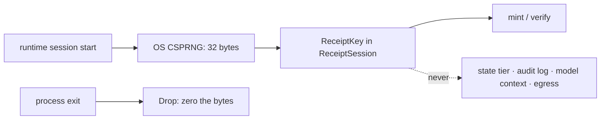
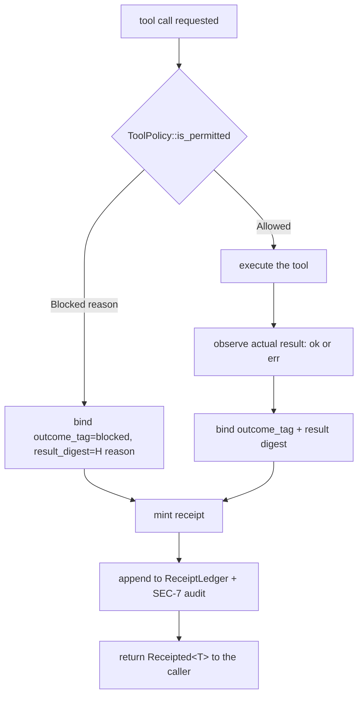

# Tool Receipts (Implementation)

**Version:** 1.0.0
**Status:** Stable
**Layer:** implementation
**Implements:** l1-tool-receipts.md

## Overview

The concrete realization of model-unforgeable per-action execution receipts (TR-1…TR-9)
as a **keyed-BLAKE3 MAC over a length-prefixed action binding**, split across the
established domain/facade seam: the pure signing and verification logic in
`crates/domain`, the ephemeral key's birth and the tool-dispatch wiring in the
`crates/core` facade.

Two properties drive every decision below.

**The primitive costs nothing new.** `blake3` is already a `cronus-domain` dependency
and already on the domain boundary guard's allowlist, and BLAKE3 ships a native keyed
mode that *is* a MAC — not a hash-then-truncate improvisation. The whole subsystem
therefore lands with **zero new crates**, which is what makes TR-1's "every effectful
action, no exceptions" affordable rather than aspirational.

**Unforgeability is structural, not procedural.** A receipt is not something a call
site remembers to produce: the dispatch seam returns a receipt-bearing outcome, so an
execution path that skips the receipt does not compile. This is the same
structural-enforcement lineage as BA-4 (no write path to activation), OA-4 (no
authority key in the schema), and DVO-3 (no code path to mint an admission) — the
guarantee is held by the type system, not by discipline.

## Related Specifications

- [l1-tool-receipts.md](l1-tool-receipts.md) — the parent contract (TR-1…TR-9).
- [l2-tool-security.md](l2-tool-security.md) — the `ToolPolicy::is_permitted` gate this subsystem attaches to, and the SEC-7 `AuditEntry` / `append_audit_entry` log TR-9 strengthens from *logged* to *provable*.
- [l2-crate-topology.md](l2-crate-topology.md) — the tier model this spec's placement obeys: pure-`std`-plus-allowlist logic in `cronus-domain`, entropy and I/O in the facade.
- [l2-security.md](l2-security.md) — SEC-1 secret isolation (the receipt key is a secret by the same rules) and the SEC-7 audit trail.
- [l2-dev-office.md](l2-dev-office.md) — DVO-7 composed the SEC-7 audit baseline *because* this subsystem did not exist; it is the first caller that upgrades once this ships.
- [l1-claim-verification.md](l1-claim-verification.md) — the output-side sibling; §4.7 draws the boundary so neither absorbs the other.
- [l1-attestation.md](l1-attestation.md) — the asymmetric/offline flavour this spec deliberately is not (TR-6).
- [l1-execution-graph.md](l1-execution-graph.md) — EG-12 deferred nodes define the TR-8 coverage boundary realized in §4.6.
- [../../nodus/specifications/l1-nodus-observability.md](../../nodus/specifications/l1-nodus-observability.md) — HO-9 carries a host-supplied receipt string on the trace; nodus stores and echoes, never mints (§4.8).

## 1. Motivation

`l1-tool-receipts` reached Stable on 2026-07-02 and has **no implementation anywhere
in the project**. This is not an inference — the gap was found during real execution
and disclosed rather than absorbed: the developer-office build assumed receipts among
its "already-shipped subsystems", discovered they did not exist, composed the real
SEC-7 audit log instead, and flagged the absence for a dedicated pass. The comment at
`crates/core/src/dev_office_workspace.rs:10` documents its own missing dependency in
prose.

The gap matters more than an ordinary unbuilt concept because the audit log the
project does have answers a *different question*. A log records what the runtime
believes happened. It cannot tell a reader whether the model's user-facing narration
matches that belief, because the log and the narration are separate channels — a
correct log sits happily beside a sentence claiming a deploy that never ran. Receipts
bind proof into the channel the model speaks through, which is the only place the
fabrication actually occurs.

## 2. Constraints & Assumptions

- **No new dependency.** `blake3` (allowlisted for `cronus-domain`) supplies the MAC.
  Adding a crypto crate for this would fail the standard-library-first policy when a
  keyed MAC is already in the tree.
- **The domain crate cannot generate entropy.** `getrandom` lives in `crates/auth-local`
  and is deliberately absent from the domain allowlist, so key *generation* is a facade
  act and the domain receives an opaque, already-random key.
- **The reasoning model is the adversary; the process is trusted.** No hardening
  against a local attacker with process-memory access is attempted — that adversary
  already owns the key and every other secret in the process.
- **Receipts are cheap enough to be unconditional.** A keyed BLAKE3 over a few hundred
  bytes is sub-microsecond; the design never trades coverage for speed, because a
  subsystem that receipts *most* actions gives TR-4 nothing to stand on.
- **Verification is scoped to the live session.** Key rotation on restart makes older
  receipts unverifiable by construction (TR-5); the durable record survives as history,
  not as re-checkable proof (§4.5).

## 3. Invariant Compliance (Layer 2)

| L1 Invariant | Implementation |
| --- | --- |
| **TR-1** Per-action receipt | `ReceiptedDispatch::invoke` is the only public execution path and returns `Receipted<T>`, which cannot be constructed without a `Receipt`. Blocked calls take the same path: `ToolPermitResult::Blocked(reason)` is bound as the outcome (§4.4), so allowed, auto-approved, and blocked actions are all receipted with no call-site opt-out. The binding carries a per-session monotonic `action_id`, so the receipt witnesses *this invocation* and not merely an action shape — two identical calls yield distinct receipts (§4.2). |
| **TR-2** Model-unforgeable | `blake3::keyed_hash` over a 32-byte `ReceiptKey` held only in the facade's `ReceiptSession`. The key is never placed in a prompt, a tool result, a log line, or any struct that crosses into context assembly; `ReceiptKey` has a hand-written `Debug` printing `ReceiptKey(<redacted>)` and no `Display`/`Serialize`, so it cannot reach the model by an accidental format call (§4.3). Forging is also closed off *around* the key rather than only through it: the `action_id` in the binding means an echoed prior receipt does not validate as a new invocation (§4.2). |
| **TR-3** Result authenticity | The observed result — success value or error — is a bound field inside the MAC input, not an adjacent annotation. Altering the narrated result changes the binding and the recomputed tag no longer matches (§4.2). |
| **TR-4** Existence authenticity | The per-turn `ReceiptLedger` is the sole authority on "did this happen". Any component that would record an action as fact consults it and gets `Unreceipted` for anything absent — a **default-deny on the fact-recording path**, never prose parsing (§4.5). |
| **TR-5** Ephemeral, isolated secret | Generated once per runtime session in `receipts_bootstrap.rs` from the OS CSPRNG, held in volatile memory only, zeroed on `Drop`. Never written to the state tier, never in an `AuditEntry`, never egressed. Rotation is implicit in process restart (§4.3). |
| **TR-6** Runtime-verified, not third-party | `verify()` requires the `ReceiptKey`, which exists only inside the process. No public-key material, no exported verification surface, no offline claim anywhere in the API or its docs (§4.7). |
| **TR-7** Complement, never replacement | Receipts are minted **after** `ToolPolicy::is_permitted` has already decided, and the decision itself is an input to the binding, not an output of it. The type carries no `allow`/`deny` capability and no grounding verdict (§4.4, §4.7). |
| **TR-8** Honest coverage boundary | A detached action gets `ReceiptState::Pending { action_id }` at dispatch and a full receipt on correlated completion. Coverage is reported as a `CoverageReport { receipted, pending }` pair, so a surface cannot render "all verified" while work is outstanding (§4.6). |
| **TR-9** Tamper-evident auditable record | Every mint appends to the existing SEC-7 append-only audit log via `append_audit_entry`, carrying the receipt token (safe to log, TR-6) and never the key. A failed `verify()` is itself appended as a `receipt_mismatch` outcome — the mismatch is an auditable event, not a silent `false` (§4.5). |

## 4. Detailed Design

### 4.1 Tier split (crate placement)

```plaintext
crates/domain/src/tool_receipts.rs     // pure, I/O-free, deterministic
    ReceiptKey            // opaque 32-byte newtype; no Display/Serialize; zeroed on Drop
    ActionBinding         // the canonical, length-prefixed MAC input
    Receipt               // token + bound fields; no secret material
    ReceiptState          // Minted | Pending { action_id }
    Receipted<T>          // an outcome that cannot exist without a Receipt
    ReceiptLedger         // per-turn record; answers TR-4's "did this happen"
    mint() / verify()     // keyed_hash + constant-time compare

crates/core/src/receipts_bootstrap.rs  // facade: entropy, session lifetime, wiring
    ReceiptSession        // owns the ReceiptKey for one runtime session
    ReceiptedDispatch     // the only public tool-execution path
    audit sink            // append_audit_entry (SEC-7), token only, never the key
```

The split follows the `activation_bootstrap` / `knowledge_bootstrap` / `loop_bootstrap`
precedent exactly: everything deterministic is domain logic testable against fixed key
vectors with no I/O, and the single non-deterministic act — reading OS entropy — sits
in the facade where `getrandom` is reachable. The domain half needs **no** change to
`scripts/check-domain-boundary.mjs`, because `blake3` is already allowlisted.

### 4.2 The canonical binding — why concatenation is not enough

The parent's §4.1 reference sketch writes the MAC input as
`action_kind ‖ inputs ‖ result ‖ timestamp`. Implemented as literal concatenation this
is **forgeable by field-boundary shifting**: the byte stream for
`kind="deploy", inputs="prod"` is identical to `kind="deployprod", inputs=""`, so one
valid receipt is simultaneously a valid receipt for a different action. The model does
not need the key to exploit this — it only needs to re-describe the same bytes with the
boundaries moved.

Every field is therefore length-prefixed, making the encoding injective:

```text
[REFERENCE]
binding := domain_tag
        ‖ u64_le(action_id)                           // per-session monotonic invocation counter
        ‖ u32_le(len(action_kind))  ‖ action_kind
        ‖ u32_le(len(inputs_digest))‖ inputs_digest
        ‖ u32_le(len(outcome_tag))  ‖ outcome_tag     // "ok" | "err" | "blocked"
        ‖ u32_le(len(result_digest))‖ result_digest
        ‖ u64_le(timestamp_ms)

tag     := blake3::keyed_hash(key, binding)           // 32 bytes
token   := "cronus-rcpt-" ‖ base16(timestamp_ms) ‖ "-" ‖ base16(tag[0..16])
```

- **`domain_tag`** is a constant literal distinguishing receipt MACs from any other
  keyed hash the project may later compute with a sibling key, so two subsystems can
  never accept each other's tags.
- **`action_id` is what makes a receipt witness an *invocation* rather than an action
  *shape*.** Without it, two identical calls — same kind, same inputs, same result,
  landing in the same millisecond — produce byte-identical bindings and therefore the
  same token, and a model holding one valid receipt could echo it to assert a second
  invocation that never occurred. That replay needs no key, so it would defeat TR-2 by
  going around it rather than through it. The counter is a per-session monotonic
  assigned by the dispatcher at invocation time, and it is the same `action_id` the
  ledger keys on (§4.5) — one identity, used for both binding and lookup.
- **Digests, not raw values.** Inputs and results are hashed before binding, which
  bounds token cost independently of payload size and keeps a secret-bearing argument
  out of the binding buffer.
- **128-bit truncation** is deliberate. The adversary is an in-process model with no
  key access and no verification oracle to grind against; 2^128 is overwhelming, and a
  short token keeps tool results readable.
- **`outcome_tag` is separate from `result_digest`** so that "succeeded with empty
  output" and "was blocked with an empty reason" cannot collide.

`verify()` recomputes the tag and compares in **constant time**. A short-circuiting
`==` would leak tag bytes positionally under repeated probing; the comparison is a
fold over the full length regardless of the first mismatch.

### 4.3 The key (TR-5)



`ReceiptKey` is a newtype over `[u8; 32]` with the leak paths closed by construction:
a hand-written `Debug` that prints a fixed redaction placeholder, no `Display`, no
`Serialize`, no `Clone`, and no accessor returning the raw bytes to anything outside
the module. The signing functions take `&ReceiptKey` and never move it.

On `Drop` the bytes are overwritten through a volatile write so the compiler may not
elide the store as dead. This is the honest std-only ceiling: it does not defeat a
value the optimizer already copied into a spilled register or a `memcpy` temporary
earlier in its life. That residual is accepted rather than papered over, because the
threat model's adversary is the model, which reads context and not process memory —
and because reaching for a dedicated scrubbing crate to close a gap this adversary
cannot walk through would trade a real dependency for a theoretical gain.

The token prefix `cronus-rcpt-` is a stable, well-known literal so the secret scrubber
(`crates/domain/src/redact.rs`) passes receipts through unredacted. Receipts carry no
secret material (TR-6) and are useless when redacted — a scrubbed receipt is
indistinguishable from a missing one, which would make TR-4 fire on genuine actions.

### 4.4 The dispatch seam (TR-1, TR-7)



Two properties are load-bearing:

**The gate's verdict is an input.** `is_permitted` runs first and unchanged; its result
is bound into the receipt. Receipts therefore witness the authorization decision without
participating in it — TR-7's "complement, never replacement" expressed as data flow, and
the reason a receipt can never be mistaken for a grant of authority (SEC-10).

**`Receipted<T>` has no bare constructor.** The caller cannot obtain the result value
without the receipt travelling beside it. Combined with `ReceiptedDispatch::invoke`
being the only public execution entry point, TR-1 holds because the alternative does
not compile — the exact property the audit-log baseline could never offer, since
appending to a log is always something a call site can forget.

### 4.5 The ledger, absence, and the audit record (TR-4, TR-9)

TR-4 is the invariant most likely to be implemented as something it is not. It does
**not** mean parsing the model's prose for action claims — that is an unbounded NLP
problem and would fail open on every phrasing it did not anticipate.

The realization inverts the burden. `ReceiptLedger` holds this turn's receipts, and
the rule binds the *fact-recording* path rather than the narration:

```text
[REFERENCE]
ledger.status(action_id) -> Receipted(receipt) | Pending | Unreceipted

any component that would record an action as having occurred
  — a session checkpoint, a summary, a work-item state change, a user-facing surface —
  MUST consult status() and treat Unreceipted as fabricated.

there is no "assume true when absent" branch anywhere in the API.
```

The runtime never upgrades an unreceipted claim to fact because no function exists that
performs the upgrade. A model may still *say* anything; what it cannot do is get that
sentence promoted into durable state.

For TR-9, every mint appends an `AuditEntry` through the existing
`append_audit_entry` (`crates/domain/src/tool_security.rs`) carrying the token, the
action kind, and the outcome — never the key, never a raw input. A `verify()` returning
mismatch appends its own entry with a `receipt_mismatch` outcome, so a detected
fabrication is a recorded event rather than a boolean the caller might discard.

The record outlives its key. After rotation the ledger remains a readable, append-only
history and stops being re-verifiable proof — the direct consequence of TR-5's
ephemerality, and the honest reading of TR-9: the record is tamper-*evident* within the
session that produced it, and archival history thereafter.

### 4.6 Deferred actions (TR-8)

An action detached from the current turn (EG-12) cannot be receipted at dispatch,
because its result — the thing TR-3 requires inside the MAC — does not exist yet.

```text
dispatch  → ReceiptState::Pending { action_id }   // no tag; nothing to bind
resume    → result observed → mint → ReceiptState::Minted(receipt)
```

`Pending` is a distinct state, never a receipt with a placeholder result: a tag
computed over a fabricated result would be a *valid* receipt for a false claim, which
inverts the entire subsystem. Coverage is surfaced as
`CoverageReport { receipted: usize, pending: usize }`, and any display of receipt
status renders both numbers. A surface may not report full verification while
`pending > 0` — TR-8's honesty requirement expressed as a shape the caller cannot
round down.

### 4.7 Boundaries — what this subsystem must not grow into

- **Not authorization.** No API accepts or returns a permission decision. The gate
  decides; receipts witness (TR-7).
- **Not grounding.** No comparison of claims against sources — that is
  `l1-claim-verification`, a different and more expensive question (TR-7).
- **Not third-party proof.** No asymmetric key, no exported verifier, no serialized
  proof format. Any future need for offline verification belongs to `l1-attestation`
  and its own L2, never as an extension here (TR-6).
- **Not a forced-tool-use mechanism.** Receipts observe actions the runtime is asked to
  take; they never require an action to be taken (TR-7).

### 4.8 nodus disposition

No new nodus primitive. `l1-nodus-observability` HO-9 already carries an optional
host-supplied receipt string on the trace (`receipt: Option<String>` in
`crates/nodus/src/observability.rs`), which is exactly the right shape: nodus **stores
and echoes** an opaque token and never mints or verifies one. Minting inside the
portable core would require the workflow language to know a host's key material, which
the portability contract forbids. The host populates the field from this subsystem;
nodus stays ignorant of its meaning.

## 5. Implementation Notes

1. **`ReceiptKey` + `ActionBinding` + `mint`/`verify` first.** Everything else depends
   on the binding's shape, and it is the piece with real test vectors: fixed key, fixed
   fields, asserted tag. Two tests carry the whole justification for §4.2 and must be
   written with it: a **boundary-shifting** test (`kind="ab", inputs="c"` vs
   `kind="a", inputs="bc"` must produce different tags) and a **replay** test (two
   invocations identical in every field except `action_id`, at a pinned timestamp, must
   produce different tags, and the first receipt must fail `verify()` against the
   second's binding). Pin the clock in both — a test that lets the real millisecond
   advance passes for the wrong reason and would stay green if `action_id` were dropped.
2. **`Receipted<T>` and the private constructor next**, before any caller exists. Adding
   the wrapper after call sites accumulate turns a compile-time guarantee into a
   refactor nobody finishes.
3. **`ReceiptLedger` and `status()`**, with the `Unreceipted` default proven by a test
   that queries an action never dispatched.
4. **Facade wiring last** — `ReceiptSession` key generation, `ReceiptedDispatch` over
   the real `ToolPolicy`, and the `append_audit_entry` sink. This is the only part
   needing real I/O and the only part not unit-testable against fixed vectors.
5. **Verify the leak paths as tests, not by inspection**: assert that
   `format!("{:?}", key)` contains no key byte, and that a redaction pass over a string
   containing a receipt token leaves the token intact.
6. Prefer a constant-time compare written once in this module over hand-rolling it at
   each call site; there is exactly one comparison that matters and it is in `verify()`.
7. Code comments explain rationale in plain language — the boundary-shifting hazard and
   the volatile-drop caveat both deserve a sentence at their site, in their own terms.

## 6. Drawbacks & Alternatives

- **A second SEC-7 writer.** Receipts and the existing tool-security audit path both
  append to the same log. Accepted deliberately: TR-9 asks receipts to *strengthen* the
  existing trail rather than open a parallel one, and a second log file would split the
  forensic record exactly where a reader needs it whole.
- **`Receipted<T>` is contagious.** Wrapping every tool outcome pushes the type through
  call chains that do not care about receipts, which is real ergonomic cost. It is also
  the mechanism: a wrapper that can be dropped early is a wrapper that will be, and TR-1
  degrades to a convention the first time someone is in a hurry.
- **Alternative — sign only "important" actions.** Rejected. TR-4 reads absence as
  fabrication, so a selective policy makes every unreceipted action ambiguous between
  "not covered" and "never happened", which is precisely the signal the subsystem
  exists to produce.
- **Alternative — reuse `hmac` + `sha1` from `crates/auth-local`.** Rejected on two
  counts: it would add a dependency edge to a crate the domain boundary guard forbids
  (INV-8), and SHA-1 is the wrong primitive to introduce into new code when an
  allowlisted modern keyed hash is already present.
- **Alternative — persist the key so receipts verify across sessions.** Rejected: TR-5
  is explicit, and a durable key converts a secret with no theft window into one with a
  permanent, on-disk theft surface — a strictly worse trade for a guarantee scoped to
  in-session fabrication.
- **The volatile-write drop is a partial guarantee.** §4.3 states the residual honestly
  rather than implying full scrubbing; closing it fully requires a dependency this
  threat model does not justify.
  <!-- TBD: whether a future in-process debugging or crash-dump surface changes this
       calculus enough to reconsider a scrubbing crate. -->

## Canonical References

| Alias | Path | Purpose |
| --- | --- | --- |
| `[PARENT]` | `.design/main/specifications/l1-tool-receipts.md` | TR-1…TR-9, the contract this realizes |
| `[GATE]` | `crates/domain/src/tool_security.rs` | `ToolPolicy::is_permitted` seam (§4.4) and the SEC-7 `AuditEntry` / `append_audit_entry` sink (§4.5) |
| `[BOUNDARY]` | `scripts/check-domain-boundary.mjs` | The domain allowlist proving `blake3` needs no guard change (§4.1) |
| `[MANIFEST]` | `crates/domain/Cargo.toml` | Confirms `blake3` is already a domain dependency |
| `[REDACT]` | `crates/domain/src/redact.rs` | The scrubber the `cronus-rcpt-` prefix must survive (§4.3) |
| `[FACADE]` | `crates/core/src/loop_bootstrap.rs` | The facade-composition precedent `receipts_bootstrap.rs` follows (§4.1) |
| `[NODUS]` | `crates/nodus/src/observability.rs` | HO-9's host-supplied `receipt` field — store-and-echo, never mint (§4.8) |

## Document History

| Version | Date | Author | Notes |
| --- | --- | --- | --- |
| 1.0.0 | 2026-08-12 | Core Team | **Post-Update Review finding, fixed before promotion:** the first draft's binding omitted any per-invocation identity, so two identical calls landing in the same millisecond produced byte-identical tokens and a model could echo one valid receipt to assert a second invocation — a replay that needs no key and therefore defeats TR-2 by going around it. A per-session monotonic `action_id` (the same identity the ledger already keyed on) now leads the binding, with a paired clock-pinned replay test in §5 so the property cannot silently regress. Initial spec, authored directly at Stable — the realization of `l1-tool-receipts`, whose absence was found and disclosed during the developer-office build rather than hidden, and deferred to a dedicated spec-driven pass. Keyed-BLAKE3 MAC using the already-allowlisted `blake3` domain dependency, so the subsystem lands with **zero new crates** (§4.1). Domain/facade tier split on the established `*_bootstrap.rs` precedent: deterministic sign/verify logic in `crates/domain/src/tool_receipts.rs`, OS entropy and dispatch wiring in `crates/core/src/receipts_bootstrap.rs`. **Corrects a genuine hazard in the parent's §4.1 reference sketch**: literal `‖` concatenation is forgeable by field-boundary shifting (`kind="ab",inputs="c"` and `kind="a",inputs="bc"` produce identical bytes), so the binding is length-prefixed and injective, with a domain-separation tag and a constant-time tag comparison (§4.2). TR-1 held structurally by `Receipted<T>`, which has no public constructor, over a single `ReceiptedDispatch::invoke` entry point — the BA-4/OA-4/DVO-3 structural-enforcement lineage applied to execution authenticity, and the property an append-to-a-log baseline can never provide. TR-4 realized as a **default-deny on the fact-recording path** via `ReceiptLedger::status`, explicitly *not* prose parsing: no API exists that upgrades an unreceipted claim to fact (§4.5). TR-8's `Pending` is a distinct state rather than a receipt over a placeholder result, since a tag computed over a fabricated result would be a valid receipt for a false claim (§4.6). TR-5's key is ephemeral, non-`Debug`-printable, non-`Serialize`, zeroed on drop, with the volatile-write residual stated honestly rather than overclaimed (§4.3). nodus disposition: no new primitive — HO-9 already stores and echoes an opaque host-supplied token, and minting inside the portable core would require host key material the portability contract forbids (§4.8). |
