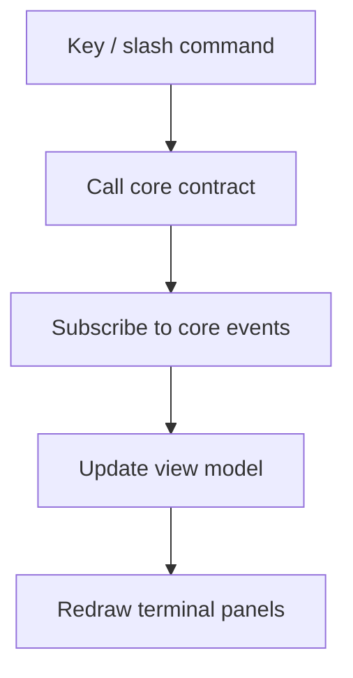

# TUI Frontend

**Version:** 1.0.0
**Status:** Stable
**Layer:** implementation
**Implements:** l1-architecture.md

## Overview

Architectural layer 3: the **terminal user-interface frontend**. It renders core state interactively in the terminal (boards, status, sessions, agent activity) and accepts slash-style commands with parity to the CLI and application surfaces.

## Related Specifications

- [l1-architecture.md](l1-architecture.md) - Concept this layer implements.
- [l2-core-library.md](l2-core-library.md) - The core this TUI drives.
- [l2-cli.md](l2-cli.md) - Sibling frontend (non-interactive).
- [l2-app-ui.md](l2-app-ui.md) - Sibling frontend (graphical).

## 1. Motivation

The TUI gives an interactive, keyboard-driven view of the autonomous office without a graphical environment — ideal over SSH and on servers/hubs. It surfaces live state (Kanban, agent activity, logs) that the plain CLI cannot render well.

## 2. Constraints & Assumptions

- Implemented in **Rust**, linking the core crate; runs in any ANSI terminal.
- Event-driven render loop reflecting core state changes; never blocks on long core operations (async).
- Slash-command input mirrors the CLI command set (INV-3 parity).
- No domain logic in the TUI layer (INV-2).

## 3. Invariant Compliance (Layer 2 only)

| L1 Invariant | Implementation |
| --- | --- |
| INV-1 Embeddable core | TUI links the core library; pure consumer. |
| INV-2 Logic in core only | TUI handles rendering + key/command input; behavior delegates to the core. |
| INV-3 Command parity | Slash commands (`/help`, `/init`, `/plan`, `/run`, `/status`, `/goal`, …) map 1:1 to the shared capability set. |
| INV-4 Hub-and-spoke autonomy | Runs on a hub (incl. over SSH) to observe/drive the autonomous engine; on a spoke acts as a client view. |
| INV-5 Durable, restartable state | TUI holds only view state; reconnecting reflects the core's durable state. |
| INV-6 Graceful capability scaling | Panels for unsupported capabilities are hidden/disabled, never behaviorally divergent. |
| INV-7 Security of client data | Secrets are never rendered; sensitive fields masked. |

## 4. Detailed Design

### 4.1 Views

| View | Content |
| --- | --- |
| Board | Kanban columns `triage → todo → ready → running → blocked → done → archive` with live task movement |
| Office | Graphical-in-text schema of agents and their current tasks |
| Status | Current position, progress, blockers (mirrors `status` capability) |
| Sessions/Log | Live agent activity, decisions, and tool output stream |
| Command bar | Slash-command input with discovery (`/help`) |

### 4.2 Render loop

### 4.3 Parity with CLI

Every `/command` in the TUI corresponds to a `cronus command` in the CLI (see [l2-cli.md](l2-cli.md) §4.1). The difference is presentation (interactive panels vs text output), never behavior (INV-3).

## 5. Drawbacks & Alternatives

- **Terminal rendering limits:** complex office visualizations are richer in the graphical app (INV-6 allows the subset).
- **Alternative — TUI only, no GUI:** rejected; non-technical clients need the full graphical surface (layer 4). <!-- TBD: choose terminal-UI rendering approach during implementation spike -->

## Canonical References

| Alias | Path | Purpose |
| --- | --- | --- |
| `[ARCH]` | `.design/main/specifications/l1-architecture.md` | Invariants (esp. INV-3 parity) |
| `[CORE]` | `.design/main/specifications/l2-core-library.md` | The contract the TUI binds to |
