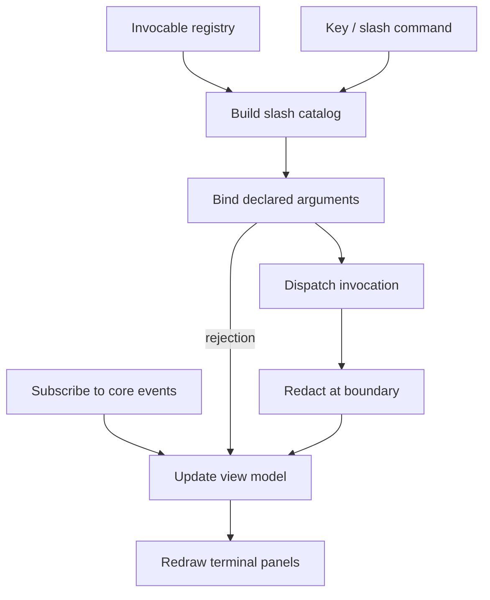

# TUI Frontend

**Version:** 1.1.0
**Status:** Stable
**Layer:** implementation
**Implements:** l1-architecture.md

## Overview

Architectural layer 3: the **terminal user-interface frontend**. It renders core state interactively in the terminal (boards, status, sessions, agent activity) and accepts slash-style commands with parity to the CLI and application surfaces.

Its slash catalog is not declared here. It is a **projection of the core's invocable registry** — the same catalog the CLI and the desktop shell project — so the three surfaces share one vocabulary by construction rather than by maintenance.

## Related Specifications

- [l1-architecture.md](l1-architecture.md) - Concept this layer implements.
- [l2-core-library.md](l2-core-library.md) - The core this TUI drives.
- [l2-cli.md](l2-cli.md) - Sibling frontend (non-interactive).
- [l2-app-ui.md](l2-app-ui.md) - Sibling frontend (graphical).
- [l2-application-shell.md](l2-application-shell.md) - Sibling frontend (desktop shell); the third consumer of the same registry. `[ADDED v1.1.0]`
- [l2-invocable-registry.md](l2-invocable-registry.md) - The catalog and dispatch this frontend projects. `[ADDED v1.1.0]`
- [l2-surface-conformance.md](l2-surface-conformance.md) - The corpus this frontend registers against. `[ADDED v1.1.0]`
- [l1-surface-parity.md](l1-surface-parity.md) - Why the catalog is derived rather than mirrored. `[ADDED v1.1.0]`

## 1. Motivation

The TUI gives an interactive, keyboard-driven view of the autonomous office without a graphical environment — ideal over SSH and on servers/hubs. It surfaces live state (Kanban, agent activity, logs) that the plain CLI cannot render well.

`[ADDED v1.1.0]` This frontend is also where the project learned what a mirrored catalog costs. Its parity was asserted against a hand-copied list of the CLI's verbs, held inside this crate specifically so the check would not need a dependency on the crate it was checking. The reasoning was sound; the result was an oracle comparing a copy against itself. The CLI grew to twenty-nine groups, the copy stayed at twenty-one, and the assertion remained green while the two surfaces diverged by eight verbs. The amendment replaces the copy with a projection and the self-comparison with a corpus.

## 2. Constraints & Assumptions

- Implemented in **Rust**, linking the core crate; runs in any ANSI terminal.
- Event-driven render loop reflecting core state changes; never blocks on long core operations (async).
- Slash-command input mirrors the CLI command set (INV-3 parity).
- No domain logic in the TUI layer (INV-2).
- **The slash catalog is generated, not written.** `[ADDED v1.1.0]` It is built from the registry's descriptors, as is the discovery listing. A hand-maintained catalog is forbidden as a source of truth, and a hand-copied restatement of another surface's verbs is forbidden as an oracle.
- **This frontend is reached through the single binary.** `[ADDED v1.1.0]` The terminal UI is a verb of the one entry point rather than a separately named second executable, so a user meets one product with one command surface.
- **Panels render from a core-supplied projection.** `[ADDED v1.1.0]` Board, office, and session views are read models the core provides. A panel that has no projection renders as *unavailable*, never as empty — the two are different states and must remain distinguishable.

## 3. Invariant Compliance (Layer 2 only)

| L1 Invariant | Implementation |
| --- | --- |
| INV-1 Embeddable core | TUI links the core library; pure consumer. |
| INV-2 Logic in core only | TUI handles rendering + key/command input; behavior delegates to the core. `[MODIFIED v1.1.0]` Domain facts the panels need — locations, orderings, defaults, board contents — arrive as core projections; the frontend derives none of them. |
| INV-3 Command parity | `[MODIFIED v1.1.0]` Parity is **structural, not asserted**. The slash catalog is a projection of the invocable registry shared with the CLI and desktop shell, leaving no place to hold a verb the registry lacks and no way to miss one it has. The prior hand-copied verb mirror is deleted and tombstoned (finding F-2). Residual behavioral agreement is proven by the conformance corpus, which this frontend registers against from its own test target (SP-6/SP-7). |
| INV-4 Hub-and-spoke autonomy | Runs on a hub (incl. over SSH) to observe/drive the autonomous engine; on a spoke acts as a client view. |
| INV-5 Durable, restartable state | TUI holds only view state; reconnecting reflects the core's durable state. |
| INV-6 Graceful capability scaling | Panels for unsupported capabilities are hidden/disabled, never behaviorally divergent. `[MODIFIED v1.1.0]` *Unsupported* and *empty* are distinct rendered states; a panel whose projection is unavailable says so rather than displaying empty columns. |
| INV-7 Security of client data | `[MODIFIED v1.1.0]` Secrets are never rendered. Masking is applied by the **dispatch boundary** rather than re-implemented here; this frontend's local redaction call is removed in favor of the shared one, and the separate obligation that the core supply a non-empty secret list is tracked as a residual in `l2-surface-conformance` §4.7. |
| INV-8 Single-deployable modular monolith | The TUI is a frontend over the sanctioned frontend↔core boundary: it renders one in-process core, or attaches to a hub as a client view — never a distributed tier. It introduces no service and no orchestration dependency; its interaction with the core is an in-process contract/event stream. |
| INV-9 Shipped-surface honesty | `[MODIFIED v1.1.0]` Enforced at the projection. Only shipped invocables enter the catalog and the discovery listing, so an unbound slash verb is unrepresentable rather than discouraged — which also retires the placeholder response this frontend returned for every verb but one. Retirement follows the same declared path as the CLI (l1-architecture v1.4.0). |
| INV-10 Representation isolation at the inward seam | The inward seam INV-10 governs lives inside the core; the TUI stands outward and binds core contract types only, naming no adapter representation (no store row, no keychain handle). Per `l2-crate-topology` §4.8 the TUI may even link the pure-domain tier and still touches no storage or keychain type — the inward leak INV-10 forbids is structurally absent from this surface. |

## 4. Detailed Design

### 4.1 Views

| View | Content |
| --- | --- |
| Board | Kanban columns `triage → todo → ready → running → blocked → done → archive` with live task movement |
| Office | Graphical-in-text schema of agents and their current tasks |
| Status | Current position, progress, blockers (mirrors `status` capability) |
| Sessions/Log | Live agent activity, decisions, and tool output stream |
| Command bar | Slash-command input with discovery, rendered from the catalog `[MODIFIED v1.1.0]` |

`[ADDED v1.1.0]` Each panel is a pure function of a core-supplied projection plus terminal-local view state. Until a projection exists for a panel, that panel renders **unavailable with its reason** — the state it must not do is render an empty, successful-looking view of data it could not obtain, which is the panel-level form of the same defect the CLI exhibits when a store error prints an empty listing.

### 4.2 Render loop

```mermaid
graph TD
    REG[Invocable registry] --> CAT[Build slash catalog]
    SUB[Subscribe to core events] --> STATE[Update view model]
    STATE --> DRAW[Redraw terminal panels]
    KEY[Key / slash command] --> CAT
    CAT --> BIND[Bind declared arguments]
    BIND -->|rejection| STATE
    BIND --> CALL[Dispatch invocation]
    CALL --> MASK[Redact at boundary]
    MASK --> STATE
```

### 4.3 Parity with CLI

`[MODIFIED v1.1.0]` **This section deliberately restates no command set.**

Both frontends project the same registry, so a slash verb and its shell counterpart are two renderings of one descriptor. The difference is presentation — interactive panels versus text output, and slash form versus verb-first flags — never behavior, and never membership (INV-3).

What remains checkable after derivation is behavioral agreement between two projections of the same descriptor: a rejection surfaced by one and swallowed by the other, or an unavailable projection that one distinguishes from empty and the other does not. That class is proven by the conformance corpus, which this frontend drives through its **real** projection from its own test target — not through a restatement of it, which is precisely what the deleted mirror was.

### 4.4 Entry point

`[ADDED v1.1.0]` The terminal UI is launched as a verb of the single `cronus` binary. A separately named executable presents the same engine as two products, splits discovery (`--help` would not mention it), and gives a user two things to install and remember for one capability. The binary that previously shipped standalone is retired under the declared-retirement rule rather than deleted silently.

## 5. Drawbacks & Alternatives

- **Terminal rendering limits:** complex office visualizations are richer in the graphical app (INV-6 allows the subset).
- **A generated catalog gives up compile-time exhaustiveness** over the verb set. `[ADDED v1.1.0]` Accepted for the same forced reason as the CLI: a build-time catalog cannot carry a contributed verb.
- **Alternative — TUI only, no GUI:** rejected; non-technical clients need the full graphical surface (layer 4).
- **Alternative — regenerate the mirrored verb list instead of deleting it:** `[ADDED v1.1.0]` rejected. A generated copy is still a copy; it fails as a stale artifact rather than as a disagreement between the things that actually run, which is the failure the corpus must produce.

## Canonical References

| Alias | Path | Purpose |
| --- | --- | --- |
| `[ARCH]` | `.design/main/specifications/l1-architecture.md` | Invariants (esp. INV-3 parity, INV-9 honesty) |
| `[CORE]` | `.design/main/specifications/l2-core-library.md` | The contract the TUI binds to |
| `[REGISTRY]` | `.design/main/specifications/l2-invocable-registry.md` | The catalog and dispatch this surface projects |
| `[CORPUS]` | `.design/main/specifications/l2-surface-conformance.md` | The corpus this surface registers against |

## Document History

| Version | Date | Notes |
| --- | --- | --- |
| 1.0.1 | 2026-07-29 | Extended §3 Invariant-Compliance to INV-8/9/10 (frontend boundary; honest slash-command surface; binds contract types only) — completeness fix. |
| 1.1.0 | 2026-09-05 | The slash catalog becomes a **projection of the invocable registry** rather than a hand-maintained list, and the **hand-copied verb mirror is deleted and tombstoned** (finding F-2) — the check-that-cannot-fail this frontend carried, green while the two surfaces differed by eight verbs. INV-3 parity is restated as structural, with residual behavioral agreement proven by the conformance corpus driven through this surface's **real** projection from its own test target. INV-9 moves to representability: only shipped invocables enter the catalog, retiring the placeholder response returned for every verb but one. INV-7 masking moves to the dispatch boundary and the local redaction call is removed; the inert-empty-secret-list half is recorded as a residual. INV-6 gains the *unsupported ≠ empty* distinction, and §4.1 makes it explicit for panels: a view whose projection is unavailable says so rather than rendering empty columns — the panel-level form of the defect the sibling frontend shows when a store error prints an empty listing. Adds §4.4: the terminal UI becomes a **verb of the single binary** rather than a separately named executable, with the standalone binary retired under the declared-retirement rule. |
