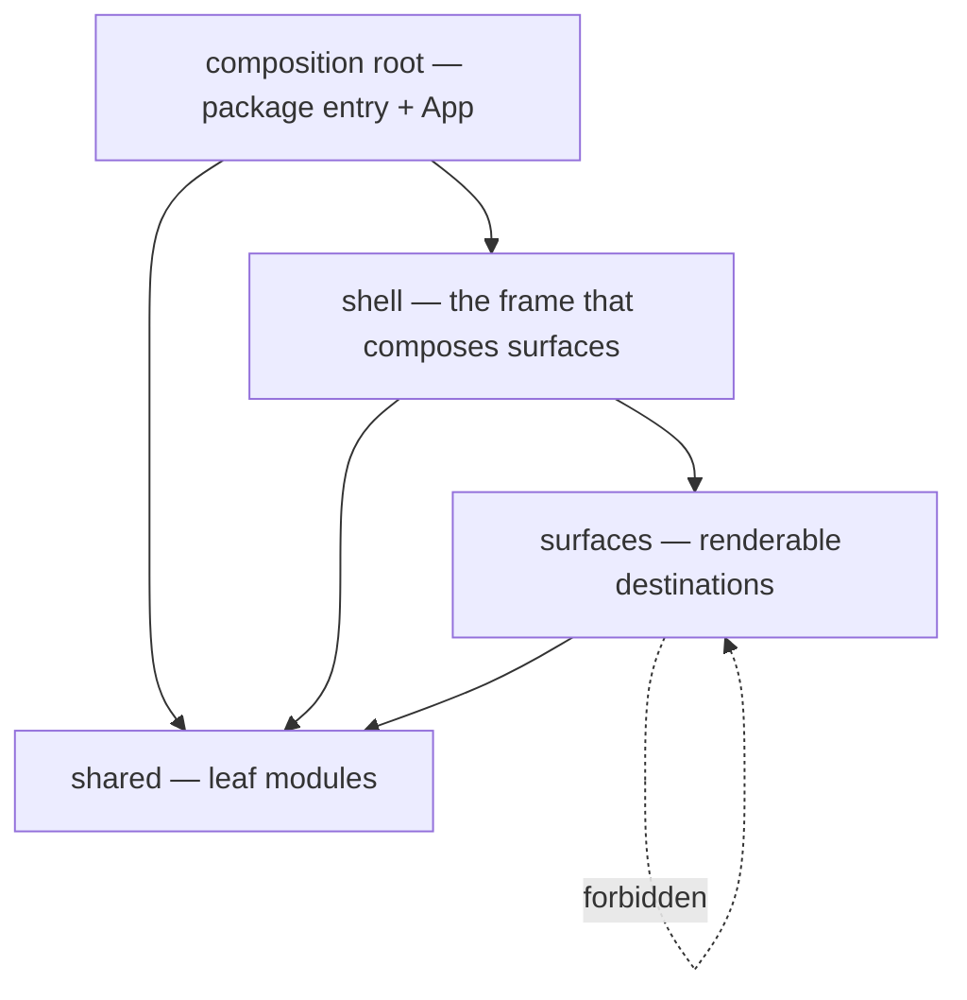

# UI Module Topology (Frontend Package Decomposition)

**Version:** 1.0.0
**Status:** Stable
**Layer:** implementation
**Implements:** l1-architecture.md

## Overview

How the frontend package `packages/ui` is partitioned into modules, which module may import which, and what each module publishes. It is the TypeScript twin of [l2-crate-topology.md](l2-crate-topology.md): where that spec turns INV-8's "strongly-bounded internal modules with strictly inward dependencies" into a boundary the Rust compiler enforces via the crate graph, this one faces a language with **no compile-time module boundary at all** — every file in a package can import every other file, and `tsc` will never object.

The decomposition axis is **direction of dependency**, not component kind. A module's tier is decided by what it is allowed to *know about*: the shared tier knows nothing above it, a surface knows only the shared tier, the shell knows surfaces, and the composition root knows the shell. There is no `components/`, `hooks/`, or `types/` tier, because those describe what a file *is* rather than what it may *reach*, and a boundary that does not constrain reach is not a boundary.

> Scope: the **inside** of `packages/ui`. The repository-level member layout (`crates/` · `apps/` · `packages/`) and the dependency direction *between* workspace members are specified in [l2-source-layout.md](l2-source-layout.md) §4.1–§4.2, which delegates here for this package's internals.

## Related Specifications

- [l1-architecture.md](l1-architecture.md) - INV-2 (no domain logic in frontends) and INV-8 (strongly-bounded internal modules) are what this topology makes checkable inside one package.
- [l2-crate-topology.md](l2-crate-topology.md) - The Rust-side counterpart, and the source of this spec's central lesson: its §6.4 records a real INV-2 violation caused purely by a module publishing more than it should have.
- [l2-source-layout.md](l2-source-layout.md) - The repo-level layout that delegates this package's internal decomposition here, exactly as its §4.5 delegates `crates/core` decomposition to the crate topology.
- [l2-app-ui.md](l2-app-ui.md) - The application this package renders; its §4.1 surfaces are the population of the surface tier, its §4.2 shell↔core bridge is the seam UMT-6 keeps single.
- [l2-quality-pipeline.md](l2-quality-pipeline.md) - §4.1 owns the structural gate (`fallow`) that mechanically enforces §4.4's rules; this spec resolves that section's open question of preset-versus-custom zones.
- [l2-navigation.md](l2-navigation.md) - Owns the concrete surface catalog and order; the catalog is shared-tier data, and the surfaces it names are the folders UMT-4 mints.
- [l2-design-system.md](l2-design-system.md) - The token contract realized by the shared-tier theming modules.
- [l1-invariant-tripwires.md](l1-invariant-tripwires.md) - TW-1/TW-2/TW-3/TW-10 govern §4.4: a mechanically checkable rule carries a mechanical check, authored with the rule, one check per rule, gating the delta.
- [l1-solution-frugality.md](l1-solution-frugality.md) - Why the enforcement reuses the structural gate already in the always-on tier instead of adding a second, partly-overlapping authority.
- [l1-change-containment.md](l1-change-containment.md) - A declared public surface is what makes a change to a module's internals containable; a module everything reaches into has no internals.

## 1. Motivation

`packages/ui` is small — roughly 3,000 lines across ~25 source files, one `shell/` subdirectory, everything else flat. Nothing in it is broken. The reason to specify its topology now is that **the cost of declaring a boundary rises with the number of edges that already cross it**, and the package is at the last moment where the declaration is nearly free.

Three specific problems are in scope.

**A boundary the toolchain cannot see is enforced by memory, and memory is what failed.** The Rust side gets its module boundaries checked on every build: a crate graph is acyclic by construction, and a module cannot reach a crate its manifest does not list. TypeScript offers no equivalent. `tsc --noEmit` type-checks a cycle happily; `biome` lints style, not shape. So today the rule "the theme module must not depend on a surface" exists only as an intention, and an intention is exactly what a refactor forgets.

**The failure mode is already documented on the other side of the repo.** [l2-crate-topology.md](l2-crate-topology.md) §6.4 records that `crates/cli` opened a database connection directly in production code — not because anyone decided a frontend should perform persistence, but because a sibling crate exposed `rusqlite::Connection` in its public API. Nobody violated a rule deliberately; a module published more than it meant to, and a call site downstream took what was offered. The same mechanism operates in TypeScript with nothing standing in its way, and its likeliest local form is a surface importing another surface's internal component and thereby coupling two destinations that a user experiences as independent.

**Tier membership is currently indistinguishable by path.** `dashboard.tsx` (a surface), `theme.ts` (shared), and `surfaces.tsx` (a catalog plus a composer) all sit at the same directory level. No pattern can name "the shared tier" because the shared tier has no location. This is the precondition problem, not a cosmetic one: the rules of §4.3 cannot be *expressed* to any tool, however good, until the partition exists in the filesystem.

## 2. Constraints & Assumptions

- The package holds **no domain logic** (INV-2). It renders projections the core computes and forwards intents over the IPC bridge. Any tier model that provides a natural home for business rules is wrong for this package by construction.
- `packages/ui` is a library consumed by exactly one workspace member (`apps/desktop`) through the package's own public entry point. It is not a routed multi-page application, and its destinations are shell-managed **surfaces**, not URL routes.
- The frontend is in active redesign; the topology must be describable and enforceable at today's size and must not require the surface set to be final.
- The enforcement mechanism must be one the repository already runs. The structural gate named in [l2-quality-pipeline.md](l2-quality-pipeline.md) §4.1 is always-on for JS/TS and already performs architecture-boundary analysis; adding a second structural authority is out of scope.
- Rules are **path-based**. A rule that depends on reading a file's contents to decide its tier cannot be checked cheaply and will not be checked.

## 3. Invariant Compliance (Layer 2 only)

| L1 Invariant | Implementation |
| --- | --- |
| INV-1 Embeddable core | Unaffected: this topology is internal to a frontend package. The core holds no dependency on `packages/ui` in either direction of this spec's scope. |
| INV-2 Logic in core only | This spec is INV-2's structural support inside the frontend. UMT-6 keeps IPC invocation in exactly one shared-tier module, so the seam to the core is a single named file rather than an ambient capability every component holds; a surface that wants core state must take it as a prop or through that one module. The zone-coverage rule (UMT-7) means a new file cannot appear outside the tier model and quietly become a second seam. |
| INV-3 Frontend interchangeability | Unaffected structurally, with one bearing: the surface catalog stays shared-tier data (owned by `l2-navigation`), so what the GUI advertises remains a declared list comparable against the CLI/TUI surfaces rather than an emergent property of which files happen to import which. |
| INV-4 Hub-and-spoke | N/A to a module topology. Desktop-versus-mobile responsibility split is a runtime property specified in `l2-app-ui` §4.3. |
| INV-5 Durable, restartable state | N/A: no durable state is held in this package. Persistence lives in the core and its adapters. |
| INV-6 Graceful capability scaling | Mild structural aid: a surface that is a self-contained folder with a declared public API is a surface a build can omit without unpicking imports from three other files. Which capabilities a running frontend exposes remains a core-contract decision. |
| INV-7 Security of client data | N/A: no secret handling in this package. The single-seam rule (UMT-6) has an incidental bearing — one module performs core calls, so any future redaction or audit of what the UI requests has one site rather than many. |
| INV-8 Single-deployable modular monolith | This spec is INV-8's enforcement mechanism inside `packages/ui`, in the same relation the crate topology holds to `crates/`. "Strongly-bounded internal modules with strictly inward dependencies" is unverifiable while every file can import every other file. The tiers of §4.2 are compile-time-and-lint-time seams only; they add no process boundary, no separate bundle, and no runtime indirection — the package still builds to one artifact linked into one deployable. |
| INV-9 Shipped-surface honesty | N/A to a module topology: which verbs the GUI advertises is a runtime surface property realized in `l2-app-ui` and `l2-navigation`. A directory neither lists nor hides a verb. |
| INV-10 Representation isolation at the inward seam | The lateral analogue of INV-10, applied within a layer. INV-10 keeps an adapter's internal representation unnameable by the domain; UMT-2 keeps a surface's internal representation — its sub-component props, local state shapes, and private helper types — unnameable by any other surface, published types being limited to the mount component, its props, and the core projections it consumes. Both are the same rule: a module's private shape is private, and crossing a seam is a declared act. |

## 4. Detailed Design

### 4.1 The rules

| ID | Rule |
| --- | --- |
| **UMT-1** | **Tier order is total and one-way.** Every module belongs to exactly one of four tiers — composition root, shell, surfaces, shared — and may import only from tiers strictly below it. There is no same-tier import at the surface tier and no upward import anywhere. |
| **UMT-2** | **A published surface is narrower than its file set.** A surface declares its public API explicitly, and that declaration carries the mount component, its props, and the core projection types it consumes — never its sub-components, local state shapes, or private helpers. A declaration that re-exports everything the folder contains is not a boundary and does not satisfy this rule. |
| **UMT-3** | **An import terminates at the declared surface.** Importers name the surface, not a path inside it. Reaching past a surface's declaration to a file within it is forbidden even when the target is exported. |
| **UMT-4** | **Grouping is by surface, never by file kind.** Files that exist to serve one surface live with that surface. Package-level `components/`, `hooks/`, or `types/` buckets are forbidden; role-based splitting is permitted only *inside* a surface folder, where its scope is already bounded. |
| **UMT-5** | **The shared tier is a leaf.** A shared module never names a surface, the shell, or the composition root — not in an import, not in a type position. Shared modules may depend on each other provided the result stays acyclic. |
| **UMT-6** | **The seam to the core is single.** Exactly one shared-tier module performs IPC invocation. No surface, shell component, or other shared module calls the host bridge directly; they receive core data as props or through that module's typed client. |
| **UMT-7** | **Every file has a tier, and the tier model is checked by the existing structural gate.** No source file falls outside the zone map, and no second linter is introduced to enforce these rules. |

UMT-4's threshold — the **folder-minting rule**, in the same spirit as the crate-minting rule of [l2-crate-topology.md](l2-crate-topology.md) §4.4: a surface stays a single file until it acquires a **second module of its own**; at that point it becomes a folder with a declared public API. In practice this is the third file (panel, sub-component, local hook). A folder is minted for **bounded scope, never for size** — a large single-file surface with no private collaborators has nothing to encapsulate and stays a file.

### 4.2 The tiers



| Tier | Holds | May import |
| --- | --- | --- |
| **composition root** | the package's public entry point and the top-level application component | shell, shared |
| **shell** | the application frame: building frame, floor tabs, sidebar, docks, overlays, command palette, surface router | surfaces (through their declarations only), shared |
| **surfaces** | renderable destinations — dashboard, office view, and each surface the navigation catalog names | shared |
| **shared** | the core bridge client, theme and token resolution, scheme manifests, localization, the navigation catalog, geometry and layout helpers | shared (acyclic) |

The shell composes surfaces and is therefore allowed to know them; a surface is a leaf of the render tree from the shell's perspective and must not know its siblings. Where two surfaces genuinely need the same visual element, that element is not a shared surface — it descends into the shared tier, or it is passed down by the shell.

### 4.3 Target layout

```plaintext
packages/ui/src/
├── index.ts              # composition root: the package's declared public API
├── App.tsx               # composition root
├── shell/                # shell tier — already a bounded folder with a declaration
│   └── index.ts
├── surfaces/             # surface tier
│   ├── index.ts          # the catalog's mount registry (no surface-to-surface edge)
│   ├── dashboard/        # minted: panel + sub-components + local hook
│   │   └── index.ts      # UMT-2: mount + props + consumed projections only
│   └── office-view.tsx   # still a single file: no private collaborators yet
└── shared/               # shared tier — leaf
    ├── bridge.ts         # UMT-6: the sole IPC seam
    ├── navigation.ts · theme.ts · tokens.ts · i18n.ts · canvas.ts
    └── schemes/
```

The move from today's flat arrangement is a **relocation, not a redesign**: no module changes behavior, no public export of the package is removed, and `apps/desktop` is untouched. What changes is that a tier becomes expressible as a path pattern, which is the precondition for §4.4 to exist at all.

### 4.4 Enforcement

The rules are enforced by the structural gate already declared always-on for JS/TS in [l2-quality-pipeline.md](l2-quality-pipeline.md) §4.1, configured with **custom zones rather than a bundled preset**.

The tool ships a `feature-sliced` preset among its boundary presets, and adopting it is the obvious-looking shortcut. It is rejected: that preset encodes layers whose purpose is to organize **client-side domain logic and domain entities**, which INV-2 forbids this package to hold. Adopting it would leave two zones permanently empty, and — worse — would put a sanctioned, named, tool-endorsed home for business logic inside the one package that must never acquire any. A boundary configuration that invites the violation it exists to prevent is a poor boundary configuration. The zones below are four, they match the tiers, and every one of them has a population.

Configuration shape `[REFERENCE]` — field names per the tool's published schema; concrete patterns are settled during implementation:

```jsonc
// .fallowrc.json  [REFERENCE]
{
  "boundaries": {
    "zones": [
      { "name": "root",     "patterns": ["packages/ui/src/{index.ts,App.tsx}"] },
      { "name": "shell",    "patterns": ["packages/ui/src/shell/**"] },
      { "name": "surfaces", "patterns": ["packages/ui/src/surfaces/**"] },
      { "name": "shared",   "patterns": ["packages/ui/src/shared/**"] }
    ],
    "rules": [
      { "from": "root",     "allow": ["shell", "shared"] },
      { "from": "shell",    "allow": ["surfaces", "shared"] },
      { "from": "surfaces", "allow": ["shared"] },
      { "from": "shared",   "allow": ["shared"] }
    ],
    "coverage": { "requireAllFiles": true },
    "calls": { "forbidden": [{ "from": "!shared", "callee": "invoke" }] }
  }
}
```

**Coverage scope and the test-file exemption.** The zone map covers `packages/ui/src/**`. Two cases would otherwise make total coverage (UMT-7) either unsatisfiable or wrong, and both are settled explicitly rather than by a broad escape hatch:

- **Co-located tests take the tier of the module under test**, and are granted one narrow exemption from UMT-3: a test may reach inside the module it tests, because verifying a private collaborator is the legitimate case for naming one. The exemption is scoped to the test's own surface — a surface's test may not reach into a *different* surface's internals, which would recreate the lateral coupling UMT-1 forbids by routing it through a test file.
- **Package tooling outside `src/`** — build config, the test setup file, local scripts — belongs to no tier and is declared in the unmatched-file allowlist. It is enumerated rather than glob-swept, so a new file there is a deliberate addition and not an unnoticed one.

Cycles within the shared tier are not covered by the direction rules, which permit shared-to-shared imports: UMT-5's acyclic requirement is carried by the gate's existing circular-dependency analysis, which runs on this package regardless of the boundary configuration.

Mapping to the tripwire discipline of [l1-invariant-tripwires.md](l1-invariant-tripwires.md):

- **TW-1** — every rule in §4.1 is path-checkable, so every rule carries a check. UMT-1/UMT-5 are the zone rules; UMT-3 is the declaration-terminating import check; UMT-6 is the forbidden-call rule; UMT-7 is coverage.
- **TW-2** — the configuration lands in the same change as the relocation. A tier partition without its check is a convention, and this spec exists because conventions in this package are unobserved.
- **TW-3** — one rule per entry, so a failure names *which* rule broke rather than reporting a generic boundary violation. UMT-5 in particular gets its own rule row rather than being folded into UMT-1, because "a shared module reached upward" and "a surface reached sideways" are different mistakes with different remedies.
- **TW-4** — the failure names the rule, the importing file, and the sanctioned alternative (descend the shared element, or pass it from the shell).
- **TW-7** — the two exemptions above are the only ones, and each is narrow and reasoned. Separately, UMT-2's judgment component (whether a published type is genuinely part of the contract or a leaked internal) is **not** mechanically checkable and is not faked as one; it is a review obligation, declared as such here.
- **TW-10** — the gate runs against the delta (`--changed-since <base>`), consistent with the invocation already declared in the quality pipeline; the existing corpus is not retroactively failed.
- **TW-11** — what the check cannot see is stated: it verifies direction and termination of imports, not whether a published symbol *ought* to be public, and not runtime coupling established through props or context.

The prose statement of the tier model — which modules are leaves and which way dependencies point — belongs in the package's own contributor-facing documentation, so a reader of the source learns the rule without consulting anything outside the product tree.

## 5. Implementation Notes

1. **Partition first.** Move files into `shared/` · `surfaces/` · `shell/` and repoint imports. Behavior-neutral; the package's public exports are unchanged. Until this lands, no rule below can be expressed.
2. **Declare the zones and the four direction rules** with coverage off. Record the violations that surface; expect few at current size.
3. **Turn coverage on** (`requireAllFiles`) so a new file cannot escape the model.
4. **Add the single-seam call rule** (UMT-6) once bridge usage is confirmed to be centralized.
5. **Mint folders lazily.** No surface becomes a folder until it earns one under §4.1's threshold. Creating empty scaffolding ahead of need contradicts the minting rule.
6. **Record the tier model in the package's contributor documentation** as part of step 1, not afterwards — a partition whose rationale is undocumented is re-flattened by the next contributor.

## 6. Drawbacks & Alternatives

- **Alternative — adopt Feature-Sliced Design wholesale.** Rejected. Its `entities` and `features` layers exist to organize client-side domain logic and domain entities; INV-2 forbids this package to hold either, so two of six layers would be empty by mandate and the structure would advertise a home for logic that must not exist here. Its remaining transferable content — a declared public API per unit, one-way layer imports, grouping by feature rather than by file kind — is adopted in full as UMT-2, UMT-1, and UMT-4. The layer taxonomy is what is declined, not the discipline.
- **Alternative — leave the package flat and rely on review.** Rejected on the evidence of §1: the equivalent rule on the Rust side was violated in production code despite review, and was caught only when a topology spec measured the tree. TypeScript has strictly weaker native defenses than Rust here.
- **Drawback — a relocation touches nearly every file.** Real, and the reason to do it at ~3,000 lines rather than later. The diff is import-path churn with no behavior change, and it is verifiable by the package's existing tests plus a type-check.
- **Drawback — barrels can rot into a second, divergent API.** The same risk the crate topology records for its facade, and the same mitigation: a surface's declaration contains re-exports only — no logic, no types of its own — and is reviewable in one sitting. A declaration that starts defining types has stopped being a declaration.
- **Drawback — the shell-to-surface edge is the model's weak point.** The shell may know every surface, so the shell is where accidental coupling will concentrate. This is accepted rather than solved: something must compose, and a composer that knows its parts is not a violation. It is called out so review attention goes there.
- **Alternative — enforce with a dedicated boundary linter.** Rejected: the structural gate already runs on every changed JS/TS file and already performs boundary analysis. A second tool would duplicate coverage, produce a second verdict to reconcile, and add a dependency whose only job is a rule the existing gate expresses natively.

## Canonical References

| Alias | Path | Purpose |
| --- | --- | --- |
| `[ARCH]` | `.design/main/specifications/l1-architecture.md` | INV-2 / INV-8 / INV-10, the invariants this topology makes checkable |
| `[CRATES]` | `.design/main/specifications/l2-crate-topology.md` | The Rust-side counterpart and the §6.4 leaked-public-API precedent |
| `[LAYOUT]` | `.design/main/specifications/l2-source-layout.md` | Repo-level member layout that delegates here |
| `[GATE]` | `.design/main/specifications/l2-quality-pipeline.md` | §4.1 owns the structural gate that enforces §4.4 |
| `[TRIPWIRE]` | `.design/main/specifications/l1-invariant-tripwires.md` | TW-1…TW-11, the enforcement discipline §4.4 follows |
| `[PKG]` | `packages/ui/package.json` | The package's declared entry point and exports |
| `[SRC]` | `packages/ui/src/index.ts` | The composition root's current public API — the surface a relocation must preserve |
| `[FALLOWSCHEMA]` | `node_modules/fallow/schema.json` | Version-aligned schema for the boundary configuration in §4.4 |

## Document History

| Version | Date | Notes |
| --- | --- | --- |
| 1.0.0 | 2026-09-03 | Initial specification. Establishes the four-tier module topology for `packages/ui` (composition root → shell → surfaces → shared) with seven rules UMT-1…UMT-7: one-way tier order, narrow published surface API, imports terminating at the declaration, grouping by surface with a folder-minting threshold, shared tier as leaf, single IPC seam, and total zone coverage enforced by the existing structural gate. Resolves the open preset-versus-custom-zones question in `l2-quality-pipeline` §4.1 in favour of custom zones, rejecting the bundled feature-sliced preset because its domain-logic layers contradict INV-2. Records full Feature-Sliced Design adoption as considered and rejected, with its three transferable rules adopted individually. Positioned as the TypeScript twin of `l2-crate-topology`, taking its §6.4 leaked-public-API incident as the motivating precedent. Post-Update Review (Safety & Boundary lens) surfaced that total coverage was unsatisfiable as first drafted; §4.4 gained an explicit coverage scope with two narrow TW-7 exemptions — co-located tests take the tier of the module under test and may reach inside it but never into a sibling surface, and package tooling outside `src/` is enumerated in the unmatched allowlist — plus a note that UMT-5's acyclic requirement is carried by the gate's existing circular-dependency analysis, since the direction rules permit shared-to-shared imports. |
