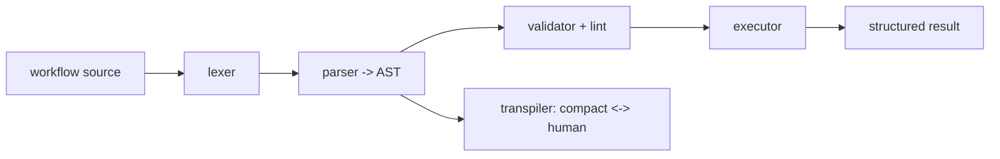
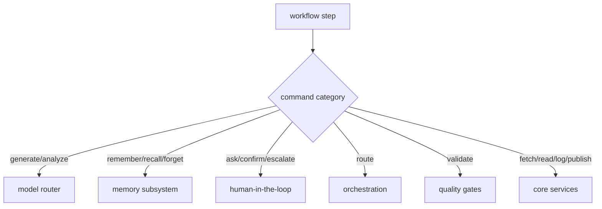

# Workflow Runtime

**Version:** 1.0.0
**Status:** Stable
**Layer:** implementation
**Implements:** l1-workflow-language.md

## Overview

The concrete realization of the workflow language: a **Rust runtime embedded in the core** — lexer, parser, validator (lint), executor, and transpiler — that runs everywhere the core runs (desktop and mobile), with no external language runtime. Workflow steps bind to existing Cronus subsystems; execution is schema-driven, validated, and bounded.

## Related Specifications

- [l1-workflow-language.md](l1-workflow-language.md) - The language model this runtime implements.
- [l2-core-library.md](l2-core-library.md) - The runtime is part of the Rust core.
- [l2-orchestration.md](l2-orchestration.md) - Delegated work / `/goal` loops execute workflows.
- [l2-model-router.md](l2-model-router.md) - Generation/analysis steps route models here.
- [l2-cli.md](l2-cli.md) - Command grammar standard for `workflow` commands.

## 1. Motivation

The language must run on every Cronus target — including the mobile thin client and the always-on hub — without a heavy external interpreter. Implementing the runtime in the Rust core (rather than embedding a separate language runtime) keeps it embeddable, fast, and dependency-free, satisfying the hub-and-spoke and mobile constraints.

## 2. Constraints & Assumptions

- The runtime is a Rust component of the core; no external language runtime is bundled.
- A formal grammar drives the parser; a schema is loaded before execution.
- Steps call core subsystems through internal interfaces; the runtime owns no domain logic of its own beyond control flow.

## 3. Invariant Compliance (Layer 2 only)

| L1 Invariant | Implementation |
| --- | --- |
| WFL-1 Dual representation | The transpiler converts compact ↔ human losslessly; both parse to the same AST. |
| WFL-2 Schema contract | The validator loads the schema first; unknown vocabulary fails validation. |
| WFL-3 Hard constraints | The executor enforces declared hard constraints; a violation halts and escalates, regardless of caller. |
| WFL-4 Preferences soft | Preferences are advisory inputs to steps; never override hard constraints. |
| WFL-5 Validate before run | `run` invokes the validator (lint rules) first; parse/undefined-var errors halt. |
| WFL-6 Bounded execution | The executor enforces max-iteration/budget limits and honors halt/pause. |
| WFL-7 Subsystem-bound | Command handlers dispatch to memory, HITL, orchestration, quality, and the model router. |
| WFL-8 Result contract | Every run returns a structured result (success/failure) and runs the declared error handler. |
| WFL-9 Human view | The client surface renders the human form via the transpiler. |

## 4. Detailed Design

### 4.1 Pipeline (all in the Rust core)

A formal grammar specification drives the parser; porting from the reference implementation's grammar is the starting point. Lint rules (errors/warnings/info) run in the validator.

### 4.2 Step binding

The runtime is the scripting layer; each command handler calls the owning subsystem (WFL-7), so workflows compose existing capabilities rather than duplicating them.

### 4.3 Embeddability

Because the runtime is Rust in the core, it executes on desktop and mobile alike. The always-on hub runs workflows for autonomous routines/goals; the mobile thin client can validate/preview and run foreground workflows. No separate language process is required on any target.

### 4.4 Command surface

Workflow operations conform to the CLI grammar standard (see `l2-cli.md` §4.4).

| Action | CLI | TUI | Library (no code) |
| --- | --- | --- | --- |
| scaffold | `cronus workflow new <name>` | `/workflow new <name>` | `workflows.scaffold(name) -> Workflow` |
| validate | `cronus workflow validate <file>` | `/workflow validate <file>` | `workflows.validate(ref) -> Report` |
| run | `cronus workflow run <file>` | `/workflow run <file>` | `workflows.run(ref, input) -> Result` |
| transpile | `cronus workflow transpile <file> --to <compact\|human>` | `/workflow transpile …` | `workflows.transpile(ref, mode) -> string` |
| test | `cronus workflow test [<file>]` | `/workflow test …` | `workflows.test(ref?) -> Report` |

## 5. Drawbacks & Alternatives

- **Porting effort:** re-implementing lexer/parser/validator/executor/transpiler in Rust is real work; mitigated by an existing formal grammar and lint catalog to port from.
- **Schema drift vs runtime:** the runtime must track the schema version it supports. <!-- TBD: runtime↔schema version compatibility checks -->
- **Alternative — embed an external interpreter:** rejected; it breaks the embeddable/mobile constraint (no heavy runtime on device).

## Canonical References

| Alias | Path | Purpose |
| --- | --- | --- |
| `[LANG]` | `.design/main/specifications/l1-workflow-language.md` | Invariants this runtime implements |
| `[CORE]` | `.design/main/specifications/l2-core-library.md` | The core that hosts the runtime |
| `[CLI]` | `.design/main/specifications/l2-cli.md` | Command grammar standard |
