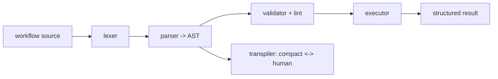
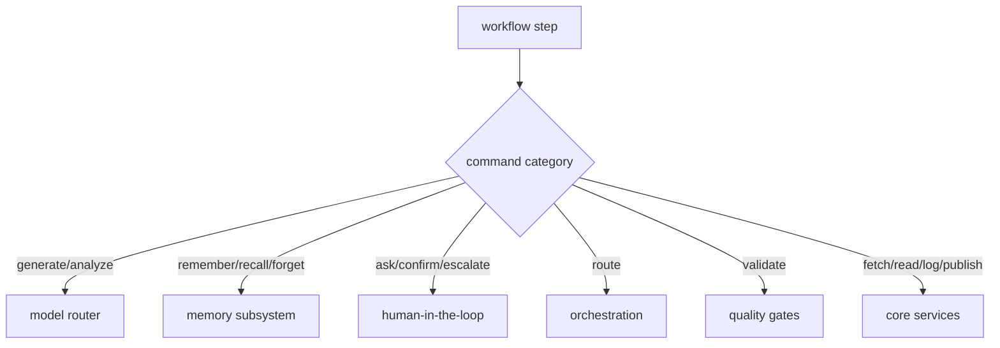

# Workflow Runtime

**Version:** 1.2.1
**Status:** Stable
**Layer:** implementation
**Implements:** l1-workflow-language.md

## Overview

The concrete realization of the workflow language: a Rust runtime **crate inside the Cronus monorepo** (`crates/nodus`) — lexer, parser, validator (lint), executor, and transpiler — that the core depends on and links **in-process**, so it runs everywhere the core runs (desktop and mobile) with no external language process. It is kept as a self-contained crate (not fused into the core) so it can be **extracted to a standalone crate later** if it outgrows Cronus; for now it is vendored in-tree because no other consumer needs it. The core wires its step handlers to Cronus subsystems. Execution is schema-driven, validated, and bounded.

## Related Specifications

- [l1-workflow-language.md](l1-workflow-language.md) - The language model this runtime implements.
- [l2-core-library.md](l2-core-library.md) - The core depends on this runtime crate and binds its steps.
- [l2-source-layout.md](l2-source-layout.md) - Where this in-monorepo crate sits in the Cronus workspace.
- [l2-orchestration.md](l2-orchestration.md) - Delegated work / `/goal` loops execute workflows.
- [l2-model-router.md](l2-model-router.md) - Generation/analysis steps route models here.
- [l2-cli.md](l2-cli.md) - Command grammar standard for `workflow` commands.

## 1. Motivation

The language must run on every Cronus target — including the mobile thin client and the always-on hub — without a heavy external interpreter. Implementing the runtime in the Rust core (rather than embedding a separate language runtime) keeps it embeddable, fast, and dependency-free, satisfying the hub-and-spoke and mobile constraints.

## 2. Constraints & Assumptions

- The runtime is an in-monorepo Rust crate the core depends on; it links in-process (no external language runtime is bundled, no separate process).
- A formal grammar drives the parser; a schema is loaded before execution.
- The port preserves behavior parity with the reference implementation (same sample workflows produce equivalent validation, execution, and transpilation results).
- Steps call core subsystems through internal interfaces; the runtime owns no domain logic of its own beyond control flow.

## 3. Invariant Compliance (Layer 2 only)

| L1 Invariant | Implementation |
| --- | --- |
| WFL-1 Dual representation | The transpiler converts compact ↔ human losslessly; both parse to the same AST. |
| WFL-2 Schema contract | The validator loads the schema first; unknown vocabulary fails validation. |
| WFL-3 Hard constraints | The executor enforces declared hard constraints; a violation halts and escalates, regardless of caller. |
| WFL-4 Preferences soft | Preferences are advisory inputs to steps; never override hard constraints. |
| WFL-5 Validate before run | `run` invokes the validator (lint rules) first; parse/undefined-var errors halt. |
| WFL-6 Bounded execution | The executor enforces max-iteration/budget limits and honors halt/pause. |
| WFL-7 Subsystem-bound | Command handlers dispatch to memory, HITL, orchestration, quality, and the model router. |
| WFL-8 Result contract | Every run returns a structured result (success/failure) and runs the declared error handler. |
| WFL-9 Human view | The client surface renders the human form via the transpiler. |

## 4. Detailed Design

### 4.1 Pipeline (all in the Rust core)



A formal grammar specification drives the parser; porting from the reference implementation's grammar is the starting point. Lint rules (errors/warnings/info) run in the validator.

### 4.2 Step binding



The runtime is the scripting layer; each command handler calls the owning subsystem (WFL-7), so workflows compose existing capabilities rather than duplicating them.

### 4.3 Embeddability

Because the runtime is a Rust crate the core links in-process, it executes on desktop and mobile alike — there is no separate language process on any target. The always-on hub runs workflows for autonomous routines/goals; the mobile thin client can validate/preview and run foreground workflows. Keeping it a self-contained crate (not fused into the core) preserves a clean seam for later extraction while still linking statically into the core build.

### 4.4 Command surface

Workflow operations conform to the CLI grammar standard (see `l2-cli.md` §4.4).

| Action | CLI | TUI | Library (no code) |
| --- | --- | --- | --- |
| scaffold | `cronus workflow new <name>` | `/workflow new <name>` | `workflows.scaffold(name) -> Workflow` |
| validate | `cronus workflow validate <file>` | `/workflow validate <file>` | `workflows.validate(ref) -> Report` |
| run | `cronus workflow run <file>` | `/workflow run <file>` | `workflows.run(ref, input) -> Result` |
| transpile | `cronus workflow transpile <file> --to <compact\|human>` | `/workflow transpile …` | `workflows.transpile(ref, mode) -> string` |
| test | `cronus workflow test [<file>]` | `/workflow test …` | `workflows.test(ref?) -> Report` |

### 4.5 Port architecture & strategy

The crate is a behavior-preserving port of the reference implementation (~5k lines across six modules) into Rust. Modules and their responsibilities:

| Module | Responsibility | Reference scope |
| --- | --- | --- |
| `lexer` | tokenize the compact form | ~tokens + symbols/operators |
| `parser` → `ast` | build the AST per the formal grammar | grammar-driven; largest module |
| `validator` | structure + lint rules (errors/warnings/info) | the lint catalog |
| `executor` | step dispatch, control flow, bounded execution | command handlers + control keywords |
| `transpiler` | compact ↔ human, lossless | rendering both forms |

Schema and grammar are **data, not code**: the vocabulary schema and the formal grammar ship as resources the crate loads (so updating the language does not require recompiling logic).

**Incremental order (vertical slice first):**

1. `lexer` + `parser` + `ast` — parse a sample workflow to an AST.
2. `transpiler` — compact ↔ human round-trip on that AST (proves WFL-1).
3. minimal `executor` — a couple of commands (`log`, `generate`) end-to-end (proves WFL-7/8).
4. `validator` + full lint rules (proves WFL-5).
5. full command set + control flow (`?if`/`?switch`/`~retry`/`~map`/`!halt`/`!pause`).

**Parity testing:** the reference implementation's sample workflows + lint cases form a golden corpus; the Rust crate must produce equivalent validation verdicts, execution results, and transpilation output. <!-- TBD: extract the reference test corpus into shared fixtures -->

### 4.6 Step-file architecture for disciplined workflow execution

Long multi-phase workflows are decomposed into step files — small, self-contained instruction documents, one per execution step. This architecture prevents context overflow, enforces sequential discipline, and keeps the executing agent focused on one unit of work at a time.

#### JIT (just-in-time) loading

Only the current step file is loaded into the agent's context at any moment. The full workflow is not pre-loaded:

```text
[REFERENCE]
JIT loading rules:
  - Load step N only when the agent is ready to begin step N.
  - Unload (or deprioritize) step N-1 once step N begins.
  - Never load step N+1 while step N is in progress.
  - This keeps context token cost proportional to one step, not the whole workflow.
```

Loading the entire workflow upfront risks context saturation on long workflows and tempts the agent to "skip ahead" to later steps — both are failure modes this pattern prevents.

#### Sequential enforcement

Steps are executed in strict declared order. No skipping is allowed, even when a step appears to be a no-op for the current situation:

```text
[REFERENCE]
Sequential enforcement rules:
  - The agent must complete (or explicitly mark as skipped with a reason) each step
    before loading the next.
  - A step cannot be deferred — if it cannot be completed, the workflow HALTs.
  - Workflow order is the author's intent; unilateral reordering is an error.
```

The rationale: steps often have side effects or populate context that later steps depend on implicitly. Skipping breaks the append-only chain.

#### State tracking in frontmatter

Workflow state (which steps have completed) is tracked in a YAML frontmatter header on the primary output document, not in conversation history:

```text
[REFERENCE]
Frontmatter state block (on the workflow's primary output document):

---
stepsCompleted:
  - step-01-init
  - step-02-domain-analysis
currentStep: step-03-competitive-landscape
status: in-progress   # draft | in-progress | complete
---
```

The frontmatter is the authoritative state source. On resume (session restart, context compaction), the agent reads the frontmatter to determine where to continue — conversation history is not reliable for this purpose.

#### Append-only document building

Workflow output documents are built incrementally. Each step appends its section to the document; earlier sections are never overwritten:

```text
[REFERENCE]
Append-only rules:
  - Each step writes exactly the section(s) it owns.
  - Completed sections are read-only; the agent never edits them in a later step.
  - The final document is the accumulation of all appended sections.
  - [ASSUMPTION] tags mark content the agent generated without explicit input —
    flagged for user review, not silently removed.
```

This rule makes partial output recoverable: if the workflow is interrupted mid-run, completed sections are already written and correct.

#### HALT at menus and decision points

When a step requires a choice the agent cannot make unilaterally, execution halts and the agent surfaces the decision to the user:

```text
[REFERENCE]
HALT conditions:
  - User choice required: multiple valid paths exist and the choice is not deterministic.
  - Ambiguous input: a required input is missing or contradictory.
  - External dependency not met: a prerequisite artifact does not exist yet.
  - Constraint conflict: the work would violate a declared constraint.

At a HALT point:
  - The agent states the specific decision or information needed.
  - The agent offers options if there are a small fixed set (≤4 recommended choices).
  - The agent does NOT improvise past the HALT — it waits for the user to respond.
```

A HALT is not a failure — it is the workflow correctly recognizing that the next step needs human intent. The agent should be specific about what it needs, not ask an open-ended question.

## 5. Drawbacks & Alternatives

- **Porting effort:** re-implementing lexer/parser/validator/executor/transpiler in Rust is real work; mitigated by an existing formal grammar and lint catalog to port from.
- **Schema drift vs runtime:** the runtime must track the schema version it supports. <!-- TBD: runtime↔schema version compatibility checks -->
- **Alternative — embed an external interpreter:** rejected; it breaks the embeddable/mobile constraint (no heavy runtime on device).
- **Alternative — standalone crate in its own repository:** deferred; vendored in-tree for now since no other consumer needs it. The self-contained crate boundary keeps later extraction cheap if that changes.

## Canonical References

| Alias | Path | Purpose |
| --- | --- | --- |
| `[LANG]` | `.design/main/specifications/l1-workflow-language.md` | Invariants this runtime implements |
| `[CORE]` | `.design/main/specifications/l2-core-library.md` | The core that hosts the runtime |
| `[CLI]` | `.design/main/specifications/l2-cli.md` | Command grammar standard |
