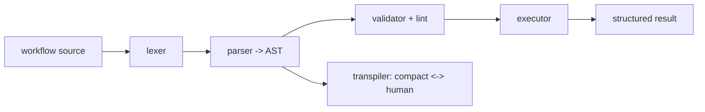
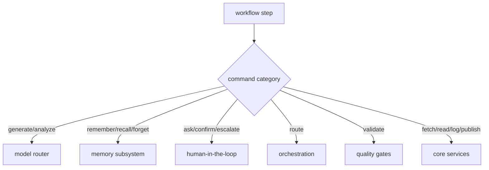

# Workflow Runtime

**Version:** 1.2.3
**Status:** Stable
**Layer:** implementation
**Implements:** l1-workflow-language.md

## Overview

The concrete realization of the workflow language: a Rust runtime **crate inside the Cronus monorepo** (`crates/nodus`) — lexer, parser, validator (lint), executor, and transpiler — that the core depends on and links **in-process**, so it runs everywhere the core runs (desktop and mobile) with no external language process. It is kept as a self-contained crate (not fused into the core) so it can be **extracted to a standalone crate later** if it outgrows Cronus; for now it is vendored in-tree because no other consumer needs it. The core wires its step handlers to Cronus subsystems. Execution is schema-driven, validated, and bounded.

## Related Specifications

- [l1-workflow-language.md](l1-workflow-language.md) - The language model this runtime implements.
- [l2-core-library.md](l2-core-library.md) - The core depends on this runtime crate and binds its steps.
- [l2-source-layout.md](l2-source-layout.md) - Where this in-monorepo crate sits in the Cronus workspace.
- [l2-orchestration.md](l2-orchestration.md) - Delegated work / `/goal` loops execute workflows.
- [l2-model-router.md](l2-model-router.md) - Generation/analysis steps route models here.
- [l2-cli.md](l2-cli.md) - Command grammar standard for `workflow` commands.

## 1. Motivation

The language must run on every Cronus target — including the mobile thin client and the always-on hub — without a heavy external interpreter. Implementing the runtime in the Rust core (rather than embedding a separate language runtime) keeps it embeddable, fast, and dependency-free, satisfying the hub-and-spoke and mobile constraints.

## 2. Constraints & Assumptions

- The runtime is an in-monorepo Rust crate the core depends on; it links in-process (no external language runtime is bundled, no separate process).
- A formal grammar drives the parser; a schema is loaded before execution.
- The port preserves behavior parity with the reference implementation (same sample workflows produce equivalent validation, execution, and transpilation results).
- Steps call core subsystems through internal interfaces; the runtime owns no domain logic of its own beyond control flow.

## 3. Invariant Compliance (Layer 2 only)

| L1 Invariant | Implementation |
| --- | --- |
| WFL-1 Dual representation | The transpiler converts compact ↔ human losslessly; both parse to the same AST. |
| WFL-2 Schema contract | The validator loads the schema first; unknown vocabulary fails validation. |
| WFL-3 Hard constraints | The executor enforces declared hard constraints; a violation halts and escalates, regardless of caller. |
| WFL-4 Preferences soft | Preferences are advisory inputs to steps; never override hard constraints. |
| WFL-5 Validate before run | `run` invokes the validator (lint rules) first; parse/undefined-var errors halt. |
| WFL-6 Bounded execution | The executor enforces max-iteration/budget limits and honors halt/pause. |
| WFL-7 Subsystem-bound | Command handlers dispatch to memory, HITL, orchestration, quality, and the model router. |
| WFL-8 Result contract | Every run returns a structured result (success/failure) and runs the declared error handler. |
| WFL-9 Human view | The client surface renders the human form via the transpiler. |

## 4. Detailed Design

### 4.1 Pipeline (all in the Rust core)



A formal grammar specification drives the parser; porting from the reference implementation's grammar is the starting point. Lint rules (errors/warnings/info) run in the validator.

### 4.2 Step binding



The runtime is the scripting layer; each command handler calls the owning subsystem (WFL-7), so workflows compose existing capabilities rather than duplicating them.

### 4.3 Embeddability

Because the runtime is a Rust crate the core links in-process, it executes on desktop and mobile alike — there is no separate language process on any target. The always-on hub runs workflows for autonomous routines/goals; the mobile thin client can validate/preview and run foreground workflows. Keeping it a self-contained crate (not fused into the core) preserves a clean seam for later extraction while still linking statically into the core build.

### 4.4 Command surface

Workflow operations conform to the CLI grammar standard (see `l2-cli.md` §4.4).

| Action | CLI | TUI | Library (no code) |
| --- | --- | --- | --- |
| scaffold | `cronus workflow new <name>` | `/workflow new <name>` | `workflows.scaffold(name) -> Workflow` |
| validate | `cronus workflow validate <file>` | `/workflow validate <file>` | `workflows.validate(ref) -> Report` |
| run | `cronus workflow run <file>` | `/workflow run <file>` | `workflows.run(ref, input) -> Result` |
| transpile | `cronus workflow transpile <file> --to <compact\|human>` | `/workflow transpile …` | `workflows.transpile(ref, mode) -> string` |
| test | `cronus workflow test [<file>]` | `/workflow test …` | `workflows.test(ref?) -> Report` |

### 4.5 Port architecture & strategy

The crate is a behavior-preserving port of the reference implementation (~5k lines across six modules) into Rust. Modules and their responsibilities:

| Module | Responsibility | Reference scope |
| --- | --- | --- |
| `lexer` | tokenize the compact form | ~tokens + symbols/operators |
| `parser` → `ast` | build the AST per the formal grammar | grammar-driven; largest module |
| `validator` | structure + lint rules (errors/warnings/info) | the lint catalog |
| `executor` | step dispatch, control flow, bounded execution | command handlers + control keywords |
| `transpiler` | compact ↔ human, lossless | rendering both forms |

Schema and grammar are **data, not code**: the vocabulary schema and the formal grammar ship as resources the crate loads (so updating the language does not require recompiling logic).

**Incremental order (vertical slice first):**

1. `lexer` + `parser` + `ast` — parse a sample workflow to an AST.
2. `transpiler` — compact ↔ human round-trip on that AST (proves WFL-1).
3. minimal `executor` — a couple of commands (`log`, `generate`) end-to-end (proves WFL-7/8).
4. `validator` + full lint rules (proves WFL-5).
5. full command set + control flow (`?if`/`?switch`/`~retry`/`~map`/`!halt`/`!pause`).

**Parity testing:** the reference implementation's sample workflows + lint cases form a golden corpus; the Rust crate must produce equivalent validation verdicts, execution results, and transpilation output. <!-- TBD: extract the reference test corpus into shared fixtures -->

### 4.6 Step-file architecture for disciplined workflow execution

Long multi-phase workflows are decomposed into step files — small, self-contained instruction documents, one per execution step. This architecture prevents context overflow, enforces sequential discipline, and keeps the executing agent focused on one unit of work at a time.

#### JIT (just-in-time) loading

Only the current step file is loaded into the agent's context at any moment. The full workflow is not pre-loaded:

```text
[REFERENCE]
JIT loading rules:
  - Load step N only when the agent is ready to begin step N.
  - Unload (or deprioritize) step N-1 once step N begins.
  - Never load step N+1 while step N is in progress.
  - This keeps context token cost proportional to one step, not the whole workflow.
```

Loading the entire workflow upfront risks context saturation on long workflows and tempts the agent to "skip ahead" to later steps — both are failure modes this pattern prevents.

#### Sequential enforcement

Steps are executed in strict declared order. No skipping is allowed, even when a step appears to be a no-op for the current situation:

```text
[REFERENCE]
Sequential enforcement rules:
  - The agent must complete (or explicitly mark as skipped with a reason) each step
    before loading the next.
  - A step cannot be deferred — if it cannot be completed, the workflow HALTs.
  - Workflow order is the author's intent; unilateral reordering is an error.
```

The rationale: steps often have side effects or populate context that later steps depend on implicitly. Skipping breaks the append-only chain.

#### State tracking in frontmatter

Workflow state (which steps have completed) is tracked in a YAML frontmatter header on the primary output document, not in conversation history:

```text
[REFERENCE]
Frontmatter state block (on the workflow's primary output document):

---
stepsCompleted:
  - step-01-init
  - step-02-domain-analysis
currentStep: step-03-competitive-landscape
status: in-progress   # draft | in-progress | complete
---
```

The frontmatter is the authoritative state source. On resume (session restart, context compaction), the agent reads the frontmatter to determine where to continue — conversation history is not reliable for this purpose.

#### Append-only document building

Workflow output documents are built incrementally. Each step appends its section to the document; earlier sections are never overwritten:

```text
[REFERENCE]
Append-only rules:
  - Each step writes exactly the section(s) it owns.
  - Completed sections are read-only; the agent never edits them in a later step.
  - The final document is the accumulation of all appended sections.
  - [ASSUMPTION] tags mark content the agent generated without explicit input —
    flagged for user review, not silently removed.
```

This rule makes partial output recoverable: if the workflow is interrupted mid-run, completed sections are already written and correct.

#### HALT at menus and decision points

When a step requires a choice the agent cannot make unilaterally, execution halts and the agent surfaces the decision to the user:

```text
[REFERENCE]
HALT conditions:
  - User choice required: multiple valid paths exist and the choice is not deterministic.
  - Ambiguous input: a required input is missing or contradictory.
  - External dependency not met: a prerequisite artifact does not exist yet.
  - Constraint conflict: the work would violate a declared constraint.

At a HALT point:
  - The agent states the specific decision or information needed.
  - The agent offers options if there are a small fixed set (≤4 recommended choices).
  - The agent does NOT improvise past the HALT — it waits for the user to respond.
```

A HALT is not a failure — it is the workflow correctly recognizing that the next step needs human intent. The agent should be specific about what it needs, not ask an open-ended question.

### 4.7 Platform-native capability lookup

Before a workflow step generates new code or recommends installing a dependency, the runtime checks a platform-native capability table. If the platform already ships a solution, the step uses it instead of generating custom code or adding a dependency.

#### Lookup principle

The lookup is applied at code-generation time using the decision ladder (see l2-quality-pipeline.md §4.13): standard library and platform-native capabilities are preferred over third-party dependencies, which are preferred over custom implementation. The lookup table makes this concrete — it maps common "thing I think I need" patterns to "what the platform already ships."

#### Lookup table (selected entries by domain)

```text
[REFERENCE]
Platform-native capability table (non-exhaustive; extend per project ecosystem):

HTML elements:
  You think you need: date picker widget library
  Platform ships: <input type="date">

  You think you need: accessible modal dialog library
  Platform ships: <dialog> element (built-in open/close, focus trap, ::backdrop)

  You think you need: lazy image loading library
  Platform ships: 

CSS capabilities:
  You think you need: responsive typography library
  Platform ships: clamp() (e.g. font-size: clamp(1rem, 2.5vw, 2rem))

  You think you need: dark-mode detection library
  Platform ships: @media (prefers-color-scheme: dark) CSS media query

JavaScript / Browser APIs:
  You think you need: uuid library
  Platform ships: crypto.randomUUID()

  You think you need: deep-clone utility
  Platform ships: structuredClone()

  You think you need: custom event bus
  Platform ships: EventTarget + addEventListener/dispatchEvent

Node.js stdlib:
  You think you need: mkdirp (recursive mkdir)
  Platform ships: fs.mkdirSync(path, { recursive: true })

  You think you need: rimraf (recursive delete)
  Platform ships: fs.rmSync(path, { recursive: true, force: true })

  You think you need: dotenv for loading .env
  Platform ships: --env-file flag (Node ≥ 20.6)

Python stdlib:
  You think you need: requests for simple GET
  Platform ships: urllib.request.urlopen() or http.client

  You think you need: dateutil for ISO date parsing
  Platform ships: datetime.fromisoformat()

  You think you need: path manipulation library
  Platform ships: pathlib.Path

Rust stdlib / ecosystem:
  You think you need: custom error type boilerplate
  Platform ships: thiserror (already in Cronus dependencies)

  You think you need: custom serialization
  Platform ships: serde (already in Cronus dependencies)

  You think you need: custom async runtime
  Platform ships: tokio (already in Cronus dependencies)

SQL / Database:
  You think you need: manual pagination loop
  Platform ships: LIMIT n OFFSET m

  You think you need: running totals via application code
  Platform ships: SUM() OVER (ORDER BY ...) window function

  You think you need: deduplication via application Set
  Platform ships: SELECT DISTINCT or GROUP BY
```

#### Lookup gate in workflow execution

When a workflow step would install a new dependency or generate more than 20 lines of new code:

```text
[REFERENCE]
Pre-generation check:
  1. Identify the capability being requested (from the step's action field).
  2. Check the platform-native table for the current project's ecosystem.
  3. If a native match is found:
     → Use the native solution. Log: "native: used <feature> instead of custom code."
  4. If no native match, check existing project dependencies.
     → If an installed dependency handles it: use it. Log: "dep: used <pkg>.<method>."
  5. Only if neither check finds a match: generate new code or recommend a new dependency.

The check is advisory — it logs the recommendation but does not block execution.
Workflow authors can mark a step `skip-native-check: true` when a custom implementation
is intentional (e.g., performance-critical hot path with benchmarks to justify it).
```

### 4.8 Nodus language syntax and built-in vocabulary

The nodus crate (`crates/nodus`) is the concrete runtime. A `.nodus` file carries a typed header, a schema-loading runtime block, reactive triggers, hard constraints, soft preferences, I/O declarations, a sequential step body, and optional test and macro blocks. The schema version embedded in the crate is **v0.4.5** (`BUILTIN_SCHEMA_VERSION`).

#### File type sigils

| Sigil | Kind |
| --- | --- |
| `§wf:name vX.Y` | Workflow — the primary executable file type |
| `§schema:name vX.Y` | Vocabulary + rule schema |
| `§config:name vX.Y` | Runtime configuration overlay |

#### Section declarations

| Keyword | Purpose |
| --- | --- |
| `§runtime: { core: … }` | Loads the named schema; `extends:` for overlays; `agents:` for named model bindings |
| `@ON: cond → action` | Reactive trigger — workflow activates when condition holds |
| `!!NEVER: …` / `!!ALWAYS: …` | Absolute hard constraints; executor halts on violation |
| `!PREF: X OVER Y IF cond` | Soft preference — advisory; never overrides `!!` rules |
| `@in: { field: type }` | Input declaration; `?` suffix marks optional; `= default` provides a fallback |
| `@out: $var` | Output variable |
| `@ctx: [a, b]` | Required context keys |
| `@err: HANDLER` | Error handler invoked for uncaught step errors |
| `@steps:` | Sequential numbered step body |
| `@test: name { … }` | Inline test block with `input:` / `expected:` / `tags:` fields |
| `@macro: name` | Reusable step-sequence macro |

#### Step-line syntax

```text
N. COMMAND(args) +modifier=value ^validator ~flag → $pipeline_target
```

- `+key=value` — named modifier passed to the command
- `^name` — output-validator rule attached to the step result
- `~name` — flag extractor; populates a named sub-variable from the result
- `→ $target` — pipeline target: step output stored as `$target` for downstream steps

#### Control flow

| Construct | Syntax |
| --- | --- |
| Conditional | `?IF cond → action` / `?ELIF cond → action` / `?ELSE → action` |
| Iterator loop | `~FOR $var IN $collection … ~END` |
| Bounded loop | `~UNTIL cond \| MAX:n … ~END` |
| Parallel block | `~PARALLEL … ~JOIN → $target` |

Conditional branches accept `!BREAK` (exit the enclosing loop), `!SKIP` (skip the current iteration), and `!OVERRIDE` (suppress a soft preference for this branch only).

#### Built-in command vocabulary (schema v0.4.5)

| Category | Commands |
| --- | --- |
| Memory & knowledge | `REMEMBER`, `RECALL`, `FORGET`, `QUERY_KB` |
| Generation | `GEN`, `REFINE`, `TRANSLATE`, `SUMMARIZE`, `FILL`, `GENERATE_DOC` |
| Analysis | `ANALYZE`, `SCORE`, `COMPARE`, `EXTRACT`, `FILTER`, `PARSE`, `PARSE_MD_HEADER`, `PARSE_INDEX` |
| I/O & messaging | `FETCH`, `STORE`, `LOAD`, `APPEND`, `MERGE`, `PUBLISH`, `NOTIFY`, `LOG` |
| Routing & control | `VALIDATE`, `ROUTE`, `ESCALATE`, `WAIT`, `TONE`, `DEBUG` |
| Execution | `EXECUTE`, `SIMULATE`, `EXECUTE_TEST`, `TRANSPILE` |
| Filesystem | `WRITE`, `READ_FILE`, `MKDIR`, `FILE_EXISTS`, `SCAN_DIR`, `MOVE`, `COPY` |
| System & meta | `ENV`, `DATE`, `COUNTER`, `GIT`, `QUERY_GIT`, `HASH`, `VERSION_BUMP` |

#### Reserved variables

`$in`, `$out`, `$error`, `$meta`, `$raw`, `$draft`, `$ctx`, `$user`, `$session`, `$log`, `$flags`, `$quality`, `$sentiment`, `$confidence`, `$memory`, `$kb_results`

User-defined step pipeline targets (`→ $name`) must not shadow reserved names.

#### Tone values (`+tone=` modifier)

`warm` · `neutral` · `formal` · `casual` · `urgent` · `empathetic` · `brand`

#### Runtime value types

The executor represents all step results with a closed `Value` enum:

| Variant | Rust type | Notes |
| --- | --- | --- |
| `Null` | — | Unset or absent |
| `Bool` | `bool` | |
| `Int` | `i64` | |
| `Float` | `f64` | |
| `Text` | `String` | |
| `List` | `Vec<Value>` | Ordered, heterogeneous |
| `Map` | `Vec<(String, Value)>` | Preserves insertion order (not `HashMap`) |

`Map` uses a `Vec` of key-value pairs rather than `HashMap` to preserve declaration order across round-trips.

#### Runtime error codes

| Code | Meaning |
| --- | --- |
| `NODUS:RULE_VIOLATION` | An `!!` absolute rule was violated at run time |
| `NODUS:PARSE_ERROR` | Source file failed to parse |
| `NODUS:MAX_REACHED` | A `~UNTIL` loop exhausted its `MAX:n` bound |
| `NODUS:EXECUTION_FAILED` | A step failed during execution |
| `NODUS:UNDEFINED_VAR` | A variable was referenced before assignment |
| `NODUS:ROUTE_NOT_FOUND` | A `ROUTE(wf:name)` target does not exist |
| `NODUS:RULE_CONFLICT` | Two `!!` rules contradict each other |
| `NODUS:SCHEMA_MISMATCH` | Schema version does not match the workflow header |
| `NODUS:NO_SCHEMA` | Workflow executed without a loaded schema |
| `NODUS:NO_TRIGGER` | No `@ON:` trigger matched the current input |
| `NODUS:UNHANDLED_ERROR` | A step error reached no `@err:` handler |

#### Library API (public surface)

| Function | Signature | Purpose |
| --- | --- | --- |
| `scaffold` | `(name: &str) -> WorkflowFile` | Return a minimal valid AST with one `GEN` step |
| `validate` | `(source, filename) -> Result<ValidationReport>` | Parse + lint; all diagnostics regardless of severity |
| `run` | `(source, filename, input?) -> Result<RunResult, Diagnostics>` | Validate then execute with stub provider; fast-fail on block errors (WFL-5) |
| `transpile` | `(source, mode: TranspileMode) -> Result<String>` | `Compact` = lossless round-trip · `Human` = one-way prose |
| `test` | `(source, filename) -> Result<TestReport>` | Execute all `@test:` blocks and aggregate pass/fail |
| `run_with_provider` | `(source, filename, input?, provider) -> Result<RunResult, …>` | Like `run` but with a custom `ModelProvider` |

The `ModelProvider` trait is the extension point for real model integration; the built-in `StubProvider` is used for tests and early development.

#### Executor boot sequence

When `run` or `run_with_provider` fires, the executor performs these steps in order:

1. Load schema (from `§runtime.core`).
2. Internalize `!!` absolute rules (violations halt immediately).
3. Internalize `!PREF` soft preferences (advisory; yielded to `!!` rules).
4. Register `@in` / `@ctx` inputs into the value environment.
5. Match `@ON` triggers against the current input.
6. Execute `@steps` sequentially; thread `→` pipeline targets between steps.

## 5. Drawbacks & Alternatives

- **Porting effort:** re-implementing lexer/parser/validator/executor/transpiler in Rust is real work; mitigated by an existing formal grammar and lint catalog to port from.
- **Schema drift vs runtime:** the runtime must track the schema version it supports. <!-- TBD: runtime↔schema version compatibility checks -->
- **Alternative — embed an external interpreter:** rejected; it breaks the embeddable/mobile constraint (no heavy runtime on device).
- **Alternative — standalone crate in its own repository:** deferred; vendored in-tree for now since no other consumer needs it. The self-contained crate boundary keeps later extraction cheap if that changes.

## Canonical References

| Alias | Path | Purpose |
| --- | --- | --- |
| `[LANG]` | `.design/main/specifications/l1-workflow-language.md` | Invariants this runtime implements |
| `[CORE]` | `.design/main/specifications/l2-core-library.md` | The core that hosts the runtime |
| `[CLI]` | `.design/main/specifications/l2-cli.md` | Command grammar standard |
