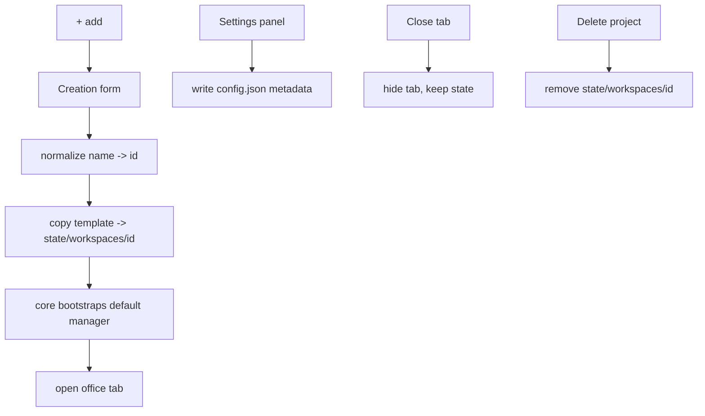

# Workspace Management

**Version:** 1.0.0
**Status:** Stable
**Layer:** implementation
**Implements:** l1-workspace-lifecycle.md

## Overview

The concrete realization of the workspace lifecycle on the desktop application: a tab bar with a pinned, non-deletable home tab and one tab per project; an "add" control that opens a creation form; name normalization to a kebab-case identifier; instantiation from the workspace blueprint into the state tier; and a default manager bootstrapped on creation.

## Related Specifications

- [l1-workspace-lifecycle.md](l1-workspace-lifecycle.md) - The lifecycle this implements.
- [l2-app-ui.md](l2-app-ui.md) - The application shell that hosts the tab bar.
- [l2-filesystem-layout.md](l2-filesystem-layout.md) - Template source and state destination paths.
- [l2-core-library.md](l2-core-library.md) - Performs instantiation, manager bootstrap, and staffing.

## 1. Motivation

The lifecycle model demands a one-gesture office creation, an always-present home, editable metadata, and an immediately-staffed manager. The desktop tab metaphor delivers all of this with a familiar UX; the filesystem flow makes each office an isolated, copyable directory.

## 2. Constraints & Assumptions

- Desktop frontend (the application shell); the tab bar is the primary navigation.
- Workspace identifiers are filesystem-safe kebab-case derived from the user-provided name.
- The frontend holds no logic: creation/edit/delete and bootstrap are core calls (consistent with INV-2).

## 3. Invariant Compliance (Layer 2 only)

| L1 Invariant | Implementation |
| --- | --- |
| WSL-1 Home singular & permanent | Leftmost tab is pinned, shows a home/star icon, has no close control; the core refuses to delete it. |
| WSL-2 One manager per office | Each workspace's `config.json` records its `manager`; the home workspace's manager carries cross-workspace oversight. |
| WSL-3 Project lifecycle | Project tabs support create (add control), edit (settings panel), and close/delete; home tab exposes none of delete. |
| WSL-4 Instantiation from blueprint | Copy `<program>/templates/workspace/` → `<state>/workspaces/<id>/`; `<id>` is the normalized name. |
| WSL-5 Default manager bootstrap | On create, the core instantiates the office manager before returning the open office. |
| WSL-6 Bidirectional staffing | The manager calls core hire/release operations against the role catalog as needs change. |
| WSL-7 Editable metadata | A settings panel writes name/description/local path back to `<ws>/config.json` without recreating the office. |
| WSL-8 Isolation & clean deletion | Each office is its own directory; deleting a project removes `<state>/workspaces/<id>/` only; home is exempt. |

## 4. Detailed Design

### 4.1 Tab bar

```text
[ ★ Home ] [ project-alpha ] [ project-beta ] [ + ]
   pinned        closable        closable      add
```

- Home tab: leftmost, pinned, home/star icon, no close button; selecting it opens the organizer office.
- Project tabs: one per `<state>/workspaces/<id>` (excluding home); closable (close ≠ delete — see §4.4).
- Add control (`+` / "Add"): opens a new tab hosting the creation form.

### 4.2 Creation form

Fields (all editable later via the settings panel):

| Field | Required | Notes |
| --- | --- | --- |
| Name | yes | human-readable; drives the identifier |
| Description | no | free text |
| Local path | no | project location on disk |

### 4.3 Name normalization (identifier)

```text
[REFERENCE]
normalize(name):
  lower-case
  replace runs of non [a-z0-9] with single "-"
  trim leading/trailing "-"
  on collision with an existing workspace id -> append "-2", "-3", ...
# "My Game Dev!" -> "my-game-dev"
```

Only lowercase letters, digits, and `-` as separator (per WSL-4).

### 4.4 Create / edit / delete flows



- **Close** a tab hides the office without destroying state; reopening relists it.
- **Delete** removes the office directory entirely (WSL-8); the home office offers no delete.

### 4.5 Default manager bootstrap

On creation the core instantiates the office manager (the boss) per the office model, writes it into `<ws>/config.json` (`manager`), and hands control to it. The manager then drives hire/release against the role catalog as the project's inputs accumulate (WSL-6).

### 4.6 Command surface

Workspace operations across all three surfaces, conforming to the CLI grammar standard (verb-first, explicit verbs; see `l2-cli.md` §4.4). The library method is the source; CLI and TUI are thin bindings (INV-3).

| Action | CLI | TUI | Library (no code) |
| --- | --- | --- | --- |
| list | `cronus workspace list` | `/workspace list` | `workspace.list() -> Workspace[]` |
| create | `cronus workspace create <name> [-d <desc>] [-p <path>]` | `/workspace create <name> …` | `workspace.create(name, {description?, path?}) -> Workspace` |
| open | `cronus workspace open <id>` | `/workspace open <id>` | `workspace.open(id) -> Workspace` |
| info | `cronus workspace info <id>` | `/workspace info <id>` | `workspace.get(id) -> Workspace` |
| set (edit) | `cronus workspace set <id> [--name <v>] [--description <v>] [--path <v>]` | `/workspace set <id> …` | `workspace.update(id, patch) -> Workspace` |
| close | `cronus workspace close <id>` | `/workspace close <id>` | `workspace.close(id) -> void` |
| delete | `cronus workspace delete <id>` | `/workspace delete <id>` | `workspace.delete(id) -> void` (refuses home) |
| home | `cronus workspace home` | `/workspace home` | `workspace.home() -> Workspace` |

- `create` takes the human-readable `<name>` (positional), normalized to `<id>` (§4.3); `--description/-d` and `--path/-p` are optional and editable later via `set`.
- `delete` refuses the home workspace (WSL-1); `close` hides a tab without destroying state (WSL-8).
- Internal helper (not a user command): `workspace.normalizeName(name) -> id`.

## 5. Drawbacks & Alternatives

- **Tabs scale poorly past many offices:** mitigate with grouping/overflow in a later iteration. <!-- TBD: overflow/grouping behavior when offices exceed the tab strip width -->
- **Close vs delete ambiguity:** mitigated by distinct affordances (close = hide, explicit Delete = destroy).
- **Alternative — one window per office:** rejected; tabs keep the building metaphor and a single organizer surface.

## Canonical References

| Alias | Path | Purpose |
| --- | --- | --- |
| `[LIFECYCLE]` | `.design/main/specifications/l1-workspace-lifecycle.md` | Invariants this implements |
| `[LAYOUT]` | `.design/main/specifications/l2-filesystem-layout.md` | Template source and state destination |
| `[APP]` | `.design/main/specifications/l2-app-ui.md` | Application shell hosting the tab bar |
