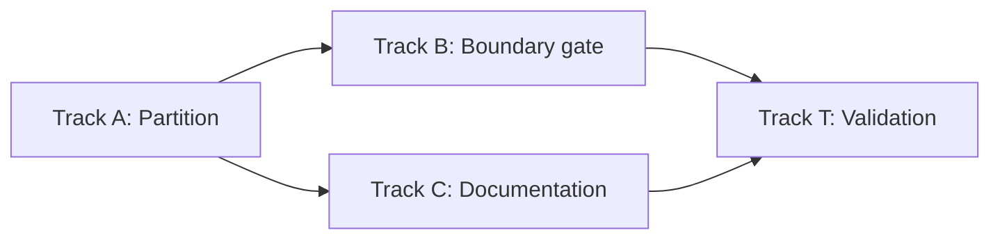

# Stage 25 Tasks — Frontend Module Topology (`packages/ui`)

**Phase:** 25
**Status:** Todo
**Strategic Goal:** Turn the four-tier module model (composition root → shell → surfaces → shared) from a convention no tool can see into a boundary checked on every changed file — by first making tier membership expressible as a path, then declaring the zones, then proving the package's public API survived unchanged.

## Character

A **structural, behavior-preserving refactor plus a lint gate** — the TypeScript counterpart of Phase 13 (Core Decomposition). No new domain logic, no new core capability, no widening of the `bridge.ts` `CoreClient`, no new dependency (`fallow` is already a root devDependency and already in the always-on gate). Every runtime behavior of `packages/ui` is identical before and after; what changes is that a violation becomes visible.

**Why now rather than later:** the cost of declaring a boundary rises with the number of edges already crossing it. The package is ~3,000 lines across 25 source modules — the last point where the declaration is nearly free.

## Track dependency (Planning Audit — read before starting)

**Track A must complete before Track B starts.** This is not a soft ordering. Zones are declared as *path patterns*; today `dashboard.tsx` (a surface), `theme.ts` (shared) and `surfaces.tsx` (a composer) all sit at the same directory level, so no pattern can name a tier. Until the partition exists on disk, the boundary config has nothing to point at. Parallel mode (C3) applies **within** Track A and **within** Track B, and Track C runs parallel to B — but B cannot open while A is unfinished.

## Verification commands (measured during planning)

`fallow audit` does **not** complete in a practical window on this dev host — the Phase 24 disclosure stands. Two narrower commands do, and they are what this phase verifies against:

| Command | Measured | Shows |
| --- | --- | --- |
| `npx fallow list --boundaries` | ~1.4 s | zone list, rules, **per-zone file counts** (the total-coverage proof) |
| `npx fallow guard <file>` | ~1.4 s | which zone a file is in and which zones it may import |

The full `fallow audit --changed-since <base>` stays the CI gate; it is never a local `Verify` line in this phase.

## Disclosed spec discrepancy (do not silently resolve)

`l2-ui-module-topology` §4.1 UMT-1 states the rule as *"may import only from tiers strictly below it"*, under which the composition root may import **surfaces** (surfaces is strictly below root). The §4.2 table under-enumerates root's row as `shell, shared`.

The rule text governs and this phase plans on it, because the same spec **requires the package's public API to survive the relocation** (§6, and its `[SRC]` canonical reference: *"the composition root's current public API — the surface a relocation must preserve"*), and `index.ts` re-exports `DashboardPanel` / `OfficeViewPanel`. Under the table's narrower reading those two requirements contradict each other.

→ Recommend `/magic.spec main` reconcile §4.2's root row to UMT-1's rule text. **Not** in this phase's scope — `magic.run` does not edit specs.

## Atomic Checklist

- [ ] [T-25A01] Mint the `shared/` leaf tier
- [ ] [T-25A02] Split `surfaces.tsx`; mint the `surfaces/` tier
- [ ] [T-25A03] Repoint `shell/` and the composition root; freeze the public API
- [ ] [T-25B01] Declare zones and the four direction rules (coverage off)
- [ ] [T-25B02] Turn on total zone coverage
- [ ] [T-25B03] Add the single-seam forbidden-call rule
- [ ] [T-25C01] Record the tier model in `packages/ui/README.md`
- [ ] [T-25C02] Containment cleanup — remove the plan reference from the root `CHANGELOG.md`
- [ ] [T-25T01] Validation — prove UMT-1…UMT-7 and behavior neutrality

## Detailed Tracking

### [T-25A01] Mint the `shared/` leaf tier

- **Spec:** l2-ui-module-topology.md §4.2, §4.3 · UMT-5
- **Status:** Todo
- **Assignment:** Agent
- **Verify:** `pnpm -C packages/ui test` (94 tests, unchanged count) · `pnpm -C packages/ui exec tsc --noEmit` · `pnpm exec biome check packages/ui` · `node packages/ui/scripts/craft-lint.mjs`
- **Handoff:** T-25A02 (the surfaces tier repoints onto the new `shared/` paths)
- **Notes:** Move into `packages/ui/src/shared/`: `bridge.ts`, `i18n.ts`, `navigation.ts`, `theme.ts`, `tokens.ts`, `canvas.ts`, `tokens.css`, `schemes/`. Add `shared/index.ts` re-exporting the tier's public symbols.

  **`styles.css` stays at `src/styles.css`** — `package.json` declares `"./styles.css": "./src/styles.css"` and `apps/desktop/src/main.tsx` imports `@cronus/ui/styles.css`. Moving it silently breaks the only consumer. Its three `@import` lines repoint to `./shared/tokens.css` and `./shared/schemes/default/tokens.{light,dark}.css`.

  `theme.ts`'s `./schemes/default/manifest.json` import becomes a within-tier path. Co-located tests (`theme.test.ts`, `tokens.test.ts`, `navigation.test.ts`, `canvas.test.ts`, `bridge.test.tsx`) move with their modules — the grouping rule, and the test-zoning rule depends on it.

### [T-25A02] Split `surfaces.tsx`; mint the `surfaces/` tier

- **Spec:** l2-ui-module-topology.md §4.1 UMT-1/UMT-4 · §4.3
- **Status:** Todo
- **Assignment:** Agent
- **Verify:** `pnpm -C packages/ui test` · `pnpm -C packages/ui exec tsc --noEmit` · plus the lateral-edge check, runnable before any zone config exists: no module under `packages/ui/src/surfaces/` imports another surface (`grep -rn 'from "\.\./surfaces' packages/ui/src/surfaces/` returns nothing, and no relative import there names a sibling surface file)
- **Handoff:** T-25A03
- **Notes:** **The largest task in Track A** — it resolves a real violation, not a hypothetical one. `surfaces.tsx` today imports `./dashboard` and `./office-view`; left in the surfaces tier those become lateral surface-to-surface edges, which UMT-1 forbids. The file is two things fused:

  - `SurfaceId` / `SURFACES` / `SURFACE_LABEL` — **catalog data** → `shared/` (alongside `navigation.ts`, which already owns the sidebar catalog).
  - `Workbench` — a **composer** (renders a nav strip and routes to a surface panel) → `shell/workbench.tsx`. Functionally it is the Phase 8 predecessor of `BuildingShell`; the shell tier is where a composer belongs.

  Then move `dashboard.tsx` + `office-view.tsx` (and their tests) into `src/surfaces/`, each still a single file — neither has a private collaborator yet, so **neither is minted as a folder** (a surface earns a folder at its second private module, never for size). Add `surfaces/index.ts` as the tier declaration, exporting mount components, their props, and consumed projection types only (UMT-2).

  `[DR]` `Workbench` is **kept and relocated**, not retired — retiring it is GUI-to-core integration scope (the disclosed Phase 24 deferral: `main.tsx` still renders it) and is governed by INV-9's declared-retirement rule. *(Override: raise it in `/magic.spec main` as an `l2-app-ui` amendment.)*

### [T-25A03] Repoint `shell/` and the composition root; freeze the public API

- **Spec:** l2-ui-module-topology.md §4.2 · UMT-2/UMT-3
- **Status:** Todo
- **Assignment:** Agent
- **Verify:** `pnpm -C packages/ui exec tsc --noEmit` · `pnpm -C packages/ui test` · `pnpm -C packages/ui build` · and the neutrality proof: the sorted identifier set exported by `src/index.ts` matches the set from `git show HEAD:packages/ui/src/index.ts`
- **Handoff:** T-25B01 (the partition now exists; zones become expressible)
- **Notes:** `shell/*` keeps its directory; its `../i18n` / `../navigation` / `../theme` imports become `../shared/...`, and `../dashboard` / `../office-view` become `../surfaces` **through the tier barrel** (UMT-3 — terminate at the declaration, not at a file inside it). `shell/index.ts` gains `workbench`.

  `App.tsx` and `index.ts` stay at `src/`. **No export is added or removed** — the only consumer imports just `App` and `createCoreClient`, but the spec requires the whole declared surface to survive, so this is a repoint, not a trim.

### [T-25B01] Declare zones and the four direction rules (coverage off)

- **Spec:** l2-ui-module-topology.md §4.4
- **Status:** Todo
- **Assignment:** Agent
- **Verify:** `npx fallow list --boundaries` prints 4 zones with non-zero file counts and the 4 rules · `npx fallow guard packages/ui/src/shared/theme.ts` reports `zone: shared` and `may import zones: shared`
- **Handoff:** T-25B02
- **Notes:** Create `.fallowrc.json` at the repo root with boundary zones `root` / `shell` / `surfaces` / `shared` over `packages/ui/src/**`, and the four direction rules. Set `$schema` to `./node_modules/fallow/schema.json` (ships version-aligned; validates offline).

  Root's `allow` is `["shell", "surfaces", "shared"]` per UMT-1's rule text — see **Disclosed spec discrepancy** above; leave a comment in the config recording why, in plain language, with no design-artifact reference.

  Leave `coverage` unset in this task. Record any violations the four rules surface — at current size expect zero, since Track A resolved the only known one.

### [T-25B02] Turn on total zone coverage

- **Spec:** l2-ui-module-topology.md §4.4 (coverage scope + the two narrow exemptions) · UMT-7
- **Status:** Todo
- **Assignment:** Agent | **User** (see fork below)
- **Verify:** `npx fallow list --boundaries` accounts for every `packages/ui` source file — summed per-zone counts plus the unmatched allowlist equal `find packages/ui/src -name '*.ts' -o -name '*.tsx' | wc -l`; no file reported unmatched
- **Handoff:** T-25B03
- **Notes:** Set coverage to require all files and enumerate package tooling in the unmatched allowlist: `packages/ui/vite.config.ts`, `packages/ui/vitest.setup.ts`, `packages/ui/scripts/craft-lint.mjs`. Enumerated, not glob-swept — the spec requires a new file there to be a deliberate addition.

  **Fork worth your input — test-file zoning.** §4.4 settles the principle (a co-located test takes the tier of the module under test, and may reach inside that module but never into a sibling surface) but not the config shape. Two valid encodings:

  - **(a) Inherit — recommended.** Test files match their tier's own pattern (`packages/ui/src/surfaces/**` already catches `dashboard.test.tsx`). Fewest moving parts; the exemption is implicit in the pattern. Trade-off: a misplaced test file silently joins whatever tier it landed in.
  - **(b) Explicit test zone.** A fifth zone matching `**/*.test.ts?(x)` with its own allow list. Louder and self-documenting; a misplaced test is visible as a zone mismatch. Cost: the exemption "may reach inside the module under test" becomes hard to express, since the zone can no longer distinguish *which* module a test belongs to.

  The agent implements **(a)** unless told otherwise — it is the shape §4.4's prose already describes. *(Override: choose (b), or edit the zones in `.fallowrc.json` directly.)*

### [T-25B03] Add the single-seam forbidden-call rule

- **Spec:** l2-ui-module-topology.md §4.1 UMT-6 · §4.4
- **Status:** Todo
- **Assignment:** Agent
- **Verify:** `npx fallow guard packages/ui/src/surfaces/dashboard.tsx` lists the forbidden call for its zone · a scratch file adding a direct host-bridge call outside `shared/bridge.ts` is reported, then reverted (evidence pasted into the task notes)
- **Handoff:** T-25T01
- **Notes:** Add a forbidden-call rule so IPC invocation is confined to `shared/bridge.ts`. Confirm centralization first — `grep -rn 'invoke' packages/ui/src` should show the seam only; `packages/ui` holds no `@tauri-apps/*` import (the Phase 24 presentation-only property), so the rule is a ratchet against regression rather than a fix.

  If the matcher cannot express "every zone except `shared`", encode it as one rule per non-shared zone (one rule, one failure message) rather than weakening it to a warning.

### [T-25C01] Record the tier model in `packages/ui/README.md`

- **Spec:** l2-ui-module-topology.md §4.4 (closing paragraph)
- **Status:** Todo
- **Assignment:** Agent
- **Verify:** `pnpm exec biome check packages/ui/README.md` clean · the file states all four tiers, the import direction, and the folder-minting threshold · `grep -nE 'l[12]-[a-z]|\.design/|[Pp]hase[-[:space:]][0-9]|T-[0-9]+[A-Z][0-9]+' packages/ui/README.md` returns nothing
- **Handoff:** T-25T01
- **Notes:** The current README is 4 lines. Extend it — do not replace it — so a contributor reading the source learns the rule without consulting anything outside the product tree. Restate the rationale in plain language: no specification names, no task IDs, no phase designators, no design-directory paths.

  Runs parallel with Track B; depends only on Track A.

### [T-25C02] Containment cleanup — remove the plan reference from the root `CHANGELOG.md`

- **Spec:** none — a standing containment rule, not a spec requirement
- **Status:** Todo
- **Assignment:** Agent
- **Verify:** `grep -nE 'T-[0-9]+[A-Z][0-9]+|[Pp]hases?[-[:space:]][0-9]+|\.design/|(PLAN|TASKS|INDEX|RULES)\.md' CHANGELOG.md` returns nothing · the edited bullet still reads correctly to someone who has never seen the plan
- **Handoff:** T-25T01
- **Notes:** Found during this phase's planning pass, not introduced by it. Root `CHANGELOG.md` line 22, inside the already-released `[nodus-0.3.0]` section, ends a bullet with a parenthetical listing plan phase numbers. A released changelog ships to users who have no access to the plan, so the parenthetical is meaningless to every reader it reaches — restate it in plain language (what the work was, not which phases produced it) or drop the parenthetical entirely.

  Scoped here rather than to its own phase because this is the only track licensed to touch product-facing documentation, and its `Verify` already runs the containment grep. Keep the edit to that one bullet — do not restructure the released section.

  Provenance for the change belongs in the commit message, never in the file.

### [T-25T01] Validation Task

- **Goal:** Verify the implementation against `l2-ui-module-topology` UMT-1…UMT-7, and prove the refactor changed no behavior.
- **Status:** Todo
- **Assignment:** Agent
- **Method / Verify:**
  1. **Public-API freeze (the neutrality proof).** Add a test asserting the sorted key set of `import * as ui from "./index"` equals a frozen literal list. `tsc` proves types resolve; only this proves no export was dropped or renamed by the move.
  2. **Full gate green:** `pnpm -C packages/ui test` · `pnpm -C packages/ui exec tsc --noEmit` · `pnpm exec biome check packages/ui` · `node packages/ui/scripts/craft-lint.mjs` · `pnpm -C packages/ui build`.
  3. **Per-rule boundary evidence:** `npx fallow list --boundaries` (zones + rules + counts — UMT-1/UMT-5/UMT-7) and `npx fallow guard` on one file per tier (UMT-3), output pasted into the phase record.
  4. **Lateral-edge check:** no module under `src/surfaces/` imports another surface.
  5. **Test count unchanged or higher** — 94 is the Phase 24 baseline; a relocation that loses a test has lost a file.
- **Notes:** UMT-2's judgment half — whether a symbol in a tier barrel is genuinely contract or a leaked internal — is **not** mechanically checkable, and §4.4 declares it a review obligation. Record it as a reviewed judgment in the phase notes, naming what each barrel publishes and why; do not fabricate a check for it.

  Do **not** add `fallow audit` to the local gate. If CI is available, confirm the full audit passes there; if not, record that as a disclosed deferral rather than claiming coverage.
