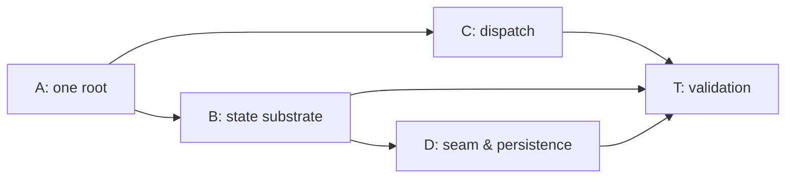

# Stage 26 Tasks — Application Shell Runtime (`packages/ui` + `apps/desktop`)

**Phase:** 26
**Status:** Todo
**Strategic Goal:** Turn the built-but-inert shell frame into the runtime the L1 model names — one composition root, projection/view/session stores over a push seam, focus-scoped keymap dispatch, and a restorable layout record — so the desktop app renders live core state instead of placeholders, without any surface reinventing state plumbing.

## Character

**A multi-layer runtime build, comparable to Phase 13 (Core Decomposition) in span.** It realizes `l2-application-shell` (AS-1…AS-13) across four contracts — state/reactivity, action/dispatch, workbench composition + restoration, async ownership — plus a Rust IPC addition for host-owned settings. It is **feature work**: the GUI-track hold was lifted by the user this session ("я в этой сессии портировал дизайн" + "запускай"), and the `l2-application-shell` §4.3 admission-rule precondition was cleared the same turn (spec 1.0.0 → 1.0.1).

**What is already done, outside this phase.** `apps/desktop/src/main.tsx` was swapped this session to mount `BuildingShell` (a prototype: Home-only floor, local theme `useState`, every surface an INV-9 placeholder). `packages/ui/src/styles.css` gained `@source "./"` (Tailwind v4 skips node_modules, so the symlinked package's classes were unscanned). Those unblock *seeing* the design; this phase makes it a runtime.

**Interpretation points for the executor (not pre-settled — resolve via Decision Review, `run.md §3.3`):**

1. **"The earlier `Workbench` composer becomes the office surface" (`l2-application-shell` §4.1).** Mechanically ambiguous. `Workbench` is the pre-`BuildingShell` five-`SurfaceId` composer; the new model routes fifteen `SidebarTab`s through `SurfaceRouter`. Candidate readings: (a) delete `Workbench`; the `office` tab's surface is `OfficeViewPanel`, which `SurfaceRouter` already renders — the composer's *nav strip* is superseded by the sidebar. (b) keep `Workbench` mounted by `SurfaceRouter` for `active === "office"`. Reading (a) is the smaller change and matches "stops being a rival root"; confirm against the spec before committing.
2. **Store primitive shape.** §4.2's `[REFERENCE]` is a hand-rolled `Store<S>` (`snapshot`/`subscribe`/`dispatch`) read via `useSyncExternalStore` + selector. Whether that is one generic module or `useSyncExternalStore` used directly per domain is the executor's call under §6's "hand-rolled store, no library" constraint.

## Track dependency (Planning Audit — read before starting)

**Track A must complete before B and C.** Both migrate `BuildingShell`'s internals; doing so against two exported roots doubles the surface. **Track D depends on B** (it writes the projection/session stores and the layout record through the view store). Parallel mode (C3) applies within each track. **Optimism-bias note:** B and C are each a real refactor of `building-shell.tsx` (240 lines of `useState` + inline handlers), not a rename — size them as build tasks, not touch-ups.

## Gates cleared (was `Held`)

- **Gate 1 — Phase 25 first.** Done — Phase 25 archived; the four-tier layout every path here assumes exists.
- **Gate 2 — GUI-track hold.** Lifted by the user this session.
- **Precondition — §4.3 admission rule.** `l2-application-shell` 1.0.1 (`/magic.spec amend`): admissibility is now *the bound capability exists in the core **or the host** and is not frontend-only*, so §4.5's settings-store-backed layout record is admissible (host-owned facility). Track D no longer inherits a rule that forbids its own requirement.

## Atomic Checklist

- [x] [T-26A01] One composition root in `packages/ui`; freeze the trimmed public API
- [ ] [T-26B01] The store primitive + `useStore` selector subscription
- [ ] [T-26B02] The view domain — migrate `BuildingShell`'s component-local state
- [ ] [T-26B03] The projection + session domains; the four-state snapshot
- [ ] [T-26C01] Action registry hardening — mandatory label, `when` predicate
- [ ] [T-26C02] Context stack + the pure keymap resolver
- [ ] [T-26C03] Three-layer binding merge + the keymap surface
- [ ] [T-26D01] Seam event direction + channel liveness
- [ ] [T-26D02] Host settings IPC + the versioned layout record
- [ ] [T-26D03] Capability-admission pass — enumerate what stays a placeholder
- [ ] [T-26T01] Validation — the §5 verification table as named tests

## Detailed Tracking

### [T-26A01] One composition root in `packages/ui`; freeze the trimmed public API

- **Spec:** l2-application-shell.md §4.1 · R-1/R-2/R-3
- **Status:** Done
- **Assignment:** Agent
- **Verify:** `pnpm -C packages/ui exec tsc --noEmit` · `pnpm -C packages/ui test` · `pnpm -C packages/ui build` · `src/index.test.ts`'s frozen list updated in the same commit and its diff reviewed (R-1: exactly one exported root) · `pnpm -C apps/desktop build` still green
- **Handoff:** T-26B01, T-26C01
- **Notes:** `packages/ui/src/index.ts` still exports **two** roots — `App` (+ `AppProps`) and `BuildingShell` (via `export * from "./shell"`). Per R-1 the package declares one. Resolve interpretation point 1 above, then: drop `App` / `AppProps` from `index.ts` and delete `src/App.tsx` + `src/App.test.tsx` (its tests move to `shell/` or are folded into `building-shell.test.tsx` — keep the count intact per the Phase 25 precedent). Update `src/index.test.ts`'s `PUBLIC_API` literal (46 → the trimmed set) with a comment that this is a deliberate API change. `apps/desktop/src/main.tsx` already imports only `BuildingShell` — confirm no `App` import remains anywhere. Do **not** widen `bridge.ts` here.

- **[DR] Interpretation point 1 resolved as reading (a) — `Workbench` retired, not remounted.** *(Override: reading (b), mount `Workbench` via `SurfaceRouter` for `active === "office"`.)* `Workbench`'s three jobs are each already done better by `BuildingShell`: its 5-`SurfaceId` nav strip → the 15-tab `SubsystemSidebar`; its `<main>` routing → `SurfaceRouter`; its footer status line → no equivalent (and no secret-bearing surface remains, so INV-7's masked-render is enforced core-side in `bridge.rs`, not here). Since the spec calls `Workbench` "a rival root", collapsing to one root retires it, its thin wrapper `App`, and `shared/surface-catalog.ts` (which existed solely to feed `Workbench`).
- **Changes:** Deleted `src/App.tsx`, `src/App.test.tsx`, `src/shell/workbench.tsx`, `src/shell/workbench.test.tsx`, `src/shared/surface-catalog.ts`. `src/index.ts` drops `App`/`AppProps` and `SURFACES`/`SurfaceId`; `src/shell/index.ts` drops `Workbench`/`WorkbenchProps`; `src/shared/index.ts` drops `export * from "./surface-catalog"`. `src/shell/store-compliance.test.tsx` retargeted from `Workbench` to `BuildingShell` (4 → 3 tests: render-determinism, token-attrs-not-inline-style, i18n locale swap; the INV-7 masked-secret case dropped — the shell has no status line and masking is core-side). `src/index.test.ts` `PUBLIC_API` 46 → **43** value symbols (dropped `App`, `Workbench`, `SURFACES`), comment records the deliberate R-1 trim. `apps/desktop/src/main.tsx` unchanged — it already imported only surviving symbols.
- **Test delta (disclosed):** 95 → **80** (16 → 14 files). All 15 removed are retired-composer *render* tests — `App.test.tsx` (4: status passthrough, connecting placeholder, surface-selection view state, bridge+App round-trip) and `workbench.test.tsx` (10: render-from-state, surface hosting, theming, localization) plus 1 store-compliance INV-7 case. The theming / i18n / render-from-state / render-determinism behaviours they asserted are covered by `theme.test.ts` (identical `resolveTheme`/`themeAttributes` assertions) and the `BuildingShell` suites (`shell.test.tsx`, `building-shell.test.tsx`, `conformance.test.tsx`, `overlays.test.tsx`, the retargeted `store-compliance.test.tsx`). No coverage of a *shipping* surface is lost. The T-26T01 behaviour-neutrality baseline is the post-A01 suite.
- **Evidence:**
  - `command: pnpm -C packages/ui exec tsc --noEmit` · `exit_code: 0`
  - `command: pnpm -C packages/ui exec vitest run` · `exit_code: 0` · `key_findings: 14 files, 80 passed`
  - `command: pnpm exec biome check packages/ui` · `exit_code: 0` · `key_findings: 47 files, 0 errors (was 52 — 5 files deleted)`
  - `command: node packages/ui/scripts/craft-lint.mjs` · `exit_code: 0`
  - `command: pnpm -C packages/ui build && node -e "import(dist/index.js).then(m=>keys.length)"` · `key_findings: 43 value exports — exactly App/Workbench/SURFACES fewer than the pre-A01 46`
  - `command: pnpm -C apps/desktop build` · `exit_code: 0` · `key_findings: main.tsx resolves against the trimmed @cronus/ui`
  - `command: npx fallow dead-code --workspace packages/ui` · `exit_code: 0` · `key_findings: ✓ No issues found — surface-catalog removal left no dangling reference`

### [T-26B01] The store primitive + `useStore` selector subscription

- **Spec:** l2-application-shell.md §4.2 · AS-1/AS-2/AS-3/AS-4
- **Status:** Todo
- **Assignment:** Agent
- **Verify:** `pnpm -C packages/ui test` (new tests for the primitive: a `dispatch` notifies subscribers; an unsubscribe stops notifications; `useStore` with a selector re-renders only on a change the selector observes; a snapshot is referentially stable when unchanged) · `tsc --noEmit` · `biome` · resolve interpretation point 2
- **Handoff:** T-26B02
- **Notes:** New `packages/ui/src/shared/store.ts` (leaf tier): `Store<S>` = `{ snapshot(): S; subscribe(l): () => void; dispatch(action): void }` + `useStore(store, selector)` over `useSyncExternalStore`. No state library (§6). `dispatch` is the only mutation path (AS-1); `subscribe` returns the deregister function (AS-4); `snapshot` is cheap and identity-stable so `useSyncExternalStore` does not thrash. Add to the `shared/index.ts` barrel.

### [T-26B02] The view domain — migrate `BuildingShell`'s component-local state

- **Spec:** l2-application-shell.md §4.2 (view domain) · §4.5 (this is the state the layout record serializes)
- **Status:** Todo
- **Assignment:** Agent
- **Verify:** `pnpm -C packages/ui test` (all shell/overlay/conformance tests still pass unchanged — behaviour-neutral migration) · `tsc` · `biome` · a test that two components reading the same view fact get it from the store, not a local copy
- **Handoff:** T-26D02 (the layout record serializes this domain)
- **Notes:** `building-shell.tsx` holds `openGroup`, `sidebarOpen`, `rightDockOpen`, `paletteOpen`, `settingsOpen`, `activeFacet` as `useState`, and takes `activeFloorId` / `activeSubsystem` as caller-owned props. Move the frame's own view state into a **view store** created at the composition root and read via `useStore`; keep `activeFloorId` / `activeSubsystem` caller-owned (they are navigation intents the host resolves). Mutations become store actions (`toggleSidebar`, `openOverlay(id)`, `setFacet`, …). The migration must not change a single rendered output — the existing 95-test suite is the neutrality proof.

### [T-26B03] The projection + session domains; the four-state snapshot

- **Spec:** l2-application-shell.md §4.2 (projection / session domains) · §4.3 (the *unrequested / pending / loaded / unavailable-with-reason* snapshot) · INV-9
- **Status:** Todo
- **Assignment:** Agent
- **Verify:** `pnpm -C packages/ui test` (a projection store's snapshot is one of the four states and never a default-empty that a surface could render as real data; `loaded-empty` and `unavailable` are separately observable — the regression T-26T01 pins) · `tsc` · `biome`
- **Handoff:** T-26D01, T-26D03
- **Notes:** A **projection store** per core-owned domain (floors + their `OfficeState`, badge counts, file tree, recent offices). Snapshot type is a discriminated union: `{ kind: "unrequested" } | { kind: "pending" } | { kind: "loaded"; data } | { kind: "unavailable"; reason }`. A **session store** derives per-projection request status for a surface to render "loading" vs "unavailable" distinctly. No fetch wired yet (that is T-26D01) — this task is the stores and the type, consumed by `SurfaceRouter` / `SubsystemSidebar` in place of the current optional props.

### [T-26C01] Action registry hardening — mandatory label, `when` predicate

- **Spec:** l2-application-shell.md §4.4 · AS-6
- **Status:** Todo
- **Assignment:** Agent
- **Verify:** `pnpm -C packages/ui test` (a `ShellAction` without `labelKey` is a type error; a `when` predicate that is false hides the action from the palette and drops its binding from resolution) · `tsc` · `biome`
- **Handoff:** T-26C02
- **Notes:** `shell/actions.ts` today: `{ id, labelKey, run, binding?, bound? }`. Add `when?: ContextPredicate` (AS-7 — where the action is live). `labelKey` is already mandatory in the type — confirm and add the test that pins it. The palette's `paletteActions` map (`building-shell.tsx`) filters on `bound()`; extend to also drop actions whose `when` is false for the current context.

### [T-26C02] Context stack + the pure keymap resolver

- **Spec:** l2-application-shell.md §4.4 (resolution steps 1–5) · AS-7
- **Status:** Todo
- **Assignment:** Agent
- **Verify:** `pnpm -C packages/ui test` — the resolver is a pure function tested directly: a matched prefix yields `Pending`; a full match yields the most-specific action (predicate satisfied deepest in the stack), most-recently-layered on a tie; an unbound keystroke yields `Unbound` and falls through; a `Pending` prefix resolves on the next keystroke, a timeout, or cancel · `tsc` · `biome`
- **Handoff:** T-26C03
- **Notes:** New `packages/ui/src/shared/keymap.ts` (leaf): `resolve(keystroke, contextStack, keymap) -> Action | Pending | Unbound`. The **context stack** is assembled from the focus path (workspace → active dock → focused panel). Replaces `building-shell.tsx`'s inline `onKeyDown` Ctrl+Shift+J comparison — that becomes one binding in the base keymap layer, resolved through this function. `Unbound` must fall through so text inputs keep working (the reason step 5 exists).

### [T-26C03] Three-layer binding merge + the keymap surface

- **Spec:** l2-application-shell.md §4.4 (three deterministic layers) · AS-8
- **Status:** Todo
- **Assignment:** Agent
- **Verify:** `pnpm -C packages/ui test` (layers merge in fixed order base → platform → user; a later layer replaces a binding of the same action id; an explicit null disables; every action lists its effective binding **and originating layer**) · `tsc` · `biome`
- **Handoff:** T-26D02 (the user layer persists through settings), T-26T01
- **Notes:** `Keymap` = ordered `[base, platform, user]` merged to one binding table. The keymap surface (a settings section or the palette's binding column) renders each action with its effective binding and origin layer, so a user can see *why* a key does what it does. Persistence of the user layer is Track D's; the merge is this task's.

### [T-26D01] Seam event direction + channel liveness

- **Spec:** l2-application-shell.md §4.3 (event subscription; channel liveness) · AS-3/AS-4
- **Status:** Todo
- **Assignment:** Agent
- **Verify:** `pnpm -C packages/ui test` against an injected fake `listen`: a core event updates the projection store and subscribers re-render; a subscription that fails to open moves dependent projections to *unavailable*; a channel reported closed does the same and re-establishing re-requests (does not resume mid-stream); no timer drives a re-request · `tsc` · `biome` · `fallow dead-code --workspace packages/ui` clean
- **Handoff:** T-26T01
- **Notes:** `bridge.ts` `createCoreClient(invoke, listen)` — add `subscribe(channel, handler) -> unsubscribe` (the host `listen` injected alongside `invoke`, same as §4.3's `[REFERENCE]`). No polling anywhere. Channel-liveness state is the seam's own: failed-open / host-closed → dependent projections become *unavailable with a reason*; reconnection is driven by the host connection lifecycle, not a frontend timer. `apps/desktop/src/main.tsx` passes Tauri's `listen` in.

### [T-26D02] Host settings IPC + the versioned layout record

- **Spec:** l2-application-shell.md §4.3 (admission — host-owned facility, per 1.0.1) · §4.5 (LayoutRecord) · AS-8/AS-12 · l2-app-ui §4.7
- **Status:** Todo
- **Assignment:** Agent
- **Verify:** `apps/desktop/tauri`: `cargo fmt --all -- --check` · `cargo clippy --all-targets -- -D warnings` · `cargo test settings` (a get returns the persisted record; a set round-trips; an older file without the layout field deserializes with the default) — **run via PowerShell** (C toolchain) · `packages/ui`: `pnpm test` (a truncated / extended / unresolvable-floor-id layout record each restores without throwing) · `tsc` · `biome`
- **Handoff:** T-26T01
- **Notes:** Rust: add `capability_settings_get` / `capability_settings_set` (or one `capability_settings` with a payload) to `apps/desktop/tauri/src/bridge.rs`, wired into `lib.rs` `generate_handler!`; back them with the existing `settings.rs` `load_or_create` / `save` and the config-dir path. Extend `Settings` with a `layout: LayoutRecord` field (`#[serde(default)]`) and a `keymap_user` map for T-26C03's user layer. Frontend: `LayoutRecord v1` = `{ activeFloorId, openFloorIds[], activeSubsystem, activeFacet?, sidebarVisible, rightDockVisible, dockSizes }`; restore is **field-wise** (unknown field ignored, missing field defaulted, unresolvable floor id dropped) so a record can never block startup. The admission basis is §4.3 1.0.1's host-owned-facility class — cite it, do not re-derive it.

### [T-26D03] Capability-admission pass — enumerate what stays a placeholder

- **Spec:** l2-application-shell.md §4.3 (admission rule) · INV-9 · l1-architecture INV-3
- **Status:** Todo
- **Assignment:** Agent
- **Verify:** a written table in this task's notes: every `SidebarTab` surface and every projection, marked *bound* (names the core capability + the frontend that already binds it, or the host facility) or *placeholder* (no admissible counterpart yet) · `pnpm -C packages/ui test` (a surface with no bound capability renders `SurfacePlaceholder`, never fabricated data — the INV-9 conformance test extended) · `grep` confirming no new `bridge.ts` method lacks a counterpart
- **Handoff:** T-26T01
- **Notes:** This is the review obligation §4.3 and §5 both declare — done as an artifact, not a mechanical check. The core today binds only `version` / `status` (`bridge.rs`). So most surfaces stay explicit placeholders; the honestly-partial shell is the deliverable. The only *new* bindings this phase admits are the seam event channel (T-26D01) and host settings (T-26D02, host-owned facility). Anything else added to the seam without a named counterpart is the erosion the rule stops — flag it, do not ship it.

### [T-26T01] Validation Task

- **Goal:** Verify the runtime against `l2-application-shell` §5's verification table — one failable check per contract — and prove the migration changed no rendered behaviour.
- **Status:** Todo
- **Assignment:** Agent
- **Method / Verify:**
  1. **Per-contract tests, one per §5 row:** R-1 one exported root; AS-13 no host import in `packages/ui` (the existing structural-gate rule); AS-3 no timer drives a state read; AS-1 a domain's state is reachable only through its store hook; AS-4 a mount/unmount cycle leaves no live listener; AS-7 resolver purity incl. prefix-pending / precedence ties / fall-through; AS-11 a response after unmount writes nothing; AS-12 truncated / extended / unresolvable-reference layout each restores without throwing; §4.2 the four projection states are separately observable (loaded-empty ≠ unavailable); §4.3 a failed-open and a host-closed channel both move projections to *unavailable*.
  2. **Full gate:** `pnpm -C packages/ui test` · `tsc --noEmit` · `pnpm exec biome check packages/ui apps/desktop/src` · `node packages/ui/scripts/craft-lint.mjs` · `pnpm -C packages/ui build` · `pnpm -C apps/desktop build` · `apps/desktop/tauri` `cargo fmt/clippy -D warnings/test` (PowerShell) · `npx fallow dead-code --workspace packages/ui` → `✓ No issues found`.
  3. **Behaviour neutrality:** the shell/overlay/conformance suites that existed before Track B pass unchanged; the public-API freeze test reflects only the deliberate R-1 trim.
  4. **Two obligations recorded as judgment, not faked as checks** (§5): whether a new seam method meets the admission rule (the T-26D03 table is the evidence); whether a piece of state is view-domain or projection-domain.
- **Notes:** Do not add `fallow audit` to the local gate (Phase 25 precedent — CI concern). Rebuild the desktop binary as the closing evidence that the app renders live where a capability is bound and an honest placeholder where it is not.
