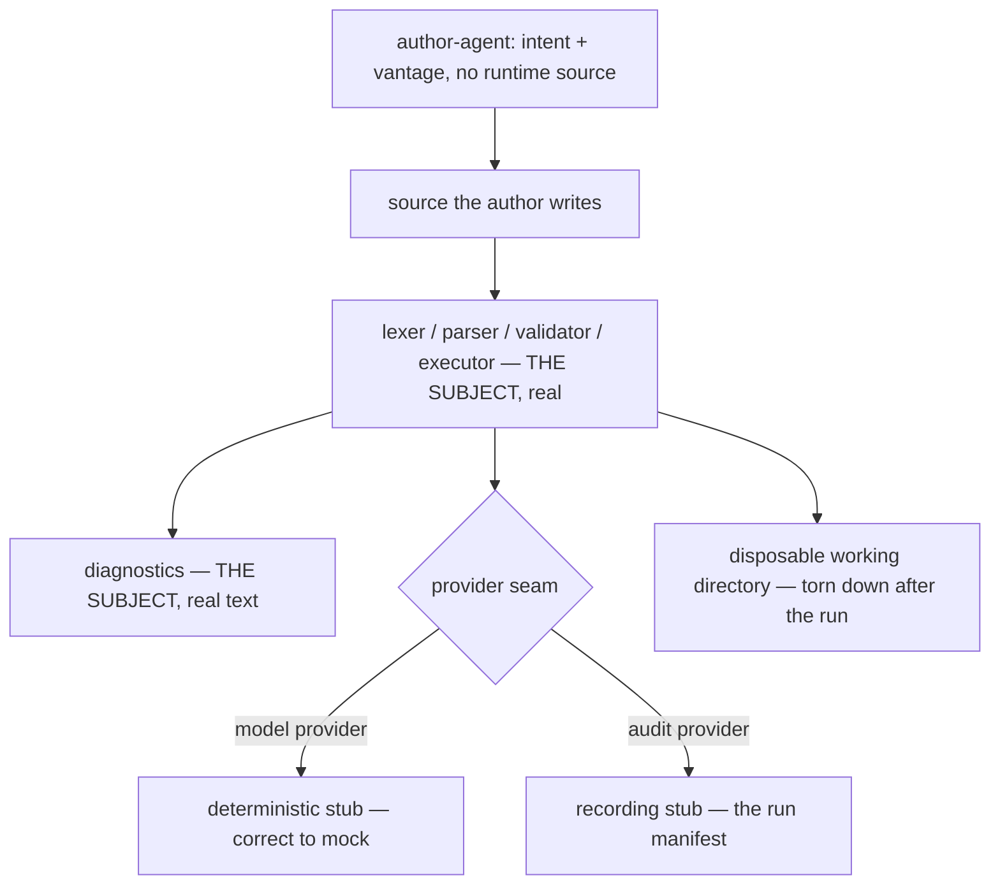

# Nodus Authoring

**Version:** 1.0.0
**Status:** Stable
**Layer:** concept

## Overview

Every verification instrument this workspace owns takes a **workflow** as its subject.
`@test:` blocks assert a workflow's outputs against fixed inputs. The task environment grades
a workflow's run against a reward. A simulated execution mode plays a workflow out with its
effects suppressed. The structural graph analyses a workflow's shape. Four instruments, one
subject — and not one of them can see a defect in **nodus itself**.

This spec takes the other subject. Its user is a person **writing** in the language, or a
developer **embedding** the library, and its question is the one no fixed input can ask:
*given only what the reference tells them, can they express what they meant — and when they
cannot, does the language tell them how?*

The instrument is the free-route one defined in
[../../main/specifications/l1-usage-simulation.md](../../main/specifications/l1-usage-simulation.md):
fix the intent, never the route, and judge from a declared vantage. Transferred to a language,
"route" becomes **the source the author writes**, and the measurement is what an author who
does not already know the answer actually produces. What makes the transfer worth its own
contract rather than a footnote is that two things about a language have no analogue in an
application, and both are invisible to every instrument above.

The first is **authorability**. A language can be complete — every intention expressible —
and still unauthorable, because the expression nobody finds might as well not exist. A fixed
test can never detect this: its author already has the source in hand.

The second is that **the diagnostic is the entire teaching surface**. Twenty-four typed codes
exist so tooling can pattern-match a failure. Nothing yet says that the text beside the code
lets the person who triggered it recover. Those are different properties, and only the first
has an instrument today — because the code is asserted by a test written by someone who
already knows what the code means.

## Related Specifications

- [l1-nodus-testing.md](l1-nodus-testing.md) — The fixed-input instrument. NT asserts a *workflow's* outputs under declared inputs; this exercises *nodus* under an author who has not been told what to write. NT-10's route-coverage advisory is a coverage claim over one workflow's routes; NA-4's is a coverage claim over the language's diagnostics.
- [l1-nodus-language.md](l1-nodus-language.md) — The subject. NL-4 validate-before-run and the §4.6 twenty-four-code taxonomy are what NA-4 claims coverage over; NL-28's "a validation result declares what it did not check" is the honesty half this adds a legibility half to.
- [l1-nodus-environment.md](l1-nodus-environment.md) — **Name collision to keep straight**: NE's *reproducible world* is the world a **workflow acts upon**, scored by a reward. NA's disposable world is the place **nodus itself** runs while an author drives it. Different subjects, different lifetimes, no shared mechanism (§4.4).
- [l1-nodus-observability.md](l1-nodus-observability.md) — HO-12's `simulated` execution mode plays out a *workflow* with effects suppressed; that is mechanism simulation and is not this. HO-20's run manifest as a re-execution recipe is the replay half NA-8 reuses rather than re-inventing.
- [l1-nodus-portability.md](l1-nodus-portability.md) — LP-3's two-host generalisation supplies the second persona: the host integrator (NA-6). A corpus that cannot travel with the standalone library fails LP for the same reason any host-bound artifact does.
- [l1-nodus-graph.md](l1-nodus-graph.md) — Model-free structural analysis over a workflow. Blind to this class by construction: a workflow nobody could have written has a perfectly sound graph.
- [../../main/specifications/l1-usage-simulation.md](../../main/specifications/l1-usage-simulation.md) — The parent instrument (USM-1…USM-12): intent fixed and route free, declared vantage, obligations versus discoveries, findings pinned by deterministic tests. This spec is its language-shaped realization and does not restate it.
- [../../main/specifications/l1-scenario-derivation.md](../../main/specifications/l1-scenario-derivation.md) — Deliberately **not** transferred (§5): nodus plans no projects, and NT already owns per-workflow coverage advisories.

## 1. Motivation

**Nothing in this workspace has nodus as its subject.** Every contract here specifies what a
conforming implementation must do, and every test asserts that a workflow behaves. Both are
necessary. Neither answers whether a person can get a workflow written, and the gap is not
an oversight — it is what happens when every instrument is built by people who already know
the language.

**The author's first hour decides adoption, and nothing observes it.** A DSL is accepted or
abandoned on whether the first working workflow happens. That hour consists entirely of
reading the reference, guessing a construct, getting a diagnostic, and guessing again. Every
one of those steps is a nodus behaviour, and none of them is exercised by a test whose input
is already-valid source.

**A typed code is not a taught recovery.** `POLICY_DENIED` is machine-matchable, categorized,
and severity-tagged. Whether the author who hit it can tell *which* policy, *which* call site,
and *what to write instead* is a separate property that the code's existence does not imply.
Tests today assert that the right code fires, which is exactly the assertion someone can pass
while the message beside it says nothing usable.

**The obvious expression and the supported expression drift apart silently.** When a language
grows twenty-eight invariants and twenty-four codes over a year of amendments, the construct a
newcomer reaches for and the construct the grammar rewards stop being the same construct.
Nobody notices, because everyone who could notice has already learned the answer. An author
who has not is the only instrument that can find it.

**nodus is meant to leave this repository.** It is vendored under `crates/nodus` and intended
to stand alone, which means its embedding surface has a user who is not a workflow author at
all: a host developer wiring providers in from published documentation. That persona has no
representation in any current spec, and the day nodus ships standalone is the day that gap
stops being theoretical.

## 2. Constraints & Assumptions

- **The subject is the real language and the real runtime** — the real lexer, parser,
  validator, executor, and the real diagnostic text. Exercising a paraphrase of any of them
  exercises the paraphrase.
- **The model is not the subject.** Model-calling commands sit behind a host provider seam;
  stubbing them is correct here for the same reason NT-5 stubs them, and stubbing anything
  *inside* the seam is not (NA-5).
- **The author-agent is biased toward the implementation it can read.** Vendored inside this
  monorepo, the runtime source is one directory away, and an unbounded actor will use it.
- **A language reference that does not exist cannot be a vantage.** Where the reference is
  incomplete, that incompleteness *is* the finding, not a reason to fall back to the source.
- **Findings here are often language-design questions**, not defects with an obvious fix, and
  they are answered in the language specification rather than in the parser (NA-9).
- **The corpus must travel.** nodus is destined to be a standalone library; an authoring
  corpus wired to this monorepo's layout does not survive the move.

## 3. Core Invariants

Rules every Layer 2 implementation MUST NOT violate:

- **NA-1 (The subject is nodus, not a workflow):** an authoring scenario's subject is the
  **language, its runtime, and its diagnostics**. Every other instrument in this workspace —
  `@test:` blocks, the graded task environment, the simulated execution mode, the structural
  graph — takes a workflow as its subject and is therefore blind to this class by
  construction. The distinction is stated as an invariant because all five are easy to
  conflate and a conflated one silently stops measuring.

- **NA-2 (Intent is fixed; the expression is not):** a scenario declares what the author wants
  a workflow to accomplish, in the author's terms, and never the source that accomplishes it —
  no constructs, no step sequence, no vocabulary units. **What the author-agent writes is the
  measurement.** Where the source it produces diverges from the expression the language was
  designed to reward, that divergence is the finding, and a scenario that supplies the source
  has deleted the only thing it could have discovered.

- **NA-3 (Judged from the language reference, never from the runtime source):** the vantage is
  declared per scenario — the published reference, the built-in diagnostics, prior authoring
  experience — and every judgement about expressibility, diagnostic clarity, or construct
  naming is made strictly inside it. A construct or a message legible only to a reader of the
  implementation is a **defect**, and a verdict resting on implementation knowledge is **void**
  rather than passing. With the runtime one directory away, this is the invariant the whole
  contract stands on.

- **NA-4 (Every diagnostic is reachable and recoverable; the taxonomy is the denominator):**
  each code in the language's **normative** error taxonomy — the one the language specification
  declares, plus whatever additional codes a given conforming implementation declares of its own
  — is claimed by at least one **plausible authoring mistake** that produces it, together
  with evidence that its message let the author **recover from within the vantage**. Coverage is claimed over the diagnostic catalog, and the
  complement is reported **per conforming implementation**: a code nothing reaches is either
  unreachable in practice or unexercised, both of which are findings, and neither of which is
  visible from a test that asserts the code fires when deliberately provoked. Claiming the
  denominator from one implementation's source rather than from the specification would make
  the coverage figure a property of that implementation — precisely the fork the language
  contract exists to prevent.

- **NA-5 (Real inside the seam, stubbed outside it — and the line is declared):** parse,
  validate, and execute are the subject and run for real against a disposable working
  directory. Model and audit providers are host seams and are stubbed, deterministically. The
  line is **the provider seam**, and it is declared with every run: stubbing outside it keeps
  the subject intact, stubbing inside it replaces the subject with a mock while the report
  continues to read as though nodus was exercised.
  Because the language's central commands are model calls, the **stub set is scenario content** —
  declared and versioned with the scenario, never a harness default — and **no obligation may
  depend on what a stub returned**. An obligation resting on stub content measures the stub; the
  same observation is a legitimate *discovery*, and that distinction is the difference between a
  corpus that survives a stub change and one that is rewritten by it.

- **NA-6 (The host integrator is a second persona, not a footnote):** because nodus is
  intended to stand alone, scenarios cover **embedding the library from its published
  documentation** — resolving a schema, supplying providers, reading a run's outcome — with a
  vantage that excludes this repository. A library whose only demonstrated integration is the
  one living beside it has not been shown to be embeddable.

- **NA-7 (Perturbations are language-shaped):** an authoring scenario carries developments
  drawn from the language's own failure surface (§4.5) — a workflow written against an older
  language version, a re-run of the same workflow, a run interrupted mid-flow, an oversized
  definition, a definition whose content reads as instruction to a model, the same workflow
  carried to a second conforming host. A scenario with none of these exercises the path where
  the implementation already agrees with itself.

- **NA-8 (Replay reuses the run manifest; findings are pinned deterministically):** what an
  authoring run took — the source the author wrote, the diagnostics it received, the order, the
  stub responses, the language and runtime versions — is recorded, and a run's re-execution
  requirements reuse the existing run-manifest recipe rather than a second, parallel format. A
  defect discovered here is **pinned by an ordinary deterministic test** before its finding
  closes: the authored source that broke becomes a fixture, and the free-route instrument is
  freed to stop finding it.

- **NA-9 (A language-design finding is answered in the language, never in the parser):** when
  the expression an author reaches for is not the expression the grammar supports, the question
  is *which one the language should reward* — a design decision belonging to the language
  specification. Resolving it by widening the parser, or by rewriting the diagnostic until the
  complaint stops, forks the implementation from the specification and does so in the direction
  nothing checks. The same holds for a message: the fix is the language's contract about what
  that failure teaches, not a better string in one branch.

> L2 specs cannot reach RFC status until all invariants here are addressed in their
> "Invariant Compliance" section.

## 4. Detailed Design

### 4.1 Five Instruments, Two Subjects

| Instrument | Subject | Input | Sees | Blind to |
| --- | --- | --- | --- | --- |
| `@test:` blocks (NT) | a workflow | fixed `input:` | wrong outputs, regressions | whether the workflow could have been written |
| Task environment (NE) | a workflow's run | a graded world | poor outcomes, weak policies | the same |
| Simulated mode (HO-12) | a workflow | a definition, effects suppressed | the mechanics of a play-out | the same |
| Structural graph (NG) | a workflow | a definition | unreachable steps, unbounded loops | the same |
| **Authoring (this spec)** | **nodus** | **an intention + a vantage** | **inexpressible intents, mute diagnostics, unreachable codes** | everything the four above own |

The asymmetry is the point. Four instruments share a subject and differ in method; the fifth
differs in subject, and that is why none of the four can be extended to cover it.

### 4.2 The Authoring Scenario

```text
[REFERENCE]  field vocabulary (persona / vantage / perturbation / obligation) is defined
             in ../../main/specifications/l1-usage-simulation.md §4.1

id          first-workflow-from-reference
persona     an author who has written workflows in other tools, never in this one
vantage     published language reference + built-in diagnostics; NOT the runtime source
intent      "take a list of items, ask a model to summarise each, stop after three
             attempts per item, and hand the results back to whoever called me"
world       empty working directory; deterministic stub model provider
perturb     legacy-definition, re-run, interrupted-run

obligations the intent is expressible at all, in source the validator accepts
            every diagnostic received names what to write instead, judged in-vantage
            no diagnostic required leaving the vantage to act on
            the accepted source round-trips (compact <-> human) unchanged

discoveries which constructs were reached for and rejected; how many attempts;
            which reference sections were consulted and which were sought and absent
```

The intent is stated in the author's vocabulary, not the language's: it says *stop after three
attempts*, not `~UNTIL … MAX:3`. Naming the construct is naming the route, and an obligation
written in the language's own terms can only confirm that the language agrees with itself.

### 4.3 The Diagnostic Catalog as Denominator (NA-4)

```text
[REFERENCE]
for each code in the NORMATIVE taxonomy (language spec §4.6, plus this
                                         implementation's own declared additions):
    reached_by   a plausible authoring mistake that produces it        (or: NOTHING)
    recovered    evidence the message let the author act, in-vantage   (or: NOT SHOWN)

report the complement, never a percentage:
    NOTHING     -> unreachable in practice, or unexercised — both findings
    NOT SHOWN   -> the code fires correctly and teaches nothing — the common case
```

The two columns fail independently, and the second is the one existing tests structurally
cannot fill: a test that provokes a code and asserts the code is a test whose author knew the
answer before starting. Only an actor that needed the message can report whether it helped.

### 4.4 Where the Stub Line Falls (NA-5), and the Two Worlds



Two "worlds" now exist in this workspace and they must not merge. The task environment's world
is **what a workflow acts upon**, is graded by a reward, and is the subject of that workflow's
evaluation. This world is **where nodus runs** while an author drives it, is graded by nothing,
and exists only to keep one authoring run from contaminating the next. Sharing a mechanism
between them would give one of the two a reward it has no use for, or strip the other of the
grading that is its entire purpose.

### 4.5 Perturbations, Language-Shaped (NA-7)

| Class | For a language, this is | Typically exposes |
| --- | --- | --- |
| Legacy definition | source written against an older language version | migration gaps, silent re-interpretation, false compatibility |
| Re-run | the same workflow executed twice | non-idempotent steps, state leaking between runs |
| Interruption | a run killed mid-flow | compensation that never fires, a restart that cannot resume |
| Scale | a very large definition or a very wide collection | unusable diagnostics, output nobody can read, quadratic validation |
| Instruction-shaped content | definition text that reads as instruction to a model | frame-marker leakage, provenance loss at interpolation |
| Second host | the same definition carried to another conforming host | divergence the differential-parity check was built for |
| Reversal | the author restructures halfway | constructs that cannot be unwound, names that cannot be freed |

Each row is a language behaviour that is already specified. What is new is exercising it from
the outside, by an actor who was not told it exists.

### 4.6 Where a Finding Goes (NA-9)

| Finding | Wrong resolution | Right resolution |
| --- | --- | --- |
| the obvious expression is unsupported | widen the grammar in the parser | decide, in the language spec, which expression the language rewards |
| a diagnostic teaches nothing | rewrite one message string | state, in the contract, what that failure must teach |
| a code is unreachable | delete it quietly | decide whether the failure mode still exists |
| the reference lacks a section | consult the runtime source | record the reference gap as the finding |

Every wrong column is faster than its right column, and every one of them moves the
implementation away from the specification in the direction nothing checks.

## 5. Drawbacks & Alternatives

- **The vantage is the hardest thing here to honour.** The runtime source is one directory from
  the author-agent, and the failure is silent: an actor that peeked produces a confident clean
  report. NA-3's void verdict makes the failure *nameable*, not impossible, and the strongest
  available evidence remains a run by an actor with no access to this repository at all.
- **Cost.** Authoring runs spend inference, and the diagnostic catalog has twenty-four entries.
  The tiering and bounds of the parent instrument apply unchanged; the short tier here is the
  first-workflow journey and nothing else.
- **Not transferred — planning-time scenario derivation.** nodus plans no projects, and the
  in-language testing facility already owns per-workflow coverage advisories. Deriving `@test:`
  blocks from a workflow's declared contract is a plausible future idea, but it belongs to the
  testing contract and would duplicate NT-3/NT-9/NT-10 if written here.
- **Alternative — fold this into the testing contract (NT).** Rejected: NT is a *language-level
  facility* that any conforming implementation must recognise, and its blocks live inside
  workflow files. This is neither — it is a corpus about the language, and putting it inside
  the language would mean a conforming implementation had to ship the critique of itself.
- **Alternative — treat it as documentation review.** Rejected: a review reads the reference and
  asks whether it looks complete. This writes against it and finds out. The two agree exactly
  until the moment they matter.
- **A corpus about a moving language rots fast.** Twenty-eight invariants arrived over a year of
  amendments, and each amendment can invalidate an authoring intent. The catalog complement in
  NA-4 is the only mechanism that surfaces this, and it surfaces it as an unreached code rather
  than as a failure. <!-- TBD: whether an authoring scenario should declare the language version range it was written against, or be re-derived on every minor language amendment -->

## Canonical References

| Alias | Path | Purpose |
| --- | --- | --- |
| `[LANG]` | `.design/nodus/specifications/l1-nodus-language.md` | The subject: NL-4 validate-before-run, the §4.6 twenty-four-code taxonomy NA-4 claims coverage over, NL-28 the honesty half. |
| `[TESTING]` | `.design/nodus/specifications/l1-nodus-testing.md` | The fixed-input instrument whose subject is a workflow; NT-5 the provider-stub precedent NA-5 extends. |
| `[ENV]` | `.design/nodus/specifications/l1-nodus-environment.md` | The other "world" in this workspace — kept separate on purpose (§4.4). |
| `[OBSERVE]` | `.design/nodus/specifications/l1-nodus-observability.md` | HO-12 simulated mode (not this), HO-20 the re-execution recipe NA-8 reuses. |
| `[INSTRUMENT]` | `.design/main/specifications/l1-usage-simulation.md` | The parent contract USM-1…USM-12 this realizes for a language. |
| `[CODES]` | `crates/nodus/src/error.rs` | One conforming implementation of the taxonomy — read to enumerate *this* realization's own declared additions, never as NA-4's denominator (that is `[LANG]` §4.6). |

## Document History

| Version | Date | Author | Notes |
| --- | --- | --- | --- |
| 1.0.0 | 2026-09-11 | Core Team | Initial spec — the free-route usage-simulation instrument realized for a language, taking the subject none of this workspace's four existing instruments can: nodus itself rather than a workflow (NA-1). Intent fixed and the written source left free, so what the author-agent writes is the measurement and a supplied source deletes the finding (NA-2); judged from the published reference and never from the runtime source, with an implementation-grounded verdict recorded void — the invariant the contract stands on, since the runtime is one directory away (NA-3); the **normative** error taxonomy as coverage denominator claimed per conforming implementation, each code claimed by a plausible authoring mistake **and** by evidence its message enabled in-vantage recovery, the two columns failing independently and the second structurally invisible to a test whose author knew the answer (NA-4); real inside the provider seam and stubbed outside it with the line declared per run, the stub set carried as scenario content and no obligation permitted to depend on what a stub returned (NA-5); the host integrator as a second persona, since a library whose only demonstrated integration lives beside it has not been shown embeddable (NA-6); language-shaped perturbations — legacy definition, re-run, interruption, scale, instruction-shaped content, second host, reversal (NA-7); replay reusing the existing run-manifest recipe rather than a parallel format, findings pinned by ordinary deterministic tests (NA-8); a language-design finding answered in the language specification, never by widening the parser or rewriting one message string (NA-9). Records the two-worlds demarcation against the graded task environment and the not-transferred verdict on planning-time scenario derivation. |
