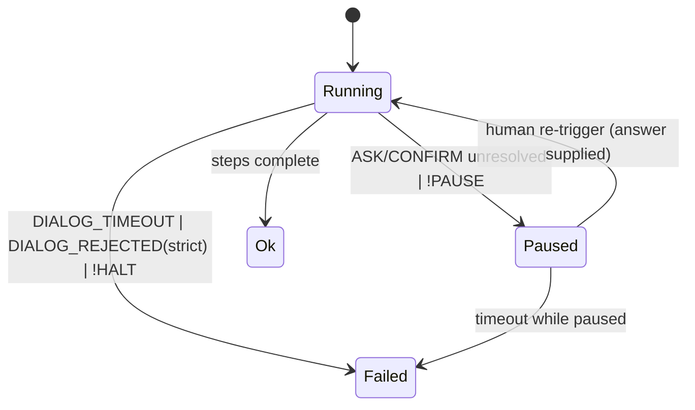

# Nodus Human-in-the-Loop Dialog Contract

**Version:** 1.0.0
**Status:** Draft
**Layer:** concept

## Overview

Nodus workflows are not always fully autonomous: some steps must pause and ask a
human for input or approval before continuing. This specification defines the
**dialog command class** — `ASK` (a typed question) and `CONFIRM` (an approval
decision) — together with the suspend/resume lifecycle (`Status::Paused`) that a
blocking human interaction implies, and the typed failure modes (timeout,
rejection) it can produce.

Dialog is a *language-level* capability: `ASK`/`CONFIRM` are first-class commands
that any conforming implementation must recognise, with semantics independent of
how a host actually renders a prompt or collects an answer. The human-facing I/O
itself is a host concern, supplied through an abstract extension point — the
language never names a terminal, chat surface, or UI toolkit (host neutrality).

This spec elevates the upstream HITL sub-section of `l1-nodus-language.md` §4.6
into a full concept contract; the crate-side realisation is itemized in
`l2-nodus-runtime.md` §4.7 and will be detailed in a dedicated Layer 2 spec.

## Related Specifications

- [l1-nodus-language.md](l1-nodus-language.md) — parent language; `ASK`/`CONFIRM` are commands in its vocabulary, and §4.6 records the upstream HITL parity gap this spec closes
- [l1-nodus-portability.md](l1-nodus-portability.md) — the dialog backend is an LP-2 extension point and an LP-8 capability-manifest role (host neutrality, LP-1)
- [l1-nodus-observability.md](l1-nodus-observability.md) — dialog prompts/answers emit execution events under the same trace protocol, bound by the data-safety boundary
- [l1-nodus-testing.md](l1-nodus-testing.md) — `@test:` blocks must run dialog-bearing workflows deterministically, without a live human (provider neutrality)

## 1. Motivation

Workflows that draft outbound content, spend budget, take irreversible actions,
or resolve genuine ambiguity need a human checkpoint. Without a language-level
construct, hosts bolt this on inconsistently: prompts leak into model calls,
approvals become out-of-band side channels, and the same workflow behaves
differently across hosts. A first-class dialog contract solves this:

- A pause for input is explicit in the workflow text, not hidden in a command argument.
- Answers are typed and bound to variables, so downstream steps consume them like any other value.
- Suspend/resume is a defined runtime state (`Status::Paused`), not an ad-hoc convention, so a run can be serialised, handed to a human, and resumed deterministically.
- Timeout and rejection are typed errors that route through `@err:` like every other runtime failure.
- Because the I/O backend is an extension point, the same workflow runs unattended in tests (default-resolved) and interactively in production (human-resolved) without edits.

## 2. Constraints & Assumptions

- Dialog commands appear only in `§wf:` files inside `@steps:` (or control-flow bodies); `§schema:`/`§config:` files have no executable steps.
- `ASK`/`CONFIRM` are blocking by contract: a conforming runtime does not execute steps after a dialog step until the dialog resolves (by answer, default, timeout, or rejection).
- The human-facing channel is never named by the workflow; it is resolved at run time from the host's dialog backend (an extension point), consistent with LP-1/LP-2.
- A non-interactive host (e.g., the in-process test configuration) has no live human; it resolves a dialog from a declared `+default` or fails fast — it never hangs.
- Dialog does not alter the determinism of non-dialog steps: a workflow with no dialog commands behaves exactly as before this spec.
- Raw human-entered text is user data; it is bound to workflow variables but is governed by the observability data-safety boundary when emitted to traces.

## 3. Core Invariants

Rules that Layer 2 implementations MUST NOT violate:

- **DG-1 Host neutrality**: the dialog backend is an abstract extension point. The language and runtime never reference a concrete UI, channel, or human-interface technology. A workflow's dialog steps are portable across any host that supplies the dialog role (LP-1/LP-2).
- **DG-2 Blocking progression**: a dialog step does not "complete" until it resolves. No step after a dialog step in execution order runs before the dialog yields an answer, a default, a timeout, or a rejection.
- **DG-3 Typed binding**: an `ASK` answer is coerced to its declared `+type` (str/bool/confirm/choice/multi_choice) and bound to the step's pipeline target as a typed `Value`. An answer that fails `+validate` is re-prompted or routed per the validation contract — never silently coerced to a wrong type.
- **DG-4 Suspend/resume lifecycle**: an unresolved blocking dialog (and an explicit `!PAUSE`) yields run status `Paused`. A paused run resumes only on explicit human re-trigger; resumption continues from the suspension point and, given the same answers, produces the same result (determinism boundary, aligns with HO-4 frozen evaluation).
- **DG-5 Typed failure modes**: a `+timeout` elapse raises `NODUS:DIALOG_TIMEOUT`; a `CONFIRM` rejection under `+strict` raises `NODUS:DIALOG_REJECTED`. Both are ordinary runtime errors that route to `@err:`; neither is a silent no-op.
- **DG-6 Default-on-absence**: when no dialog backend is available, a dialog with a declared `+default` resolves to that default without blocking; a dialog with no default and no backend fails fast with a `NODUS:DIALOG_*` error. A dialog step never hangs a non-interactive run.
- **DG-7 Trace data-safety**: dialog prompts and answers emit execution events, but raw human text is never written verbatim to a trace — only typed/length-summarised descriptors cross the observability boundary (consistent with the observability data-safety contract).
- **DG-8 Capability declaration**: a workflow that invokes `ASK`/`CONFIRM` requires the dialog extension role; the capability manifest (LP-8) surfaces this so a host that cannot satisfy it is rejected fail-fast before the run starts, not mid-dialog.

## 4. Detailed Design

### 4.1 `ASK` — typed question

`ASK(prompt) +type ^validate ~flags → $answer`. Modifiers:

| Modifier | Meaning |
| --- | --- |
| `+type` | `str` (default) / `bool` / `confirm` / `choice` / `multi_choice` |
| `+options` | the allowed values for `choice` / `multi_choice` |
| `+hint` | a non-binding hint shown alongside the prompt |
| `+default` | the value used when no backend is present (DG-6) or on a non-strict timeout |
| `+validate` | a validator the answer must satisfy before binding (DG-3) |
| `+timeout` | a duration after which the dialog raises `NODUS:DIALOG_TIMEOUT` (DG-5) |

The answer is bound to the pipeline target as a typed `Value`. `prompt` supports
runtime variable interpolation under the same rules as other string arguments.

### 4.2 `CONFIRM` — approval decision

`CONFIRM(content) +msg +actions +default +strict → $decision`. The decision is a
boolean-like outcome (approve / reject, or a chosen action from `+actions`).
Under `+strict`, a rejection raises `NODUS:DIALOG_REJECTED` (DG-5); without
`+strict`, a rejection binds a falsy decision and execution continues.

### 4.3 Suspend / resume lifecycle

A blocking dialog that cannot resolve synchronously, and an explicit `!PAUSE`,
transition the run to `Status::Paused`. A paused run is a suspended computation
that carries enough state to continue once a human re-triggers it.

<!-- TBD: the concrete representation of paused-run state (resume token vs. serialised execution context) and where it is persisted — host responsibility vs. runtime responsibility — needs design review before this advances to Stable. -->

### 4.4 Dialog backend as an extension point

The human-facing channel is supplied by an abstract dialog provider, following
the LP-2 pattern (one built-in no-op/default-resolving implementation ships;
concrete interactive backends live outside the library). This makes dialog
workflows runnable unattended in tests and interactively in production without
edits.

<!-- TBD: whether the dialog backend is a distinct `ExtensionRole::Dialog` in the LP-8 taxonomy, or folded into an existing role. The capability-manifest integration (DG-8) depends on this choice. -->

### 4.5 Error taxonomy (dialog subset)

| Code | Severity | Trigger |
| --- | --- | --- |
| `NODUS:DIALOG_TIMEOUT` | error | `+timeout` elapsed before an answer (DG-5) |
| `NODUS:DIALOG_REJECTED` | error | `CONFIRM` rejected under `+strict` (DG-5) |
| `NODUS:PAUSED` | info | run suspended awaiting human re-trigger (DG-4) |

These extend the language error taxonomy (`l1-nodus-language.md` §4.6, 11 → 24).

## 5. Drawbacks & Alternatives

- **Dialog as a host-only concern (no language construct)**: rejected — it reintroduces the cross-host inconsistency this spec exists to remove (DG-1/DG-2). Approval and input would become out-of-band side channels invisible to the workflow text.
- **Embedding prompts in model calls (`GEN`)**: rejected — conflates model inference with human interaction; answers would be untyped free text, and there would be no defined suspend/resume state.
- **Synchronous-only dialog (no `Paused` state)**: rejected — long-lived approvals (hours/days) cannot block an in-memory run; the `Paused` lifecycle (DG-4) is required for durable hand-off.

## 6. Implementation Notes

- The capability-manifest gate (LP-8) is the natural enforcement point for DG-8: derive a dialog-role requirement from any `ASK`/`CONFIRM` in the AST, mirroring how the model role is derived from `GEN`/`ANALYZE`.
- The non-interactive default-resolving backend (DG-6) parallels the `StubProvider`/no-op providers already established for model, audit, storage, and policy roles.
- Trace emission (DG-7) reuses the existing execution-event taxonomy; dialog events carry summarised descriptors, not raw answers.

## Canonical References

| Alias | Path | Purpose |
| --- | --- | --- |
| `[LANG-GAP]` | `l1-nodus-language.md` §4.6 | upstream HITL semantics this spec elevates |
| `[RUNTIME-GAP]` | `l2-nodus-runtime.md` §4.7 | crate-side dialog implementation gap |
| `[PORT]` | `l1-nodus-portability.md` | LP-2 extension-point + LP-8 manifest pattern the dialog backend follows |
| `[OBS]` | `l1-nodus-observability.md` | trace data-safety boundary governing DG-7 |

## Document History

| Version | Date | Change |
| --- | --- | --- |
| 1.0.0 | 2026-06-27 | Initial Draft — dialog command class (`ASK`/`CONFIRM`), suspend/resume lifecycle (`Status::Paused`), DG-1…DG-8 invariants, dialog backend extension point, dialog error subset (`DIALOG_TIMEOUT`/`DIALOG_REJECTED`/`PAUSED`). Elevates `l1-nodus-language.md` §4.6 HITL sub-section. Open design questions marked TBD (paused-state representation; `ExtensionRole::Dialog` taxonomy placement). |
