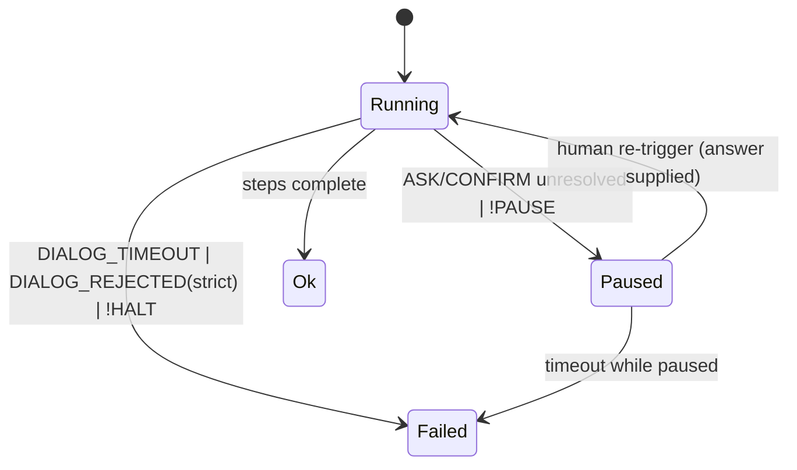

# Nodus Human-in-the-Loop Dialog Contract

**Version:** 1.3.1
**Status:** Stable
**Layer:** concept

## Overview

Nodus workflows are not always fully autonomous: some steps must pause and ask a
human for input or approval before continuing. This specification defines the
**dialog command class** — `ASK` (a typed question) and `CONFIRM` (an approval
decision) — together with the suspend/resume lifecycle (`Status::Paused`) that a
blocking human interaction implies, and the typed failure modes (timeout,
rejection) it can produce.

Dialog is a *language-level* capability: `ASK`/`CONFIRM` are first-class commands
that any conforming implementation must recognise, with semantics independent of
how a host actually renders a prompt or collects an answer. The human-facing I/O
itself is a host concern, supplied through an abstract extension point — the
language never names a terminal, chat surface, or UI toolkit (host neutrality).

This spec elevates the upstream HITL sub-section of `l1-nodus-language.md` §4.6
into a full concept contract; the crate-side realisation is itemized in
`l2-nodus-runtime.md` §4.7 and will be detailed in a dedicated Layer 2 spec.

## Related Specifications

- [l1-nodus-language.md](l1-nodus-language.md) — parent language; `ASK`/`CONFIRM` are commands in its vocabulary, and §4.6 records the upstream HITL parity gap this spec closes
- [l1-nodus-portability.md](l1-nodus-portability.md) — the dialog backend is an LP-2 extension point and an LP-8 capability-manifest role (host neutrality, LP-1)
- [l1-nodus-observability.md](l1-nodus-observability.md) — dialog prompts/answers emit execution events under the same trace protocol, bound by the data-safety boundary
- [l1-nodus-testing.md](l1-nodus-testing.md) — `@test:` blocks must run dialog-bearing workflows deterministically, without a live human (provider neutrality)
- [../../main/specifications/l1-review-checkpoint.md](../../main/specifications/l1-review-checkpoint.md) — [ADDED v1.3.1] the main concept the ASK/CONFIRM dialog seam realizes for a human reviewer: a solicited review pause over Status::Paused (NL-12), its revise loop the grader-gated `~UNTIL +grade` with feedback threading (NL-14). No new dialog surface — review checkpoints compose the existing seams.

## 1. Motivation

Workflows that draft outbound content, spend budget, take irreversible actions,
or resolve genuine ambiguity need a human checkpoint. Without a language-level
construct, hosts bolt this on inconsistently: prompts leak into model calls,
approvals become out-of-band side channels, and the same workflow behaves
differently across hosts. A first-class dialog contract solves this:

- A pause for input is explicit in the workflow text, not hidden in a command argument.
- Answers are typed and bound to variables, so downstream steps consume them like any other value.
- Suspend/resume is a defined runtime state (`Status::Paused`), not an ad-hoc convention, so a run can be serialised, handed to a human, and resumed deterministically.
- Timeout and rejection are typed errors that route through `@err:` like every other runtime failure.
- Because the I/O backend is an extension point, the same workflow runs unattended in tests (default-resolved) and interactively in production (human-resolved) without edits.

## 2. Constraints & Assumptions

- Dialog commands appear only in `§wf:` files inside `@steps:` (or control-flow bodies); `§schema:`/`§config:` files have no executable steps.
- `ASK`/`CONFIRM` are blocking by contract: a conforming runtime does not execute steps after a dialog step until the dialog resolves (by answer, default, timeout, or rejection).
- The human-facing channel is never named by the workflow; it is resolved at run time from the host's dialog backend (an extension point), consistent with LP-1/LP-2.
- A non-interactive host (e.g., the in-process test configuration) has no live human; it resolves a dialog from a declared `+default` or fails fast — it never hangs.
- Dialog does not alter the determinism of non-dialog steps: a workflow with no dialog commands behaves exactly as before this spec.
- Raw human-entered text is user data; it is bound to workflow variables but is governed by the observability data-safety boundary when emitted to traces.

## 3. Core Invariants

Rules that Layer 2 implementations MUST NOT violate:

- **DG-1 Host neutrality**: the dialog backend is an abstract extension point. The language and runtime never reference a concrete UI, channel, or human-interface technology. A workflow's dialog steps are portable across any host that supplies the dialog role (LP-1/LP-2).
- **DG-2 Blocking progression**: a dialog step does not "complete" until it resolves. No step after a dialog step in execution order runs before the dialog yields an answer, a default, a timeout, or a rejection.
- **DG-3 Typed binding**: an `ASK` answer is coerced to its declared `+type` (str/bool/confirm/choice/multi_choice) and bound to the step's pipeline target as a typed `Value`. An answer that fails `+validate` is re-prompted or routed per the validation contract — never silently coerced to a wrong type.
- **DG-4 Suspend/resume lifecycle**: an unresolved blocking dialog (and an explicit `!PAUSE`) yields run status `Paused`. A paused run resumes only on explicit human re-trigger; resumption continues from the suspension point and, given the same answers, produces the same result (determinism boundary, aligns with HO-4 frozen evaluation).
- **DG-5 Typed failure modes**: a `+timeout` elapse raises `NODUS:DIALOG_TIMEOUT`; a `CONFIRM` rejection under `+strict` raises `NODUS:DIALOG_REJECTED`. Both are ordinary runtime errors that route to `@err:`; neither is a silent no-op.
- **DG-6 Default-on-absence**: when no dialog backend is available, a dialog with a declared `+default` resolves to that default without blocking; a dialog with no default and no backend fails fast with a `NODUS:DIALOG_*` error. A dialog step never hangs a non-interactive run.
- **DG-7 Trace data-safety**: dialog prompts and answers emit execution events, but raw human text is never written verbatim to a trace — only typed/length-summarised descriptors cross the observability boundary (consistent with the observability data-safety contract).
- **DG-8 Capability declaration**: a workflow that invokes `ASK`/`CONFIRM` requires the dialog extension role; the capability manifest (LP-8) surfaces this so a host that cannot satisfy it is rejected fail-fast before the run starts, not mid-dialog.
- **DG-9 Memoizable approval (host-supplied, never widening)**: a dialog step MAY be declared memoize-eligible (`+remember`). A memoize-eligible `ASK`/`CONFIRM` MAY have its answer supplied by the host dialog provider from a *durable prior decision* keyed by a stable dialog identity (the resolved prompt / action signature), resolving without re-prompting. The durable-decision store, its scope, and its revocation are **host concerns** (LP-1) — the language names none of them; it only marks a dialog memoize-eligible. A memoized resolution emits an execution event with a distinct provenance (remembered vs freshly-answered) under the DG-7 data-safety boundary. Discipline: a dialog **not** carrying `+remember` always prompts; memoization MUST NOT change a decision's meaning — it never turns a rejection into an approval, never relaxes `+strict`, and never binds a remembered value that would fail the step's `+type`/`+validate`; and a host MAY decline to memoize (governance), in which case the dialog prompts normally (fail-safe to asking). This is the nodus realization of the main `l1-security` SEC-9 learnable-permission contract, kept host-neutral: nodus supplies the memoize-eligibility marker and trace provenance; the host owns the decision store, scope, and revocation.

- **DG-10 Promotable remembered decision (host-ratified, never self-authored)**: a `+remember`-eligible `ASK`/`CONFIRM` (DG-9) whose remembered decision **recurs with a stable answer** across runs MAY be surfaced — carrying its **recurrence provenance** (that the same dialog identity resolved the same way on distinct occasions, extending the remembered-vs-answered trace of DG-7/DG-9) — as a **host-promotable candidate** for a standing `!PREF` preference rule, so a stably-repeated human decision can graduate from *remembered per-decision* to *a standing workflow preference*. Nodus contributes only the **eligibility + the recurrence provenance**; the **durability gate** (how long / how many distinct occasions before it counts), the **human ratification**, and the **actual promotion** to a `!PREF`/rule are entirely **host-supplied** (LP-2), and — per LP-10 — a workflow **never self-authors** the promotion: it surfaces a candidate, it does not mint a rule. A promoted preference enters as an ordinary `!PREF` **soft** rule (NL-3, `!OVERRIDE`-able), **never silently hardened to a `!!` hard rule**; demotion (a promoted `!PREF` later removed by the host) leaves the DG-9 memoization untouched. Purely additive: a host that promotes nothing keeps DG-9 behaviour exactly as today. This is the nodus realization of the main `l1-pattern-codification` contract — its earned-not-automatic promotion (PC-1, recurrence as the *candidate* signal, not the promotion), its propose-not-self-author discipline (PC-2/PC-8, the host ratifies and authors), and its auditable pathway (PC-7, the recurrence provenance) — the workflow-dialog channel by which a stably-repeated decision *proposes* a standing preference the host may ratify.

## 4. Detailed Design

### 4.1 `ASK` — typed question

`ASK(prompt) +type ^validate ~flags → $answer`. Modifiers:

| Modifier | Meaning |
| --- | --- |
| `+type` | `str` (default) / `bool` / `confirm` / `choice` / `multi_choice` |
| `+options` | the allowed values for `choice` / `multi_choice` |
| `+hint` | a non-binding hint shown alongside the prompt |
| `+default` | the value used when no backend is present (DG-6) or on a non-strict timeout |
| `+validate` | a validator the answer must satisfy before binding (DG-3) |
| `+timeout` | a duration after which the dialog raises `NODUS:DIALOG_TIMEOUT` (DG-5) |
| `+remember` | marks the dialog memoize-eligible — the host MAY satisfy it from a durable prior decision without re-prompting (DG-9) |

The answer is bound to the pipeline target as a typed `Value`. `prompt` supports
runtime variable interpolation under the same rules as other string arguments.

### 4.2 `CONFIRM` — approval decision

`CONFIRM(content) +msg +actions +default +strict +remember → $decision`. The
decision is a boolean-like outcome (approve / reject, or a chosen action from
`+actions`). Under `+strict`, a rejection raises `NODUS:DIALOG_REJECTED` (DG-5);
without `+strict`, a rejection binds a falsy decision and execution continues.
`+remember` marks the approval memoize-eligible (DG-9): a repeated equivalent
`CONFIRM` MAY resolve from a durable prior approval without re-prompting — but a
remembered decision never turns a prior reject into an approve nor relaxes
`+strict`.

### 4.3 Suspend / resume lifecycle

A blocking dialog that cannot resolve synchronously, and an explicit `!PAUSE`,
transition the run to `Status::Paused`. A paused run is a suspended computation
that carries enough state to continue once a human re-triggers it.



**Paused-run state (resolved).** The runtime signals suspension by returning
`Status::Paused` together with a **resume descriptor** — the workflow identifier,
a snapshot of the variable environment, and the index of the suspended step.
The runtime does **not** mandate how that descriptor is stored: persistence and
re-invocation are a host responsibility (LP-1), so a host may keep the run in
memory, serialise it to disk, or queue it for a human. The built-in in-process
configuration is **synchronous**: a dialog with a `+default` resolves
immediately, and a dialog with no default and no interactive backend returns
`Status::Paused` rather than blocking. True cross-invocation suspend/resume is a
host extension over this signal — the executor's run-to-completion model is
unchanged for the default-resolved common case.

### 4.4 Dialog backend as an extension point

The human-facing channel is supplied by an abstract dialog provider, following
the LP-2 pattern (one built-in no-op/default-resolving implementation ships;
concrete interactive backends live outside the library). This makes dialog
workflows runnable unattended in tests and interactively in production without
edits.

**Dialog role (resolved).** The dialog backend is a **distinct extension role**
— `Dialog` joins the LP-8 extension-point taxonomy alongside Model, Audit,
Storage, and Policy. This lets the capability manifest derive a `Dialog`
requirement from any `ASK`/`CONFIRM` in a workflow (mirroring how `Model` is
derived from `GEN`/`ANALYZE`), so a host that provides no dialog backend is
rejected fail-fast (DG-8) — unless every dialog in the workflow declares a
`+default`, in which case the built-in synchronous resolver satisfies them and
no `Dialog` role is required.

### 4.5 Error taxonomy (dialog subset)

| Code | Severity | Trigger |
| --- | --- | --- |
| `NODUS:DIALOG_TIMEOUT` | error | `+timeout` elapsed before an answer (DG-5) |
| `NODUS:DIALOG_REJECTED` | error | `CONFIRM` rejected under `+strict` (DG-5) |
| `NODUS:PAUSED` | info | run suspended awaiting human re-trigger (DG-4) |

These extend the language error taxonomy (`l1-nodus-language.md` §4.6, 11 → 24).

### 4.6 Memoizable approval [ADDED v1.2.0]

A workflow that gates a *routine, repeated* action behind `CONFIRM`/`ASK` trains
the human to approve without reading — the same approval-fatigue failure the host
security layer guards against. `+remember` lets an approval *learn* into a standing
host decision, while nodus stays host-neutral: the language contributes only the
memoize-eligibility marker and a trace provenance; the durable store, its scope,
and revocation live entirely in the host (LP-1), reached through the same
`DialogProvider` seam that already answers dialogs (LP-2).

```text
[REFERENCE]
resolve_dialog(step):                          // executor asks the DialogProvider
    if step.has(+remember):
        key := stable_dialog_identity(step)    // resolved prompt / action signature
        prior := provider.recall(key)          // host store — nodus does not define it
        if prior is present and provider.may_memoize(key):   // host governance
            if answer_fits(step, prior):       // +type / +validate / not a widened +strict
                emit_event(dialog_resolved{ provenance: "remembered" })   // DG-7 summary only
                return bind(step, prior)
    ans := provider.prompt(step)               // fall through: normal ask (fail-safe)
    emit_event(dialog_resolved{ provenance: "answered" })
    if step.has(+remember): provider.offer_remember(key, ans)  // host MAY persist; nodus doesn't
    return bind(step, ans)
```

The provider — not the language — decides whether a memoized answer exists, whether
governance permits reusing it, and at what scope it was stored. Absent a match or on
a host that declines to memoize, the dialog prompts exactly as an ordinary
`ASK`/`CONFIRM` (DG-6 default-on-absence still applies to `+default`). Because the
whole store is host-side, a paused-run/resume host, an unattended test host, and an
interactive host each apply their own (or no) memoization without any workflow edit.

### 4.7 Promotable remembered decision [ADDED v1.3.0]

DG-10 extends the DG-9 memoization seam with one read-only signal — a *recurrence
descriptor* — and no new authoring power in the core:

```text
[REFERENCE]
// on a memoized resolution event (DG-9), the host MAY observe:
recurrence := { dialog_identity, answer, distinct_occasions }   // DG-7 provenance, no raw content

// promotion is entirely host-side (LP-2), gated + ratified there (LP-10):
host.consider_promotion(recurrence):
    if recurrence.distinct_occasions < host.durability_floor:  return HOLD    // PC-1 durability gate
    if not host.ask_human_ratify(recurrence):                  return HOLD    // PC-2 propose → ratify
    host.install_pref_rule(recurrence.dialog_identity, recurrence.answer)      // a !PREF (NL-3), never !!
```

Nodus emits only the recurrence provenance; the durability floor, the ratification
prompt, and the `!PREF` install are the host's. Because the promoted form is a soft
`!PREF` (NL-3, `!OVERRIDE`-able) and never a `!!` hard rule, a wrongly-promoted
preference is always overridable per-branch and removable by the host — codification
stays reversible (PC-5) at the workflow layer too. A host that supplies no promotion
policy runs DG-9 exactly as today.

## 5. Drawbacks & Alternatives

- **Dialog as a host-only concern (no language construct)**: rejected — it reintroduces the cross-host inconsistency this spec exists to remove (DG-1/DG-2). Approval and input would become out-of-band side channels invisible to the workflow text.
- **Embedding prompts in model calls (`GEN`)**: rejected — conflates model inference with human interaction; answers would be untyped free text, and there would be no defined suspend/resume state.
- **Synchronous-only dialog (no `Paused` state)**: rejected — long-lived approvals (hours/days) cannot block an in-memory run; the `Paused` lifecycle (DG-4) is required for durable hand-off.

## 6. Implementation Notes

- The capability-manifest gate (LP-8) is the natural enforcement point for DG-8: derive a dialog-role requirement from any `ASK`/`CONFIRM` in the AST, mirroring how the model role is derived from `GEN`/`ANALYZE`.
- The non-interactive default-resolving backend (DG-6) parallels the `StubProvider`/no-op providers already established for model, audit, storage, and policy roles.
- Trace emission (DG-7) reuses the existing execution-event taxonomy; dialog events carry summarised descriptors, not raw answers.

## Canonical References

| Alias | Path | Purpose |
| --- | --- | --- |
| `[LANG-GAP]` | `l1-nodus-language.md` §4.6 | upstream HITL semantics this spec elevates |
| `[RUNTIME-GAP]` | `l2-nodus-runtime.md` §4.7 | crate-side dialog implementation gap |
| `[PORT]` | `l1-nodus-portability.md` | LP-2 extension-point + LP-8 manifest pattern the dialog backend follows |
| `[OBS]` | `l1-nodus-observability.md` | trace data-safety boundary governing DG-7 |

## Document History

| Version | Date | Change |
| --- | --- | --- |
| 1.3.0 | 2026-07-09 | Added DG-10 (promotable remembered decision, host-ratified never self-authored) — a `+remember`-eligible `ASK`/`CONFIRM` (DG-9) whose remembered decision recurs with a stable answer across runs MAY be surfaced, carrying its recurrence provenance (same dialog identity, same answer, on distinct occasions — extending the DG-7/DG-9 remembered-vs-answered trace), as a host-promotable candidate for a standing `!PREF` preference rule, so a stably-repeated human decision can graduate from remembered-per-decision to a standing workflow preference; nodus contributes only the eligibility + recurrence provenance, while the durability gate, the human ratification, and the actual promotion to a `!PREF`/rule are entirely host-supplied (LP-2) and — per LP-10 — a workflow never self-authors the promotion (it surfaces a candidate, it does not mint a rule); a promoted preference enters as an ordinary `!PREF` soft rule (NL-3, `!OVERRIDE`-able), never silently hardened to a `!!` hard rule, and demotion leaves DG-9 memoization untouched; purely additive (a host that promotes nothing keeps DG-9 as today). New §4.7. The nodus realization of the new main l1-pattern-codification contract (PC-1 earned-not-automatic / PC-2 & PC-8 propose-not-self-author / PC-7 auditable pathway) — the workflow-dialog channel by which a stably-repeated decision proposes a standing preference the host may ratify. L1 stays Stable (C9); l2-nodus-dialog carries DG-10 as a pending Invariant-Compliance obligation reconciled at magic.task (DG-9 precedent). |
| 1.2.0 | 2026-07-02 | Added DG-9 (memoizable approval — a `+remember`-marked `ASK`/`CONFIRM` MAY be satisfied by the host `DialogProvider` from a durable prior decision keyed by a stable dialog identity, without re-prompting; store/scope/revocation are host concerns LP-1, nodus contributes only the marker + a remembered-vs-answered trace provenance DG-7; never turns reject→approve, never relaxes `+strict`, never binds a value failing `+type`/`+validate`, host MAY decline → prompts normally). New §4.6 + `+remember` modifier on `ASK`/`CONFIRM`. The host-neutral nodus realization of main `l1-security` SEC-9 learnable-permission promotion. |
| 1.1.0 | 2026-06-27 | Resolved both open design questions and promoted Draft → Stable. §4.3: paused-run state = `Status::Paused` + a host-persisted resume descriptor; built-in host is synchronous (default-or-Paused). §4.4: the dialog backend is a distinct `ExtensionRole::Dialog` in the LP-8 taxonomy; workflows whose dialogs all carry `+default` need no Dialog role. |
| 1.0.0 | 2026-06-27 | Initial Draft — dialog command class (`ASK`/`CONFIRM`), suspend/resume lifecycle (`Status::Paused`), DG-1…DG-8 invariants, dialog backend extension point, dialog error subset (`DIALOG_TIMEOUT`/`DIALOG_REJECTED`/`PAUSED`). Elevates `l1-nodus-language.md` §4.6 HITL sub-section. Open design questions marked TBD (paused-state representation; `ExtensionRole::Dialog` taxonomy placement). |
