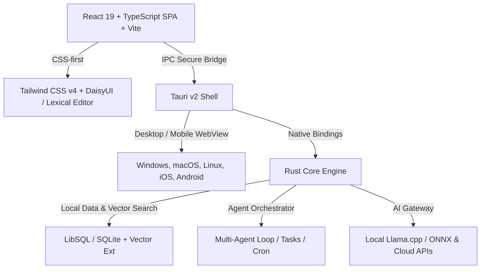

# Technology Stack Research: Project Cronus

This document evaluates the technological stack options for **Cronus**, an autonomous AI agent workspace designed to operate as a local/remote "office" across Desktop (Windows, macOS, Linux) and Mobile (iOS, Android) platforms.

## Core Requirements & Constraints

1. **Cross-Platform Delivery**: Support Windows, macOS, Linux, iOS, and Android.
2. **Mobile as a Local Server**: Mobile devices (iOS/Android) must run a "full version" of the app, acting as always-on, low-power personal servers.
3. **Low Resource Footprint**: Restrictive memory (RAM) and battery limitations on mobile operating systems (iOS Background Tasks, Android Low Memory Killer).
4. **AI-Ready Engine**: Seamless integration with local LLM runtimes (e.g., Llama.cpp, ONNX) and remote AI APIs.
5. **Unified Codebase**: Minimize platform-specific code duplication.

## 1. Core Engine Runtime (The AI Office Manager)

The engine coordinates agents, runs cron tasks, manages local state, and routes LLM requests.

| Runtime | Performance | Mobile Backgrounding | AI Ecosystem | Memory Footprint | Decision |
| --- | --- | --- | --- | --- | --- |
| **Rust** | Extremely High | Excellent (Native lib) | Growing (Candle, LLM.rs) | Minimal (~10-20MB) | **Recommended** |
| **Go** | High | Good (Go Mobile) | Moderate (Go-llama.cpp) | Low (~20-40MB) | Alternative |
| **Node.js/Bun** | Moderate | Very Poor (OS restrictions) | High (LangChain, SDKs) | High (~100MB+) | Not Feasible |

### Why Rust wins for the Core Engine

- **Tauri Native Integration**: Tauri uses Rust as its native backend. Building the core engine in Rust allows compiling a single library that runs directly within the Tauri shell on desktop and mobile.
- **Resource Efficiency**: A Rust-based core engine consumes negligible CPU and RAM when idle, preventing mobile OS schedulers from killing the application when running in the background.
- **Local AI Execution**: Rust compiles cleanly with C/C++ libraries (like `llama.cpp` or `onnxruntime`) via FFI, allowing highly optimized local model execution on mobile GPUs (Metal/Vulkan).

## 2. Database Layer

The database must store agent history, vector embeddings (memory), and Kanban tasks locally.

| Database | Mobile Capabilities | Desktop Capabilities | Vector Support | Setup Overhead | Decision |
| --- | --- | --- | --- | --- | --- |
| **LibSQL / SQLite** | Native (Built-in) | Embedded (File-based) | Yes (sqlite-vss, Vector) | Zero | **Recommended** |
| **PostgreSQL** | None (Hack required) | System Service Daemon | Yes (pgvector) | High | Remote Only |

### Database Strategy

- **Local Node (SQLite / LibSQL)**: LibSQL (open-source SQLite fork by Turso) supports vector search extensions and can run in embedded mode on both mobile and desktop. It requires zero configuration or daemon installation.
- **Sync/Hybrid Mode**: The database driver can abstract queries so that if a user connects to a remote central PostgreSQL server, it syncs state, but default local storage remains SQLite/LibSQL.

## 3. Frontend & Cross-Platform Shell

We need to render a premium graphical user interface (The Interactive Office) across all platforms.

| Technology | Desktop Integration | Mobile Integration | Code Reuse | Native Bridging | Decision |
| --- | --- | --- | --- | --- | --- |
| **Tauri v2** | Native (Wry / WebView2) | Native (iOS/Android Wry) | ~95% | Rust-to-Swift/Java | **Recommended** |
| **Capacitor + Vite** | Electron (Heavy) | Native WebView | ~85% | JS-to-Swift/Java | Alternative |
| **Next.js (SSR)** | Static Export only | Static Export only | ~70% | Complex | Not Ideal |

### The Tauri v2 Advantage

- **Unified Rust Backend**: Tauri v2 natively compiles the same Rust codebase into a desktop application and native iOS/Android packages. It eliminates the need to mix Tauri (for desktop) and Capacitor (for mobile).
- **Security & Sandboxing**: Tauri provides a secure IPC bridge between the React frontend and the Rust core.
- **UI Performance**: Renders via system WebViews (Edge/WebView2 on Windows, WebKit on macOS/iOS, Android WebView), keeping bundle size and memory usage very low.

## 4. Proposed Technology Stack (The Cronus Stack)

### Stack Components

1. **Frontend Core**: **React 19** (Single Page App) + **Vite** + **TypeScript**.
   - *Why React SPA instead of Next.js?* Next.js features like SSR require a running Node.js server. Since we bundle the UI inside Tauri (which serves assets locally), a React SPA built via Vite is cleaner, faster, and compiles into static files perfectly.
2. **Styling & Components**: **Tailwind CSS v4** + **DaisyUI / shadcn/ui** + **Lexical Editor**.
   - Gives rich aesthetics out of the box with CSS-first performance, customizable themes, and a highly advanced rich-text editor for notes and planning.
3. **Shell Wrapper**: **Tauri v2**.
   - Handles packaging for Windows, macOS, Linux, iOS, and Android. Provides the IPC bridge.
4. **Backend/Engine**: **Rust** (embedded in Tauri).
   - Runs the Kanban orchestrator, manages workflows, performs local AI routing, and communicates with the DB.
5. **Database**: **LibSQL (SQLite)** with vector search enabled.
   - Simple file-based database. Easy backup/restore (just copy the database file), and zero setup overhead.

## Alternative/Hybrid Approach (For Faster Prototyping)

If Rust backend development proves too slow initially:

- **Core Engine in Go**: Compile the Go core as a library/shared object using `gomobile` and bundle it with Tauri. Go provides rapid backend development and an excellent concurrency model.
- **Core Engine in TypeScript (Bun/Node)**: Bundle a miniature Node.js execution binary for desktop, but fall back to a web-hosted server for mobile (since running Bun on iOS is restricted).

## Next Steps

1. Review the proposed **Cronus Stack**.
2. Document the finalized stack in `CONTRIBUTING.md`.
3. Create directories and file stubs in `.release/windows` using the approved layout.
